# LEGO 编辑器原子功能拆分（面试官可提问点）

> 目标：把编辑器拆成“可独立提问”的最小功能单元，便于准备面试。

## A. 编辑器入口与页面骨架
1. **编辑器页面路由入口**：`/editor/:id` 路由指向编辑器视图。  
   * 提问点：路由参数如何驱动加载作品？

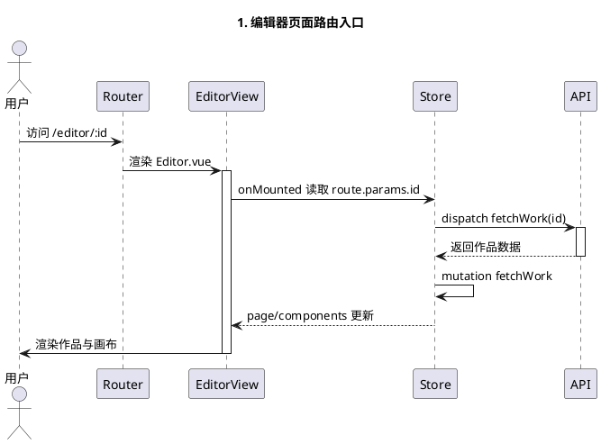

2. **编辑器整体布局与面板分区**：左侧组件库、中间画布、右侧属性/图层/页面面板。  
   * 提问点：如何组织三栏布局并与状态联动？

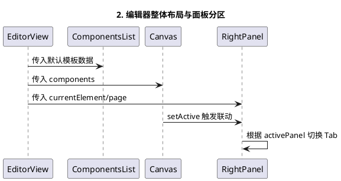

## B. 组件创建与上画布
3. **从组件列表添加文本组件**：点击组件列表项，组装 `ComponentData` 并发出 `on-item-click`。  
   * 提问点：为何组件数据要带 `id/name/props`？

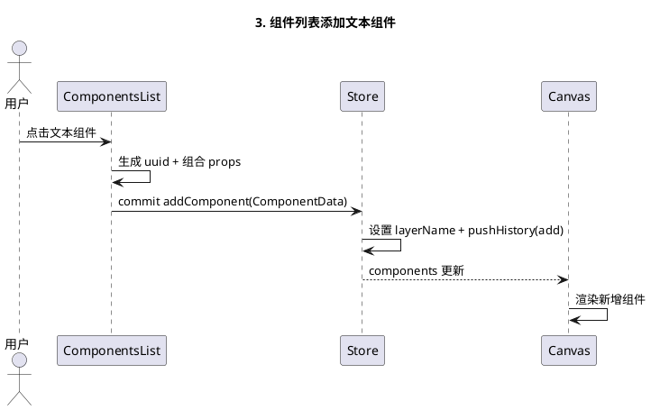

4. **图片上传并生成图片组件**：上传成功后创建 `l-image` 组件，读取图片尺寸并设置宽度。  
   * 提问点：如何通过上传响应构建组件并限制宽度？

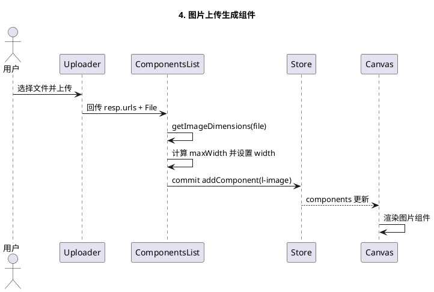

5. **添加组件到画布**：编辑器接收事件后 `commit('addComponent')` 写入 `components`。  
   * 提问点：新增组件时如何处理图层名/历史记录？

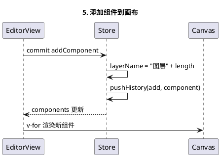

## C. 画布渲染与选中
6. **画布渲染组件列表**：`v-for` 渲染 `EditWrapper` + 业务组件，数据来自 `store`。  
   * 提问点：组件树如何跟随 `components` 响应式更新？

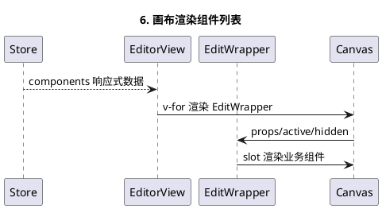

7. **选中元素并联动右侧面板**：点击包装层触发 `setActive`，通过 getter 读 `currentElement`。  
   * 提问点：选中态如何影响属性编辑与图层高亮？

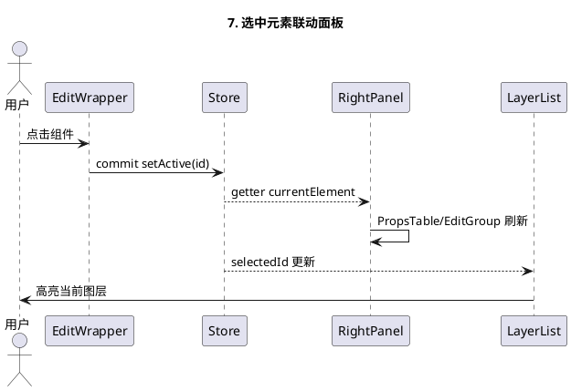

## D. 组件移动与尺寸调整
8. **拖拽移动组件**：`EditWrapper` 监听 `mousedown/mousemove` 计算位置后更新。  
   * 提问点：如何计算画布内相对坐标并写回 store？

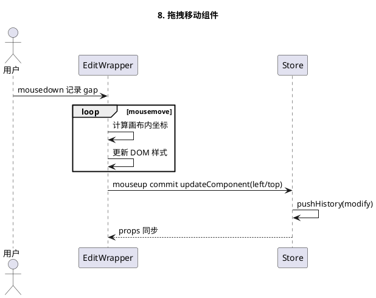

9. **拖拽缩放组件**：四个 resizer 节点计算宽高与位移并提交更新。  
   * 提问点：不同方向缩放如何影响 `top/left/width/height`？

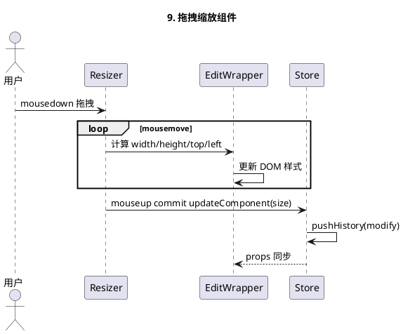

## E. 属性编辑与表单映射
10. **属性面板分组**：`EditGroup` 将属性按“尺寸/边框/阴影/位置/事件”等分组。  
    * 提问点：如何把“基础属性 + 预设分组”合并？

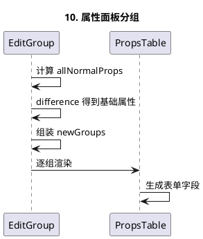

11. **属性表单动态渲染**：`PropsTable` 通过 `propsMap` 转成表单配置并渲染。  
    * 提问点：属性到表单控件映射的策略是什么？

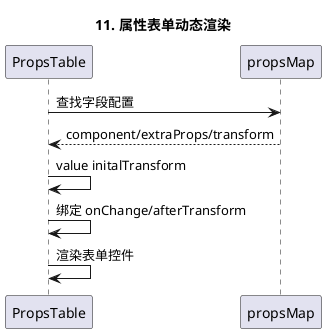

12. **属性变更写回 store**：表单 `change` 触发 `updateComponent` 更新 props。  
    * 提问点：如何支持单字段与多字段更新？

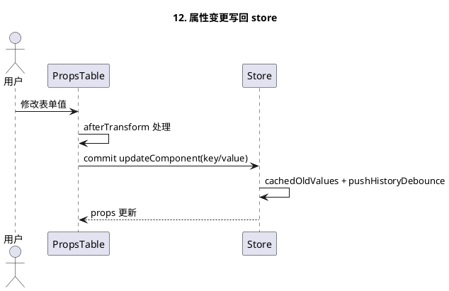

## F. 图层管理
13. **图层列表渲染与排序**：`LayerList` 使用 `vuedraggable` 对图层排序。  
    * 提问点：拖拽排序和画布渲染之间如何保持一致？

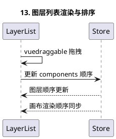

14. **图层显隐/锁定**：图层按钮更新 `isHidden/isLocked`。  
    * 提问点：锁定与隐藏的 UI/数据联动逻辑？

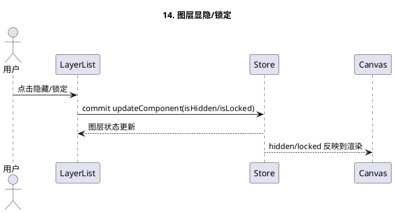

15. **图层名称内联编辑**：`InlineEdit` 支持点击编辑、Enter 保存、Esc 回滚。  
    * 提问点：如何用组合式 API 做可复用的内联编辑？

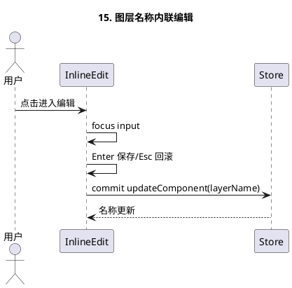

## G. 历史记录与撤销/重做
16. **新增/删除/修改历史记录**：`pushHistory` 记录 add/delete/modify。  
    * 提问点：历史记录里保存了哪些关键字段？

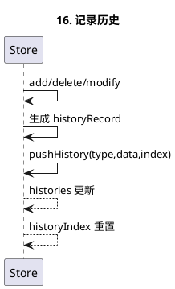

17. **撤销/重做操作**：`undo/redo` 按历史类型恢复状态。  
    * 提问点：如何处理“历史游标”与数组回退？

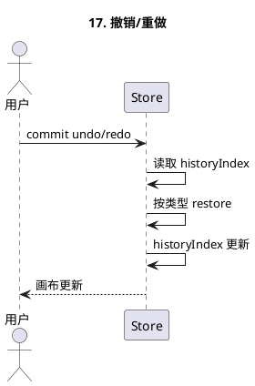

18. **防抖合并修改历史**：`pushHistoryDebounce` 限制高频更新。  
    * 提问点：为什么要防抖，如何避免记录过多？

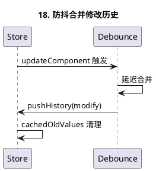

## H. 快捷键与上下文菜单
19. **快捷键复制/粘贴/删除/移动**：`hotKeys` 绑定 `ctrl+c/v`、方向键等。  
    * 提问点：如何把快捷键映射到 store mutation？

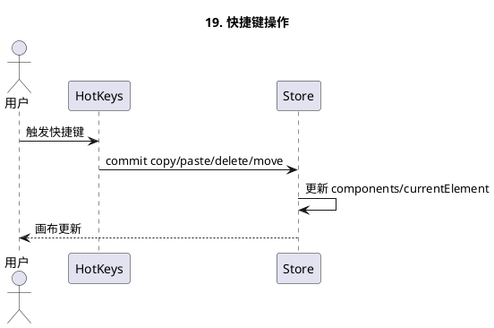

20. **右键菜单操作**：`contextMenu` 初始化并绑定删除行为。  
    * 提问点：如何在不同区域挂载不同菜单？

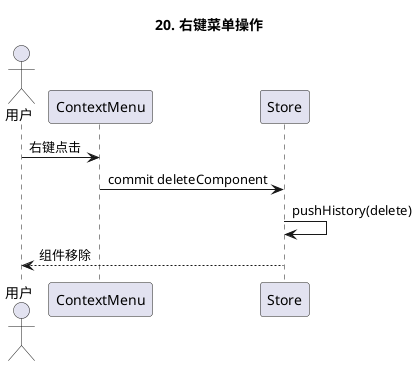

## I. 保存/预览/发布
21. **手动保存与自动保存**：`useSaveWork` 负责保存 payload + 自动保存定时器。  
    * 提问点：保存 payload 中 content 的结构是什么？

```plantuml
@startuml
title 21. 手动保存与自动保存
participant EditorView
participant useSaveWork
participant Store
participant API
EditorView -> useSaveWork: 点击保存/定时触发
useSaveWork -> useSaveWork: 组装 payload
useSaveWork -> Store: dispatch saveWork(payload)
Store -> API: PATCH /works/:id
API --> Store: 保存成功
Store --> useSaveWork: isDirty=false
@enduml
```

22. **离开路由的保存提示**：`onBeforeRouteLeave` + `Modal.confirm`。  
    * 提问点：怎么保证离开前不丢数据？

```plantuml
@startuml
title 22. 离开路由保存提示
actor 用户
participant Router
participant useSaveWork
participant Store
participant API
用户 -> Router: 尝试离开
Router -> useSaveWork: onBeforeRouteLeave
useSaveWork -> 用户: Modal.confirm
用户 -> useSaveWork: 选择保存/不保存
alt 选择保存
  useSaveWork -> Store: dispatch saveWork
  Store -> API: PATCH /works/:id
  API --> Store: 保存成功
end
Router -> 用户: 继续导航
@enduml
```

23. **预览面板与二维码**：`PreviewForm` 生成预览链接与二维码。  
    * 提问点：preview URL 结构如何拼接？

```plantuml
@startuml
title 23. 预览面板与二维码
participant PreviewForm
participant Store
participant QRCode
PreviewForm -> Store: 读取 page 信息
PreviewForm -> PreviewForm: 拼接 preview URL
PreviewForm -> QRCode: 生成二维码
QRCode --> PreviewForm: 展示二维码
PreviewForm -> PreviewForm: 展示 iframe 预览
@enduml
```

24. **发布流程**：`usePublishWork` 截图上传、更新封面、发布作品、拉取渠道。  
    * 提问点：发布流程为何要先保存？

```plantuml
@startuml
title 24. 发布流程
participant usePublishWork
participant Uploader
participant Store
participant API
usePublishWork -> Uploader: 截图上传
Uploader --> usePublishWork: 返回封面 URL
usePublishWork -> Store: commit updatePage(coverImg)
usePublishWork -> Store: dispatch saveWork
Store -> API: PATCH /works/:id
API --> Store: 保存成功
usePublishWork -> Store: dispatch publishWork
Store -> API: POST /works/publish/:id
API --> Store: 发布成功
usePublishWork -> Store: dispatch fetchChannels
Store -> API: GET /channel/getWorkChannels/:id
API --> Store: channels 更新
@enduml
```

25. **渠道管理与复制链接**：`PublishForm` 生成渠道、二维码、复制链接。  
    * 提问点：如何动态生成渠道二维码并实现复制？

```plantuml
@startuml
title 25. 渠道管理与复制链接
actor 用户
participant PublishForm
participant Store
participant API
participant QRCode
participant Clipboard
用户 -> PublishForm: 创建渠道
PublishForm -> Store: dispatch createChannel
Store -> API: POST /channel/
API --> Store: 返回新渠道
Store --> PublishForm: channels 更新
PublishForm -> QRCode: 生成渠道二维码
用户 -> Clipboard: 点击复制链接
Clipboard --> 用户: 复制成功
@enduml
```

## J. 页面级配置
26. **页面标题内联编辑**：Header 通过 `InlineEdit` 修改标题并写入 `page`。  
    * 提问点：如何区分“页面属性”与“组件属性”？

```plantuml
@startuml
title 26. 页面标题内联编辑
actor 用户
participant InlineEdit
participant Store
用户 -> InlineEdit: 修改标题
InlineEdit -> Store: commit updatePage(title)
Store -> Store: isDirty=true
Store --> InlineEdit: 标题更新
@enduml
```

27. **页面属性配置**：`PropsTable` 直接编辑 `page.props`。  
    * 提问点：页面级属性和组件级属性的表单复用方式？

```plantuml
@startuml
title 27. 页面属性配置
actor 用户
participant PropsTable
participant Store
用户 -> PropsTable: 修改页面属性
PropsTable -> Store: commit updatePage(props)
Store -> Store: isDirty=true
Store --> PropsTable: 页面属性更新
@enduml
```

---

### 使用建议
- **每条原子功能**都可以拆成：
  1) 触发入口（UI/事件）  
  2) 数据流（store mutation/action）  
  3) 影响的 UI 或副作用（画布/面板/接口）
- 按照上述结构准备问答，可以快速定位到具体文件与函数。
