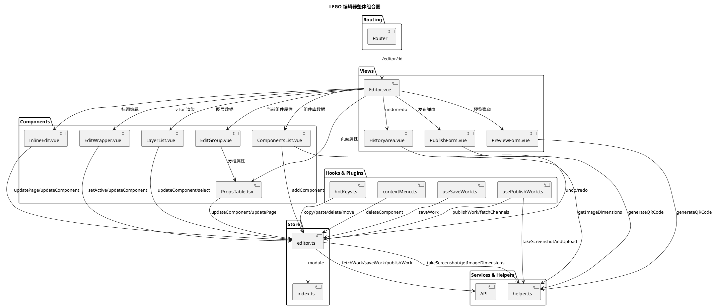

# LEGO 编辑器整体组合图（PlantUML）

> 目标：给出编辑器全局组件/数据流的组合视图，覆盖路由、核心页面、组件库、画布、属性面板、历史、快捷键、保存/发布等关键模块关系。

```plantuml
@startuml
title LEGO 编辑器整体组合图

package "Routing" {
  [Router]
}

package "Views" {
  [Editor.vue] as EditorView
  [PreviewForm.vue] as PreviewForm
  [PublishForm.vue] as PublishForm
  [HistoryArea.vue] as HistoryArea
}

package "Components" {
  [ComponentsList.vue] as ComponentsList
  [EditWrapper.vue] as EditWrapper
  [LayerList.vue] as LayerList
  [EditGroup.vue] as EditGroup
  [PropsTable.tsx] as PropsTable
  [InlineEdit.vue] as InlineEdit
}

package "Store" {
  [editor.ts] as EditorStore
  [index.ts] as RootStore
}

package "Hooks & Plugins" {
  [useSaveWork.ts] as UseSaveWork
  [usePublishWork.ts] as UsePublishWork
  [hotKeys.ts] as HotKeys
  [contextMenu.ts] as ContextMenu
}

package "Services & Helpers" {
  [API] as API
  [helper.ts] as Helper
}

' Routing to Editor
Router --> EditorView : /editor/:id

' Editor layout relations
EditorView --> ComponentsList : 组件库数据
EditorView --> EditWrapper : v-for 渲染
EditorView --> LayerList : 图层数据
EditorView --> EditGroup : 当前组件属性
EditorView --> PropsTable : 页面属性
EditorView --> InlineEdit : 标题编辑
EditorView --> HistoryArea : undo/redo
EditorView --> PreviewForm : 预览弹窗
EditorView --> PublishForm : 发布弹窗

' Component interactions
ComponentsList --> EditorStore : addComponent
EditWrapper --> EditorStore : setActive/updateComponent
LayerList --> EditorStore : updateComponent/select
EditGroup --> PropsTable : 分组属性
PropsTable --> EditorStore : updateComponent/updatePage
InlineEdit --> EditorStore : updatePage/updateComponent
HistoryArea --> EditorStore : undo/redo

' Hooks and plugins
HotKeys --> EditorStore : copy/paste/delete/move
ContextMenu --> EditorStore : deleteComponent
UseSaveWork --> EditorStore : saveWork
UsePublishWork --> EditorStore : publishWork/fetchChannels

' Store to API
EditorStore --> API : fetchWork/saveWork/publishWork
EditorStore --> Helper : takeScreenshot/getImageDimensions

' Helper usage
ComponentsList --> Helper : getImageDimensions
UsePublishWork --> Helper : takeScreenshotAndUpload
PreviewForm --> Helper : generateQRCode
PublishForm --> Helper : generateQRCode

' Store relations
EditorStore --> RootStore : module

@enduml
```
