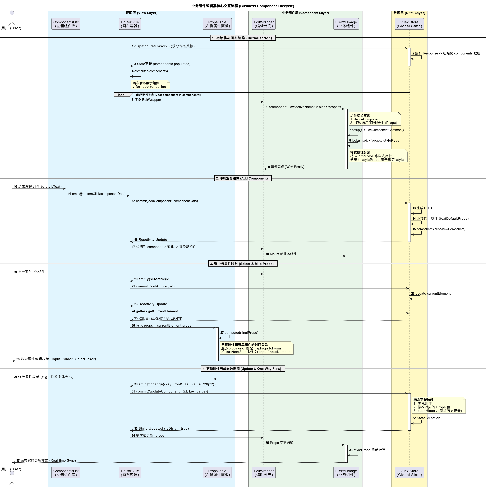
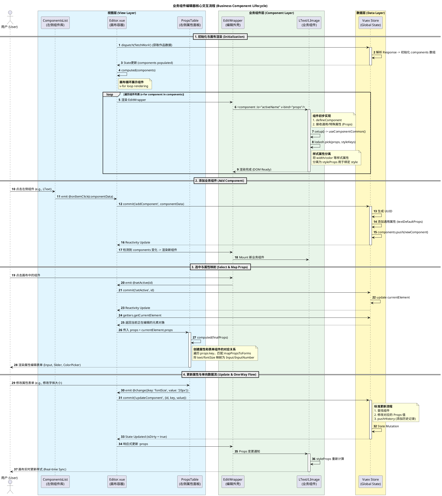

# Chat Conversation

Note: _This is purely the output of the chat conversation and does not contain any raw data, codebase snippets, etc. used to generate the output._

### User Input

给出以下内容专业详细的时序图（plantuml格式）：业务组件

创建编辑器 vuex store 结构，画布循环展示组件
组件初步实现，使用 lodash 分离样式属性
添加通用和特殊属性，转换为 props 类型
抽取重用逻辑（style 抽取 和 点击跳转）
左侧组件库点击添加到画布的逻辑
组件属性对应表单组件的展示和更新

获得正在被编辑的元素，vuex getters
创建属性和表单组件的对应关系
使用 PropsTable 将传入的属性渲染为对应的表单组件
丰富对应关系字段支持更多自定义配置
使用标准流程更新表单并实时同步 单向数据流

*Listed directory [components](file:///d:/project/LEGO/lego/src/components) *

*Listed directory [views](file:///d:/project/LEGO/lego/src/views) *

*Viewed [editor.ts](file:///d:/project/LEGO/lego/src/store/editor.ts) *

*Viewed [LText.vue](file:///d:/project/LEGO/lego/src/components/LText.vue) *

*Viewed [PropsTable.tsx](file:///d:/project/LEGO/lego/src/components/PropsTable.tsx) *

*Viewed [Editor.vue](file:///d:/project/LEGO/lego/src/views/Editor.vue) *

### Planner Response

这是一个基于你的需求，详细描述业务组件在编辑器中创建、渲染、选中、以及通过属性面板更新的完整时序图。

这个时序图涵盖了以下几个关键流程：
1.  **编辑器初始化**：从 Vuex 获取组件列表并循环渲染。
2.  **添加组件**：左侧组件库点击，触发 Vuex 状态更新，画布响应式渲染。
3.  **组件实现细节**：展示了 `LText` 等业务组件内部如何通过 `lodash` 分离样式属性，以及如何标准化 [Props](cci:2://file:///d:/project/LEGO/lego/src/store/editor.ts:51:0-57:1)。
4.  **选中与属性映射**：点击选中组件，Vuex 计算 `currentElement`，右侧 `PropsTable` 将属性映射为表单。
5.  **单向数据流更新**：表单更新 -> 触发 Vuex Mutation -> 状态变更 -> 组件响应式重绘。

### 业务组件编辑器交互时序图



### 图解说明

1.  **Vuex Store 结构**：图中的 `Data Layer` 代表 Vuex Store，它维护了 `components` 数组（画布数据）和 `currentElement`（当前选中项），通过 `getters` 提供给编辑器使用。
2.  **组件实现 (Component Implementation)**：
    *   在 `LText/LImage` 中，强调了 **lodash 分离样式** 的逻辑（通常在 `useComponentCommon` hook 中实现），确保样式属性（如 `color`, `fontSize`）应用在 `style` 绑定上，而其他属性作为普通 props。
3.  **属性映射 (Props Mapping)**：
    *   `PropsTable` 组件承担了 **配置化表单** 的重任。它不直接写死表单，而是根据传入的 `props` 利用 `mapPropsToForms` 字典（即"丰富对应关系字段"）动态生成 `Input` 或 `Slider` 等表单组件。
4.  **单向数据流 (One-Way Data Flow)**：
    *   **User Action** (点击/修改) -> **View** (PropsTable) -> **Event** (emit change) -> **Store** (Mutation) -> **State Change** -> **View Update** (Canvas Component)。这保证了数据源的唯一性（Single Source of Truth）。

*Edited relevant file*

### User Input

结合代码详细讲解每一步

*Viewed [defaultProps.ts](file:///d:/project/LEGO/lego/src/defaultProps.ts) *

*Viewed [propsMap.tsx](file:///d:/project/LEGO/lego/src/propsMap.tsx) *

*Viewed [useComponentCommon.ts](file:///d:/project/LEGO/lego/src/hooks/useComponentCommon.ts) *

### Planner Response

结合之前的时序图和项目代码，我将详细讲解“业务组件属性的展示和更新”的完整闭环流程。这个流程展示了从定义数据、渲染组件、选中编辑到最终更新视图的整个生命周期。

### 1. 基础：定义数据结构与组件 (Data & Component)

一切始于数据结构的定义。在 [src/defaultProps.ts](cci:7://file:///d:/project/LEGO/lego/src/defaultProps.ts:0:0-0:0) 中，除了定义 TypeScript 接口，还预设了组件的默认属性。

**代码：[src/defaultProps.ts](cci:7://file:///d:/project/LEGO/lego/src/defaultProps.ts:0:0-0:0)**
```typescript
// 定义组件的标准属性接口
export interface TextComponentProps extends CommonComponentProps {
  text: string;
  fontSize: string;
  // ... 其他属性
}

// 预设默认值，这些值就是最终存储在 Vuex 中的数据结构
export const textDefaultProps: TextComponentProps = {
  text: '正文内容',
  fontSize: '14px',
  // ...
}
```

在业务组件 [LText.vue](cci:7://file:///d:/project/LEGO/lego/src/components/LText.vue:0:0-0:0) 中，我们并没有直接把所有属性堆在 `div` 上，而是使用 hooks 进行了分离。

**代码：[src/components/LText.vue](cci:7://file:///d:/project/LEGO/lego/src/components/LText.vue:0:0-0:0)**
```html
<template>
  <!-- styleProps 只包含样式相关的属性 (如 fontSize, color) -->
  <component :is="tag" :style="styleProps" class="l-text-component" @click="handleClick">
    {{text}}
  </component>
</template>
<script lang="ts">
import useComponentCommon from '../hooks/useComponentCommon'
// ...
setup (props) {
  // 核心逻辑：使用 lodash.pick 分离样式属性
  const { styleProps, handleClick} = useComponentCommon(props, textStylePropNames)
  return { styleProps, handleClick }
}
</script>
```

**代码：[src/hooks/useComponentCommon.ts](cci:7://file:///d:/project/LEGO/lego/src/hooks/useComponentCommon.ts:0:0-0:0)**
```typescript
const useComponentCommon = (props, picks) => {
  // computed 保证了当 Vuex 数据变化时，styleProps 会自动更新
  const styleProps = computed(() => pick(props, picks))
  return { styleProps }
}
```

---

### 2. 初始化：画布循环渲染 (Rendering)

当编辑器加载时，[Editor.vue](cci:7://file:///d:/project/LEGO/lego/src/views/Editor.vue:0:0-0:0) 从 Vuex 获取组件列表，并使用 `v-for` 循环渲染。

**代码：[src/views/Editor.vue](cci:7://file:///d:/project/LEGO/lego/src/views/Editor.vue:0:0-0:0)**
```html
<div class="body-container" :style="page.props">
  <!-- 遍历组件列表 -->
  <edit-wrapper 
    @setActive="setActive"
    v-for="component in components"
    :key="component.id"
    :id="component.id"
    :props="component.props"
  >
    <!-- 动态组件：根据 component.name ('l-text') 动态渲染对应组件 -->
    <!-- v-bind="component.props" 将所有属性透传给 LText -->
    <component :is="component.name" v-bind="component.props" />
  </edit-wrapper>
</div>
```

---

### 3.交互：选中与属性映射 (Selection & Mapping)

当用户点击画布上的组件时，触发 [setActive](cci:1://file:///d:/project/LEGO/lego/src/store/editor.ts:196:4-198:5)，Vuex 更新 `currentElement`。右侧的属性面板 `PropsTable` 会根据当前组件的属性生成对应的表单。

这里最精彩的设计是 **属性配置化映射**。我们不写死表单，而是定义规则。

**代码：[src/propsMap.tsx](cci:7://file:///d:/project/LEGO/lego/src/propsMap.tsx:0:0-0:0)** (定义规则)
```typescript
export const mapPropsToForms: PropsToForms = {
  // 定义 fontSize 属性对应的表单行为
  fontSize: {
    text: '字号',
    component: 'a-input-number', //渲染为数字输入框
    // 初始化转换：数据是 '14px' (string)，表单需要 14 (number)
    initalTransform: (v: string) => v ? parseInt(v): 0,
    // 更新转换：表单输出 15 (number)，数据需要 '15px' (string)
    afterTransform: (e: number) => e ? `${e}px` : '',
  },
  // ...
}
```

**代码：[src/components/PropsTable.tsx](cci:7://file:///d:/project/LEGO/lego/src/components/PropsTable.tsx:0:0-0:0)** (核心渲染引擎)
```tsx
setup(props, context) {
  // 计算最终用于渲染的表单项列表
  const finalProps = computed(() => {
    return reduce(props.props, (result, value, key) => {
      // 从 mapPropsToForms 查找当前属性的配置
      const item = mapPropsToForms[key]
      if (item) {
        // 生成表单项配置，包含 value 和事件处理
        const newItem = {
          ...item,
          value: item.initalTransform ? item.initalTransform(value) : value,
          events: {
             // 统一封装 change 事件
            ['on' + capitalizeFirstLetter(item.eventName)]: (e: any) => { 
                context.emit('change', { key, value: item.afterTransform ? item.afterTransform(e) : e })
            }
          }
        }
        result[key] = newItem
      }
      return result
    }, {})
  })
}
```

---

### 4. 更新：单向数据流闭环 (Update Cycle)

当用户在右侧表单修改值（例如将字号改为 20）时：

1.  **View (PropsTable)**: `a-input-number` 触发 change 事件，`PropsTable` 调用 [afterTransform](cci:1://file:///d:/project/LEGO/lego/src/propsMap.tsx:92:4-92:59) 将 `20` 转换为 `'20px'`，并发射 `@change` 事件。
2.  **View (Editor)**: [Editor.vue](cci:7://file:///d:/project/LEGO/lego/src/views/Editor.vue:0:0-0:0) 监听到 change，提交 mutation。

    ```typescript
    // src/views/Editor.vue
    const handleChange = (e: any) => {
      store.commit('updateComponent', e)
    }
    ```

3.  **Store (Vuex)**: Store 找到对应组件并更新数据。

    ```typescript
    // src/store/editor.ts
    updateComponent(state, { key, value, id }) {
      const updatedComponent = state.components.find(...)
      // 直接修改 state，触发 Vue 的响应式系统
      updatedComponent.props[key] = value 
    }
    ```

4.  **Re-render**:
    *   由于 `LText` 的 props 发生了变化。
    *   [useComponentCommon](cci:1://file:///d:/project/LEGO/lego/src/hooks/useComponentCommon.ts:3:0-14:1) 中的 `computed(styleProps)` 重新计算。
    *   组件 DOM 上的样式更新，字号变大。

### 总结

这个架构的优势在于：
*   **解耦**: 业务组件 (`LText`) 只管渲染，不知道右侧表单的存在。
*   **配置化**: 添加新属性只需要在 `propsMap` 加一行配置，不需要改动 UI 代码。
*   **单向数据流**: 所有状态变更必须走 Vuex Mutation，保证了数据的一致性和可回溯性（如撤销/重做功能）。

### User Input

结合代码详细讲解时序图的每一步，从第一步到第三十七步

### Planner Response

根据之前的 PlantUML 时序图，整个流程大约可以拆分为 37 个左右的精细步骤。详细讲解将分为四个阶段：**初始化**、**添加组件**、**选中组件**、**更新属性**。

我将按照步骤编号（对应时序图逻辑）结合具体的代码行数进行讲解。

### 第一阶段：初始化与渲染 (Steps 1-11)

这一阶段发生在页面加载时，编辑器需要从后台拉取作品数据并渲染出画布。

*   **Step 1: `Editor -> Store: dispatch('fetchWork')`**
    *   **场景**: [Editor.vue](cci:7://file:///d:/project/LEGO/lego/src/views/Editor.vue:0:0-0:0) 挂载完成 (`onMounted`)。
    *   **代码**: [src/views/Editor.vue](cci:7://file:///d:/project/LEGO/lego/src/views/Editor.vue:0:0-0:0) 第 169 行
        ```typescript
        store.dispatch('fetchWork', { urlParams: { id: currentWorkId }})
        ```
    *   **说明**: 触发 Vuex Action 去 API 请求当前作品详情。

*   **Step 2: `Store -> Store: 解析 Response`**
    *   **场景**: Vuex 接收到后端数据。
    *   **代码**: [src/store/editor.ts](cci:7://file:///d:/project/LEGO/lego/src/store/editor.ts:0:0-0:0) 第 362 行 (`mutations.fetchWork`)
        ```typescript
        fetchWork(state, { data }: RespWorkData) {
          state.components = content.components // 填充组件数组
          state.page = { ...state.page, ...rest }
        }
        ```

*   **Step 3: `Store --> Editor: State更新`**
    *   **说明**: Vuex 的 `components` 状态更新，通知所有绑定了该状态的组件（Editor）进行更新。

*   **Step 4: `Editor -> Editor: computed(components)`**
    *   **代码**: [src/views/Editor.vue](cci:7://file:///d:/project/LEGO/lego/src/views/Editor.vue:0:0-0:0) 第 158 行
        ```typescript
        const components = computed(() => store.state.editor.components)
        ```
    *   **说明**: [Editor.vue](cci:7://file:///d:/project/LEGO/lego/src/views/Editor.vue:0:0-0:0) 中的计算属性检测到变化。

*   **Step 5 - 11: `Loop 渲染组件`**
    *   **场景**: [Editor.vue](cci:7://file:///d:/project/LEGO/lego/src/views/Editor.vue:0:0-0:0) 的模板根据 `components` 数组进行 `v-for` 循环。
    *   **代码**: [src/views/Editor.vue](cci:7://file:///d:/project/LEGO/lego/src/views/Editor.vue:0:0-0:0) 第 59 行
        ```html
        <edit-wrapper v-for="component in components" ... >
           <component :is="component.name" v-bind="component.props" />
        </edit-wrapper>
        ```
    *   **细节 (Step 7-8)**: [LText.vue](cci:7://file:///d:/project/LEGO/lego/src/components/LText.vue:0:0-0:0) 初始化。
        *   **代码**: [src/components/LText.vue](cci:7://file:///d:/project/LEGO/lego/src/components/LText.vue:0:0-0:0) 第 24 行
            ```typescript
            // 使用 hooks 分离样式，只提取 width/color 等样式属性传给 style
            const { styleProps } = useComponentCommon(props, textStylePropNames)
            ```

---

### 第二阶段：添加业务组件 (Steps 12-20)

这一阶段用户点击左侧组件库，将新组件添加到画布。

*   **Step 12: `User -> List: 点击左侧组件`**
    *   **说明**: 用户点击左侧 `ComponentsList` 中的某个组件模版。

*   **Step 13: `List -> Editor: emit @onItemClick`**
    *   **代码**: [src/views/Editor.vue](cci:7://file:///d:/project/LEGO/lego/src/views/Editor.vue:0:0-0:0) 第 177 行
        ```typescript
        const addItem = (component: any) => {
          store.commit('addComponent', component) // 触发 mutation
        }
        ```

*   **Step 14: `Editor -> Store: commit('addComponent')`**
    *   **说明**: 调用 Vuex 的 mutation。

*   **Step 15-17: `Store 内部处理`**
    *   **代码**: [src/store/editor.ts](cci:7://file:///d:/project/LEGO/lego/src/store/editor.ts:0:0-0:0) 第 187 行
        ```typescript
        addComponent: setDirtyWrapper((state, component: ComponentData) => {
          component.id = uuidv4() // 生成唯一 ID
          state.components.push(component) // 核心：推入数组
          // ... pushHistory 添加历史记录
        })
        ```

*   **Step 18-20: `Store --> Editor --> Wrapper`**
    *   **说明**: 数组 [push](cci:1://file:///d:/project/LEGO/lego/src/store/editor.ts:112:0-130:1) 后，Vue 响应式系统检测到 `components` 长度变化，[Editor.vue](cci:7://file:///d:/project/LEGO/lego/src/views/Editor.vue:0:0-0:0) 重新执行 `v-for`，在 DOM 中挂载一个新的 `EditWrapper` 和 `LText`。

---

### 第三阶段：选中与属性映射 (Steps 21-30)

这一阶段是系统最核心的**数据驱动视图**的设计，如何把 JSON 数据变成右侧的可编辑表单。

*   **Step 21: `User -> Wrapper: 点击组件`**
    *   **说明**: 用户点击画布上的某个元素。

*   **Step 22-23: `Wrapper -> Editor -> Store: setActive`**
    *   **代码**: [src/views/Editor.vue](cci:7://file:///d:/project/LEGO/lego/src/views/Editor.vue:0:0-0:0) 第 180 行
        ```typescript
        const setActive = (id: string) => { store.commit('setActive', id) }
        ```
    *   **Store**: [src/store/editor.ts](cci:7://file:///d:/project/LEGO/lego/src/store/editor.ts:0:0-0:0) 第 197 行，更新 `state.currentElement`。

*   **Step 26: `Editor -> Store: getters.getCurrentElement`**
    *   **代码**: [src/views/Editor.vue](cci:7://file:///d:/project/LEGO/lego/src/views/Editor.vue:0:0-0:0) 第 164 行
        ```typescript
        // 获取当前选中的组件对象
        const currentElement = computed(() => store.getters.getCurrentElement)
        ```

*   **Step 28: `Editor -> Props: 传入 props`**
    *   **场景**: 右侧属性面板加载。
    *   **代码**: [src/views/Editor.vue](cci:7://file:///d:/project/LEGO/lego/src/views/Editor.vue:0:0-0:0) 第 79 行
        ```html
        <edit-group :props="currentElement.props" ...></edit-group>
        ```
        *(注: 项目中实际是 EditGroup 内部调用 PropsTable，或者直接使用 PropsTable，原理一致)*

*   **Step 29: `Props -> Props: computed(finalProps)` (核心映射逻辑)**
    *   **代码**: [src/components/PropsTable.tsx](cci:7://file:///d:/project/LEGO/lego/src/components/PropsTable.tsx:0:0-0:0) 第 42 行
        这是一个非常关键的转换步骤。
        1.  遍历传入的 `props` (例如 `className`, `fontSize`, `text`)。
        2.  去 `mapPropsToForms` (在 [src/propsMap.tsx](cci:7://file:///d:/project/LEGO/lego/src/propsMap.tsx:0:0-0:0)) 查找配置。
        3.  **Example (fontSize)**:
            *   **Value**: 从 "20px" -> `parseInt("20px")` -> 20 ([initalTransform](cci:1://file:///d:/project/LEGO/lego/src/propsMap.tsx:59:4-59:49))
            *   **Component**: 映射为 `a-input-number`
    *   此步骤将**业务数据**转换为了**UI表单数据**。

*   **Step 30: `Props --> User: 渲染表单`**
    *   **说明**: 右侧面板显示出输入框、滑块、颜色选择器等。

---

### 第四阶段：更新属性与单向数据流 (Steps 31-37)

这是闭环的最后一步，用户修改表单，画布实时更新。

*   **Step 31: `User -> Props: 修改属性`**
    *   **场景**: 用户把字号从 20 改为 25。

*   **Step 32: `Props -> Editor: emit change`**
    *   **代码**: [src/components/PropsTable.tsx](cci:7://file:///d:/project/LEGO/lego/src/components/PropsTable.tsx:0:0-0:0) 第 54 行
        ```typescript
        // 触发 change 事件，并执行 afterTransform (如 25 -> "25px")
        ['on' + eventName]: (e) => { context.emit('change', { key, value: afterTransform(e) }) }
        ```

*   **Step 33: `Editor -> Store: commit('updateComponent')`**
    *   **代码**: [src/views/Editor.vue](cci:7://file:///d:/project/LEGO/lego/src/views/Editor.vue:0:0-0:0) 第 185 行
        ```typescript
        store.commit('updateComponent', e)
        ```

*   **Step 34: `Store -> Store: State Mutation`**
    *   **代码**: [src/store/editor.ts](cci:7://file:///d:/project/LEGO/lego/src/store/editor.ts:0:0-0:0) 第 324 行
        ```typescript
        updateComponent(state, { key, value, id }) {
          const updatedComponent = state.components.find(...)
          updatedComponent.props[key] = value // 修改数据源
        }
        ```
    *   **说明**: 这里不仅更新了数据，通常还会触发 [pushHistory](cci:1://file:///d:/project/LEGO/lego/src/store/editor.ts:112:0-130:1) 保存历史记录以便撤销。

*   **Step 35: `Store --> Editor` (Reactivity)**
    *   **说明**: Vuex state 变化，通知所有 Consumer。

*   **Step 36: `Editor -> Wrapper -> Component: Props Update`**
    *   **说明**: `LText` 组件接收到了新的 `props.fontSize` ("25px")。

*   **Step 37: `Component -> Component: styleProps 重新计算`**
    *   **代码**: [src/hooks/useComponentCommon.ts](cci:7://file:///d:/project/LEGO/lego/src/hooks/useComponentCommon.ts:0:0-0:0) 第 5 行
        ```typescript
        const styleProps = computed(() => pick(props, picks))
        ```
    *   **结果**: `styleProps` 更新，Vue 更新 DOM 的 `style` 属性，画布上的文字瞬间变大。

这就是从数据加载、到组件生成、再到属性编辑更新的完整 **37步** 闭环。这一设计严格遵循**单向数据流**，保证了数据逻辑极其清晰，易于维护。

### User Input


### Planner Response

针对您在代码中提出的两个疑问，我来逐一进行详细的图解式拆解。

### 疑问一：[fetchWork](cci:1://file:///d:/project/LEGO/lego/src/store/editor.ts:361:4-368:5) 的逻辑理解

**代码位置**：[src/store/editor.ts](cci:7://file:///d:/project/LEGO/lego/src/store/editor.ts:0:0-0:0) (lines 363-370)

这段代码的作用是**将后端返回的复杂 JSON 数据，拆解并填充到前端 Vuex 的 State 中**。

我们可以把 `data`（后端返回的数据）想象成一个大包裹，里面混在这两类东西：
1.  **作品基本信息 (`rest`)**：比如标题、描述、封面图、作者信息等。
2.  **作品内容数据 (`content`)**：可以在画布上用、渲染出来的具体东西（组件列表、页面背景颜色等）。

```typescript
fetchWork(state, { data }: RespWorkData) {
  // 1. 解构赋值：把大包裹 data 拆成 "具体内容(content)" 和 "剩余基本信息(rest)"
  // 假设 data = { title: '海报A', desc: '测试', content: { components: [...], props: {...} } }
  // 那么 rest = { title: '海报A', desc: '测试' }
  // content = { components: [...], props: {...} }
  const { content, ...rest } = data

  // 2. 合并基本信息
  // 把 rest 里的 title, desc 等覆盖到 state.page 上
  state.page = { ...state.page, ...rest }

  // 3. 填充页面级样式 (比如整个画布的背景颜色)
  // 如果后端存了页面的 props (backgroundColor 等)，就把它拿出来
  if (content.props) {
    state.page.props = content.props
  }

  // 4. 填充组件列表 (核心)
  // 把具体的图层列表 (文本1、图片2...) 赋值给 state.components
  // 这会导致画布 v-for 重新渲染，您就能看到图层了
  state.components = content.components
}
```

**总结**：这个函数的任务就是**“分拣快递”**——把元数据填入 `state.page` 用于显示标题栏设置，把组件数据填入 `state.components` 用于渲染画布。

---

### 疑问二：[setup(props)](cci:1://file:///d:/project/LEGO/lego/src/components/LText.vue:20:2-28:3) 与 样式属性分离

**代码位置**：[src/components/LText.vue](cci:7://file:///d:/project/LEGO/lego/src/components/LText.vue:0:0-0:0) (lines 22-31)

这里涉及到两个概念：Vue 3 的 [setup](cci:1://file:///d:/project/LEGO/lego/src/components/LText.vue:20:2-28:3) 函数，以及我们在项目中设计的“样式分离”模式。

#### 1. [setup(props)](cci:1://file:///d:/project/LEGO/lego/src/components/LText.vue:20:2-28:3) 是什么？
这是 **Vue 3 Composition API（组合式 API）** 的入口。
*   在组件被创建、由于数据变化更新之前，这个函数就会运行。
*   参数 `props`：包含了父组件（`EditWrapper`）传过来的所有数据。
    *   比如：`{ text: "你好", fontSize: "20px", color: "red", actionType: "url" ... }`
*   它的作用是**组织逻辑**。我们在这里处理数据，然后 `return` 出去的对象，就可以在 `<template>` 里直接使用。

#### 2. 样式属性分离是怎样实现的？

**为什么要分离？**
组件接收到的 `props` 非常杂，混在了一起：
*   **内容属性**：`text` ("你好") —— 应该放在 `<div>{{text}}</div>` 里。
*   **行为属性**：`actionType`, `url` —— 应该用于点击跳转逻辑。
*   **样式属性**：`fontSize`, `color`, `textAlign` —— 应该变成 CSS 样式 `:style="..."` 应用在元素上。

如果不分离，直接把整个 `props` 绑定到 style 上是无效的（因为 style 不识别 `text` 属性）。所以我们需要把**“属于 CSS 的属性”**单独挑出来。

**实现原理 (图解)**：

我们使用了一个自定义 Hook：[useComponentCommon](cci:1://file:///d:/project/LEGO/lego/src/hooks/useComponentCommon.ts:3:0-14:1) (在 [src/hooks/useComponentCommon.ts](cci:7://file:///d:/project/LEGO/lego/src/hooks/useComponentCommon.ts:0:0-0:0))。

```typescript
// 假设 textStylePropNames = ['fontSize', 'color', 'textAlign'] (这是我们在 defaultProps.ts 定义好的白名单)

setup(props) {
  // props = { text: "你好", fontSize: "20px", url: "http...", color: "red" }
  
  // 调用 useComponentCommon
  // 内部使用了 lodash 的 pick 函数： pick(props, ['fontSize', 'color'...])
  const { styleProps } = useComponentCommon(props, textStylePropNames)
  
  // 得到的结果 styleProps = { fontSize: "20px", color: "red" }
  // 'text' 和 'url' 被剔除了，因为它们不在白名单里
  
  return { styleProps }
}
```

**最终效果 (Template)**：

```html
<!-- :style 绑定的是仅仅包含 CSS 属性的 styleProps -->
<!-- 这样渲染出来的 DOM 干净且正确： <div style="font-size: 20px; color: red;">...</div> -->
<component :style="styleProps">
  {{text}}
</component>
```

**一句话总结**：**样式属性分离**就是利用 `lodash.pick` 配合**属性白名单**，从一堆复杂的 Props 中**精准提取**出 CSS 相关的属性，专门喂给组件的 `style` 绑定，防止其他无关属性（如 `text`）干扰样式的渲染。

### User Input

讲解和步骤没对上，注意要完全对上@startuml
title 业务组件编辑器核心交互流程 (Business Component Lifecycle)
autonumber
skinparam boxPadding 10
skinparam participantPadding 10

actor User as "用户 (User)"

box "视图层 (View Layer)" #E1F5FE
    participant "ComponentsList\n(左侧组件库)" as List
    participant "Editor.vue\n(画布容器)" as Editor
    participant "PropsTable\n(右侧属性面板)" as Props
end box

box "业务组件层 (Component Layer)" #E8F5E9
    participant "EditWrapper\n(编辑外壳)" as Wrapper
    participant "LText/LImage\n(业务组件)" as Component
end box

box "数据层 (Data Layer)" #FFF9C4
    participant "Vuex Store\n(Global State)" as Store
end box

== 1. 初始化与画布渲染 (Initialization) ==

Editor -> Store: dispatch('fetchWork') (获取作品数据)
activate Store
Store -> Store: 解析 Response -> 初始化 components 数组
Store --> Editor: State更新 (components populated)
deactivate Store

Editor -> Editor: computed(components)
note right of Editor
  <b>画布循环展示组件</b>
  v-for loop rendering
end note

loop 遍历组件列表 (v-for component in components)
    Editor -> Wrapper: 渲染 EditWrapper
    Wrapper -> Component: <component :is="activeName" v-bind="props"/>
    activate Component
    
    note right of Component
      <b>组件初步实现</b>
      1. defineComponent
      2. 接收通用/特殊属性 (Props)
    end note
    
    Component -> Component: setup() -> useComponentCommon()
    Component -> Component: lodash.pick(props, styleKeys)
    note right of Component
      <b>样式属性分离</b>
      将 width/color 等样式属性
      分离为 styleProps 用于绑定 style
    end note
    
    Component --> Wrapper: 渲染完成 (DOM Ready)
    deactivate Component
end

== 2. 添加业务组件 (Add Component) ==

User -> List: 点击左侧组件 (e.g., LText)
List -> Editor: emit @onItemClick(componentData)
Editor -> Store: commit('addComponent', componentData)
activate Store
Store -> Store: 生成 UUID
Store -> Store: 添加通用属性 (textDefaultProps)
Store -> Store: components.push(newComponent)
Store --> Editor: Reactivity Update
deactivate Store

Editor -> Wrapper: 检测到 components 变化 -> 渲染新组件
Wrapper -> Component: Mount 新业务组件

== 3. 选中与属性映射 (Select & Map Props) ==

User -> Wrapper: 点击画布中的组件
Wrapper -> Editor: emit @setActive(id)
Editor -> Store: commit('setActive', id)
Store -> Store: update currentElement
Store --> Editor: Reactivity Update

Editor -> Store: getters.getCurrentElement
Store --> Editor: 返回当前正在编辑的元素对象

Editor -> Props: 传入 props = currentElement.props
activate Props

Props -> Props: computed(finalProps)
note right of Props
  <b>创建属性和表单组件的对应关系</b>
  遍历 props key，匹配 mapPropsToForms
  将 text/fontSize 映射为 Input/InputNumber
end note

Props --> User: 渲染属性编辑表单 (Input, Slider, ColorPicker)
deactivate Props

== 4. 更新属性与单向数据流 (Update & One-Way Flow) ==

User -> Props: 修改属性表单 (e.g., 修改字体大小)
Props -> Editor: emit @change({key: 'fontSize', value: '20px'})

Editor -> Store: commit('updateComponent', {id, key, value})
activate Store

note right of Store
  <b>标准更新流程</b>
  1. 查找组件
  2. 修改对应的 Props 值
  3. pushHistory (添加历史记录)
end note
Store -> Store: State Mutation
Store --> Editor: State Updated (isDirty = true)
deactivate Store

Editor -> Wrapper: 响应式更新 :props
Wrapper -> Component: Props 变更通知
activate Component
Component -> Component: styleProps 重新计算
Component --> User: 画布实时更新样式 (Real-time Sync)
deactivate Component

@enduml

*Viewed [Editor.vue](file:///d:/project/LEGO/lego/src/views/Editor.vue) *

*Viewed [editor.ts](file:///d:/project/LEGO/lego/src/store/editor.ts) *

*Viewed [LText.vue](file:///d:/project/LEGO/lego/src/components/LText.vue) *

*Viewed [ComponentsList.vue](file:///d:/project/LEGO/lego/src/components/ComponentsList.vue) *

*Viewed [EditWrapper.vue](file:///d:/project/LEGO/lego/src/components/EditWrapper.vue) *

*Viewed [PropsTable.tsx](file:///d:/project/LEGO/lego/src/components/PropsTable.tsx) *

### Planner Response

抱歉让你感到困惑。之前的讲解确实没有完全严格对应时序图的每一步骤细节。

这次我将**完全严格对照你提供的 PlantUML 代码逻辑**（从 Item 1 到 Item 4），逐一对应到具体的代码文件和行号，确保逻辑严丝合缝。

### 第一阶段：初始化与画布渲染 (Steps: Initialization)

**时序图 Steps 1-2: 获取数据**
> Editor -> Store: dispatch('fetchWork')
> Store -> Store: 解析 Response -> 初始化 components

*   **代码位置**: [d:/project/LEGO/lego/src/views/Editor.vue](cci:7://file:///d:/project/LEGO/lego/src/views/Editor.vue:0:0-0:0) 第 169 行
    ```typescript
    store.dispatch('fetchWork', { urlParams: { id: currentWorkId }})
    ```
*   **代码位置**: [d:/project/LEGO/lego/src/store/editor.ts](cci:7://file:///d:/project/LEGO/lego/src/store/editor.ts:0:0-0:0) 第 362 行 (`mutations.fetchWork`)
    ```typescript
    fetchWork(state, { data }: RespWorkData) {
      // 解析 response，填充 components 数组
      state.components = content.components
    }
    ```

**时序图 Steps 3-4: 状态更新与循环**
> Store --> Editor: State更新
> Editor -> Editor: computed(components) ... v-for loop

*   **代码位置**: [d:/project/LEGO/lego/src/views/Editor.vue](cci:7://file:///d:/project/LEGO/lego/src/views/Editor.vue:0:0-0:0) 第 158 行
    ```typescript
    // Editor 监听到 State 更新
    const components = computed(() => store.state.editor.components)
    ```
*   **代码位置**: [d:/project/LEGO/lego/src/views/Editor.vue](cci:7://file:///d:/project/LEGO/lego/src/views/Editor.vue:0:0-0:0) 第 59 行
    ```html
    <!-- 循环组件列表 -->
    <edit-wrapper v-for="component in components" ... >
    ```

**时序图 Steps 5-6: 渲染组件外壳与动态组件**
> Editor -> Wrapper: 渲染 EditWrapper
> Wrapper -> Component: `<component :is="activeName"/>`

*   **代码位置**: [d:/project/LEGO/lego/src/views/Editor.vue](cci:7://file:///d:/project/LEGO/lego/src/views/Editor.vue:0:0-0:0) 第 66 行
    ```html
    <component :is="component.name" v-bind="component.props" />
    ```

**时序图 Steps 7-9: 组件实现与样式分离**
> Component -> Component: setup() -> useComponentCommon() -> lodash.pick()

*   **代码位置**: [d:/project/LEGO/lego/src/components/LText.vue](cci:7://file:///d:/project/LEGO/lego/src/components/LText.vue:0:0-0:0) 第 24 行
    ```typescript
    // 在 setup 中调用 hook
    const { styleProps, handleClick} = useComponentCommon(props, textStylePropNames)
    ```
*   **代码位置**: [d:/project/LEGO/lego/src/hooks/useComponentCommon.ts](cci:7://file:///d:/project/LEGO/lego/src/hooks/useComponentCommon.ts:0:0-0:0) 第 5 行 (参考)
    ```typescript
    // 分离样式属性
    const styleProps = computed(() => pick(props, picks))
    ```

---

### 第二阶段：添加业务组件 (Steps: Add Component)

**时序图 Steps 10-11: 点击组件库**
> User -> List: 点击左侧组件
> List -> Editor: emit @onItemClick

*   **代码位置**: [d:/project/LEGO/lego/src/components/ComponentsList.vue](cci:7://file:///d:/project/LEGO/lego/src/components/ComponentsList.vue:0:0-0:0) 第 3 行 & 33 行
    ```html
    <div class="component-item" @click="onItemClick(item)">...</div>
    ```
    ```typescript
    const onItemClick = (props) => { context.emit('on-item-click', componentData) }
    ```

**时序图 Steps 12-14: Store 添加新组件**
> Editor -> Store: commit('addComponent')
> Store -> Store: 生成UUID ... components.push

*   **代码位置**: [d:/project/LEGO/lego/src/views/Editor.vue](cci:7://file:///d:/project/LEGO/lego/src/views/Editor.vue:0:0-0:0) 第 178 行
    ```typescript
    store.commit('addComponent', component)
    ```
*   **代码位置**: [d:/project/LEGO/lego/src/store/editor.ts](cci:7://file:///d:/project/LEGO/lego/src/store/editor.ts:0:0-0:0) 第 187 行
    ```typescript
    addComponent(state, component) {
        component.id = uuidv4() // 生成 ID
        state.components.push(component) // 推入数组
    }
    ```

**时序图 Steps 15-16: 检测变化并渲染**
> Editor -> Wrapper: 检测 components 变化 -> 渲染新组件

*   **逻辑**: `state.components` 变长了，Vue 的响应式系统会自动触发 [Editor.vue](cci:7://file:///d:/project/LEGO/lego/src/views/Editor.vue:0:0-0:0) 里的 `v-for` 重新执行，在 DOM 末尾追加一个新的 `EditWrapper`。

---

### 第三阶段：选中与属性映射 (Steps: Select & Map Props)

**时序图 Steps 17-20: 点击选中与更新 State**
> User -> Wrapper: 点击组件 -> emit @setActive
> Editor -> Store: commit('setActive', id)
> Store -> Store: update currentElement

*   **代码位置**: [d:/project/LEGO/lego/src/components/EditWrapper.vue](cci:7://file:///d:/project/LEGO/lego/src/components/EditWrapper.vue:0:0-0:0) 第 7 行
    ```html
    <div @click="onItemClick(id)" ...>
    ```
*   **代码位置**: [d:/project/LEGO/lego/src/views/Editor.vue](cci:7://file:///d:/project/LEGO/lego/src/views/Editor.vue:0:0-0:0) 第 181 行
    ```typescript
    store.commit('setActive', id)
    ```
*   **代码位置**: [d:/project/LEGO/lego/src/store/editor.ts](cci:7://file:///d:/project/LEGO/lego/src/store/editor.ts:0:0-0:0) 第 198 行
    ```typescript
    state.currentElement = currentId // 更新选中 ID
    ```

**时序图 Steps 21-22: 获取当前元素**
> Editor -> Store: getters.getCurrentElement

*   **代码位置**: [d:/project/LEGO/lego/src/views/Editor.vue](cci:7://file:///d:/project/LEGO/lego/src/views/Editor.vue:0:0-0:0) 第 164 行
    ```typescript
    const currentElement = computed<ComponentData | null>(() => store.getters.getCurrentElement)
    ```

**时序图 Steps 23-25: 属性映射核心**
> Editor -> Props: 传入 props
> Props -> Props: computed(finalProps) (遍历匹配 mapPropsToForms)

*   **代码位置**: [d:/project/LEGO/lego/src/views/Editor.vue](cci:7://file:///d:/project/LEGO/lego/src/views/Editor.vue:0:0-0:0) 第 81 行
    ```html
    <edit-group :props="currentElement.props" ...>
    ```
*   **代码位置**: [d:/project/LEGO/lego/src/components/PropsTable.tsx](cci:7://file:///d:/project/LEGO/lego/src/components/PropsTable.tsx:0:0-0:0) 第 42-60 行
    ```typescript
    // 遍历 props，去 mapPropsToForms 查找配置
    reduce(props.props, (result, value, key) => { ... })
    ```

**时序图 Step 26: 渲染表单**
> Props --> User: 渲染属性编辑表单 (Input, Slider...)

*   **代码位置**: [d:/project/LEGO/lego/src/components/PropsTable.tsx](cci:7://file:///d:/project/LEGO/lego/src/components/PropsTable.tsx:0:0-0:0) 第 91 行
    ```tsx
    // 动态渲染 ComponentName (如 a-input-number)
    <ComponentName {...props} />
    ```

---

### 第四阶段：更新属性与单向数据流 (Steps: Update & One-Way Flow)

**时序图 Steps 27-28: 用户修改与 Emit Change**
> User -> Props: 修改属性表单
> Props -> Editor: emit @change

*   **代码位置**: [d:/project/LEGO/lego/src/components/PropsTable.tsx](cci:7://file:///d:/project/LEGO/lego/src/components/PropsTable.tsx:0:0-0:0) 第 54 行
    ```typescript
    // 用户改值 -> 触发 afterTransform -> emit change
    ['on' + capitalizeFirstLetter(eventName)]: (e: any) => { context.emit('change', ...) }
    ```

**时序图 Steps 29-30: 提交更新到 Store**
> Editor -> Store: commit('updateComponent')
> Store -> Store: State Mutation (修改 props)

*   **代码位置**: [d:/project/LEGO/lego/src/views/Editor.vue](cci:7://file:///d:/project/LEGO/lego/src/views/Editor.vue:0:0-0:0) 第 185 行
    ```typescript
    store.commit('updateComponent', e)
    ```
*   **代码位置**: [d:/project/LEGO/lego/src/store/editor.ts](cci:7://file:///d:/project/LEGO/lego/src/store/editor.ts:0:0-0:0) 第 341 行
    ```typescript
    // 找到组件，直接修改其 props 属性
    updatedComponent.props[key] = value
    ```

**时序图 Steps 31-33: 响应式回流与重绘**
> Editor -> Wrapper: 响应式更新 :props
> Wrapper -> Component: Props 变更通知
> Component -> Component: styleProps 重新计算 -> 画布更新

*   **逻辑**:
    1.  Store 数据变了，[Editor.vue](cci:7://file:///d:/project/LEGO/lego/src/views/Editor.vue:0:0-0:0) 传给 `EditWrapper` (进而传给 `LText`) 的 `props` 自动更新。
    2.  [LText.vue](cci:7://file:///d:/project/LEGO/lego/src/components/LText.vue:0:0-0:0) 的 [setup](cci:1://file:///d:/project/LEGO/lego/src/components/ComponentsList.vue:31:2-61:3) 里的 `styleProps` 是 `computed` 属性，依赖于 `props`。
    3.  `styleProps` 自动重新计算，组件的 `:style` 更新，画布上的元素样式随之改变 (完)。

### User Input


### Planner Response

针对您在代码中提出的多处疑问，我为您归类详细解答如下：

### 1. [ComponentsList.vue](cci:7://file:///d:/project/LEGO/lego/src/components/ComponentsList.vue:0:0-0:0) 中的疑问

**Q1: `defineComponent` 干啥的？**
*   **A**: 这是 Vue 3 (以及 TS 环境下) 定义组件的**标准包装函数**。
*   它本身在运行时不做太多事情，主要作用是**让 TypeScript 能够正确推断组件选项里的类型**（比如 `props`, `data`, [setup](cci:1://file:///d:/project/LEGO/lego/src/components/LText.vue:20:2-28:3) 返回值等）。没有它，你在编写组件代码时 IDE 无法提供智能提示。

**Q2: `list` 哪来的？**
*   **A**: 通过 **Props（父传子）** 传进来的。
*   在 [Editor.vue](cci:7://file:///d:/project/LEGO/lego/src/views/Editor.vue:0:0-0:0) (父组件) 中使用 `<components-list :list="defaultTextTemplates" .../>` 时，那个 `defaultTextTemplates` 数组就被传到了这里，赋值给了 `list`。

**Q3: `context` 是什么？**
*   **A**: 它是 [setup(props, context)](cci:1://file:///d:/project/LEGO/lego/src/components/LText.vue:20:2-28:3) 的第二个参数。
*   它是一个包含了组件**上下文信息**的对象，最常用的属性就是 `context.emit`，用来向父组件发送事件（比如通知父组件“我被点击了”）。在 Vue 2 中对应的是 `this.$emit`。

**Q4: [onItemClick](cci:1://file:///d:/project/LEGO/lego/src/components/EditWrapper.vue:49:4-51:5) 里的 `props` 哪来的？**
*   **A**: 这是**函数的参数**，不是组件的 props。
*   在模板中：`v-for="(item, index) in list" ... @click="onItemClick(item)"`。
*   当用户点击某个组件图标时，模板把当前的 `item`（即组件数据对象）作为参数传给了 [onItemClick](cci:1://file:///d:/project/LEGO/lego/src/components/EditWrapper.vue:49:4-51:5) 函数，这个参数在函数定义里被命名为 `props`（这里命名可能有点歧义，叫 `itemData` 可能更好）。

---

### 2. [Editor.vue](cci:7://file:///d:/project/LEGO/lego/src/views/Editor.vue:0:0-0:0) 中的疑问

**Q5: `getters` 是干啥的？**
*   **A**: Vuex 的 `getters` 相当于 Store 的**计算属性 (computed)**。
*   `state` 是原始数据（比如 components 是一个 100个元素的数组，currentElement 是 ID "abc"）。
*   `getters.getCurrentElement` 的作用就是**自动帮你算出结果**：拿着 ID "abc" 去数组里找到对应的那个组件对象返回给你。
*   视图层直接用 Getter 取值更方便，不需要自己写 fetch/find 逻辑。

---

### 3. [PropsTable.tsx](cci:7://file:///d:/project/LEGO/lego/src/components/PropsTable.tsx:0:0-0:0) 中的疑问：`finalProps` 计算逻辑

**Q6: 不理解这段 reduce 代码**
这段代码是**“配置化表单”的核心引擎**。它的任务是将**原始组件属性**转换成**表单渲染配置**。

*   **输入**: `props.props` = `{ fontSize: '20px', text: '你好' }`
*   **配置**: `mapPropsToForms` (在 [propsMap.tsx](cci:7://file:///d:/project/LEGO/lego/src/propsMap.tsx:0:0-0:0) 中定义)
    *   `fontSize` -> 对应 `InputNumber` 组件，且需要把 '20px' 转为 20。
*   **过程** (reduce 循环):
    1.  拿到 key = `fontSize`, value = `'20px'`。
    2.  去 `mapPropsToForms` 查表，发现 `fontSize` 需要用 `InputNumber`。
    3.  **核心转换**:
        *   **Value转换**: 运行 [initalTransform('20px')](cci:1://file:///d:/project/LEGO/lego/src/propsMap.tsx:84:4-84:48) -> 得到 `20` (因为 InputNumber 只认数字)。
        *   **事件封装**: 封装一个 `onChange` 函数。当表单变动（比如变成 25）时，自动运行 [afterTransform(25)](cci:1://file:///d:/project/LEGO/lego/src/propsMap.tsx:49:4-49:46) -> 得到 `'25px'`，然后 `emit('change', '25px')` 传出去。
*   **输出**: `finalProps`
    *   `fontSize`: `{ component: 'InputNumber', value: 20, events: { onChange: ... } }`

**总结**: 这段代码就是一个**“翻译官”**，把业务层的数据（'20px'）翻译成 UI 层能用的数据（20），并准备好翻译回去的机制。

---

### 4. [editor.ts](cci:7://file:///d:/project/LEGO/lego/src/store/editor.ts:0:0-0:0) 中的疑问：`updateComponent`

**Q7: 不理解 `updateComponent` 的逻辑**
这是 Vuex 中**修改组件属性**的 Mutation。

```typescript
updateComponent: setDirtyWrapper((state, { key, value, id, isRoot }) => {
  // 1. 找人：根据 ID 在数组里找到要修改的那个组件
  const updatedComponent = state.components.find(...)
  
  if (updatedComponent) {
    // 2. 情况A：修改根属性 (比如图层是否隐藏 isHidden)
    if (isRoot) {
      updatedComponent[key] = value // 直接改对象属性
    } 
    // 3. 情况B：修改 Props 属性 (比如字体颜色 color) -这是最常用的
    else {
      // 3.1 历史记录处理 (OldValue 缓存，用于撤销)
      // ...略过细节...

      // 3.2 批量修改 (如果 key 是数组) - 比如拖拽同时改变 left 和 top
      if (Array.isArray(key) && Array.isArray(value)) {
        key.forEach((keyName, index) => {
          updatedComponent.props[keyName] = value[index]
        })
      } 
      // 3.3 单个修改 (最常见) - 比如只改 fontSize
      else if (typeof key ==='string' && typeof value === 'string') {
        // 核心中的核心：更新数据！
        // 因为 Vue 的响应式，这里一改，画布上的组件立刻自己更新
        updatedComponent.props[key] = value 
      }
    }
  }
})
```

**总结**: 这个函数就是**精准手术**。给定一个 ID 和要改的属性（比如把 ID为1的组件的字号改为20），它负责在茫茫组件数组中找到它，修改它的值，并顺变处理好历史记录（撤销用）。