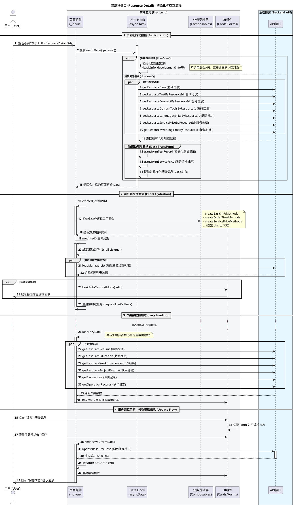
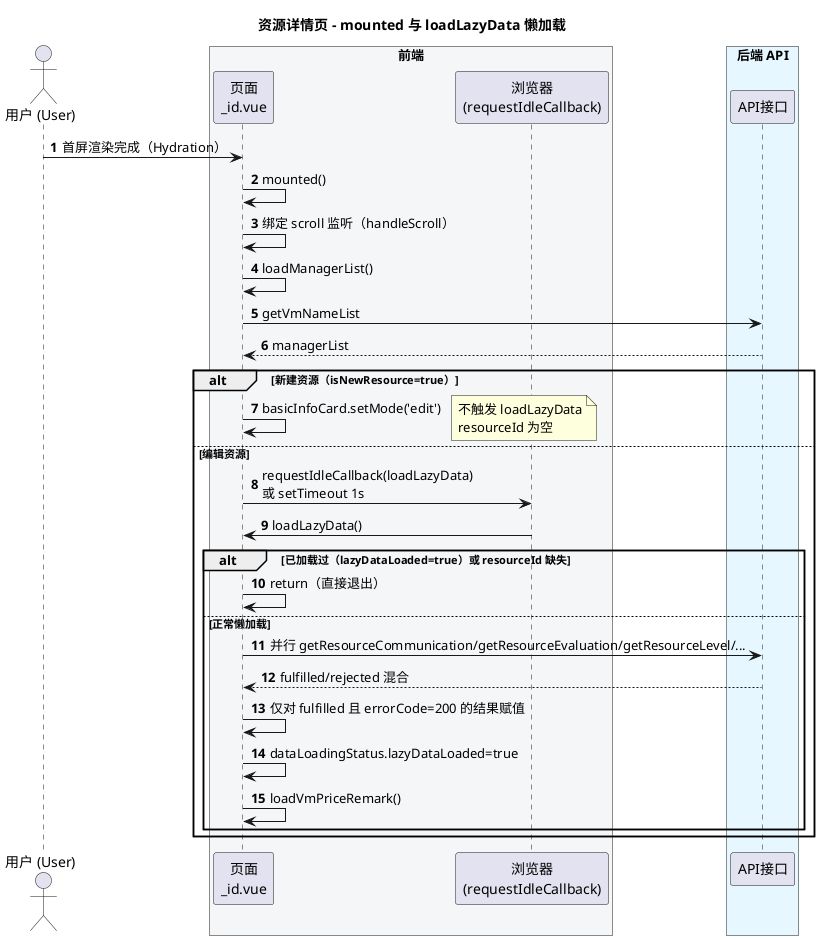
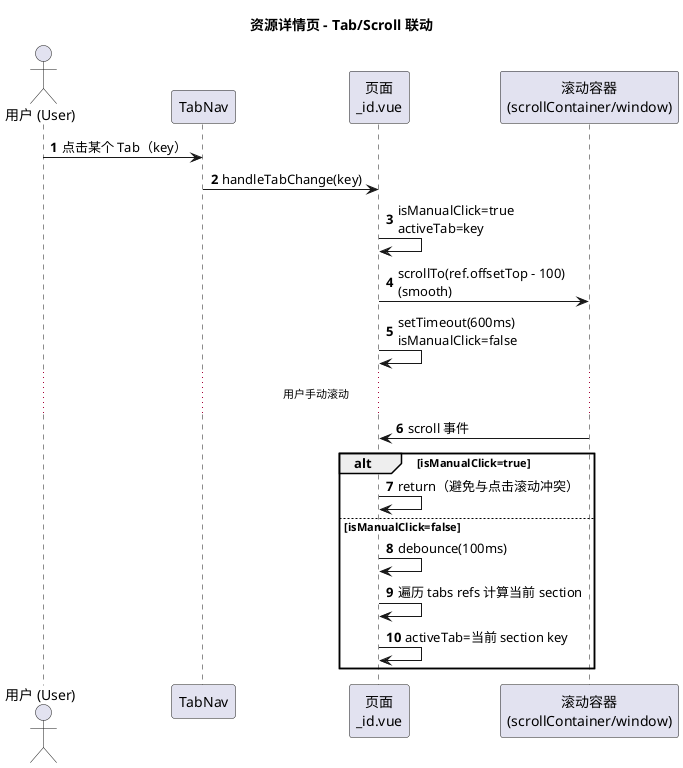
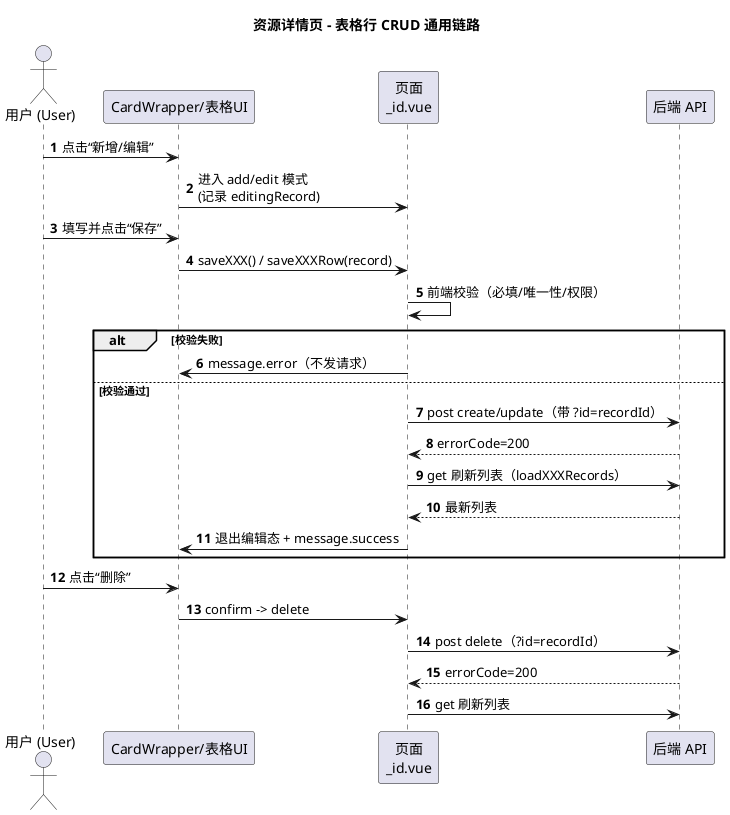
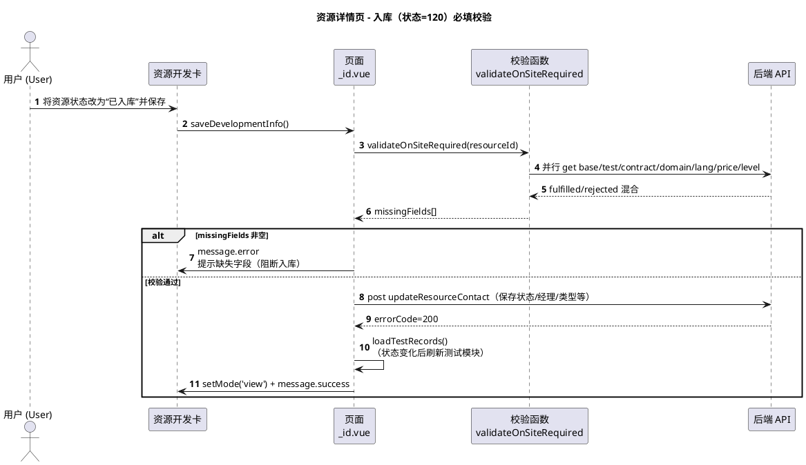
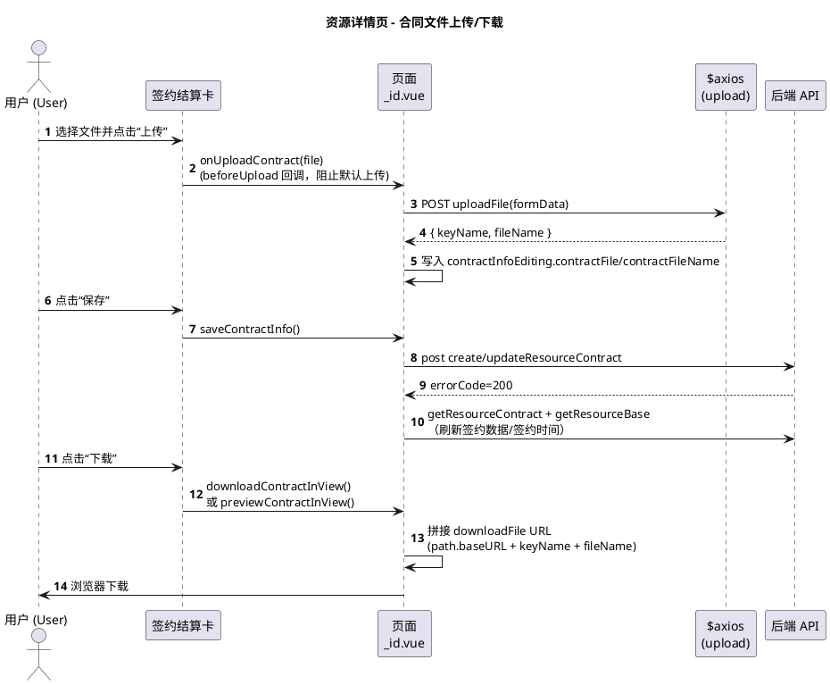
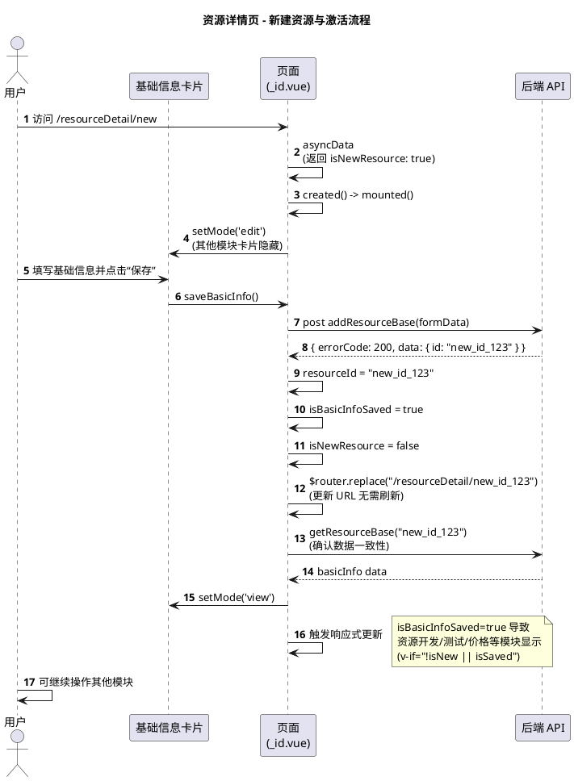
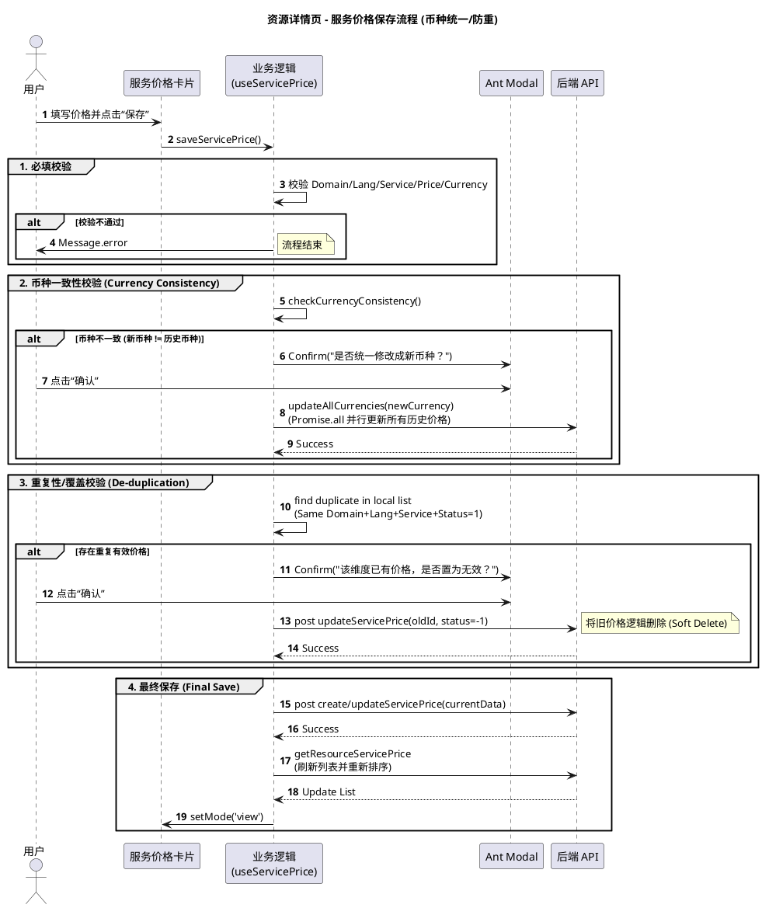

# 资源详情页 (Resource Detail Page) 分析

## 概览

资源详情页 (`pages/resourceManagement/resourceDetail/_id.vue`) 采用了**高性能、模块化**的架构设计。它利用并行加载 (`Promise.allSettled`) 和懒加载 (`requestIdleCallback`) 策略来确保首屏渲染速度，同时通过组合式函数 (`Composables`) 将复杂的业务逻辑（如表单验证、数据持久化）从组件中剥离。

## 面试官视角：我在这个页面的实习产出怎么讲（建议优先讲这部分）

> 目标：把“我写过一个资源详情页”讲成“我解决了性能/复杂度/可靠性/可维护性问题”，并能经得起追问。

### 0) 一句话定位（先把“你到底做了什么”讲清楚）

这个资源详情页是我**独立从 0 到 1 完整实现**的：根据产品经理的业务需求（PRD/原型）拆解模块与流程，**按设计师 Figma 还原样式与交互**，并完成与后端 API 的对接（取数/保存/删除/上传下载/异常处理），保证页面可用、可维护、可扩展。

（面试可直接复述）我交付的不只是“页面能跑”，而是：需求落地 + UI 还原 + API 对接 + 复杂交互/边界处理 + 性能与稳定性兜底。

### 1) 我负责/推进了哪些事情（可按模块挑 3-5 个讲深）

- 首屏取数与性能：在 `asyncData` 把首屏关键接口改为并行 `Promise.allSettled`，并明确“强依赖（base）/弱依赖（其他）”的降级策略，避免单点失败拖垮首屏
- 非首屏数据策略：在 `mounted` 里用 `requestIdleCallback + timeout` 做懒加载，配合 `lazyDataLoaded` 状态位防重复请求，保证滚动/交互流畅
- 复杂业务拆分：把基础信息、接单时间、服务价格、简历附件等通用逻辑抽到 `utils/resource/*`，页面只保留 orchestration（事件/状态/权限/刷新）
- 交互一致性：实现 Tab 点击滚动定位 + 滚动联动高亮（防抖 + 手动点击保护 `isManualClick`），减少“页面很长找不到模块”的使用成本
- 可靠性与边界：处理签约模块动态显隐引发的 Tab 回退、合同文件上传/预览/下载、表格行编辑的取消回滚、路由离开清理大数组等
- 业务规则落地：例如“准入测试唯一性（含服务端兜底校验）”、“入库(120)前跨模块必填校验”等

### 2) 我做这些改动解决了什么问题（用问题驱动表达）

可以按下面句式组织：

- 之前的问题：首屏接口串行/失败即白屏/页面长导致定位成本高/编辑态回滚不一致/数据量大导致卡顿
- 我做的方案：并行 + allSettled 分级容错 / requestIdleCallback 懒加载 / Tab-Scroll 联动 / 抽离可复用逻辑 / 离开页面释放内存
- 结果如何验证：Network waterfall、Performance 面板、控制台性能日志（代码里已有 `performance.now()` 打点）、用户操作路径回归

### 3) 面试时可量化/可验证的点（不要报虚数，讲“怎么量”）

- 首屏耗时：对比并行前后，抓 `asyncData` 阶段耗时（页面内已有日志点位）+ DevTools Network/Performance
- 懒加载收益：展示首次渲染只请求首屏接口，`requestIdleCallback` 后再拉取重数据（订单/评价/简历/日志），验证滚动时帧率更稳定
- 失败容错：手动让某个弱依赖接口返回错误，页面仍可用（base 成功即可），对应模块空态/提示可控
- 维护成本：新增模块只需接入 `tabs + ref` 与一个 `utils/resource/*` 方法集合，页面改动集中且可预测

### 4) STAR/项目复盘模板（用于回答“你具体做了什么”）

- S（场景）：资源详情页模块多、接口多、页面长，首屏慢且局部失败会影响体验
- T（任务）：保证首屏可用 + 把重数据延后 + 降低耦合便于迭代
- A（行动）：并行首屏 allSettled + 懒加载 + 模块化抽离 + 权限/规则/边界处理
- R（结果）：首屏更快、弱依赖失败不阻断、交互更顺畅、后续迭代改动更集中（用第 3 节的方法展示证据）

### 5) 我是怎么对齐需求/设计/后端的（追问“怎么协作”时用）

- 需求：把 PRD 拆成可交付的卡片模块（基础信息/开发/测试/签约/价格/简历/评价/沟通/日志等），明确每个模块的“展示态/编辑态/保存态/空态/异常态”
- 设计：以 Figma 为准逐块还原（布局、间距、按钮状态、表格交互），并补齐设计稿未覆盖的边界（无数据、权限不可编辑、长文本/超长字段、上传失败等）
- 后端：对齐字段与枚举（如 status 映射）、接口幂等与并发场景（准入测试唯一性）、以及错误码/空数据结构差异（数组/对象兼容），确保线上数据形态下稳定

## 页面结构与模块划分（补充）

页面整体由「Tab 导航 + 多卡片分区」组成，每个分区通过 `ref` 与 `tabs` 配置绑定，实现：点击 Tab 滚动定位、滚动联动高亮当前 Tab。

主要卡片/模块（按页面顺序，部分模块受状态控制显隐）：

- 基础信息（`basicRef`，`<basic-info-card />`）
- 资源开发（`developmentRef`，`<development-info-card />`，新建时需先保存基础信息）
- 资源测试（`testRef`，表格行编辑，含“准入测试唯一性/不可改类型”等规则）
- 签约结算（`contractRef`，仅当 `shouldShowContractModule === true` 时显示）
- 接单时间、领域工具、语言能力、服务价格（复用 `utils/resource/*` 的模块化逻辑）
- 简历/教育/工作/项目、订单数据、评价管理、沟通管理、操作日志（非首屏数据，客户端懒加载）

页面关键状态（理解时序/显隐/权限时很常用）：

- `resourceId`：编辑态为真实 id；新建态为 `null`
- `isNewResource`：`params.id === 'new'`
- `isBasicInfoSaved`：基础信息是否已保存（控制后续模块是否可见）
- `activeTab` / `tabs`：Tab 高亮与滚动定位
- `dataLoadingStatus.basicLoaded` / `dataLoadingStatus.lazyDataLoaded`：首屏/懒加载状态位（防止重复加载）
- `shouldShowContractModule`：资源状态码 `>= 80`（测试通过）才展示签约模块，并会影响 Tab 列表
- `isFieldEditable/isFieldDeletable`：字段级权限（结合资源状态 + 特殊规则）

## 初始化与交互时序图



## 补充时序图（更贴近实现）

原“总览时序图”偏宏观，下面补齐几条在实际排查/扩展时更常用的关键链路：客户端懒加载、Tab/滚动联动、通用表格行 CRUD、入库必填校验、合同文件上传/下载。

### 时序图 A：客户端挂载与懒加载（requestIdleCallback + 重复加载保护）



### 时序图 B：Tab 点击与滚动联动（handleTabChange + handleScroll）



### 时序图 C：通用“表格行”CRUD（以测试/评价/沟通为代表）



### 时序图 D：资源状态变更为“已入库(120)”的必填校验（saveDevelopmentInfo 内）



### 时序图 E：合同文件上传/下载（签约结算模块）



### 时序图 F：新建资源与激活流程 (New Resource Workflow)



### 时序图 G：资源入库与动态模块加载 (Status Change & Contract Module)

````plantuml
@startuml
title 资源详情页 - 状态变更(入库)与动态模块
autonumber
actor "用户" as User
participant "资源开发卡片" as DevCard
participant "页面\n(_id.vue)" as Page
participant "校验逻辑\n(validateOnSiteRequired)" as Validator
participant "后端 API" as API

User -> DevCard: 修改状态为 "已入库"\n(Status: 120)
User -> DevCard: 点击“保存”
DevCard -> Page: saveDevelopmentInfo()

Page -> Page: 识别目标状态 code == 120
activate Page
    Page -> Validator: validateOnSiteRequired(id)
    activate Validator
        Validator -> API: 并行 fetch 7个模块数据\n(Base, Test, Contract, Domain, Lang, Price, Level)
        API --> Validator: data
        Validator -> Validator: 检查各模块必填字段
    deactivate Validator

    alt 有缺失字段
        Page -> User: 报错提示 "入库信息不完整: [字段名]"
        Page -> Page: 中止保存
    else 校验通过
        Page -> API: post updateResourceContact(status=120)
        API --> Page: success

        Page -> Page: loadTestRecords()
        Page -> Page: developmentInfo.status = "已入库"
        Page -> DevCard: setMode('view')

        note right of Page
          响应式更新: developmentInfo 变更触发
          shouldShowContractModule 计算属性
          (status >= 80 -> True)
        end note

        Page -> Page: contractRef v-if 变为 True
        Page -> User: 界面自动显示“签约结算”模块 Tab
    end
deactivate Page
@enduml

### 时序图 H：服务价格保存流程（币种统一 + 覆盖旧价）

服务价格模块包含极其复杂的业务规则：**币种必须全局统一**、**同一维度价格排他**。



#### 步骤 6-13：[核心] 并行首屏数据请求

使用 `Promise.allSettled` 并行请求 7 个关键接口，这是首屏性能优化的核心。相比串行 `await`，这能将耗时压缩到最慢的那个接口时间。

```javascript
// 代码位置：_id.vue L1645
const [
  baseRes,
  testRes,
  contractRes,
  domainRes,
  langRes,
  priceRes,
  timeRes
] = await Promise.allSettled([
  app.$http.get(path.getResourceBase, { resourceId: id }),
  app.$http.get(path.getResourceTestByResourceId, { resourceId: id })
  // ... 其他5个核心接口
])
```

#### 步骤 15-17：数据转换与标准化 (Adapter Pattern)

后端返回的数据格式（如下划线风格、Unix 时间戳）并不总是适合前端组件直接使用，这里进行了清洗和转换。

- `transformTestRecord`: 标准化测试记录字段。
- `transformServicePrice`: 对服务价格进行排序。

---

### 第二阶段：客户端激活 (Hydration)

#### 步骤 19-21：业务逻辑注入 (Composition)

为了避免 `_id.vue` 变成一个 5000 行的 "God Object"，大量业务逻辑（如表单校验、联动规则）被抽离到了外部 `utils/resource/*.js` 文件中。在 `created` 钩子中初始化这些逻辑。

```javascript
// 代码位置：_id.vue L1888
this.basicInfoMethods = createBasicInfoMethods(this, { ... })
this.orderTimeMethods = createOrderTimeMethods(this, { ... })
```

#### 步骤 24-25：非阻塞数据加载

有些数据（如资源经理列表）不是首屏渲染必须的，推迟到 `mounted`（客户端）再加载，减少服务端处理时间。

```javascript
mounted() {
  this.loadManagerList() // 客户端单独加载
}
```

#### 步骤 26-27：新建模式自动进入编辑态

如果识别到是 `new` 模式，直接调用子组件方法打开编辑表单，提升交互体验。

```javascript
if (this.isNewResource) {
  this.$refs.basicInfoCard.setMode('edit')
}
```

#### 答疑：请求的 JSON 是怎样到前端并展示到页面的？

以资源详情页为例（`pages/resourceManagement/resourceDetail/_id.vue`），数据链路可以理解为：

1.  **路由参数进入 asyncData**：访问 `/resourceManagement/resourceDetail/:id` 时，Nuxt 解析动态路由并注入 `params.id`，`asyncData({ params, app })` 中用它作为请求参数。
2.  **请求拿到后端 JSON**：在 `asyncData` 里通过 `app.$http.get(...)` 获取响应对象（通常含 `errorCode/data`）。
3.  **适配为前端可用结构**：把后端字段映射成页面更易用的结构（如 `translatorName -> basicInfo.name`），并对数组做格式化/排序（如 `transformTestRecord/transformServicePrice`）。
4.  **return 合并进页面 data**：`asyncData` 最后 `return { basicInfo, developmentInfo, ... }`，Nuxt 会把这些字段合并进页面组件数据，用于首屏渲染。
5.  **父页面通过 props 下发给卡片组件**：模板里把页面数据传给子组件，例如 `<basic-info-card :basic-info="basicInfo" ... />`。
6.  **子组件模板渲染展示**：卡片组件（如 `components/ResourceDetail/Cards/BasicInfoCard.vue`）通过 `props.basicInfo` 获取数据，并用 `{{ basicInfo.name }}` 等语法渲染到 DOM。

订单详情页同理（`pages/orderDetail/_id.vue`）：`asyncData` `return { orderList, ... }` 后，模板直接用 `<el-table :data="orderList">`、`orderList[0].xxx` 渲染。

---

### 第三阶段：资源懒加载 (Lazy Loading)

#### 步骤 29-30：Idle Callback 优化

利用 `requestIdleCallback` API，在浏览器主线程空闲时才去加载“重数据”（如简历文件、操作日志），最大限度保证页面滚动流畅。

```javascript
// 代码位置：_id.vue L1988
if (window.requestIdleCallback) {
  window.requestIdleCallback(() => {
    this.loadLazyData()
  })
} else {
  setTimeout(() => {
    this.loadLazyData()
  }, 1000)
}
```

#### 步骤 31-36：次要数据并行请求

同样使用 `Promise.allSettled` 获取简历、教育经历、项目经验等 6-7 个次要接口。

---

### 第四阶段：用户交互 (CRUD Loop)

#### 步骤 39-42：组件通信 (Emit)

在 `BasicInfoCard` 组件内部，用户点击保存触发 `@save` 事件。父组件 `_id.vue` 监听到事件后，调用 `saveBasicInfo` 方法。

#### 步骤 43-44：代理保存请求

`_id.vue` 并不直接写 API 调用代码，而是代理给 `useBasicInfo.js` 中的逻辑处理。

```javascript
// _id.vue 代理调用
saveBasicInfo() {
  this.basicInfoMethods.saveBasicInfo()
}

// useBasicInfo.js 真实逻辑
async saveBasicInfo() {
  // 1. 表单校验
  context.basicForm.validateFields(...)
  // 2. 发送请求
  await context.$http.post(path.updateResourceBase, formData)
}
```

#### 答疑：编辑/保存 → 刷新展示这条链路是怎么串起来的？

以“基础信息卡片”为例，这条链路在项目中是完整闭环的：

1.  **子组件触发事件**：`components/ResourceDetail/Cards/BasicInfoCard.vue` 中 `handleSave()` 执行 `this.$emit('save')`。
2.  **父组件接收并代理**：`pages/resourceManagement/resourceDetail/_id.vue` 模板里 `@save="saveBasicInfo"`，方法体内转调 `this.basicInfoMethods.saveBasicInfo()`。
3.  **业务模块注入**：在 `_id.vue` 的 `created()` 中通过 `createBasicInfoMethods(this, {...})` 把可复用逻辑挂到 `this.basicInfoMethods`。
4.  **表单校验与组装参数**：`utils/resource/useBasicInfo.js` 的 `saveBasicInfo()` 使用 `context.basicForm.validateFields(...)` 校验表单，通过 `buildBasicInfoFormData(values)` 把表单值映射成后端字段（例如 `translatorName/userEmail/phone` 等）。
5.  **发起保存请求**：编辑模式下 `updateBasicInfo()` 会执行 `context.$http.post(\`${path.updateResourceBase}?id=${context.resourceId}\`, updateRequest)`。
6.  **重新拉取并更新页面数据**：保存成功后会 `await this.loadBasicInfo(context.resourceId)`，再次调用 `getResourceBase` 获取最新数据，并更新 `context.basicInfo`。
7.  **展示自动刷新**：由于父页面把 `basicInfo` 作为 prop 传给 `<basic-info-card :basic-info="basicInfo">`，`basicInfo` 更新会触发 Vue 响应式更新，卡片组件的“查看态”字段（如 `{{ basicInfo.name }}`）会自动刷新。
8.  **切回查看态**：保存成功后会通过 `context.$refs.basicInfoCard.setMode('view')` 退出编辑态。

#### 步骤 45-47：反馈与状态同步

保存成功后：

1.  **重载数据**：调用 `loadBasicInfo` 确保本地数据与服务器一致。
2.  **切换视图**：退出编辑模式。
3.  **用户提示**：弹出 Message Toast。

---

## 接口/数据结构速查（补充）

### 1) 首屏 asyncData（并行 allSettled）

- 基础信息：`path.getResourceBase`
- 测试记录：`path.getResourceTestByResourceId`
- 签约结算：`path.getResourceContractByResourceId`（签约时间来自 `getResourceBase.signDate`）
- 领域工具：`path.getResourceDomainToolsByResourceId`
- 语言能力：`path.getResourceLanguageAbilityByResourceId`
- 服务价格：`path.getResourceServicePriceByResourceId`
- 接单时间：`path.getResourceWorkingTimeByResourceId`

### 2) 非首屏 loadLazyData（并行 allSettled）

- 沟通记录：`path.getResourceCommunicationByResourceId`
- 评价记录：`path.getResourceEvaluationByResourceId`
- 译员级别：`path.getResourceLevel`
- 学历：`path.getResourceEducationByResourceId`
- 工作经历：`path.getResourceWorkExperienceByResourceId`
- 项目经历：`path.getResourceProjectByResourceId`
- 简历文件：`path.getResourceResumeByResourceIdAndType`（`fileType=1/2/3`）
- 订单统计：`path.getResourceOrderStatistics`
- 操作日志：`path.getResourceOperationRecord`
- 准入测试存在性：`path.hasBaseResourceTest`

### 3) 典型写接口（按模块）

- 基础信息：`path.addResourceBase` / `path.updateResourceBase`
- 资源开发：`path.updateResourceContact`
- 资源测试：`path.createResourceTest` / `path.updateResourceTest` / `path.deleteResourceTest`
- 签约结算：`path.createResourceContract` / `path.updateResourceContract`
- 合同文件：`path.uploadFile` / `path.downloadFile`
- 译员级别：`path.updateResourceLevel`
- 评价记录：`path.createResourceEvaluation` / `path.updateResourceEvaluation` / `path.deleteResourceEvaluation`
- 沟通记录：`path.createResourceCommunication` / `path.updateResourceCommunication` / `path.deleteResourceCommunication`
- 领域工具：`path.createResourceDomainTools` / `path.updateResourceDomainTools`
- 语言能力：`path.createResourceLanguageAbility` / `path.updateResourceLanguageAbility` / `path.deleteResourceLanguageAbility`
- 接单时间：`path.createResourceWorkingTime` / `path.updateResourceWorkingTime`
- 学历：`path.createResourceEducation` / `path.updateResourceEducation` / `path.deleteResourceEducation`
- 工作经历：`path.createResourceWorkExperience` / `path.updateResourceWorkExperience` / `path.deleteResourceWorkExperience`
- 项目经历：`path.createResourceProject` / `path.updateResourceProject` / `path.deleteResourceProject`
- 简历附件：`path.createResourceResume` / `path.deleteResourceResume`
- 服务价格：`path.createResourceServicePrice` / `path.updateResourceServicePrice` / `path.deleteResourceServicePrice`

### 4) 常见字段映射（后端 -> 前端）

- 基础信息：`translatorName/userEmail/phone/username` -> `basicInfo.name/email/mobile/loginAccount`
- 签约结算：`contractFile/url` -> `contractFile/contractFileName`（前端展示用 `contractFileName`）
- 资源状态：后端 `status`（数值）-> 前端 `developmentInfo.status`（文案），再通过 `statusReverseMap` 反向得到状态码用于逻辑判断

## 异常分支与容错策略（补充）

### 1) asyncData 的“强依赖/弱依赖”划分

- `getResourceBase`（基础信息）是强依赖：失败会进入 `catch`，最终返回空结构（页面可渲染，但展示为空）。
- 其他接口为弱依赖：使用 `Promise.allSettled`，只消费 `fulfilled && errorCode === 200` 的结果，失败不阻断首屏。

### 2) 懒加载同样采用 allSettled，保证“能加载多少加载多少”

`loadLazyData` 对多个非首屏接口并行请求，分别对每个结果做判定与映射（沟通/评价/综合评价/学历/工作/项目/简历文件/订单统计/操作记录/准入测试标记），最后设置 `dataLoadingStatus.lazyDataLoaded = true` 防止重复加载。

### 3) 签约模块动态显隐导致的 Tab 回退

当 `shouldShowContractModule` 从 `true -> false` 且当前 `activeTab === 'contract'` 时，会自动切回 `basic` 并滚动到基础信息区域，避免出现“Tab 指向不可见区域”的体验问题。

## 权限与特殊业务规则（补充）

### 1) 字段级权限

页面通过 `getFieldPermission(category, fieldName, resourceStatus)` 获得字段权限，并在此之上做了若干特殊规则覆盖：

- 新建资源：`basicInfo.name` / `basicInfo.email` 允许编辑（便于首次录入）
- 登录账号：`basicInfo.loginAccount` 一旦保存后不可再次修改（以是否已有值为准）
- 资源经理：首次保存前可编辑，保存后锁定（`isDevelopmentInfoSaved`）
- 测试类型：若该条测试记录“原始类型”为准入测试（`_originalTestType === 0`），则不可编辑

### 2) “入库(120)”前置必填校验

当资源状态变更为“已入库(120)”时，会触发跨模块校验（`validateOnSiteRequired`），并行检查：基础信息、测试记录、签约时间、领域工具、语言能力、服务价格、译员级别等；缺失则阻断入库并提示缺失字段。

## 性能优化点（补充）

- 并行首屏加载：`asyncData` 中 `Promise.allSettled` + 必要字段适配
- 并行懒加载：`requestIdleCallback`（含 `timeout`）+ `Promise.allSettled`
- 静态配置冻结：`Object.freeze(resourceDetailConfig.*)`，减少运行期开销
- 滚动联动防抖：`handleScroll` debounce（100ms）并避免无意义的 `activeTab` 重置
- 路由离开清理大数组：`beforeRouteLeave` 清空重数据，降低内存占用

---

## 高频追问清单（面试用 Q/A，按“追问深度”准备）

### 1) 为什么用 `asyncData`，不用 `mounted` 拉首屏数据？

- 回答要点：`asyncData` 能覆盖 SSR 首屏与站内跳转取数，首屏 HTML 就有数据；`mounted` 只能在浏览器执行，首屏会变成“白屏/骨架等 JS 拉完”
- 可顺带讲：把“必须影响首屏展示的”放 `asyncData`，把“重且不影响首屏可用的”放 `mounted + requestIdleCallback`

### 2) 为什么用 `Promise.allSettled`，不用 `Promise.all`？

- 回答要点：页面接口多，弱依赖允许失败；`allSettled` 能做到“能用多少用多少”，只把 `getResourceBase` 当强依赖
- 追问准备：如果强依赖失败怎么办？现状是 `catch` 后返回空结构保证页面可渲染（但展示为空）；也可以在业务上选择跳转/错误页（看产品要求）

### 3) 懒加载为什么用 `requestIdleCallback`？兼容性怎么处理？

- 回答要点：让重数据加载让出主线程空闲时机，避免影响滚动/输入；代码里有降级 `setTimeout(1000)`
- 追问准备：为什么给 `timeout`？避免浏览器一直没空闲导致数据永远不加载（尤其在低端机/长任务）

### 4) 页面很长，Tab/滚动联动怎么避免“互相打架”？

- 回答要点：点击 Tab 时设置 `isManualClick=true`，滚动监听直接 return；平滑滚动结束后恢复；滚动监听本身做防抖并仅在变更时更新 `activeTab`
- 追问准备：滚动容器不一定是 window，如何处理？页面通过 `getScrollContainer()` 识别可滚动父容器并统一 scrollTop 计算

### 5) 为什么要把逻辑抽到 `utils/resource/*`，不直接写在页面里？

- 回答要点：该页模块多、CRUD 多，抽离后页面只负责编排（mode 切换、刷新列表、权限判断）；逻辑可复用（资源详情页/译员平台）
- 追问准备：抽离边界怎么定？“可复用且有状态”的放 methods 工厂（接收 `context`），纯工具函数放 `formatters/validators/transformers`

### 6) “准入测试唯一性”为什么还要做服务端校验？

- 回答要点：前端本地校验只能防单人操作；并发下可能两人同时新增，必须依赖服务端真相；前端调用 `hasBaseResourceTest` 做实时兜底
- 追问准备：服务端挂了怎么办？代码里 catch 会回退到本地列表兜底（尽量减少误放行）

### 7) “入库(120)”的必填校验为什么要跨模块并行拉数据？

- 回答要点：入库是业务关键动作，需校验多个模块是否完善；并行拉取减少等待；并且使用 `allSettled` 避免单接口失败导致整体验证不可用
- 追问准备：如何避免“校验用旧数据误报”？保存资源开发时用当前编辑态 manager 去过滤 missing（代码里有处理）

### 8) 你如何证明这些优化真的有效？

- 回答要点：给出“怎么量”的证据链：Network waterfall（请求数/串并行）、Performance（长任务/帧率）、页面内 `performance.now` 打点日志、手动失败注入验证容错
