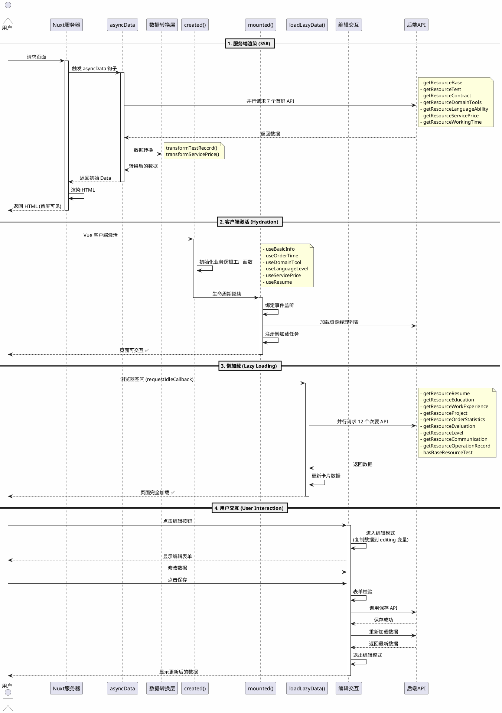
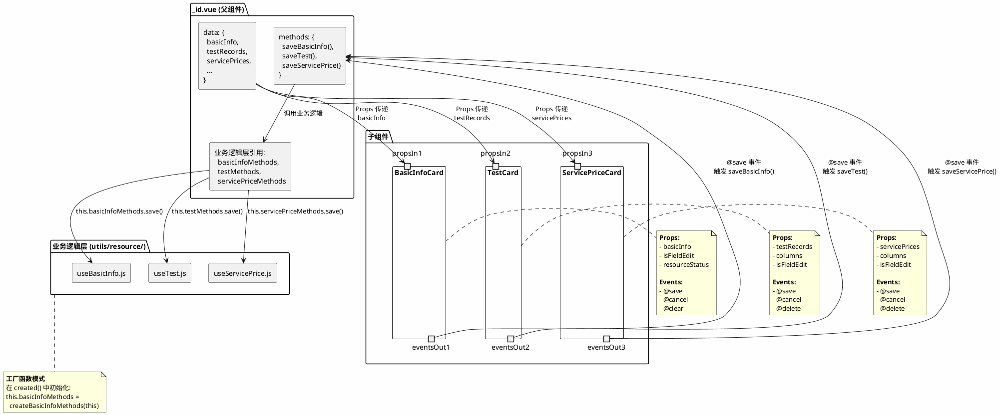
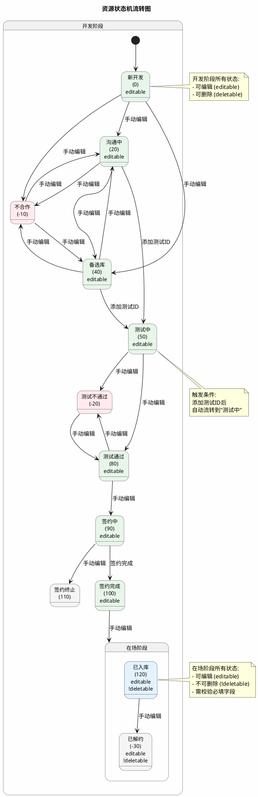

# 资源详情页架构图解 (PlantUML)

本文档通过 PlantUML 可视化图表帮助理解资源详情页的架构设计。

> **提示**: 你可以将 PlantUML 代码复制到 [PlantUML 在线编辑器](http://www.plantuml.com/plantuml/uml/) 或使用 VS Code 的 PlantUML 插件查看渲染后的图表。

## 1. 整体架构图

```plantuml
@startuml 资源详情页整体架构
!define RECTANGLE class

skinparam componentStyle rectangle
skinparam backgroundColor #FEFEFE
skinparam component {
  BackgroundColor<<browser>> #E3F2FD
  BackgroundColor<<nuxt>> #FFF3E0
  BackgroundColor<<page>> #F3E5F5
  BackgroundColor<<logic>> #E8F5E9
  BackgroundColor<<backend>> #FCE4EC
  BorderColor #424242
  FontSize 12
}

package "用户浏览器 (Browser)" <<browser>> {
  package "Nuxt.js 应用 (SSR + CSR)" <<nuxt>> {
    package "资源详情页 (_id.vue)" <<page>> {
      component "asyncData\n(SSR 首屏)" as asyncData
      component "created()\n(逻辑初始化)" as created
      
      package "13个功能卡片组件" {
        component "BasicInfoCard" as basic
        component "DevelopmentCard" as dev
        component "TestCard" as test
        component "ContractCard" as contract
        component "OrderTimeCard" as time
        component "DomainToolCard" as domain
        component "LanguageLevelCard" as lang
        component "ServicePriceCard" as price
        component "ResumeCard" as resume
        component "OrderDataCard" as order
        component "EvaluationCard" as eval
        component "CommunicationCard" as comm
        component "OperationCard" as op
      }
    }
    
    package "业务逻辑层\n(utils/resource/)" <<logic>> {
      component "useBasicInfo.js" as useBasic
      component "useOrderTime.js" as useTime
      component "useDomainTool.js" as useDomain
      component "useLanguageLevel.js" as useLang
      component "useServicePrice.js" as usePrice
      component "useResume.js" as useResume
      component "useEducation.js" as useEdu
      component "useWorkExperience.js" as useWork
      component "useProjectResume.js" as useProject
    }
  }
}

package "后端服务 (Backend API)" <<backend>> {
  component "基础信息API" as apiBasic
  component "资源测试API" as apiTest
  component "签约结算API" as apiContract
  component "接单时间API" as apiTime
  component "领域工具API" as apiDomain
  component "语言水平API" as apiLang
  component "服务价格API" as apiPrice
  component "简历项目API" as apiResume
  component "订单数据API" as apiOrder
  component "评价记录API" as apiEval
  component "沟通记录API" as apiComm
  component "操作日志API" as apiOp
}

asyncData --> apiBasic : HTTP GET
asyncData --> apiTest : HTTP GET
asyncData --> apiContract : HTTP GET
asyncData --> apiTime : HTTP GET
asyncData --> apiDomain : HTTP GET
asyncData --> apiLang : HTTP GET
asyncData --> apiPrice : HTTP GET

created --> useBasic : 初始化
created --> useTime : 初始化
created --> useDomain : 初始化
created --> useLang : 初始化
created --> usePrice : 初始化
created --> useResume : 初始化

basic --> useBasic : 调用方法
dev --> useBasic : 调用方法
time --> useTime : 调用方法
domain --> useDomain : 调用方法
lang --> useLang : 调用方法
price --> usePrice : 调用方法
resume --> useResume : 调用方法

useBasic --> apiBasic : HTTP POST
useTime --> apiTime : HTTP POST
useDomain --> apiDomain : HTTP POST
useLang --> apiLang : HTTP POST
usePrice --> apiPrice : HTTP POST
useResume --> apiResume : HTTP POST

note right of asyncData
  并行加载7个首屏API
  使用 Promise.allSettled
end note

note right of created
  初始化业务逻辑工厂函数
  绑定到组件实例
end note

note bottom of "业务逻辑层\n(utils/resource/)"
  可复用的业务逻辑
  工厂函数模式
end note

@enduml
```



## 2. 数据流转图



## 3. 组件通信图



## 4. 状态机流转图



## 5. 权限控制矩阵

```plantuml
@startuml 权限控制矩阵

skinparam backgroundColor #FEFEFE
skinparam defaultFontSize 11

title 字段权限控制矩阵

package "基础信息 (BasicInfo)" {
  card "姓名" as name {
    开发阶段: ❌ 编辑 ❌ 删除
    在场阶段: ❌ 编辑 ❌ 删除
  }
  
  card "邮箱" as email {
    开发阶段: ❌ 编辑 ❌ 删除
    在场阶段: ❌ 编辑 ❌ 删除
  }
  
  card "手机号" as mobile {
    开发阶段: ✅ 编辑 ✅ 删除
    在场阶段: ✅ 编辑 ✅ 删除
  }
  
  card "微信" as wechat {
    开发阶段: ✅ 编辑 ✅ 删除
    在场阶段: ✅ 编辑 ✅ 删除
  }
  
  card "所在国家" as country {
    开发阶段: ✅ 编辑 ✅ 删除
    在场阶段: ✅ 编辑 ✅ 删除
  }
}

package "资源开发 (Development)" {
  card "资源状态" as status {
    开发阶段: ✅ 编辑 ✅ 删除
    在场阶段: ✅ 编辑 ❌ 删除
  }
  
  card "资源经理" as manager {
    开发阶段: ❌ 编辑 ❌ 删除
    在场阶段: ❌ 编辑 ❌ 删除
  }
  
  card "开发渠道" as channel {
    开发阶段: ✅ 编辑 ✅ 删除
    在场阶段: ✅ 编辑 ❌ 删除
  }
  
  card "资源类型" as type {
    开发阶段: ✅ 编辑 ✅ 删除
    在场阶段: ✅ 编辑 ❌ 删除
  }
}

package "领域工具 (DomainTool)" {
  card "擅长领域" as domain {
    开发阶段: ✅ 编辑 ✅ 删除
    在场阶段: ✅ 编辑 ❌ 删除
  }
  
  card "游戏标签" as game {
    开发阶段: ✅ 编辑 ✅ 删除
    在场阶段: ✅ 编辑 ✅ 删除
  }
  
  card "影视标签" as film {
    开发阶段: ✅ 编辑 ✅ 删除
    在场阶段: ✅ 编辑 ✅ 删除
  }
  
  card "工具标签" as tool {
    开发阶段: ✅ 编辑 ✅ 删除
    在场阶段: ✅ 编辑 ✅ 删除
  }
}

package "综合评价 (Evaluation)" {
  card "译员级别" as level {
    开发阶段: ✅ 编辑 ✅ 删除
    在场阶段: ✅ 编辑 ❌ 删除
  }
}

note right of "基础信息 (BasicInfo)"
  **权限规则:**
  - 姓名、邮箱为核心标识
    不可修改和删除
  - 联系方式可自由编辑
end note

note right of "资源开发 (Development)"
  **权限规则:**
  - 开发阶段: 所有字段可编辑删除
  - 在场阶段: 可编辑但不可删除
  - 资源经理始终不可修改
end note

note bottom of "领域工具 (DomainTool)"
  **权限规则:**
  - 擅长领域在场阶段不可删除
  - 标签类字段始终可编辑删除
end note

@enduml
```

## 6. 性能优化时间线

```plantuml
@startuml 页面加载时间线
!pragma teoz true
skinparam backgroundColor #FEFEFE

concise "用户" as User
concise "Nuxt服务器" as Nuxt
concise "asyncData" as Async
concise "浏览器" as Browser
concise "Vue客户端" as Vue
concise "懒加载" as Lazy

@0
User is "请求页面" #LightBlue

@10
Nuxt is "接收请求" #LightGreen

@20
Async is "触发钩子" #LightYellow

@30
Async is "并行7个API" #Orange
note bottom
  - getResourceBase
  - getResourceTest
  - getResourceContract
  - getResourceDomainTools
  - getResourceLanguageAbility
  - getResourceServicePrice
  - getResourceWorkingTime
end note

@200
Async is "API响应完成" #LightGreen

@210
Async is "数据转换" #LightYellow
note bottom
  transformTestRecord()
  transformServicePrice()
end note

@220
Async is "返回Data" #LightGreen

@230
Nuxt is "渲染HTML" #LightYellow

@250
Nuxt is "返回HTML" #LightGreen

@300
Browser is "接收HTML" #LightBlue

@350
Browser is "首屏渲染✅" #LightGreen
note bottom
  **用户可见**
  耗时: 350ms
end note

@400
Vue is "Hydration" #LightYellow

@450
Vue is "created()" #LightYellow
note bottom
  初始化业务逻辑
  工厂函数
end note

@500
Vue is "mounted()" #LightYellow
note bottom
  - 绑定滚动监听
  - 加载资源经理列表
  - 注册懒加载任务
end note

@550
Vue is "可交互✅" #LightGreen
note bottom
  **用户可操作**
  耗时: 550ms
end note

@1000
Lazy is "浏览器空闲" #LightBlue
note bottom
  requestIdleCallback
end note

@1020
Lazy is "并行12个API" #Orange
note bottom
  - getResourceResume
  - getResourceEducation
  - getResourceWorkExperience
  - getResourceProject
  - getResourceOrderStatistics
  - getResourceEvaluation
  - getResourceLevel
  - getResourceCommunication
  - getResourceOperationRecord
  - hasBaseResourceTest
end note

@1500
Lazy is "API响应完成" #LightGreen

@1550
Lazy is "完全加载✅" #LightGreen
note bottom
  **所有数据可用**
  总耗时: 1550ms
end note

@enduml
```

## 7. 模块依赖关系图

```plantuml
@startuml 模块依赖关系图
!define COMPONENT rectangle
skinparam componentStyle rectangle
skinparam backgroundColor #FEFEFE

package "_id.vue (主页面)" as MainPage {
  component [_id.vue] as Main
}

package "组件层 (Components)" as Components {
  component [ResourceBreadcrumb] as Breadcrumb
  component [TabNav] as TabNav
  component [CardWrapper] as CardWrapper
  component [TagSelectorModal] as TagModal
  
  package "Cards/" {
    component [BasicInfoCard] as BasicCard
    component [DevelopmentInfoCard] as DevCard
    component [OrderTimeCard] as TimeCard
    component [DomainToolCard] as DomainCard
    component [LanguageLevelCard] as LangCard
    component [ServicePriceCard] as PriceCard
    component [ResumeCard] as ResumeCard
    component [OperationRecordCard] as OpCard
  }
}

package "配置层 (Config)" as Config {
  component [resourceDetailConfig.js] as DetailConfig
  component [resourceStatus.js] as StatusConfig
  component [resourceFieldPermission.js] as PermConfig
  component [path.js] as PathConfig
  component [languageOption.js] as LangOption
  component [industry.js] as Industry
  component [subject.js] as Subject
}

package "工具层 (Utils)" as Utils {
  component [formatters.js] as Formatters
  component [validators.js] as Validators
  component [resourceDetailTransform.js] as Transform
}

package "业务逻辑层 (Business Logic)" as Logic {
  component [useBasicInfo.js] as UseBasic
  component [useOrderTime.js] as UseTime
  component [useDomainTool.js] as UseDomain
  component [useLanguageLevel.js] as UseLang
  component [useServicePrice.js] as UsePrice
  component [useResume.js] as UseResume
  component [useEducation.js] as UseEdu
  component [useWorkExperience.js] as UseWork
  component [useProjectResume.js] as UseProject
}

Main -down-> Breadcrumb : 导入
Main -down-> TabNav : 导入
Main -down-> CardWrapper : 导入
Main -down-> TagModal : 导入
Main -down-> BasicCard : 导入
Main -down-> DevCard : 导入
Main -down-> TimeCard : 导入
Main -down-> DomainCard : 导入
Main -down-> LangCard : 导入
Main -down-> PriceCard : 导入
Main -down-> ResumeCard : 导入
Main -down-> OpCard : 导入

Main -down-> DetailConfig : 导入
Main -down-> StatusConfig : 导入
Main -down-> PermConfig : 导入
Main -down-> PathConfig : 导入
Main -down-> LangOption : 导入
Main -down-> Industry : 导入
Main -down-> Subject : 导入

Main -down-> Formatters : 导入
Main -down-> Validators : 导入
Main -down-> Transform : 导入

Main -down-> UseBasic : 导入
Main -down-> UseTime : 导入
Main -down-> UseDomain : 导入
Main -down-> UseLang : 导入
Main -down-> UsePrice : 导入
Main -down-> UseResume : 导入
Main -down-> UseEdu : 导入
Main -down-> UseWork : 导入
Main -down-> UseProject : 导入

note right of Components
  **组件层**
  - 13个功能卡片
  - 面包屑导航
  - 标签选择器
end note

note right of Config
  **配置层**
  - 状态机配置
  - 权限矩阵
  - API路径
  - 选项数据
end note

note right of Utils
  **工具层**
  - 数据格式化
  - 表单校验
  - 数据转换
end note

note right of Logic
  **业务逻辑层**
  - 工厂函数模式
  - 可复用逻辑
  - 9个业务模块
end note

@enduml
```



---

**提示**: 这些图表帮助你从不同角度理解资源详情页的架构。建议结合《资源详情页完整分析.md》一起阅读。

