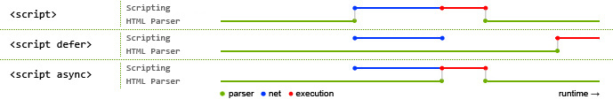

---
tags:
  - 前端
  - 八股
  - HTML
  - 标签
  - 语义化
---

# HTML

笔者将从以下方面展开Html八股的学习

> 1. HTML5语义化与结构
> 2. 浏览器渲染机制
> 3. 资源加载与性能优化
> 4. 移动适配与响应式
> 5. HTML基础与规范

### HTML5语义化与结构

#### HTML5语义标签化  （必背）

1. 使用带有语义化的标签构建页面 header footer main aside article section  ,避免长篇幅无语义的<div>
2. 易于用户阅读 样式文件未加载时 页面结构清晰
3. 易于SEO 搜索引擎根据标签确定上下文和关键字权重
4. 方便屏幕阅读器解析，如盲人阅读器根据语义渲染网页
5. 易于开发和维护 使得代码更具可读性 更好维护
6. 并未广泛使用 京东、淘宝仍然使用<div> 设置id为header或者footer 作用不大 不用重写网页

#### slot（必背）

1. slot插槽，一般在封装组件的时候使用，在组件内不知道以那种形式来展示内容时，可以用slot来占据位置，最终展示形式由父组件以内容形式传递过来
2. 默认插槽：又名匿名插槽，当slot没有指定name属性值时一个默认显示插槽，一个组件内只有有一个匿名插槽
3. 具名插槽：带有具体名字的插槽，也就是带有name属性的slot，一个组件可以出现多个具名插槽。
4. 作用域插槽：默认插槽、具名插槽的一个变体，可以是匿名插槽，子组件渲染作用域插槽时，可以将子组件内部的数据传递给父组件，让父组件根据子组件的传递过来的数据决定如何渲染该插槽。
5. 实现原理：当子组件vm实例化时，获取到父组件传入的slot标签的内容，存放在vm.$slot中，默认插槽为vm.$slot.default，具名插槽为vm.$slot.xxx，xxx 为插槽名，
6. 当组件执行渲染函数时候，遇到slot标签，使用$slot中的内容进行替换，此时可以为插槽传递数据，若存在数据，则可称该插槽为作用域插槽。

#### SEO是什么?

* SEO(Search Engine Optimization)，汉译为搜索引擎优化
* 搜索引擎优化是一种利用搜索引擎的搜索规则来提高目前网站在有关搜索引擎内的自然排名的方式。
* SEO是指为了从搜索引擎中获得更多的免费流量，从网站结构、内容建设方案、用户互动传播、页面等角度进行合理规划，使网站更适合搜索引擎的索引原则的行为。

#### 如何实现SEO优化

SEO主要分为内部和外部两个方向。

1. 内部优化

* META 标签优化:例如:TITLE，KEYWORDS，DESCRIPTION(TDK)等的优化
* 内部链接的优化，包括相关性链接(Tag 标签)，锚文本链接，各导航链接，及图片链接网站内容更新:每天保持站内的更新(主要是文童的更新等)
* 服务器端渲染(SSR)

2. 外部优化

* 外部链接类别:博客、论坛、B2B、新闻、分类信息、贴吧、知道、百科、相关信息网等尽量保持链接的多样性外链运营:每天添加一定数量的外部链接，使关键词排名稳定提升。
* 外链选择:与一些和你网站相关性比较高,整体质量比较好的网站交换友情链接,巩固稳定关键词排名

#### HTML5 有哪些 drag 相关的 API ?

* dragstart:事件主体是被拖放元素，在开始拖放被拖放元素时触发。
* darg:事件主体是被拖放元素，在正在拖放被拖放元素时触发。
* dragenter:事件主体是目标元素，在被拖放元素进入某元素时触发
* dragover:事件主体是目标元素，在被拖放在某元素内移动时触发
* dragleave:事件主体是目标元素，在被拖放元素移出目标元素时触发
* drop:事件主体是目标元素，在目标元素完全接受被拖放元素时触发
* dragend:事件主体是被拖放元素，在整个拖放操作结束时触发。

#### HTML5有哪些更新 （必背）

* 新的选择器 `document.querySelector`、`document.querySelectorAll`
* 媒体播放的 `video` 和 `audio` 标签
  * 以前用的 flash 实现
* 本地存储 `localStorage` 和 `sessionStorage`
* 浏览器通知 `Notifications`
***语义化标签，例如 **`header`**，**`nav`**，**`footer`**，**`section`**，**`article`** 等标签**
* 地理位置 `Geolocation`
* 多任务处理 `web worker`

运行在后台的JS，独立于其他脚本，不影响性能

#### 前端需要注意哪些SEO

**合理的 title、keywords 、description**

* 搜索对着三项的权重逐个减小，title值强调重点即可，重要关键词出现不要超过2次，而且要靠前，不同页面 title 要有所不同
* description 把页面内容高度概括，长度合适，不可过分堆砌关键词，不同页面description 有所不同;
* keywords 列举出重要关键词即可语义化的 HTML 代码，符合W3C规范

**语义化代码**

让搜索引擎容易理解网页重要内容 HTML 代码放在最前:搜索引擎抓取 HTML 顺序是从上到下，有的搜索引擎对抓取长度有限制，保证重要内容一定会被抓取

**重要内容不要用 js 输出**：爬虫不会执行js获取内容

**少用 iframe** :搜索引擎不会抓取 iframe 中的内容

**非装饰性图片必须加 alt**

**提高网站速度**: 网站速度是搜索引擎排序的一个重要指标

#### WEB标准以及W3C标准是什么?

标签闭合 、标签小写 、不乱嵌套 、使用外链 css 和 js 、结构行为表现的分离

#### <audio>

| **属性** | **类型/值** | **描述与注意事项** |
| :--- | :--- | :--- |
| `src` | URL | **最重要**的属性。用于指定要播放的音频文件的路径（可以是相对路径或绝对URL）。没有它，音频标签就没有内容可播放。 |
| `controls` | Boolean (布尔属性) | 如果出现，则**向用户显示播放控件**（如播放/暂停按钮、进度条、音量控制）。**强烈建议始终添加此属性**，除非您想完全通过自定义 JavaScript 按钮来控制播放，以确保良好的用户体验。 |
| `autoplay` | Boolean (布尔属性) | 如果出现，则音频在**就绪后会自动尝试播放**。**注意**：现代浏览器（如 Chrome）出于用户体验和节省流量的考虑，通常会**阻止自动播放**。除非用户之前与页面有过交互（如点击），否则带 `autoplay`的视频或音频可能无法生效。 |
| `loop`** | Boolean (布尔属性) | 如果出现，则每当**音频播放结束后会自动重新开始播放**，实现循环播放的效果。常用于背景音乐或氛围音效。 |
| `muted` | Boolean (布尔属性) | 如果出现，则音频的**输出会被静音**（默认无声）。**实用技巧**：与 `autoplay`搭配使用。由于浏览器限制，**静音的音频通常允许自动播放**。可以先设置 `muted`和 `autoplay`让视频自动背景播放，然后让用户通过控件取消静音。 |
| `preload` | `none``metadata``auto` | 建议**根据优先级选择值**，而不是依赖默认的 `auto`。用于提示浏览器在页面加载时应该如何加载音频数据。它不是强制命令，浏览器可能会根据自身策略（如为用户节省流量）调整行为。 |

***

#### HTML的表单控件

HTML5保留了HTML4中的所有表单控件,包括

* text(文本框)
* password(密码框)
* radio(单选按钮)
* checkbox(复选框
* submit(提交按钮)
* reset(重置按钮)
* button(普通按钮)
* file(文件上传)
* hidden(隐藏域)
* select/option(下拉列表框)
* textarea(多行文本框)

HTML5新增的表单控件类型包括:

* email(邮件输入框)
* url(网址输入框)
* number(数字输入框)
* range(范围滑块)
* date(日期选择器)
* color(颜色选择器
* search(搜索框)等

#### DOM节点类型

DOM（文档对象模型）树将HTML或XML文档表示为一系列节点（Node）的层次结构，这些节点共同描述了文档的内容与结构。理解不同类型的节点是进行DOM操作的基础。下面我将为你详细讲解DOM树中的几种主要节点类型。

| **节点类型** | **nodeType 值** | **nodeName** | **nodeValue** | **描述** |
| :--- | :--- | :--- | :--- | :--- |
| **Element** | 1 | 标签名（如DIV） | `null` | 表示HTML或XML元素，是DOM树的主要构建块 |
| **Text** | 3 | `#text` | 文本内容 | 包含元素内的文本内容，包括空格和换行符 |
| **Comment** | 8 | `#comment` | 注释内容 | 表示HTML文档中的注释（`<!-- 注释内容 -->`） |
| **Document** | 9 | `#document` | `null` | 代表整个文档的根节点，是DOM树的入口点 |
| **DocumentType** | 10 | `html` | `null` | 表示文档类型声明（`<!DOCTYPE html>`）。  |
| **Attribute** | 2 | 属性名 | 属性值 | 表示元素的属性（如 `id="myId"`）。  **注意**：在DOM标准中，属性节点被视为其所属元素节点的一部分，并非DOM树中独立的子节点。 |

### 浏览器渲染机制

#### 浏览器输入URL（必背）

* 输入URL
* 判断是否存在http缓存（如果是强制缓存且在有效期内 直接从浏览器获取，如果不是继续向下执行）
* DNS域名解析
* tcp三次握手
* 发起http请求（如果是协商缓存 服务器发现资源未变返回304 使用本地缓存；服务器发现资源已变返回200，浏览器接受新数据并更新本地缓存）
* 渲染页面 加载css html js 加载到脚本的时候 页面的渲染会被阻塞 所以一般css放在header中 js放在body的底部 避免阻塞页面的解析与渲染 渲染过程是 1.html-dom 2.css-cssom 3.根据dom和stylesheet生成渲染树

4. 布局 5.分层 6.绘制 7.合成

**项目实践 - 慕课乐高编辑器：**

在乐高低代码编辑器项目中，用户访问编辑器页面时会经历完整的URL加载流程：
- 首次访问时，Webpack打包的JS/CSS资源会被下载并缓存，后续访问利用强缓存（Cache-Control）加速
- 编辑器核心组件（如画布、属性面板）的代码通过路由懒加载实现，避免首屏加载过多资源阻塞渲染
- 项目中CSS放在`<head>`中通过`mini-css-extract-plugin`提取，JS通过`defer`属性延迟执行，确保页面快速呈现

#### 浏览器如何渲染页面（必背）

1. 构建DOM树：解析HTML文件，识别标签、属性、文本，每个元素对应一个节点
2. 构建CSSOM树：根据css规则，识别选择器、属性、值，每个css规则对应一个节点
3. 生成渲染树：遍历DOM树，找到需要渲染的节点，将CSSOM上的样式应用与DOM节点
4. 布局：根据DOM计算每个节点的布局信息，确定在页面中的位置和大小
5. 分层：渲染树分为多个图层，优化渲染，根据transform、z-index将节点分配到不同图层，每个图层独立渲染，避免不必要的重绘
6. 绘制、光栅化：将每个图层的节点转换为绘制指令，生成绘制列表，转换为像素，生成位图、存储与显存中
7. 合成：将多个图层的页面按照层级关系

#### 重绘和重排的区别（必背）

1. 重排：dom元素的几何属性发生改变，浏览器将重新计算所有元素的布局

* 页面初始化渲染、删除/增加可见DOM、修改属性值、修改内部内容、调整浏览器页面大小、激活了ccs伪类、设置了style、查询了属性或调用了方法

2. 重绘：元素外观发生变化，不影响布局，重新绘制元素

* 修改了颜色、改变了透明度、改变元素的阴影

3. 样式集中修改、设置absolute或fixed脱离文档流、使用transform或opacity触发GPU加速、批量修改dom。GPU加速：分层、栅格化、纹理上传、复合

#### 讲讲强制重绘和强制重排

浏览器会尝试通过**队列机制**批量处理样式更改以减少重排和重绘次数，但当你通过 JavaScript 请求某些特定样式信息时，浏览器为了返回最新值，会**立即清空队列并进行重排**，这就是“强制”发生的时候

##### 触发强制重排的操作

当你读取以下属性或调用以下方法时，通常会强制浏览器清空队列并进行重排

| **类别** | **属性/方法** |
| :--- | :--- |
| 元素尺寸和位置 | `offsetTop`, `offsetLeft`, `offsetWidth`, `offsetHeight` |
| 元素内容区域 | `clientTop`, `clientLeft`, `clientWidth`, `clientHeight` |
| 元素滚动相关 | `scrollTop`, `scrollLeft`, `scrollWidth`, `scrollHeight` |
| 计算样式 | `window.getComputedStyle()`, `element.currentStyle`(IE) |
| 获取元素几何信息 | `element.getBoundingClientRect()` |
| 窗口大小 | `window.innerWidth`, `window.innerHeight`(在某些情况下) |

##### 触发重绘的操作

修改以下主要影响元素外观而非布局的CSS属性，通常会触发重绘

`color`

`background-color`/ `background-image`

`border-color`/ `border-style`/ `outline`

`visibility`(注意：与`display: none`不同，`visibility: hidden`只触发重绘)

`opacity`(注意：修改`opacity`通常只会触发重绘，而不会触发重排，尤其是在现代浏览器中)

`text-decoration`

#### 浏览器垃圾回收机制（必背）

1. 栈垃圾回收：用于存储执行上下文，遵循后进先出，函数执行结束，JS引擎移动栈指针销毁函数执行上下文，释放栈空间
2. 堆垃圾回收：存储复杂对象，V8引擎分为新生代和老生代，新生代（scavenge）-标记、复制清除、角色互换  老生代-标记清除、标记整理

性能优化：

* 全停顿-垃圾回收过程影响JS脚本执行，造成页面卡顿
* 增量标记-V8引擎将标记过程分为多个子标记过程，交替执行垃圾回收和JS脚本

#### 浏览器乱码的原因是什么?如何解决?

产生乱码的原因:

* 网页源代码是 gbk 的编码，而内容中的中文字是 utf-8 编码的，这样浏览器打开即会出现 html 乱码，反之也会出现乱码;
* html网页编码是 gbk ，而程序从数据库中调出呈现是 utf-8 编码的内容也会造成编码乱码;
* 浏览器不能自动检测网页编码，造成网页乱码。

解决办法:

* 使用软件编辑HTML网页内容
* 如果网页设置编码是 gbk ，而数据库储存数据编码格式是 UTF-8，此时需要程序查询数据库数据显示数据前进程序转码;
* 如果浏览器浏览时候出现网页乱码，在浏览器中找到转换编码的菜单进行转换

#### 浏览器是如何对 HTML5 的离线储存资源进行管理和加载?

* 在线的情况下，浏览器发现 html 头部有 manifest 属性，它会请求 manifest 文件

如果是第一次访问页面那么浏览器就会根据 manifest 文件的内容下载相应的资源并且进行离线存储。

如果已经访问过页面并且资源已经进行离线存储了，那么浏览器就会使用离线的资源加载页面，然后浏览器会对比新的 manifest 文件与旧的manifest 文件，如果文件没有发生改变，就不做任何操作，如果文件改变了，就会重新下载文件中的资源并进行离线存储。

* 离线的情况下，浏览器会直接使用离线存储的资源。

#### 说说你对以下几个页面生命周期事件的理解:DOMContentLoaded，load,beforeunload，unload

HTML 页面的生命周期包含三个重要事件:

* DOMContentLoaded -- 浏览器已完全加载 HTML，并构建了 DOM 树，但像 和样式表之类的外部资源可能尚未加载完成。
* load -- 浏览器不仅加载完成了 HTML，还加载完成了所有外部资源:图片，样式等
* beforeunload/unload --当用户正在离开页面时

每个事件都是有用的:

* DOMContentLoaded 事件 -- DOM 已经就绪，因此处理程序可以査找 DOM 节点，并初始化接口。·
* load 事件 -- 外部资源已加载完成，样式已被应用，图片大小也已知了
* beforeunload 事件 -- 用户正在离开:我们可以检查用户是否保存了更改，并询问他是否真的要离开。
* unload 事件 -- 用户几乎已经离开了，但是我们仍然可以启动一些操作，例如发送统计数据

**DOMContentLoaded 和脚本**

当浏览器处理一个 HTML 文档，并在文档中遇到<script>标签时，就会在继续构建 DOM 之前运行它。这是一种防范措施，因为脚本可能想要修改 DOM，甚至对其执行 document.write 操作，所以 DOMContentLoaded 必须等待脚本执行结束。

因此，DOMContentLoaded 肯定在下面的这些脚本执行结束之后发生。此规则有两个例外:

* 具有 async 特性(attribute)的脚本不会阻塞 DOMContentLoaded，稍后 我们会讲到。
* 使用 document,createElement('script”)动态生成并添加到网页的脚本也不会阻塞

**DOMContentLoaded和样式**

外部样式表不会影响 DOM，因此 DOMContentLoaded 不会等待它们。但这里有一个陷阱。如果在样式后面有一个脚本，那么该脚本必须等待样式表加载完成。原因是，脚本可能想要获取元素的坐标和其他与样式相关的属性。因此，它必须等待样式加载完成。

当 DOMContentLoaded 等待脚本时，它现在也在等待脚本前面的样式。

**浏览器内建的自动填充**

Firefox，Chrome 和 Opera 都会在 DOMContentLoaded 中自动填充表单例如，如果页面有一个带有登录名和密码的表单，并且浏览器记住了这些值，那么在 DOMContentLoaded 上，浏览器会尝试自动填充它们(如果得到了用户允许)。

因此，如果 DOMContentLoaded 被需要加载很长时间的脚本延迟触发，那么自动填充也会等待。你可能在某些网站上看到过(如果你使用浏览器自动填充)-- 登录名/密码字段不会立即自动填充，而是在页面被完全加载前会延迟填充。这实际上是 DOMContentLoaded 事件之前的延迟

**window.onload**

当整个页面，包括样式、图片和其他资源被加载完成时，会触发 window 对象上的 load 事件。可以通过 onload 属性获取此事件。

**window.onunload**

当访问者离开页面时，window 对象上的 unload 事件就会被触发。我们可以在那里做一些不涉及延迟的操作，例如关闭相关的弹出窗口。

有一个值得注意的特殊情况是发送分析数据。

假设我们收集有关页面使用情况的数据:鼠标点击，滚动，被查看的页面区域等自然地，当用户要离开的时候，我们希望通过 unload 事件将数据保存到我们的服务器上。有一个特殊的 navigator.sendBeacon(url,data)方法可以满足这种需求它在后台发送数据，转换到另外一个页面不会有延迟:浏览器离开页面，但仍然在执行 sendBeacon。当 sendBeacon 请求完成时，浏览器可能已经离开了文档，所以就无法获取服务器响应(对于分析数据来说通常为空)。

还有一个 keep-alive 标志，该标志用于在 fetch 方法中为通用的网络请求执行此类"离开页面后”的请求。你可以在Fetch API 一章中找到更多相关信息。

如果我们要取消跳转到另一页面的操作，在这里做不到。但是我们可以使用另一个事件 -- onbeforeunload。

**window.onbeforeunload**

如果访问者触发了离开页面的导航(navigation)或试图关闭窗口，beforeunload 处理程序将要求进行更多确认。

如果我们要取消事件，浏览器会询问用户是否确定。

**总结**

* 页面生命周期事件:*

当 DOM 准备就绪时，document 上的 DOMContentLoaded 事件就会被触发。在这个阶段，我们可以将JavaScript 应用于元素。

* 诸如<script>...</script>或<script src="...">\</script〉之类的脚本会阻塞。DOMContentLoaded，浏览器将等待它们执行结束。
* 图片和其他资源仍然可以继续被加载。

当页面和所有资源都加载完成时，window 上的 load 事件就会被触发。我们很少使用它，因为通常无需等待那么长时间。

当用户想要离开页面时，window 上的 beforeunload 事件就会被触发。如果我们取消这个事件，浏览器就会询问我们是否真的要离开(例如，我们有未保存的更改)

当用户最终离开时，window上的 unload 事件就会被触发。在外理程序中，我们只能执行不涉及延迟或询问用户的简单操作。正是由于这个限制，它很少被使用。我们可以使用 naviqatorsendBeacon 来发送网络请求,

#### MutationObserver

MutationObserver 是一个用于监听 DOM变化的 JavaScript API。它能够监控 DOM 树中的各种变动，例如元素的添加、删除、属性变化以及文本内容的修改，并在这些变化发生时触发回调函数。

**一、工作原理**

MutationObserver 采用异步机制监听 DOM 变化，与同步触发的事件不同，它会在 DOM 操作完成后批量通知变化。这种特性不仅提高了性能，还避免了频繁的回调函数执行。

**二、应用场景**

**动态内容加载**\ 当页面内容通过 JavaScript 动态加载时，MutationObserver 可以监听新增的 DOM 节点，并为其绑定事件或执行其他逻辑。

**属性变化监控**\ 可以监听元素属性的变化，例如样式、类名等的修改，并触发相应的操作。

**Vue 生态中的联动**\ 在 Vue 等前端框架中，MutationObserver 可用于与响应式系统联动，优化 DOM 监听和更新机制。

**三、与事件的区别**

MutationObserver 与传统事件机制不同，事件是同步触发的，而 MutationObserver 是异步批量处理的。这种设计使其在处理复杂 DOM 操作时更加高效

#### iframe

iframe 元素 可以在一个网站里面嵌入另一个网站内容

**优点**

1. 实现一个窗口同时加载多个第三方域名下内容
2. 增加代码复用性

**缺点**

1. 搜索引擎无法识别、不利于SEO
2. 影响首页首屏加载时间
3. 兼容性差
4. 阻塞主页面的 onload 事件

#### 前端跨页面通信，你知道哪些方法?（必背）

在前端中，有几种方法可用于实现跨页面通信:

1. LocalStorage 或 SessionStorage:这两个 Web 存储 API 可以在不同页面之间共享数据。一个页面可以将数据存储在本地存储中，另一个页面则可以读取该数据并进行相应处理。通过监听 storage 事件，可以实现数据的实时更新。
2. Cookies:使用 Cookies 也可以在不同页面之间传递数据。通过设置和读取 Cookie 值，可以在同一域名下的不同页面之间交换信息。
3. PostMessage: window.postMessage()方法允许从一个窗口向另一个窗口发送消息，并在目标窗口上触发message 事件。通过指定目标窗口的 origin，可以确保只有特定窗口能够接收和处理消息.
4. Broadcast Channel:Broadcast Channe| API 允许在同一浏览器下的不同上下文(例如，在不同标签页或iframe 中)之间进行双向通信。它提供了一个类似于发布-订阅模式的机制，通过创建一个广播频道，并在不同上下文中加入该频道，可以实现消息的广播和接收。
5. SharedWorker:SharedWorker 是一个可由多个窗口或标签页共享的 Web Worker，它可以在不同页面之间进行跨页面通信。通过 SharedWorker，多个页面可以通过 postMessage 进行双向通信，并共享数据和执行操作。
6. IndexedDB:IndexedDB 是浏览器提供的一个客户端数据库，可以在不同页面之间存储和共享数据。通过在一个页面中写入数据，另一个页面可以读取该数据。
7. WebSocket:WebSocket 提供了全双工的、双向通信通道，可以在客户端和服务器之间进行实时通信。通过建立 WebSocket 连接，可以在不同页面之间通过服务器传递数据并实现实时更新。

这些方法各有特点，适用于不同的场景。根据具体需求和使用环境，选择合适的跨页面通信方法可以实现数据传递和协作。

#### 什么是 DOM 和 BOM?

DOM(Document Object Model)和 BOM(Browser Object Model)是JavaScript 中常用的两个概念，用于描述浏览器中的不同对象模型。

1. DOM(Document Object Model):

***DOM 是表示 HTML 和 XML 文档的标准的对象模型**。它将文档中的每个组件(如元素、属性、文本等)都看作是一个对象，开发者可以使用 JavaScript 来操作这些对象，从而动态地改变页面的内容、结构和样式。
***DOM 以树状结构组织文档的内容**，其中树的根节点是 document对象，它代表整个文档。document 对象有各种方法和属性，可以用来访问和修改文档的内容和结构。

2. BOM(Browser Object Model):

***BOM 是表示浏览器窗口及其各个组件的对象模型**。它提供了一组对象，用于访问和控制浏览器窗口及其名。
***BOM 的核心对象是 window 对象**，它表示浏览器窗口，并且是 JavaScript 中的全局对象。window 对象提供了许多属性和方法，用于控制浏览器窗口的各个方面，如页面导航、定时器、对话框等
* BOM 还提供了其他一些对象，如 navigator(提供浏览器相关信息)、location(提供当前文档的。URL信息)、history(提供浏览器历史记录)、screen(提供屏幕信息)等。

总的来说，**DOM 是用于访问和操作网页文档的对象模型，而 BOM 是用于控制浏览器窗口及其各个组件的对象模型**。在 JavaScript 编程中，开发者通常会同时使用 DOM 和 BOM 来完成各种任务，如操作网页元素、导航控制,事件处理等。

### 资源加载与性能优化

#### 页面导入样式时，使用 link 和 @import 有什么区别？（必背）

1. 从属关系区别:

```

- link是html提供的标签，不仅可以加载css还可以定义rss，rel连接属性，引入网站图标；
- @import 是 **CSS 提供**的语法规则，只有导入样式表的作用；

```

2. 加载顺序：

```

- link 标签引入的 CSS **被同时加载**
- @import 引入的 CSS 将在**页面加载完毕**后被加载

```

3. 兼容性

```

- link全兼容
- @import 只可在 IE5+ 才能识别

```

4. dom操作

```

- link支持使用JS控制DOM改变样式
- @import不支持

```

5. 权重

```

- link的权重更高

```

#### script标签中defer和async的区别（必背）

如果没有defer或async属性，浏览器会**立即加载并执行相应**的**脚本**。它不会等待后续加载的文档元素，读取到就会开始加载和执行，这样就阻塞了后续文档的加载。

下图可以直观的看出三者之间的区别:



其中蓝色代表js脚本网络加载时间，红色代表js脚本执行时间，绿色代表html解析。

**defer 和 async属性都是去异步加载外部的JS脚本文件，它们都不会阻塞页面的解析**，其区别如下：

***执行顺序：**多个带async属性的标签，不能保证加载的顺序；多个带defer属性的标签，按照加载顺序执行；
* defer 和 async 的共同点是都是可以并行加载JS文件，不会阻塞页面的加载，不同点是 defer的加载完成之后，JS会等待整个页面全部加载完成了再执行，而带async属性的JS是加载完成之后，会马上执行
*  JS脚本的执行需要等待文档所有元 素解析完之后，load和DOMContentLoaded事件之前执行

#### 上传图片后，怎么通过浏览器预览上传图片

1. window.URL.createObjectURL(img.files\[0])

2. FileReader

* 创造FileReader对象
* readAsDataURL读取文件
* onload事件监听，拿到完整数据
* FileReader的result拿到读取的结果

```javascript
// HTML: <input type="file" id="uploader">
document.getElementById('uploader').addEventListener('change', (e) => {
  const reader = new FileReader();
  reader.onload = (e) => {
    document.getElementById('preview').src = e.target.result;
  };
  reader.readAsDataURL(e.target.files[0]);
});

```

#### 页面统计数据中，常用的 PV、UV 指标分别是什么?

1. PV(页面访问量)

即页面浏览量或点击量，用户每1次对网站中的每个网页访问均被记录1个PV。

用户对同一页面的多次访问，访问量累计，用以衡量网站用户访问的网页数量。

2. UV(独立访客)

是指通过互联网访问、浏览这个网页的自然人。访问您网站的一台电脑客户端为一个访客。

00:00-24:00内相同的客户端只被计算一次。

#### 使用input标签上传图片时，怎样触发默认拍照功能?

capture属性用于指定文件上传控件中媒体拍摄的方式。

可选值：

* user (前置)
* environment (后置)
* camera (相机)
* camcorder (摄像机)
* microphone (录音)

示例代码如下：

```html
<input type='file' accept='image/*;' capture='camera'>

```

#### input上传文件可以同时选择多张吗?怎么设置?

可以，通过给input标签设置multiple属性

```html
<input type="file" name="files" multiple/>

```

#### 如何禁止input展示输入的历史记录?

在输入input时会提示原来输入过的内容，还会出现下拉的历史记录，禁止这种情况只需在input中加入:

autocomplete="off"

```html
<input type="text" autocomplete="off"/>

```

autocomplete 属性是用来规定输入字段是否启用自动完成的功能。

#### preload、prefetch、preconnect 和 prerender

| **特性** | `preload` | `prefetch` | `preconnect` | `prerender` |
| :--- | :--- | :--- | :--- | :--- |
| **核心目的** | **当前页面**关键资源高优先级加载 | **未来页面/资源**低优先级预获取 | **提前建立连接**（DNS, TCP, TLS） | **后台预渲染**整个未来页面 |
| **加载时机** | 立即，**高优先级** | 浏览器**空闲时**，低优先级 | 立即 | 浏览器空闲时 |
| **适用场景** | 当前页字体、首屏关键脚本/样式 | 用户可能访问的下一页资源 | 静态资源域名、第三方域名 | 确定用户下一步访问的页面 |
| **语法示例** | `<link rel="preload" href="font.woff2" as="font">` | `<link rel="prefetch" href="next-page.html">` | `<link rel="preconnect" href="https://cdn.example.com">` | `<link rel="prerender" href="https://example.com/next">` |
| **注意点** | 需配合 `as`属性，否则可能重复加载 | 可能浪费带宽；注意预测准确性 | 每个预连接都有开销，**慎用于过多域名** | **开销巨大**；兼容性与统计问题；需谨慎使用 |

### 移动适配与响应式

#### meta标签（选背）

表示网页的基础配置

使用 `name` 和 `content` 属性进行定义

name 和 content 一起使用，前者表示元数据的名称，后者是元数据的值

常用的meta标签：

1. charset，用来描述HTML文档的编码类型：<meta charset="UTF-8">
2. keywords，页面关键词：<meta name="keywords" content="关键词"/>
3. description，页面描述：<meta name="description" content="页面描述内容"/>
4. refresh，页面重定向和刷新：<meta http-equiv="refresh"content="0;url="/>
5. viewport，适配移动端，可以控制视口的大小和比例：\ <meta name="viewport" content="width=device-width, initial-scale=1, maximum-scale=1">

其中，content 参数有以下几种：

```

- width viewport ：宽度(数值/device-width)
- height viewport ：高度(数值/device-height)
- initial-scale ：初始缩放比例
- maximum-scale ：最大缩放比例
- minimum-scale ：最小缩放比例
- user-scalable ：是否允许用户缩放(yes/no）

```

6\. 搜索引擎索引方式：\ <meta name="robots" content="index,follow"/>

其中，content 参数有以下几种：

```

- all：文件将被检索，且页面上的链接可以被查询；
- none：文件将不被检索，且页面上的链接不可以被查询；
- index：文件将被检索；
- follow：页面上的链接可以被查询；
- noindex：文件将不被检索；
- nofollow：页面上的链接不可以被查询。

```

#### mete标签中的viewport有什么用

**什么是Viewport?**

viewport是用户网页的可视区域

viewport翻译为中文可以叫做“视区”

手机浏览器是把页面放在一个虚拟的“窗口”（viewport）中，通常这个虚拟的“窗口”（viewport）比屏幕宽，这样就不用把每个网页挤到很小的窗口中（这样会破坏没有针对手机浏览器优化的网页的布局），用户可以通过平移和缩放来看网页的不同部分。

**设置Viewport**

一个常用的针对移动网页优化过的页面的viewport meta标签大致如下：

```html
<meta name="viewport" content="width=device-width, initial-scale=1.0">

```

***width**：控制viewport的大小，可以指定的一个值，如600，或者特殊的值，如`device-width`为设备的宽度（单位为缩放为100%时的CSS的像素）
***height**：和width相对应，指定高度
***initial-scale**：初始缩放比例，也即是当页面第一次load的时候缩放比例
***maximum-scale**：允许用户缩放到的最大比例
***minimum-scale**：允许用户缩放到的最小比例
***user-scalable**：用户是否可以手动缩放

#### img标签title、alt、srcset

alt：图片加载失败时，显示alt的内容，利于SEO，且长度必须少于100个英文字符，尽可能的短

title：鼠标移动到图片上时，显示title的内容，为设置该属性的元素提供建议性的信息

响应式页面中经常用到根据屏幕密度设置不同的图片。这时就用到了 img 标签的srcset属性。srcset属性用于设置不同屏幕密度下，img 会自动加载不同的图片

srcset属性用于指定不同分辨率的图像

#### img的srcset

响应式页面中经常用到根据屏幕密度设置不同的图片。这时就用到了img标签的srcset属性。srcset属性用于设置不同屏幕密度下，img会自动加载不同的图片。用法如下：

```html


```

使用上面的代码，就能实现在屏幕密度为1x的情况下加载image-128.png，屏幕密度为2x时加载image-256.png

按照上面的实现，不同的屏幕密度都要设置图片地址，目前的屏幕密度有1x,2x,3x,4x四种，如果每一个图片都设置4张图片，加载就会很慢。所以就有了新的srcset标准。代码如下：

```html


```

其中srcset指定图片的地址和对应的图片质量。sizes用来设置图片的尺寸零界点。对于srcset中的w单位，可以理解成图片质量。如果可视区域小于这个质量的值，就可以使用。浏览器会自动选择一个最小的可用图片

sizes语法如下：

```javascript
sizes="[media query] [length], [media query] [length]..."

```

sizes就是指默认显示128px，如果视区宽度大于360px，则显示340px

#### 怎么实现点击回顶部的效果

1. **锚点**

使用锚点链接是一种简单的返回顶部的功能实现。该实现主要在页面顶部放置一个指定名称的锚点链接，然后在页面下方放置一个返回到该锚点的链接，用户点击该链接即可返回到该锚点所在的顶部位置。

```html
<body style="height:2000px;">
  <div id="topAnchor"></div>
  <a href="#topAnchor" style="position:fixed;right:0;bottom:0">回到顶部</a>
</body>

```

1. **scrollTop**

`scrollTop`属性表示被隐藏在内容区域上方的像素数。元素未滚动时，`scrollTop`的值为0，如果元素被垂直滚动了，`scrollTop`的值大于0，且表示元素上方不可见内容的像素宽度。由于`scrollTop`是可写的，可以利用`scrollTop`来实现回到顶部的功能。

```html
<body style="height:2000px;">
  <button id="test" style="position:fixed;right:0;bottom:0">回到顶部</button>
  <script>
    test.onclick = function(){
      document.body.scrollTop = document.documentElement.scrollTop = 0;
    }
  </script>
</body>

```

**3. scrollTo**

`scrollTo(x, y)`方法滚动当前window中显示的文档，让文档中由坐标`x`和`y`指定的点位于显示区域的左上角。设置`scrollTo(0,0)`可以实现回到顶部的效果。

**4. scrollBy**

`scrollBy(x,y)`方法滚动当前window中显示的文档，`x`和`y`指定滚动的相对量。只要把当前页面的滚动长度作为参数，逆向滚动，则可以实现回到顶部的效果。

**5. scrollIntoView()**

`Element.scrollIntoView`方法滚动当前元素，进入浏览器的可见区域。该方法可以接受一个布尔值作为参数。如果为`true`，表示元素的顶部与当前区域的可见部分的顶部对齐（前提是当前区域可滚动）；如果为`false`，表示元素的底部与当前区域的可见部分的尾部对齐（前提是当前区域可滚动）。如果没有提供该参数，默认为`true`。使用该方法的原理与使用锚点的原理类似，在页面最上方设置目标元素，当页面滚动时，目标元素被滚动到页面区域以外，点击回到顶部按钮，使目标元素重新回到原来位置，则达到预期效果。

```html
<body style="height:2000px;">
  <div id="target"></div>
  <button id="test" style="position:fixed;right:0;bottom:0">回到顶部</button>
  <script>
    test.onclick = function(){
      target.scrollIntoView();
    }
  </script>
</body>

```

总结：

* 瞄点a标签herf＋id
* scrollTop设置为0
* scrollto（0，0）
* scrollBy（0，-top）
* scrollIntoView(true)

#### Canvas和SVG有什么区别?

##### **1. 基础概念**

| **特性** | **Canvas** | **SVG** |
| --- | --- | --- |
| **类型** | **位图**（基于像素的栅格图形） | **矢量图**（基于数学描述的图形） |
| **DOM 支持** | 无（通过 JavaScript API 绘制） | 是（XML 格式，可通过 DOM 操作） |
| **渲染方式** | 逐像素渲染，绘制后无法直接修改 | 保留模式，可动态修改属性或结构 |

##### **2. 核心区别**

| **对比维度** | **Canvas** | **SVG** |
| --- | --- | --- |
| **性能** | 适合高频重绘（如游戏、动画） | 适合静态或少量动态图形（DOM 操作有性能开销） |
| **缩放适应性** | 放大时会模糊（位图特性） | 无限缩放不失真（矢量特性） |
| **事件交互** | 需手动计算坐标实现交互（复杂） | 原生支持事件绑定（如 `onclick` ） |
| **SEO/可访问性** | 内容不可被搜索引擎抓取 | 文本和结构可被索引 |
| **复杂度** | 适合复杂动态场景（如数据可视化） | 适合结构化图形（如图标、图表） |

#### canvas在标签上设置宽高，与在style中设置宽高有什么区别?

* canvas标签的width和height是画布实际宽度和高度，绘制的图形都是在这个上面
* 而style的width和height是canvas在浏览器中被渲染的高度和宽度

如果canvas的width和height没指定或值不正确，就被设置成默认值。

### HTML基础与规范

#### DOCTYPE 的作用是什么？（必背）

* <!DOCTYPE>声明位于 HTML文档中的第一行。告知浏览器的解析器用什么文档标准解析这个文档。
* DOCTYPE 不存在或格式不正确会导致文档以兼容模式呈现。
***标准模式**的渲染方式和 JS 引擎的解析方式都是以该浏览器支持的**最高标准**运行。在**兼容模式**中，页面**以宽松的向后兼容**的方式显示，模拟老式浏览器的行为以防止站点无法工作。

PS: HTML5 不基于 SGML，因此不需要对 DTD 进行引用

#### 标准模式与兼容模式各有什么区别？（必背）

* 标准模式的渲染方式和 JS 引擎的解析方式都是以该浏览器支持的最高标准运行。
* 在兼容模式中，页面以宽松的向后兼容的方式显示

#### 行内元素有哪些?块级元素有哪些?空(void)元素有那些?（必背）

HTML 中的行内元素(inline elements)通常用于在一行内显示，不会独占一行的空间。常见的行内元素有。

* <span>:用于对文本或其他内联元素进行分组或添加样式。
* :用于插入图像
* <input>:用于创建用户输入字段。
* <a>:用于创建超链接。
* <strong>:表示强调的文本。
* <em>:表示斜体强调的文本。

块级元素(block-level elements)通常会独占一行的空间，并且会在前后创建换行。常见的块级元素有

* <div>:用于将内容分组。
* <p>:用于段落。
* <h1>-<h6>:用于标题。
* <ul>和<ol>:用于无序和有序列表
* <1i>:用于列表项。
* <table>:用于创建表格,

空元素(void elements)是指没有闭合标签的元素。在 HTML 中没有内容，只有一个开启标签。常见空元素有:

* :用于插入图像
* <input>:用于创建用户输入字段。
* <meta>:用于指定页面元数据
* <link>:用于引入外部资源。
* <hr>:用于创建水平分隔线。
*  :用于插入换行符

注意，HTML5 中的空元素可以使用自闭合的格式，例如 、\。

#### title与h1的区别、b与strong的区别、i与em的区别?

在 HTML 中，title、h1、b、strong、i和 em 都是文本相关的标记，它们之间有一些相似之处，但也有一些重要的区别。

title 和 h1 的区别

* 1.用途不同:

**title **标签用于定义 HTML **文档的标题**，通常会显示在**浏览器的标签页**上或者窗口的标题栏上，对于搜索引擎优化(SEO)也非常重要。

h1 标签用于表示文档的主标题，通常显示在页面内容区域的顶部。

* 2.所在位置不同:**title** 标签应该放在**<head>标签**内，而 **h1 标签**则应该放在**<body>标签**内。
* 3.数量不同：**tile**每个页面**唯一,h1 标签**可多个（但建议单个，保持语义清晰）

b和 strong 的区别

* b **纯视觉强调**
* strong **语义化强调**

i 和 em 的区别

* i**纯视觉斜体**
* em **语义化强调**

最后

需要注意的是，在 HTML5 中，b和i标记已经被废弃，推荐使用 strong 和 em 标记来代替。同时，随着搜索引擎的发展和语义化网页的兴起，h1-h6 标记也被赋予了更重要的语义化含义，应该根据具体情况来选择使用不同的标记。

#### 说说 HTML、XML、XHTML 的区别

* HTML:超文本标记语言，是**语法较为松散**的、不严格的Web语言;
* XML:可扩展的标记语言，**语法严格**，主要用于**存储数据化结构**，可扩展，**可自定义标签**。
* XHTML:可扩展的超文本标记语言，HTML 的 XML 化，**语法更严谨**。

#### head 标签有什么作用（必背）

* <head> 标签用于**定义文档的头部**，它是所有头部元素的容器。<head> 中的元素可以**引用脚本**、**指示样式**表、**提供元信息，seo优化**等。
* 下面这些标签可用在 head 部分：<title><meta> <link><style><script><base>
* 其中 <title> 定义文档的标题，它是 head 部分中唯一必需的元素。

#### 网页制作会用到的图片格式有哪些?

png-24、png-8、ipeg、gif、svg

> 但是上面的那些都不是面试官想要的最后答案 面试官希望听到是Webp ,Apng .(是否有关注新技术，新鲜事物)

Webp:WebP 格式，谷歌(google)开发的一种旨在**加快图片加载速度**的图片格式。图片**压缩体积**大约只有 JPEG 的 2/3,并能节省大量的服务器带宽资源和数据空间。Facebook Ebay 等知名网站已经开始测试并使用 WebP 格式。在质量相同的情况下， WebP格式图像的体积要比JPEG格式图像小 40%。

\---体积小 加载速度快

Apng:全称是“Animated Portable Network Graphics”,是PNG的**位图动画扩展**， 可以实现png格式的动态图片效果。04年诞生，但一直得不到各大浏览器厂商的支持，直到日前得到 i0s safari 8 的支持，有望代替 GIF 成为下一代动态图标准

#### src和href的区别（必背）

src和href都是用来加载外部资源，区别如下

* src当浏览器解析到该元素时，会**暂停其他资源的加载和处理**，直到该资源加载完成。它会**将资源内容嵌入到当前标签所在的位置**，将其指向的资源下载应用到文档内，如js脚本等。常用在img、script、iframe等标签。
* href指向**外部资源所在的位置**，和当前元素位置建立链接，当浏览器解识别到它指向的位置，将其下载的时候**不会阻止其他资源的加载解析**。常用在a 、 link标签。

> 更新: 2025-12-17 14:28:49
> 原文: <https://www.yuque.com/u56987424/lwyx/amgdcznyd86l6y4k>
