---
tags:
  - 前端
  - 八股
  - React
  - 框架
  - Hooks
---

# React

### 核心概念与基础

#### 说说对受控组件和非受控组件的理解，以及应用场景？（必背）

##### 一、受控组件

受控组件，简单来讲，就是受我们控制的组件，组件的状态全程响应外部数据

举个简单的例子：

```javascript
class TestComponent extends React.Component {
  constructor (props) {
    super(props);
    this.state = { username: 'lindaidai' };
  }
  render () {
    return <input name="username" value={this.state.username} />
  }
}

```

这时候当我们在输入框输入内容的时候，会发现输入的内容并无法显示出来，也就是input标签是一个可读的状态

这是因为value被this.state.username所控制住。当用户输入新的内容时，this.state.username并不会自动更新，这样的话input内的内容也就不会变了

如果想要解除被控制，可以为input标签设置onChange事件，输入的时候触发事件函数，在函数内部实现state的更新，从而导致input框的内容页发现改变

因此，受控组件我们一般需要初始状态和一个状态更新事件函数

##### 二、非受控组件

非受控组件，简单来讲，就是不受我们控制的组件

一般情况是在初始化的时候接受外部数据，然后自己在内部存储其自身状态

当需要时，可以使用ref 查询 DOM 并查找其当前值，如下：

```javascript
import React, { Component } from 'react';

export class UnControll extends Component {
  constructor (props) {
    super(props);
    this.inputRef = React.createRef();
  }
  handleSubmit = (e) => {
    console.log('我们可以获得input内的值为', this.inputRef.current.value);
    e.preventDefault();
  }
  render () {
    return (
      <form onSubmit={e => this.handleSubmit(e)}>
        <input defaultValue="lindaidai" ref={this.inputRef} />
        <input type="submit" value="提交" />
      </form>
    )
  }
}

```

##### 三、应用场景

大部分时候推荐使用受控组件来实现表单，因为在受控组件中，表单数据由React组件负责处理

如果选择非受控组件的话，控制能力较弱，表单数据就由DOM本身处理，但更加方便快捷，代码量少

针对两者的区别，其应用场景如下图所示：

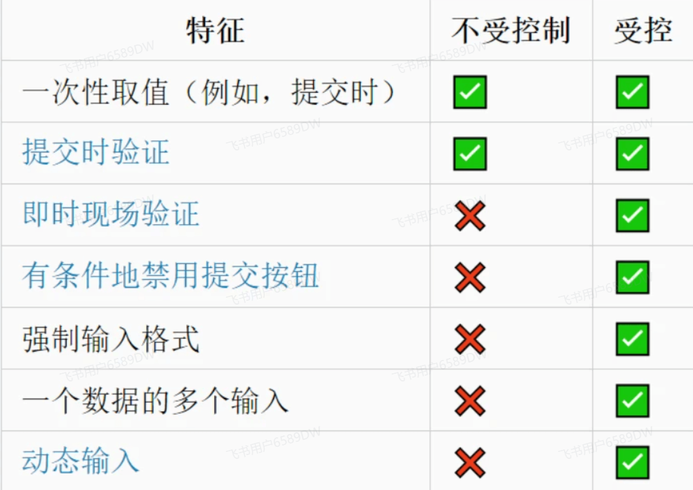

#### setState 是同步，还是异步的？（必背）

##### react18之前

setState在不同情况下可以表现为异步或同步。

在Promise的状态更新、js原生事件、setTimeout、setInterval..中是同步的。

在react的合成事件中，是异步的。

##### react18之后

setState都会表现为异步（即批处理）

react18之前版本的解释

在React中，如果是由React引发的事件处理（比如通过onClick引发的事件处理），调用setState不会同步更新this.state，除此之外的setState调用会同步执行this.state 。所谓“除此之外”，指的是绕过React通过addEventListener直接添加的事件处理函数，还有通过setTimeout/setInterval产生的异步调用。

原因： 在React的setState函数实现中，会根据一个变量isBatchingUpdates判断是直接更新this.state还是放到队列中回头再说，而isBatchingUpdates默认是false，也就表示setState会同步更新this.state，但是，有一个函数batchedUpdates，这个函数会把isBatchingUpdates修改为true，而当React在调用事件处理函数之前就会调用这个batchedUpdates，造成的后果，就是由React控制的事件处理过程setState不会同步更新this.state。

注意： setState的“异步”并不是说内部由异步代码实现，其实本身执行的过程和代码都是同步的，只是合成事件和钩子函数的调用顺序在更新之前，导致在合成事件和钩子函数中没法立马拿到更新后的值，形式了所谓的“异步”，当然可以通过第二个参数 setState(partialState, callback) 中的callback拿到更新后的结果。

综上，setState 只在合成事件和 hook() 中是“异步”的，在 原生事件和 setTimeout 中都是同步的。

#### React Portals 有什么用？

React Portals 是 React 提供的一种机制，用于将子组件渲染到父组件 DOM 层次结构之外的位置。它在处理一些特殊情况下的 UI 布局或交互时非常有用。以下是一些使用 React Portals 的常见情况：

1. 在模态框中使用： 当你需要在应用的根 DOM 结构之外显示模态框（对话框）时，React Portals 可以帮助你将模态框的内容渲染到根 DOM 之外的地方，而不影响布局。
2. 处理 z-index 问题： 在一些复杂的布局中，可能存在 z-index 的层级关系导致组件无法按照预期的方式叠加显示。使用 React Portals 可以将组件渲染到具有更高 z-index 的容器中，以解决这些问题。
3. 在全局位置显示组件： 如果你希望某个组件在页面的固定位置显示，而不受父组件的定位影响，React Portals 可以将该组件渲染到 body 或其他容器中。
4. 在动画中使用： 当你需要在页面中的某个位置执行动画时，React Portals 可以帮助你将动画的内容渲染到离该位置更近的 DOM 结构中，以提高动画性能。

使用 React Portals 的基本步骤如下：

```javascript
import React from 'react';
import ReactDOM from 'react-dom';

function MyPortalComponent() {
  return ReactDOM.createPortal(
    // 子组件的内容
    <div>
      This is rendered using a portal!
    </div>,
    // 渲染目标的 DOM 元素
    document.getElementById('portal-root')
  );
}

// 在应用的根组件中渲染 MyPortalComponent
function App() {
  return (
    <div>
      {/* 此处的内容在正常的 DOM 结构中 */}
      <p>This is a normal component.</p>

      {/* 使用 React Portals 渲染到 'portal-root' 元素外 */}
      <MyPortalComponent />
    </div>
  );
}

export default App;

```

在上面的例子中，MyPortalComponent 中的内容会被渲染到具有 id 为 'portal-root' 的 DOM 元素外。

#### React 事件绑定的方式有哪些？区别是什么？（必背）

***三种方式**：
  1. 构造函数中绑定：`this.handleClick = this.handleClick.bind(this)`
  2. 箭头函数绑定：`onClick={() => this.handleClick()}`
  3. 类属性箭头函数：`handleClick = () => { ... }`
***区别**：
  * 性能：方式3最好，方式2每次渲染都创建新函数
  * 简洁性：方式3最简洁
  * 推荐：方式3（类属性箭头函数）或函数组件+Hooks

#### React 中的 ref 有什么用？（必背）

使用 refs 获取。组件被调用时会新建一个该组件的实例。refs 会指向这个实例，可以是一个回调函数，回调函数会在组件被挂载后立即执行

如果把 refs 放到原生 DOM 组件的 input 中，我们就可以通过 refs 得到 DOM 节点；如果把 refs 放到 React 组件中，那么我们获得的就是组件的实例，因此就可以调用实例的方法（如果想访问该组件的真实 DOM，那么可以用 React.findDOMNode 来找到 DOM 节点，但是不推崇此方法）

refs 无法用于无状态组件，无状态组件挂载时只是方法调用，没有新建实例。在 v16 之后，可以使用 useRef。

#### 说说React Jsx转换成真实DOM过程？（必背）

##### 一、是什么

react通过将组件编写的JSX映射到屏幕，以及组件中的状态发生了变化之后 React会将这些「变化」更新到屏幕上

在前面文章了解中，JSX通过babel最终转化成React.createElement这种形式，例如：

```javascript
<div>
  
  <Hello />
</div>

```

会被babel转化成如下：

```javascript
React.createElement(
  "div",
  null,
  React.createElement("img", {
    src: "avatar.png",
    className: "profile"
  }),
  React.createElement(Hello, null)
);

```

在转化过程中，babel在编译时会判断 JSX 中组件的首字母：

* 当首字母为小写时，其被认定为原生 DOM 标签，createElement 的第一个变量被编译为字符串
* 当首字母为大写时，其被认定为自定义组件，createElement 的第一个变量被编译为对象

最终都会通过RenderDOM.render(...)方法进行挂载，如下：

```javascript
ReactDOM.render(<App />,  document.getElementById("root"));

```

##### 二、过程

在react中，节点大致可以分成四个类别：

* 原生标签节点
* 文本节点
* 函数组件
* 类组件

如下所示：

```javascript
class ClassComponent extends Component {
  static defaultProps = {
    color: "pink"
  };
  render() {
    return (
      <div className="border">
        <h3>ClassComponent</h3>
        <p className={this.props.color}>{this.props.name}</p >
      </div>
    );
  }
}

function FunctionComponent(props) {
  return (
    <div className="border">
      FunctionComponent
      <p>{props.name}</p >
    </div>
  );
}

const jsx = (
  <div className="border">
    <p>xx</p >
    < a href=" ">xxx</ a>
    <FunctionComponent name="函数组件" />
    <ClassComponent name="类组件" color="red" />
  </div>
);

```

这些类别最终都会被转化成React.createElement这种形式

React.createElement其被调用时会传⼊标签类型type，标签属性props及若干子元素children，作用是生成一个虚拟Dom对象，如下所示：

```javascript
function createElement(type, config, ...children) {
    if (config) {
        delete config.__self;
        delete config.__source;
    }
    // ! 源码中做了详细处理，⽐如过滤掉key、ref等
    const props = {
        ...config,
        children: children.map(child =>
   typeof child === "object" ? child : createTextNode(child)
  )
    };
    return {
        type,
        props
    };
}
function createTextNode(text) {
    return {
        type: TEXT,
        props: {
            children: [],
            nodeValue: text
        }
    };
}
export default {
    createElement
};

```

createElement会根据传入的节点信息进行一个判断：

* 如果是原生标签节点， type 是字符串，如div、span
* 如果是文本节点， type就没有，这里是 TEXT
* 如果是函数组件，type 是函数名
* 如果是类组件，type 是类名

虚拟DOM会通过ReactDOM.render进行渲染成真实DOM，使用方法如下：

```javascript
ReactDOM.render(element, container[, callback])

```

当首次调用时，容器节点里的所有 DOM 元素都会被替换，后续的调用则会使用 React 的 diff算法进行高效的更新

如果提供了可选的回调函数callback，该回调将在组件被渲染或更新之后被执行

render大致实现方法如下：

```javascript
function render(vnode, container) {
    console.log("vnode", vnode); // 虚拟DOM对象
    // vnode _> node
    const node = createNode(vnode, container);
    container.appendChild(node);
}

// 创建真实DOM节点
function createNode(vnode, parentNode) {
    let node = null;
    const {type, props} = vnode;
    if (type === TEXT) {
        node = document.createTextNode("");
    } else if (typeof type === "string") {
        node = document.createElement(type);
    } else if (typeof type === "function") {
        node = type.isReactComponent
            ? updateClassComponent(vnode, parentNode)
        : updateFunctionComponent(vnode, parentNode);
    } else {
        node = document.createDocumentFragment();
    }
    reconcileChildren(props.children, node);
    updateNode(node, props);
    return node;
}

// 遍历下子vnode，然后把子vnode->真实DOM节点，再插入父node中
function reconcileChildren(children, node) {
    for (let i = 0; i < children.length; i++) {
        let child = children[i];
        if (Array.isArray(child)) {
            for (let j = 0; j < child.length; j++) {
                render(child[j], node);
            }
        } else {
            render(child, node);
        }
    }
}
function updateNode(node, nextVal) {
    Object.keys(nextVal)
        .filter(k => k !== "children")
        .forEach(k => {
        if (k.slice(0, 2) === "on") {
            let eventName = k.slice(2).toLocaleLowerCase();
            node.addEventListener(eventName, nextVal[k]);
        } else {
            node[k] = nextVal[k];
        }
    });
}

// 返回真实dom节点
// 执行函数
function updateFunctionComponent(vnode, parentNode) {
    const {type, props} = vnode;
    let vvnode = type(props);
    const node = createNode(vvnode, parentNode);
    return node;
}

// 返回真实dom节点
// 先实例化，再执行render函数
function updateClassComponent(vnode, parentNode) {
    const {type, props} = vnode;
    let cmp = new type(props);
    const vvnode = cmp.render();
    const node = createNode(vvnode, parentNode);
    return node;
}
export default {
    render
};

```

##### 三、总结

在react源码中，虚拟Dom转化成真实Dom整体流程如下图所示：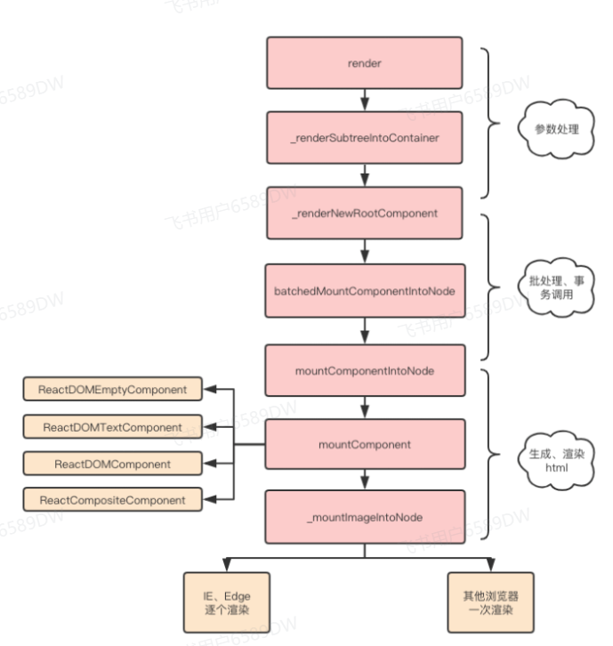

其渲染流程如下所示：

* 使用React.createElement或JSX编写React组件，实际上所有的 JSX 代码最后都会转换成React.createElement(...) ，Babel帮助我们完成了这个转换的过程。
* createElement函数对key和ref等特殊的props进行处理，并获取defaultProps对默认props进行赋值，并且对传入的孩子节点进行处理，最终构造成一个虚拟DOM对象
* ReactDOM.render将生成好的虚拟DOM渲染到指定容器上，其中采用了批处理、事务等机制并且对特定浏览器进行了性能优化，最终转换为真实DOM

#### 简述下 React 的事件代理机制？（必背）

React 并不会把所有的处理函数直接绑定在真实的节点上。而是把所有的事件绑定到结构的最外层，使用一个统一的事件监听器，这个事件监听器上维持了一个映射来保存所有组件内部的事件监听和处理函数。

当组件挂载或卸载时，只是在这个统一的事件监听器上插入或删除一些对象。

当事件发生时，首先被这个统一的事件监听器处理，然后在映射里找到真正的事件处理函数并调用。

这样做的优点是解决了兼容性问题，并且简化了事件处理和回收机制（不需要手动的解绑事件，React 已经在内部处理了）。但是有些事件 React 并没有实现，比如 window 的 resize 事件。

在React@17.0.3版本中：

* 所有事件都是委托在id = root的DOM元素中（网上很多说是在document中，17版本不是了）；
* 在应用中所有节点的事件监听其实都是在id = root的DOM元素中触发；
* React自身实现了一套事件冒泡捕获机制；
* React实现了合成事件SyntheticEvent；
* React在17版本不再使用事件池了（网上很多说使用了对象池来管理合成事件对象的创建销毁，那是16版本及之前）；
* 事件一旦在id = root的DOM元素中委托，其实是一直在触发的，只是没有绑定对应的回调函数；

之所以会将事件委托从document中移到id = root的DOM元素，是为了可以更加安全地进行新旧版本 React 树的嵌套。

#### state 和 props 有什么区别？（必背）

***定义**：state 是组件内部状态，props 是父组件传入的参数
***可变性**：state 可修改（通过 setState），props 只读
***作用域**：state 是组件私有，props 是外部传入
***通信**：父组件通过 props 向子组件传值，子组件通过回调函数向父组件通信

#### 讲讲 React.memo 和 JS 的 memorize 函数的区别

React.memo() 和 JS 的 memorize 函数都是用来对函数进行结果缓存，提高函数的性能表现。不过，它们之间还是有一些区别的：

1. 适用范围不同：React.memo() 主要适用于优化 React 组件的性能表现，而 memorize 函数可以用于任何 JavaScript 函数的结果缓存。
2. 实现方式不同：React.memo() 是一个 React 高阶组件（HOC），通过浅层比较 props 是否发生变化来决定是否重新渲染组件。而 memorize 函数则是通过将函数的输入参数及其计算结果保存到一个缓存对象中，以避免重复计算相同的结果。
3. 缓存策略不同：React.memo() 的缓存策略是浅比较（shallow compare），只比较props 的第一层属性值是否相等，不会递归比较深层嵌套对象或数组的内容。而 memorize 函数的缓存策略是将输入参数转换成字符串后，作为缓存的键值。如果传入的参数不是基本类型时，则需要自己实现缓存键值的计算。
4. 应用场景不同：React.memo() 主要适用于对不经常变化的组件进行性能优化，而 memorize 函数则主要适用于对计算量大、执行时间长的函数进行结果缓存。例如，对于状态不变的组件或纯函数，可以使用 React.memo() 进行优化；对于递归计算、复杂数学运算等耗时操作，可以使用 memorize 函数进行结果缓存。

综上所述，React.memo() 和 JS 的 memorize 函数虽然都是用于提高函数的性能表现，但其适用范围、实现方式、缓存策略和应用场景等方面还是有一定的区别。开发者需要根据具体情况来选择合适的性能优化手段，以提高应用程序的性能和响应速度。

#### 怎么判断一个对象是否是 React 元素？

如果想要判断一个对象是否是 React 元素，可以使用 React.isValidElement() 方法进行判断。该方法接收一个参数，返回一个布尔值，用于表示指定的对象是否是 React 元素。

以下是一个示例代码：

```javascript
import React from 'react';

const MyComponent = () => {
  return <div>Hello, world!</div>;
}

const elem = <MyComponent />;

console.log(React.isValidElement(elem)); // true
console.log(React.isValidElement({}));   // false

```

在上述代码中，定义了一个简单的组件 MyComponent，并通过 JSX 语法创建了一个 React 元素 elem。然后，使用 React.isValidElement() 方法对 elem 和一个普通对象 {} 进行判断，并输出结果。

需要注意的是，React.isValidElement() 方法只能用于判断是否为 React 元素，并不能判断元素的类型和其他属性。如果需要获取元素的类型或其他属性，可以直接访问元素的属性，例如 type、props、key 等。

#### 说说对 React 中Element、Component、Node、Instance 四个概念的理解

在 React 中，Element、Component、Node、Instance 是四个重要的概念。

1. Element：Element 是 React 应用中最基本的构建块，它是一个普通的 JavaScript 对象，用来描述 UI 的一部分。Element 可以是原生的 DOM 元素，也可以是自定义的组件。它的作用是用来向 React 描述开发者想在页面上 render 什么内容。Element 是不可变的，一旦创建就不能被修改。
2. Component：Component 是 React 中的一个概念，它是由 Element 构成的，可以是函数组件或者类组件。Component 可以接收输入的数据（props），并返回一个描述 UI 的 Element。Component 可以被复用，可以在应用中多次使用。分为 Class Component 以及 Function Component。
3. Node：Node 是指 React 应用中的一个虚拟节点，它是 Element 的实例。Node 包含了 Element 的所有信息，包括类型、属性、子节点等。Node 是 React 内部用来描述 UI 的一种数据结构，它可以被渲染成真实的 DOM 元素。
4. Instance：Instance 是指 React 应用中的一个组件实例，它是 Component 的实例。每个 Component 在应用中都会有一个对应的 Instance，它包含了 Component 的所有状态和方法。Instance 可以被用来操作组件的状态，以及处理用户的交互事件等。

#### react 和 react-dom 是什么关系？

react 和 react-dom 是 React 库的两个主要部分，它们分别负责处理不同的事务。它们之间的关系可以理解为：

1. react： 这是 React 库的核心部分，包含了 React 的核心功能，如组件、状态、生命周期等。它提供了构建用户界面所需的基本构建块。当你编写 React 组件时，你实际上是在使用 react 包。
2. react-dom： 这是 React 专门为 DOM 环境提供的包，它包含了与浏览器 DOM 相关的功能。react-dom 提供了用于在浏览器中渲染 React 组件的方法，包括 ReactDOM.render。在 Web 开发中，react-dom 被用于将 React 应用渲染到浏览器的 DOM 中。

基本上，react 和 react-dom 是为了分离 React 的核心功能，以便更好地处理不同的环境和平台。这种分离使得 React 更加灵活，可以适应不同的渲染目标，而不仅仅局限于浏览器环境。

在使用 React 开发 Web 应用时，通常会同时安装和引入这两个包：

```javascript
import React from 'react';
import ReactDOM from 'react-dom';

const App = () => {
  return <h1>Hello, React!</h1>;
};

ReactDOM.render(<App />, document.getElementById('root'));

```

在上面的例子中，react 库提供了 App 组件的定义，而 react-dom 库提供了 ReactDOM.render 方法，用于将组件渲染到 HTML 页面中。这种分工让 React 在不同平台上能够更灵活地适应各种渲染目标。

#### 说说React事件和原生事件的执行顺序

我们知道，React在内部对事件做了统一的处理，合成事件是一个比较大的概念

为什么要有合成事件

1. 在传统的事件里，不同的浏览器需要兼容不同的写法，在合成事件中React提供统一的事件对象，抹平了浏览器的兼容性差异
2. React通过顶层监听的形式，通过事件委托的方式来统一管理所有的事件，可以在事件上区分事件优先级，优化用户体验

React在合成事件上对于16版本和17版本的合成事件有很大不同，我们也会简单聊聊区别。

##### 概念

###### 事件委托

事件委托的意思就是可以通过给父元素绑定事件委托，通过事件对象的target属性可以获取到当前触发目标阶段的dom元素，来进行统一管理

比如写原生dom循环渲染的时候，我们要给每一个子元素都添加dom事件，这种情况最简单的方式就是通过事件委托在父元素做一次委托，通过target属性判断区分做不同的操作

###### 事件监听

事件监听主要用到了addEventListener这个函数，具体怎么用可以点击进行查看 事件监听和事件绑定的最大区别就是事件监听可以给一个事件监听多个函数操作，而事件绑定只有一次

```javascript
// 可以监听多个，不会被覆盖
eventTarget.addEventListener('click', () => {});
eventTarget.addEventListener('click', () => {});

eventTarget.onclick = function () {};
eventTarget.onclick = function () {}; // 第二个会把第一个覆盖

```

事件执行顺序

```javascript
<div>
  <span>点我</span>
</div>

```

当我们点击span标签的时候会经过这么三个过程，在路径内的元素绑定的事件都会进行触发

捕获阶段 => 目标阶段 => 冒泡阶段

###### 合成事件

在看之前先看一下这几个问题

* 原生事件和合成事件的执行顺序是什么？
* 合成事件在什么阶段下会被执行？
* 阻止原生事件的冒泡，会影响到合成事件的执行吗？
* 阻止合成事件的冒泡，会影响到原生事件的执行吗？

下面一个例子说清楚，

```javascript
import React, { useRef, useEffect } from "react";
import "./styles.css";

const logFunc = (target, isSynthesizer, isCapture = false) => {
    const info = `${isSynthesizer ? "合成" : "原生"}事件，${
        isCapture ? "捕获" : "冒泡"}阶段，${target}元素执行了`;

    console.log(info);
};

const batchManageEvent = (targets, funcs, isRemove = false) => {
    targets.forEach((target, targetIndex) => {
        funcs[targetIndex].forEach((func, funcIndex) => {
            target[isRemove ? "removeEventListener" : "addEventListener"](
                "click",
                func,
                !funcIndex
            );
        });
    });
};

export default function App() {
    const divDom = useRef();
    const h1Dom = useRef();
    useEffect(() => {

        const docClickCapFunc = () => logFunc("document", false, true);
        const divClickCapFunc = () => logFunc("div", false, true);
        const h1ClickCapFunc = () => logFunc("h1", false, true);
        const docClickFunc = () => logFunc("document", false);
        const divClickFunc = () => logFunc("div", false);
        const h1ClickFunc = () => logFunc("h1", false);

        batchManageEvent(
            [document, divDom.current, h1Dom.current],
            [
                [docClickCapFunc, docClickFunc],
                [divClickCapFunc, divClickFunc],
                [h1ClickCapFunc, h1ClickFunc]
            ]
        );

        return () => {
            batchManageEvent(
                   [document, divDom.current, h1Dom.current],
                [
                    [docClickCapFunc, docClickFunc],
                    [divClickCapFunc, divClickFunc],
                    [h1ClickCapFunc, h1ClickFunc]
                ],
                true
            );
        };
    }, []);

    return (
        <div
          ref={divDom}
          className="App1"
          onClickCapture={() => logFunc("div", true, true)}
          onClick={() => logFunc("div", true)}
        >
          <h1
            ref={h1Dom}
            onClickCapture={() => logFunc("h1", true, true)}
            onClick={() => logFunc("h1", true)}
          >
            Hello CodeSandbox
          </h1>
        </div>
    );
}

```

当我们点击h1的时候

会先执行原生事件事件流，当执行到document的冒泡阶段的时候做了个拦截，在这个阶段开始执行合成事件

当我们把上面的demo的原生div的stopPropagation()  方法调用阻止捕获和冒泡阶段中当前事件的进一步传播，会阻止后续的所有事件执行

```javascript
// ...
const divClickCapFunc = (e) => {
    e.stopPropagation(); // 增加原生捕获阶段的阻止事件
    logFunc("div", false, true);
};
// ...

```

模拟阶段

```javascript
<!DOCTYPE html>
<html lang="en">
  <head>
    <meta charset="utf-8" />
    <meta name="viewport" content="width=device-width, initial-scale=1.0, maximum-scale=1.0, maximum-scale=1, user-scalable=no" />
    <meta name="theme-color" content="#000000" />
    <meta name="description" content="Web site created using create-react-app" />
    <link href="favicon.ico" type="image/x-icon" rel="icon" />
    <title>浅谈React合成事件</title>
  </head>
  <body>
    <div id="wrapper">
      <h1 id="content">hello</h1>
    </div>
  </body>
  <script>
    const logFunc = (target, isSynthesizer, isCapture = false) => {
      const info = `${isSynthesizer ? '合成' : '原生'}事件，${isCapture ? '捕获' : '冒泡'}阶段，${target}元素执行了`;
      console.log(info);
    };
    // document的派发事件函数
    const dispatchEvent = currentDom => {
      let current = currentDom;
      let eventCallbacks = []; // 存储冒泡事件回调函数
      let eventCaptureCallbacks = []; // 存储冒泡事件回调函数
      // 收集事件流一路上的所有回调函数
      while (current) {
        if (current.onClick) {
          eventCallbacks.push(current.onClick);
        }
        if (current.onClickCapture) {
          // 捕获阶段由外到内，所以需要把回调函数放到数组的最前面
          eventCaptureCallbacks.unshift(current.onClickCapture);
        }
        current = current.parentNode;
      }
      // 执行调用
      eventCaptureCallbacks.forEach(callback => callback());
      eventCallbacks.forEach(callback => callback());
    };
    const wrapperDom = document.getElementById('wrapper');
    const contentDom = document.getElementById('content');

    // 一路上注册原生事件
    document.addEventListener('click', () => logFunc('document', false, true), true);
    wrapperDom.addEventListener('click', () => logFunc('div', false, true), true);
    contentDom.addEventListener('click', () => logFunc('h1', false, true), true);
    contentDom.addEventListener('click', () => logFunc('h1', false));
    wrapperDom.addEventListener('click', () => logFunc('div', false));
    document.addEventListener('click', e => {
      dispatchEvent(e.target); // 这里收集一路上的事件进行派发
      logFunc('document', false);
    });

    // 模拟合成事件
    wrapperDom.onClick = () => logFunc('div', true);
    wrapperDom.onClickCapture = () => logFunc('div', true, true);
    contentDom.onClick = () => logFunc('h1', true);
    contentDom.onClickCapture = () => logFunc('h1', true, true);
  </script>
</html>

```

点击h1可以看到一路上的注册的所有事件已经执行了

React16给document上加的统一的拦截判发事件会在一定情况下出问题，下面举个例子简单说明一下

```javascript
import React, { useEffect, useState } from 'react';
import './styles.css';

const Modal = ({ onClose }) => {
  useEffect(() => {
    document.addEventListener('click', onClose);
    return () => {
      document.removeEventListener('click', onClose);
    };
  }, [onClose]);
  return (
    <div
      style={{ width: 300, height: 300, backgroundColor: 'red' }}
      onClick={e => {
        e.stopPropagation();
        // e.nativeEvent.stopImmediatePropagation();
      }}
    >
      Modal
    </div>
  );
};

function App() {
  const [visible, setVisible] = useState(false);
  return (
    <div className="App">
      <button
        onClick={() => {
          setVisible(true);
        }}
      >
        点我弹出modal
      </button>
      {visible && <Modal onClose={() => setVisible(false)} />}
    </div>
  );
}
export default App;

```

写完之后点击按钮Modal被弹出来, 但是点击modal里面的内容modal就隐藏了，添加阻止事件流函数还是不行

原因就是点击之后，事件冒泡到document上，同时也执行了他身上挂载的方法，解决办法就是给点击事件添加 e.nativeEvent.stopImmediatePropagation();

stopImmediatePropagation和stopPropagation的区别就是，前者会阻止当前节点下所有的事件监听的函数，后者不会

那react17及之后做了什么改变呢

16和17的区别

在17版本中，React把事件节点绑定函数绑定在了render的根节点上，避免了上述的问题,

用上面的demo的在线案例把版本改成17之后，可以发现事件的执行顺序变了

模拟17版本

```javascript
<!DOCTYPE html>
<html lang="en">
        }
        current = current.parentNode;
      }
      eventCallbacks.forEach(callback => callback());
    };
    const wrapperDom = document.getElementById('wrapper');
    const contentDom = document.getElementById('content');
    const root = document.getElementById('root');

    // 一路上注册原生事件
    document.addEventListener('click', () => logFunc('document', false, true), true);
    root.addEventListener(
      'click',
      e => {
        dispatchEvent(e.target, true);
        logFunc('root', false, true);
      },
      true
    );
    wrapperDom.addEventListener('click', () => logFunc('div', false, true), true);
    contentDom.addEventListener('click', () => logFunc('h1', false, true), true);
    contentDom.addEventListener('click', () => logFunc('h1', false));
    wrapperDom.addEventListener('click', () => logFunc('div', false));
    root.addEventListener('click', e => {
      dispatchEvent(e.target); // 这里收集一路上的事件进行派发
      logFunc('root', false);
    });
    document.addEventListener('click', () => logFunc('document', false));
    // 模拟合成事件
    wrapperDom.onClick = () => logFunc('div', true);
    wrapperDom.onClickCapture = () => logFunc('div', true, true);
    contentDom.onClick = () => logFunc('h1', true);
    contentDom.onClickCapture = () => logFunc('h1', true, true);
  </script>
</html>

```

区别就是在外层增加了一个root模拟根节点，修改了dispatchEvent的逻辑

可以看到，效果已经和17版本的一样了

回看16demo，切换版本到17，当我们切换到17的时候，用stopPropagation就可以解决问题了, 原因就是他在root节点上绑定的事件冒泡函数，stopPropagation切断了事件流，不会流向到document身上了

###### 总结

* 16版本先执行原生事件，当冒泡到document时，统一执行合成事件，
* 17版本在原生事件执行前先执行合成事件捕获阶段，原生事件执行完毕执行冒泡阶段的合成事件,通过根节点来管理所有的事件

原生的阻止事件流会阻断合成事件的执行，合成事件阻止后也会影响到后续的原生执行

#### 怎么在代码中判断一个 React 组件是 class component 还是 function component？

可以使用JavaScript的typeof运算符和React的Component类来进行判断。

下面是一个示例的判断方法：

```javascript
function isClassComponent(component) {
  return (
    typeof component === 'function' &&
    !!component.prototype.isReactComponent
  );
}

// 示例用法
const MyComponent = () => <div>Hello, I'm a function component!</div>;
const MyClassComponent = class extends React.Component {
  render() {
    return <div>Hello, I'm a class component!</div>;
  }
};

console.log(isClassComponent(MyComponent)); // false
console.log(isClassComponent(MyClassComponent)); // true

```

上面定义了一个名为isClassComponent的函数，它接受一个组件作为参数。函数内部使用typeof运算符来判断该组件是否为函数类型，并通过检查component.prototype.isReactComponent属性来确定是否为Class组件。

#### 子组件是一个 Portal，发生点击事件能冒泡到父组件吗？

React 的 Portal 通过 React 的 context 和事件冒泡的机制工作。

在理解这个问题之前，首先要了解一些基本知识：

1. React Context：React 使用 context 来存储组件树的一些信息，比如事件处理程序。当组件使用 Portal 时，Portal 在 React 内部仍然保持在父组件树中，即使在 DOM 上渲染到其他地方。也就是说，Portal 的 context 依然从其父组件继承而来。
2. DOM 事件冒泡：DOM 中的事件（例如点击事件）通常会从触发事件的元素开始，然后逐步向上冒泡到父元素，直到 document 元素。在这个过程中，事件会按照 DOM 树的层级一层层地向上传递。
3. React 的事件代理：React 使用事件代理模式将所有事件都代理到顶层（document 或者 root DOM 节点）进行处理。这意味着当在子组件中触发一个事件时，无论子组件是否使用了 Portal，React 都会将事件传递到其父组件，然后逐级往上冒泡，直到到达代理事件的顶层。

在 React 中，当一个子组件使用 Portal 将其内容渲染到其他 DOM 节点时，尽管在 DOM 结构上子组件不再是父组件的直接子节点，但在 React 的组件树中，子组件仍然是父组件的子节点。这意味着 React 在监听和处理事件时，会沿着组件树的路径（而不是 DOM 树的路径）冒泡事件。因此，子组件中触发的事件仍然会冒泡到父组件。

#### React 为什么要废弃 componentWillMount、componentWillReceiveProps、componentWillUpdate 这三个生命周期钩子？它们有哪些问题呢？React 又是如何解决的呢？

React 在 16.3 版本中：

* 将 componentWillMount、componentWillReceiveProps、componentWillUpdate 三个生命周期钩子加上了 UNSAFE 前缀，变为 UNSAFE\_componentWillMount、UNSAFE\_componentWillReceiveProps 和 UNSAFE\_componentWillUpdate。
* 并引入了一个新的生命周期钩子：getDerivedStateFromProps。

并在 17.0 以及之后的版本中：

* 删除了 componentWillMount、componentWillReceiveProps、componentWillUpdate 这三个生命周期钩子。

不过 UNSAFE\_componentWillMount、UNSAFE\_componentWillReceiveProps 和 UNSAFE\_componentWillUpdate 还是可以用的。

我们知道 React 的更新流程分为：render 阶段和 commit 阶段。

componentWillMount、componentWillReceiveProps、componentWillUpdate 这三个生命周期钩子都是在 render 阶段执行的。

在 fiber 架构被应用之前，render 阶段是不能被打断的。当页面逐渐复杂之后，就有可能会阻塞页面的渲染，于是 React 推出了 fiber 架构。在应用 fiber 架构之后，低优先级任务的 render 阶段可以被高优先级任务打断。

而这导致的问题就是：在 render 阶段执行的生命周期函数可能被执行多次。

componentWillMount、componentWillReceiveProps、componentWillUpdate 这三个生命周期钩子，如果我们在其中执行一些具有副作用的操作，例如发送网络请求，就有可能导致一个同样的网络请求被执行多次，这显然不是我们想看到的。

而 React 又没法强迫开发者不去这样做，因为怎么样使用 React 是开发者的自由，所以 React 就新增了一个静态的生命周期 getDerivedStateFromProps，来解决这个问题。

用一个静态函数 getDerivedStateFromProps 来取代被废弃的几个生命周期函数，这样开发者就无法通过 this 获取到组件的实例，也不能发送网络请求以及调用 this.setState。它就是强制开发者在 render 之前只做无副作用的操作，间接强制我们无法进行这些不合理不规范的操作，从而避免对生命周期的滥用。

#### 简述下 React 的生命周期？每个生命周期都做了什么？（选背）

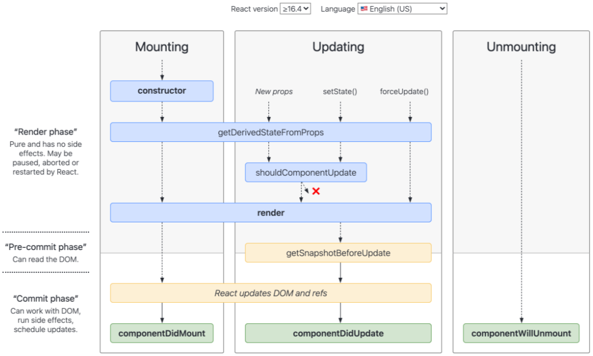

##### 挂载

当组件实例被创建并插入 DOM 中时，其生命周期调用顺序如下：

* constructor()
* static getDerivedStateFromProps()
* render()
* componentDidMount()

##### 更新

当组件的 props 或 state 发生变化时会触发更新。组件更新的生命周期调用顺序如下：

* static getDerivedStateFromProps()
* shouldComponentUpdate()
* render()
* getSnapshotBeforeUpdate()
* componentDidUpdate()

##### 卸载

当组件从 DOM 中移除时会调用如下方法：

* componentWillUnmount()

##### 错误处理

渲染过程，生命周期，或子组件的构造函数中抛出错误时，会调用如下方法：

* static getDerivedStateFromError()
* componentDidCatch()

##### 具体介绍

##### render()

render() 方法是 class 组件中唯一必须实现的方法。

当 render 被调用时，它会检查 this.props 和 this.state 的变化并返回以下类型之一：

* React 元素。通常通过 JSX 创建。例如，<div /> 会被 React 渲染为 DOM 节点，<MyComponent /> 会被 React 渲染为自定义组件，无论是 <div /> 还是 <MyComponent /> 均为 React 元素。
* 数组或 fragments。 使得 render 方法可以返回多个元素。欲了解更多详细信息，请参阅 fragments 文档。
* Portals。可以渲染子节点到不同的 DOM 子树中。欲了解更多详细信息，请参阅有关 portals 的文档
* 字符串或数值类型。它们在 DOM 中会被渲染为文本节点
* 布尔类型或 null。什么都不渲染。（主要用于支持返回 test && <Child /> 的模式，其中 test 为布尔类型。）

render() 函数应该为纯函数，这意味着在不修改组件 state 的情况下，每次调用时都返回相同的结果，并且它不会直接与浏览器交互。

如需与浏览器进行交互，请在 componentDidMount() 或其他生命周期方法中执行你的操作。保持 render() 为纯函数，可以使组件更容易思考。

##### constructor()

如果不初始化 state 或不进行方法绑定，则不需要为 React 组件实现构造函数。

在 React 组件挂载之前，会调用它的构造函数。在为 React.Component 子类实现构造函数时，应在其他语句之前前调用 super(props)。否则，this.props 在构造函数中可能会出现未定义的 bug。

通常，在 React 中，构造函数仅用于以下两种情况：

通过给 this.state 赋值对象来初始化内部 state。

* 为事件处理函数绑定实例
* 在 constructor() 函数中不要调用 setState() 方法。如果你的组件需要使用内部 state，请直接在构造函数中为 this.state 赋值初始 state。

只能在构造函数中直接为 this.state 赋值。如需在其他方法中赋值，你应使用 this.setState() 替代。

要避免在构造函数中引入任何副作用或订阅。如遇到此场景，请将对应的操作放置在 componentDidMount 中。

##### componentDidMount()

componentDidMount() 会在组件挂载后（插入 DOM 树中）立即调用。依赖于 DOM 节点的初始化应该放在这里。如需通过网络请求获取数据，此处是实例化请求的好地方。

这个方法是比较适合添加订阅的地方。如果添加了订阅，请不要忘记在 componentWillUnmount() 里取消订阅

你可以在 componentDidMount() 里直接调用 setState()。它将触发额外渲染，但此渲染会发生在浏览器更新屏幕之前。如此保证了即使在 render() 两次调用的情况下，用户也不会看到中间状态。请谨慎使用该模式，因为它会导致性能问题。通常，你应该在 constructor() 中初始化 state。如果你的渲染依赖于 DOM 节点的大小或位置，比如实现 modals 和 tooltips 等情况下，你可以使用此方式处理。

##### componentDidUpdate()

componentDidUpdate() 会在更新后会被立即调用。首次渲染不会执行此方法。

当组件更新后，可以在此处对 DOM 进行操作。如果你对更新前后的 props 进行了比较，也可以选择在此处进行网络请求。（例如，当 props 未发生变化时，则不会执行网络请求）。

```javascript
componentDidUpdate(prevProps) {
  // 典型用法（不要忘记比较 props）：
  if (this.props.userID !== prevProps.userID) {
    this.fetchData(this.props.userID);
  }
}

```

你也可以在 componentDidUpdate() 中直接调用 setState()，但请注意它必须被包裹在一个条件语句里，正如上述的例子那样进行处理，否则会导致死循环。它还会导致额外的重新渲染，虽然用户不可见，但会影响组件性能。不要将 props “镜像”给 state，请考虑直接使用 props。 欲了解更多有关内容，请参阅为什么 props 复制给 state 会产生 bug。

如果组件实现了 getSnapshotBeforeUpdate() 生命周期（不常用），则它的返回值将作为 componentDidUpdate() 的第三个参数 “snapshot” 参数传递。否则此参数将为 undefined。

componentWillUnmount()

componentWillUnmount() 会在组件卸载及销毁之前直接调用。在此方法中执行必要的清理操作，例如，清除 timer，取消网络请求或清除在 componentDidMount() 中创建的订阅等。

componentWillUnmount() 中不应调用 setState()，因为该组件将永远不会重新渲染。组件实例卸载后，将永远不会再挂载它。

##### shouldComponentUpdate()

根据 shouldComponentUpdate() 的返回值，判断 React 组件的输出是否受当前 state 或 props 更改的影响。默认行为是 state 每次发生变化组件都会重新渲染。大部分情况下，你应该遵循默认行为。

当 props 或 state 发生变化时，shouldComponentUpdate() 会在渲染执行之前被调用。返回值默认为 true。首次渲染或使用 forceUpdate() 时不会调用该方法。

此方法仅作为性能优化的方式而存在。不要企图依靠此方法来“阻止”渲染，因为这可能会产生 bug。你应该考虑使用内置的 PureComponent 组件，而不是手动编写 shouldComponentUpdate()。PureComponent 会对 props 和 state 进行浅层比较，并减少了跳过必要更新的可能性。

如果你一定要手动编写此函数，可以将 this.props 与 nextProps 以及 this.state 与nextState 进行比较，并返回 false 以告知 React 可以跳过更新。请注意，返回 false 并不会阻止子组件在 state 更改时重新渲染。

我们不建议在 shouldComponentUpdate() 中进行深层比较或使用 JSON.stringify()。这样非常影响效率，且会损害性能。

目前，如果 shouldComponentUpdate() 返回 false，则不会调用 UNSAFE\_componentWillUpdate()，render() 和 componentDidUpdate()。后续版本，React 可能会将 shouldComponentUpdate 视为提示而不是严格的指令，并且，当返回 false 时，仍可能导致组件重新渲染。

##### static getDerivedStateFromProps()

getDerivedStateFromProps 会在调用 render 方法之前调用，并且在初始挂载及后续更新时都会被调用。它应返回一个对象来更新 state，如果返回 null 则不更新任何内容。

此方法适用于罕见的用例，即 state 的值在任何时候都取决于 props。例如，实现 <Transition> 组件可能很方便，该组件会比较当前组件与下一组件，以决定针对哪些组件进行转场动画。

派生状态会导致代码冗余，并使组件难以维护。 确保你已熟悉这些简单的替代方案：

* 如果你需要执行副作用（例如，数据提取或动画）以响应 props 中的更改，请改用 componentDidUpdate。
* 如果只想在 prop 更改时重新计算某些数据，请使用 memoization helper 代替。
* 如果你想在 prop 更改时“重置”某些 state，请考虑使组件完全受控或使用 key 使组件完全不受控代替。

此方法无权访问组件实例。如果你需要，可以通过提取组件 props 的纯函数及 class 之外的状态，在getDerivedStateFromProps()和其他 class 方法之间重用代码。

请注意，不管原因是什么，都会在每次渲染前触发此方法。这与 UNSAFE\_componentWillReceiveProps 形成对比，后者仅在父组件重新渲染时触发，而不是在内部调用 setState 时。

##### getSnapshotBeforeUpdate()

getSnapshotBeforeUpdate() 在最近一次渲染输出（提交到 DOM 节点）之前调用。它使得组件能在发生更改之前从 DOM 中捕获一些信息（例如，滚动位置）。此生命周期方法的任何返回值将作为参数传递给 componentDidUpdate()。

此用法并不常见，但它可能出现在 UI 处理中，如需要以特殊方式处理滚动位置的聊天线程等。

应返回 snapshot 的值（或 null）。

##### Error boundaries

Error boundaries 是 React 组件，它会在其子组件树中的任何位置捕获 JavaScript 错误，并记录这些错误，展示降级 UI 而不是崩溃的组件树。Error boundaries 组件会捕获在渲染期间，在生命周期方法以及其整个树的构造函数中发生的错误。

如果 class 组件定义了生命周期方法 static getDerivedStateFromError() 或 componentDidCatch() 中的任何一个（或两者），它就成为了 Error boundaries。通过生命周期更新 state 可让组件捕获树中未处理的 JavaScript 错误并展示降级 UI。

仅使用 Error boundaries 组件来从意外异常中恢复的情况；不要将它们用于流程控制。

##### static getDerivedStateFromError()

此生命周期会在后代组件抛出错误后被调用。 它将抛出的错误作为参数，并返回一个值以更新 state。

##### componentDidCatch()

此生命周期在后代组件抛出错误后被调用。 它接收两个参数：

* error —— 抛出的错误。
* info —— 带有 componentStack key 的对象，其中包含有关组件引发错误的栈信息。

componentDidCatch() 会在“提交”阶段被调用，因此允许执行副作用。 它应该用于记录错误之类的情况。

React 的开发和生产构建版本在 componentDidCatch() 的方式上有轻微差别。

在开发模式下，错误会冒泡至 window，这意味着任何 window.onerror 或 window.addEventListener('error', callback) 会中断这些已经被 componentDidCatch() 捕获的错误。

相反，在生产模式下，错误不会冒泡，这意味着任何根错误处理器只会接受那些没有显式地被 componentDidCatch() 捕获的错误。

### Hooks

#### 为什么不能在循环、条件或嵌套函数中调用 Hooks？（必背）

如果在条件语句中使用hooks，React会抛出 error。

这与React Hooks的底层设计的数据结构相关，先抛出结论：react用链表来严格保证hooks的顺序。

一个典型的useState使用场景：

```javascript
const [name,setName] = useState('leo');

......

setName('Lily');

```

简而言之，这个初始化了一个hooks，并且将其追加到链表结尾。

```javascript
function mountState(initialState) {

  // 将新的 hook 对象追加进链表尾部
  var hook = mountWorkInProgressHook();

  // initialState 可以是一个回调，若是回调，则取回调执行后的值

  if (typeof initialState === 'function') {

    // $FlowFixMe: Flow doesn't like mixed types

    initialState = initialState();
  }

  // 创建当前 hook 对象的更新队列，这一步主要是为了能够依序保留 dispatch

  const queue = hook.queue = {

    last: null,

    dispatch: null,

    lastRenderedReducer: basicStateReducer,

    lastRenderedState: (initialState: any),

  };

  // 将 initialState 作为一个“记忆值”存下来

  hook.memoizedState = hook.baseState = initialState;

  // dispatch 是由上下文中一个叫 dispatchAction 的方法创建的，这里不必纠结这个方法具体做了什么

  var dispatch = queue.dispatch = dispatchAction.bind(null, currentlyRenderingFiber$1, queue);

  // 返回目标数组，dispatch 其实就是示例中常常见到的 setXXX 这个函数，想不到吧？哈哈

  return [hook.memoizedState, dispatch];
}

```

从这段源码中我们可以看出，mounState 的主要工作是初始化 Hooks。在整段源码中，最需要关注的是 mountWorkInProgressHook 方法，它为我们道出了 Hooks 背后的数据结构组织形式。以下是 mountWorkInProgressHook 方法的源码：

```javascript
function mountWorkInProgressHook() {

  // 注意，单个 hook 是以对象的形式存在的
  var hook = {

    memoizedState: null,

    baseState: null,

    baseQueue: null,

    queue: null,

    next: null

  };

  if (workInProgressHook === null) {
    // 这行代码每个 React 版本不太一样，但做的都是同一件事：将 hook 作为链表的头节点处理
    firstWorkInProgressHook = workInProgressHook = hook;
  } else {
    // 若链表不为空，则将 hook 追加到链表尾部
    workInProgressHook = workInProgressHook.next = hook;
  }
  // 返回当前的 hook
  return workInProgressHook;
}

```

到这里可以看出，hook 相关的所有信息收敛在一个 hook 对象里，而 hook 对象之间以单向链表的形式相互串联。

接着，我们来看更新过程

需要注意的是updateState的过程：按顺序去遍历之前构建好的链表，取出对应的数据信息进行渲染。

我们把 mountState 和 updateState 做的事情放在一起来看：mountState（首次渲染）构建链表并渲染；updateState 依次遍历链表并渲染。

hooks 的渲染是通过“依次遍历”来定位每个 hooks 内容的。如果前后两次读到的链表在顺序上出现差异，那么渲染的结果自然是不可控的。

这个现象有点像我们构建了一个长度确定的数组，数组中的每个坑位都对应着一块确切的信息，后续每次从数组里取值的时候，只能够通过索引（也就是位置）来定位数据。也正因为如此，在许多文章里，都会直截了当地下这样的定义：Hooks 的本质就是数组。但读完这一课时的内容你就会知道，Hooks 的本质其实是链表。

```javascript
let mounted = false;

    if(!mounted){
        // eslint-disable-next-line
        const [name,setName] = useState('leo');
        const [age,setAge] = useState(18);
        mounted = true;
    }
    const [career,setCareer] = useState('码农');
    console.log('career',career);
    ......

    <div onClick={()=>setName('Lily')}>
    点我点我点我
    <div>

```

点击div后，我们期望的输出是 "码农"，然而事实上(尽管会error，但是打印还是执行)打印的为 "Lily"

原因是，三个useState在初始化的时候已经构建好了一个三个节点的链表结构，依次为： name('leo') --> age(18) --> career('码农')

每个节点都已经派发了一个与之对应的update操作，因此执行setName时候，三个节点就修改为了 name('Lily') --> age(18) --> career('码农')

然后执行update渲染操作，从链表依次取出值，此时，条件语句的不再执行，第一个取值操作会从链表的第一个，也就是name对应的hooks对象进行取值：此时取到的为 name:Lily

必须按照顺序调用从根本上来说是因为 useState 这个钩子在设计层面并没有“状态命名”这个动作，也就是说你每生成一个新的状态，React 并不知道这个状态名字叫啥，所以需要通过顺序来索引到对应的状态值

#### 说说你对 useContext 的理解

##### 什么是Context

context（上下文）可以看成是扩大版的props，它可以将全局的数据通过provider接口传递value给局部的组件，让包围在provider中的局部组件可以获取到全局数据的读写接口

全局变量可以看成是全局的上下文

而上下文则是局部的全局变量，因为只有包围在provider中的局部组件才可以获取到这些全局变量的读写接口

##### 用法

* 创建context
* 设置provider并通过value接口传递state
* 局部组件获取读写接口

案例理解是最快的方式，我在下面的代码中，将设置一个父组件，一个子组件，通过useContext来传递state，并在子组件上设置一个按钮来改变全局state

```javascript
import React, { createContext, useContext, useState } from \"react\";
const initialState = { m: 100, n: 50 }; // 定义初始state
const X = createContext(); // 创建Context
let a = 0;
export default function App() {
  console.log(`render了${a}次`);//用来检查执行App函数多少次
  const [state, setState] = useState(initialState); // 创建state读写接口
  a += 1;
  return (
    <X.Provider value={{ state, setState }}> // 通过provider提供value给包围里内部组件，只有包围里的组件才有效
      <Father></Father>
    </X.Provider>
  );
}

const Father = (props) => {
  const { state, setState } = useContext(X);//拿到 名字为X的上下文的value，用两个变量来接收读写接口
  const addN = () => {
    setState((state) => {
      return { ...state, n: state.n + 1 };
    });
  };
  const addM = () => {
    setState((state) => {
      return { ...state, m: state.m + 1 };
    });
  };
  return (
    <div>
      爸爸组件
      <div>n:{state.n}</div>
      <Child />
      <button onClick={addN}>设置n</button>
      <button onClick={addM}>设置m</button>
    </div>
  );
};
const Child = (props) => {
  const { state } = useContext(X); // 读取state
  return (
    <div>
      儿子组件
      <div>m:{state.m}</div>
    </div>
  );
};

```

拿到读写接口的组件就可以控制state数据

> tips：注意到最上层的变量a没？这是我用来测试的，我发现点击按钮后会触发App函数并更新页面，说明react下使用context来修改数据的时候，都会重新进行全局执行，而不是数据响应式的。

总结

我们学习到Context上下文的基本概念和作用，并且通过小案例总结得出context的使用方法：

* 使用creacteContext创建一个上下文
* 设置provider并通过value接口传递state数据
* 局部组件从value接口中传递的数据对象中获取读写接口

#### 说说你对 useMemo 的理解（必背）

##### Memo

在class的时代，我们一般是通过pureComponent来对数据进行一次浅比较，引入Hook特性后，我们可以使用Memo进行性能提升。

在此之前，我们来做一个实验

```javascript
import "./styles.css";

function App() {
  const [n, setN] = useState(0);
  const [m, setM] = useState(10);
  console.log("执行最外层盒子了");
  return (
    <>
      <div>
        最外层盒子
        <Child1 value={n} />
        <Child2 value={m} />
        <button
          onClick={() => {
            setN(n + 1);
          }}
        >
          n+1
        </button>
        <button
          onClick={() => {
            setM(m + 1);
          }}
        >
          m+1
        </button>
      </div>
    </>
  );
}
function Child1(props) {
  console.log("执行子组件1了");
  return <div>子组件1上的n：{props.value}</div>;
}
function Child2(props) {
  console.log("执行子组件2了");
  return <div>子组件2上的m：{props.value}</div>;
}

const rootElement = document.getElementById("root");
ReactDOM.render(<App />, rootElement);

```

上面的代码我设置了两个子组件，分别读取父组件上的n跟m，然后父组件上面设置两个点击按钮，当点击后分别让设置的n、m加1。以下是第一次渲染时log控制台的结果

```javascript
执行最外层盒子了
执行子组件1了
执行子组件2了

```

跟想象中一样，render时先进入App函数，执行，发现里面的两个child函数，执行，创建虚拟dom，创建实体dom，最后将画面渲染到页面上。

##### 使用Memo优化

当我点击n+1按钮时，此时state里面的n必然+1，也会重新引发render渲染，并把新的n更新到视图中。

我们再看控制台

执行最外层盒子了

执行子组件1了

执行子组件2了

执行最外层盒子了

执行子组件1了

执行子组件2了 //为什么组件2也渲染了，里面的m没有变化

你会发现子组件2也渲染了，显然react重新把所有的函数都执行了一遍，把未曾有n数据的子组件2也重新执行了。

如何优化？我们可以使用memo把子组件改成以下代码

```javascript
const Child1 = React.memo((props) => {
  console.log("执行子组件1了");
  return <div>子组件1上的n：{props.value}</div>;
});

const Child2 = React.memo((props) => {
  console.log("执行子组件2了");
  return <div>子组件2上的m：{props.value}</div>;
});

```

再重新点击试试？

执行最外层盒子了

执行子组件1了

执行子组件2了

执行最外层盒子了

执行子组件1了

会发现没有执行子组件2了

这样的话react就会只执行对应state变化的组件，而没有变化的组件，则复用上一次的函数，也许memo也有memory的意思，代表记忆上一次的函数，不重新执行（我瞎猜的- -！！）

##### 出现bug

上面的代码虽然已经优化好了性能，但是会有一个bug

上面的代码是由父组件控制<button>的，如果我把控制state的函数传递给子组件，会怎样呢？

```javascript
<Child2 value={m} onClick={addM} /> //addM是修改M的函数

```

点击按钮让n+1

执行最外层盒子了

执行子组件1了

执行子组件2了

执行最外层盒子了

执行子组件1了

执行子组件2了

又重新执行子组件2。

为什么会这样？因为App重新执行了，它会修改addM函数的地址（函数是复杂数据类型），而addM又作为props传递给子组件2，那么就会引发子组件2函数的重新执行。

##### useMemo

这时候就要用useMemo解决问题。

useMemo(()=>{},\[])

useMemo接收两个参数，分别是函数和一个数组（实际上是依赖），函数里return 函数,数组内存放依赖。

代码块

```javascript
const addM = useMemo(() => {
    return () => {
      setM({ m: m.m + 1 });
    };
  }, [m]); //表示监控m变化

```

使用方式就跟useEffect似的。

##### useCallback

上面的代码很奇怪有没有

```javascript
useMemo(() => {
    return () => {
      setM({ m: m.m + 1 });
    };
  }, [m])

```

react就给我们准备了语法糖，useCallback。它是这样写的

```javascript
  const addM = useCallback(() => {
    setM({ m: m.m + 1 });
  }, [m]);

```

是不是看上去正常多了？

```javascript
import React, { useCallback, useMemo, useState } from "react";
import ReactDOM from "react-dom";

import "./styles.css";

function App() {
  const [n, setN] = useState(0);
  const [m, setM] = useState({ m: 1 });
  console.log("执行最外层盒子了");
  const addN = useMemo(() => {
    return () => {
      setN(n + 1);
    };
  }, [n]);
  const addM = useCallback(() => {
    setM({ m: m.m + 1 });
  }, [m]);
  return (
    <>
      <div>
        最外层盒子
        <Child1 value={n} click={addN} />
        <Child2 value={m} click={addM} />
        <button onClick={addN}>n+1</button>
        <button onClick={addM}>m+1</button>
      </div>
    </>
  );
}
const Child1 = React.memo((props) => {
  console.log("执行子组件1了");
  return <div>子组件1上的n：{props.value}</div>;
});

const Child2 = React.memo((props) => {
  console.log("执行子组件2了");
  return <div>子组件2上的m：{props.value.m}</div>;
});

const rootElement = document.getElementById("root");
ReactDOM.render(<App />, rootElement);

```

总结

* 使用memo可以帮助我们优化性能，让react没必要执行不必要的函数
* 由于复杂数据类型的地址可能发生改变，于是传递给子组件的props也会发生变化，这样还是会执行不必要的函数，所以就用到了useMemo这个api
* useCallback是useMemo的语法糖

#### 说说你对自定义hook的理解

##### 自定义Hook

通过自定义 Hook，可以将组件逻辑提取到可重用的函数中。

可以理解成Hook就是用来放一些重复代码的函数。

下面我将做手动实现一个列表渲染、删除的组件，然后把它做成自定义Hook。

##### 示例

定义数据列表

```javascript
const initialState = [
  { id: 1, name: "qiu" },
  { id: 2, name: "yan" },
  { id: 2, name: "xi" }
];

```

创建一个App组件并渲染它

```javascript
function App(props) {
  const [state, setState] = useState(initialState);
  const deleteLi = (index) => {
    setState((state) => {
      const newState = JSON.parse(JSON.stringify(state));//深拷贝数据
      newState.splice(index, 1);
      return newState;
    });
  };
  return (
    <>
      <ul>
        {state
          ? state.map((v, index) => {
              return (
                <li key={index}>
                  {index + "、"}
                  {v.name}
                  <button
                    onClick={() => {
                      deleteLi(index);
                    }}
                  >
                    X
                  </button>
                </li>
              );
            })
          : \"加载中\"}
      </ul>
    </>
  );
}

```

上面的代码，我对一个数组进行渲染+删除操作，当点击按钮时，就会删除数组的对应index的数据，从而执行页面更新

##### 封装成Hook

```javascript
const useList = () => {
  const [state, setState] = useState(initialState);
  const deleteLi = (index) => {
    setState((state) => {
      const newState = JSON.parse(JSON.stringify(state));
      newState.splice(index, 1);
      return newState;
    });
  };
  return { state, setState, deleteLi };//返回查、改、删
};

```

我把上面的业务逻辑都放在useList这个函数中，并将查、改、删的API给放在一个对象中return出去。这样就形成了一个自定义Hook

##### 使用自定义Hook

一般可以将自定义Hook给单独放在一个文件中，如果要使用，就引过来

```javascript
+ import useList from \"./useList\";

```

在需要使用的App组件中执行自定义Hook并接收API

```javascript
function App(props) {
  const { state, deleteLi } = useList();//这里接收return出来的查、删API
  return (
         ... //这里跟最开始的App组件里是一样的，为了页面整洁，就不贴代码了
  );
}

```

##### 总结

所谓的自定义Hook，实际上就是把很多重复的逻辑都放在一个函数里面，通过闭包的方式给return出来，这是非常高级的方式，程序员崇尚代码简洁，如果说以后业务开发时需要大量的重复代码，我们就可以将它封装成自定义Hook。

#### 如何让 useEffect 支持 async/await？

大家在使用 useEffect 的时候，假如回调函数中使用 async...await... 的时候，会报错如下。

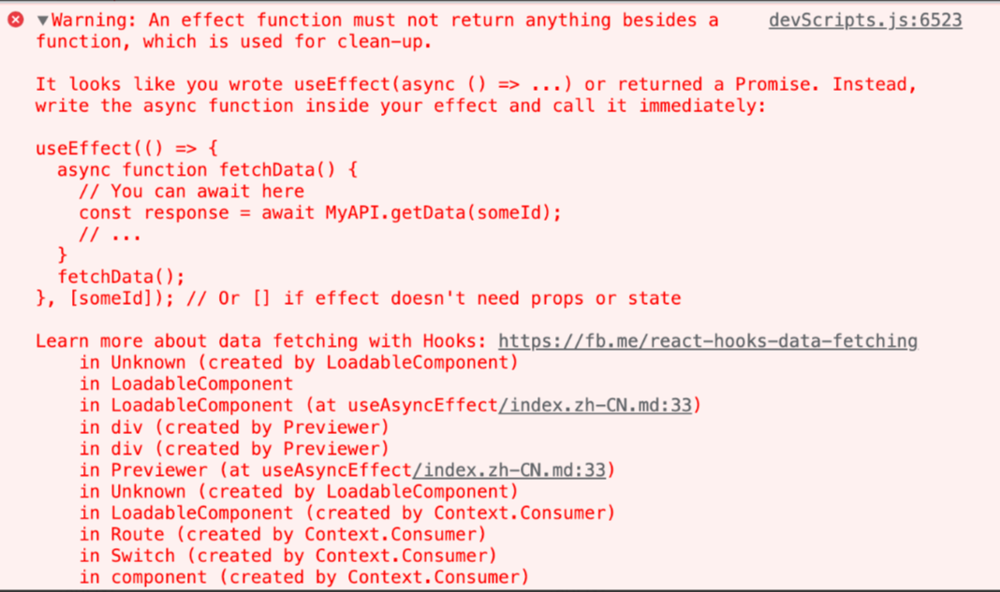

看报错，我们知道 effect function 应该返回一个销毁函数（return返回的 cleanup 函数），如果 useEffect 第一个参数传入 async，返回值则变成了 Promise，会导致 react 在调用销毁函数的时候报错**。

##### React 为什么要这么做？

useEffect 作为 Hooks 中一个很重要的 Hooks，可以让你在函数组件中执行副作用操作。

它能够完成之前 Class Component 中的生命周期的职责。它返回的函数的执行时机如下：

* 首次渲染不会进行清理，会在下一次渲染，清除上一次的副作用。
* 卸载阶段也会执行清除操作。

不管是哪个，我们都不希望这个返回值是异步的，这样我们无法预知代码的执行情况，很容易出现难以定位的 Bug。

所以 React 就直接限制了不能 useEffect 回调函数中不能支持 async...await...

##### useEffect 怎么支持 async...await...

竟然 useEffect 的回调函数不能使用 async...await，那我直接在它内部使用。

做法一：创建一个异步函数（async...await 的方式），然后执行该函数。

```javascript
useEffect(() => {
  const asyncFun = async () => {
    setPass(await mockCheck());
  };
  asyncFun();
}, []);

```

法二：也可以使用 IIFE，如下所示：

```javascript
useEffect(() => {
  (async () => {
    setPass(await mockCheck());
  })();
}, []);

```

##### 自定义 hooks

既然知道了怎么解决，我们完全可以将其封装成一个 hook，让使用更加的优雅。我们来看下 ahooks 的 useAsyncEffect，它支持所有的异步写法，包括 generator function。

思路跟上面一样，入参跟 useEffect 一样，一个回调函数（不过这个回调函数支持异步），另外一个依赖项 deps。内部还是 useEffect，将异步的逻辑放入到它的回调函数里面。

```javascript
function useAsyncEffect(
  effect: () => AsyncGenerator<void, void, void> | Promise<void>,
  // 依赖项
  deps?: DependencyList,
) {
  // 判断是 AsyncGenerator
  function isAsyncGenerator(
    val: AsyncGenerator<void, void, void> | Promise<void>,
  ): val is AsyncGenerator<void, void, void> {
    // Symbol.asyncIterator: https://developer.mozilla.org/zh-CN/docs/Web/JavaScript/Reference/Global_Objects/Symbol/asyncIterator
    // Symbol.asyncIterator 符号指定了一个对象的默认异步迭代器。如果一个对象设置了这个属性，它就是异步可迭代对象，可用于for await...of循环。
    return isFunction(val[Symbol.asyncIterator]);
  }
  useEffect(() => {
    const e = effect();
    // 这个标识可以通过 yield 语句可以增加一些检查点
    // 如果发现当前 effect 已经被清理，会停止继续往下执行。
    let cancelled = false;
    // 执行函数
    async function execute() {
      // 如果是 Generator 异步函数，则通过 next() 的方式全部执行
      if (isAsyncGenerator(e)) {
        while (true) {
          const result = await e.next();
          // Generate function 全部执行完成
          // 或者当前的 effect 已经被清理
          if (result.done || cancelled) {
            break;
          }
        }
      } else {
        await e;
      }
    }
    execute();
    return () => {
      // 当前 effect 已经被清理
      cancelled = true;
    };
  }, deps);
}

```

async...await 我们之前已经提到了，重点看看实现中变量 cancelled 的实现的功能。 它的作用是中断执行。

> 通过 yield 语句可以增加一些检查点，如果发现当前 effect 已经被清理，会停止继续往下执行。

试想一下，有一个场景，用户频繁的操作，可能现在这一轮操作 a 执行还没完成，就已经开始开始下一轮操作 b。这个时候，操作 a 的逻辑已经失去了作用了，那么我们就可以停止往后执行，直接进入下一轮操作 b 的逻辑执行。这个 cancelled 就是用来取消当前正在执行的一个标识符。

##### 还可以支持 useEffect 的清除机制么？

可以看到上面的 useAsyncEffect，内部的 useEffect 返回函数只返回了如下：

```javascript
return () => {
  // 当前 effect 已经被清理
  cancelled = true;
};

```

这说明，你通过 useAsyncEffect 没有 useEffect 返回函数中执行清除副作用的功能。

你可能会觉得，我们将 effect(useAsyncEffect 的回调函数)的结果，放入到 useAsyncEffect 中不就可以了？

实现最终类似如下：

```javascript
function useAsyncEffect(effect: () => Promise<void | (() => void)>, dependencies?: any[]) {
  return useEffect(() => {
    const cleanupPromise = effect()
    return () => { cleanupPromise.then(cleanup => cleanup && cleanup()) }
  }, dependencies)
}

```

这种做法在github上也有讨论，上面有个大神的说法我表示很赞同：

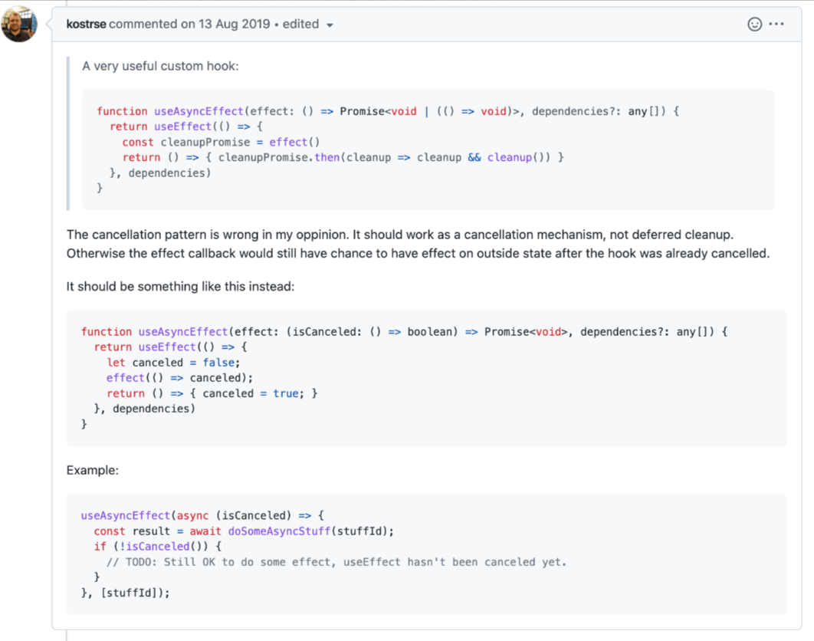

他认为这种延迟清除机制是不对的，应该是一种取消机制。否则，在钩子已经被取消之后，回调函数仍然有机会对外部状态产生影响。他的实现和例子我也贴一下，跟 useAsyncEffect 其实思路是一样的，如下：

实现：

```javascript
function useAsyncEffect(effect: (isCanceled: () => boolean) => Promise<void>, dependencies?: any[]) {
  return useEffect(() => {
    let canceled = false;
    effect(() => canceled);
    return () => { canceled = true; }
  }, dependencies)
}

```

Demo:

```javascript
useAsyncEffect(async (isCanceled) => {
  const result = await doSomeAsyncStuff(stuffId);
  if (!isCanceled()) {
    // TODO: Still OK to do some effect, useEffect hasn't been canceled yet.
  }
}, [stuffId]);

```

其实归根结底，我们的清除机制不应该依赖于异步函数，否则很容易出现难以定位的 bug。

##### 总结与思考

由于 useEffect 是在函数式组件中承担执行副作用操作的职责，它的返回值的执行操作应该是可以预期的，而不能是一个异步函数，所以不支持回调函数 async...await 的写法。

我们可以将 async...await 的逻辑封装在 useEffect 回调函数的内部，这就是 ahooks useAsyncEffect 的实现思路，而且它的范围更加广，它支持的是所有的异步函数，包括 generator function。

#### 我们应该在什么场景下使用 useMemo 和 useCallback ？（必背）

##### 前言

useMemo 和 useCallback 是 React 的内置 Hook，通常作为优化性能的手段被使用。他们可以用来缓存函数、组件、变量，以避免两次渲染间的重复计算。但是实践过程中，他们经常被过度使用：担心性能的开发者给每个组件、函数、变量、计算过程都套上了 memo，以至于它们在代码里好像失控了一样，无处不在。

本文希望通过分析 useMemo/useCallback 的目的、方式、成本，以及具体使用场景，帮助开发者正确的决定如何适时的使用他们。赶时间的读者可以直接拉到底部看结论。

我们先从 useMemo/useCallback 的目的说起。

为什么使用 useMemo 和 useCallback

使用 memo 通常有三个原因：

1. 防止不必要的 effect。
2. 防止不必要的 re-render。
3. 防止不必要的重复计算。

后两种优化往往被误用，导致出现大量的无效优化或冗余优化。下面详细介绍这三个优化方式。

防止不必要的 effect

如果一个值被 useEffect 依赖，那它可能需要被缓存，这样可以避免重复执行 effect。

```javascript
const Component = () => {
  // 在 re-renders 之间缓存 a 的引用
  const a = useMemo(() => ({ test: 1 }), []);

  useEffect(() => {
    // 只有当 a 的值变化时，这里才会被触发
    doSomething();
  }, [a]);

  // the rest of the code
};

```

useCallback 同理：

```javascript
const Component = () => {
  // 在 re-renders 之间缓存 fetch 函数
  const fetch = useCallback(() => {
    console.log('fetch some data here');
  }, []);

  useEffect(() => {
    // 仅fetch函数的值被改变时，这里才会被触发
    fetch();
  }, [fetch]);

  // the rest of the code

};

```

当变量直接或者通过依赖链成为 useEffect 的依赖项时，那它可能需要被缓存。这是 useMemo 和 useCallback 最基本的用法。

防止不必要的 re-render

进入重点环节了🔔。正确的阻止 re-render 需要我们明确三个问题：

1. 组件什么时候会 re-render。
2. 如何防止子组件 re-render。
3. 如何判断子组件需要缓存。
4. 组件什么时候会 re-render

三种情况：

1. 当本身的 props 或 state 改变时。
2. Context value 改变时，使用该值的组件会 re-render。
3. 当父组件重新渲染时，它所有的子组件都会 re-render，形成一条 re-render 链。

第三个 re-render 时机经常被开发者忽视，导致代码中存在大量的无效缓存。

例如：

```javascript
const App = () => {
  const [state, setState] = useState(1);

  const onClick = useCallback(() => {
    console.log('Do something on click');
  }, []);

  return (
        // 无论 onClick 是否被缓存，Page 都会 re-render
    <Page onClick={onClick} />
  );
};

```

当使用 setState 改变 state 时，App 会 re-render，作为子组件的 Page 也会跟着 re-render。这里 useCallback 是完全无效的，它并不能阻止 Page 的 re-render。

1. 如何防止子组件 re-render

必须同时缓存 onClick 和组件本身，才能实现 Page 不触发 re-render。

```javascript
const PageMemoized = React.memo(Page);

const App = () => {
  const [state, setState] = useState(1);

  const onClick = useCallback(() => {
    console.log('Do something on click');
  }, []);

  return (
    // Page 和 onClick 同时 memorize
    <PageMemoized onClick={onClick} />
  );
};

```

由于使用了React.memo，PageMemoized 会浅比较 props 的变化后再决定是否 re-render。onClick 被缓存后不会再变化，所以 PageMemoized 不再 re-render。

然而，如果 PageMemoized 再添加一个未被缓存的 props，一切就前功尽弃 🤯 ：

```javascript
const PageMemoized = React.memo(Page);

const App = () => {
  const [state, setState] = useState(1);

  const onClick = useCallback(() => {
    console.log('Do something on click');
  }, []);

  return (
    // page WILL re-render because value is not memoized
    <PageMemoized onClick={onClick} value={[1, 2, 3]} />
  );
};

```

由于 value 会随着 App 的 re-render 重新定义，引用值发生变化，导致 PageMemoized 仍然会触发 re-render。

现在可以得出结论了，必须同时满足以下两个条件，子组件才不会 re-render：

* 子组件自身被缓存。
* 子组件所有的 prop 都被缓存。
* 如何判断子组件需要缓存

我们已经了解，为了防止子组件 re-render，需要以下成本：

* 开发者工作量的增加： 一旦使用缓存，就必须保证组件本身以及所有 props 都缓存，后续添加的所有 props 都要缓存。
* 代码复杂度和可读性的变化：代码中出现大量缓存函数，这会增加代码复杂度，并降低易读性。

除此之外还有另外一个成本：性能成本。 组件的缓存是在初始化时进行，虽然每个组件缓存的性能耗费很低，通常不足1ms，但大型程序里成百上千的组件如果同时初始化缓存，成本可能会变得很可观。

所以局部使用 memo，比全局使用显的更优雅、性能更好，坏处是需要开发者主动去判断是否需要缓存该子组件。

##### 那应该什么时候缓存组件，怎么判断一个组件的渲染是昂贵的？

很遗憾，似乎没有一个简单&无侵入&自动的衡量方式。通常来说有两个方式：

1. 人肉判断，开发或者测试人员在研发过程中感知到渲染性能问题，并进行判断。
2. 通过工具，目前有一些工具协助开发者在查看组件性能:

* 如 React Dev Tools Profiler，这篇文章介绍了使用方式
* 如这个 hooks：useRenderTimes

另外，React 在 16.5版本后提供了 Profiler API：它可以识别出应用中渲染较慢的部分，或是可以使用类似 memoization 优化的部分。所以可以通过 puppeteer 或 cypress 在自动化集成中测试组件性能，这很适合核心组件的性能测试。

##### 防止不必要的重复计算

如 React 文档所说，useMemo 的基本作用是，避免在每次渲染时都进行高开销的计算。

那什么是“高开销的计算”？

高开销的计算其实极少出现，如下示例，对包含 250 个 item 的数组 countries 进行排序、渲染，并计算耗时。

```javascript
const List = ({ countries }) => {
  const before = performance.now();
  const sortedCountries = orderBy(countries, 'name', sort);
  // this is the number we're after
  const after = performance.now() - before;

  return (
    // same
  )
};

```

大部分情况下，我们的计算量要比这个 250 个 item 的数组少，而组件渲染要比这个 List 组件复杂的多，所以真实程序中，计算和渲染的性能差距会更大。

可见，组件渲染才是性能的瓶颈，应该把 useMemo 用在程序里渲染昂贵的组件上，而不是数值计算上。当然，除非这个计算真的很昂贵，比如阶乘计算。

至于为什么不给所有的组件都使用 useMemo，上文已经解释了。useMemo 是有成本的，它会增加整体程序初始化的耗时，并不适合全局全面使用，它更适合做局部的优化。

##### 为什么 React 没有把缓存组件作为默认配置？

简而言之：

1. 缓存是有成本的，小的成本可能会累加过高。
2. 默认缓存无法保证足够的正确性。

原因 2 的原文：correctness is not guaranteed for everything because people can mutate things. Christopher Chedeau 未给出进一步解释。或许他是指可能会导致跟 purecomponent相同的问题，即浅比较 mutate things 时，由于浅比较相等，导致组件未能 update 的问题。

##### 结论

1. 讲到这里我们可以总结出 useMemo/useCallback 使用准则了：

大部分的 useMemo 和 useCallback 都应该移除，他们可能没有带来任何性能上的优化，反而增加了程序首次渲染的负担，并增加程序的复杂性。

2. 使用 useMemo 和 useCallback 优化子组件 re-render 时，必须同时满足以下条件才有效。

* 子组件已通过 React.memo 或 useMemo 被缓存
* 子组件所有的 prop 都被缓存

3. 不推荐默认给所有组件都使用缓存，大量组件初始化时被缓存，可能导致过多的内存消耗，并影响程序初始化渲染的速度。

#### 说说你对 React Hook的闭包陷阱的理解，有哪些解决方案？

本文从 一个hooks中 “奇怪”（其实符合逻辑） 的 “闭包陷阱” 的场景切入，试图讲清楚其背后的因果。同时，在许多 react hooks 奇技淫巧的文章里，也能看到 useRef 的身影，那么为什么使用 useRef 又能摆脱 这个 “闭包陷阱” ？ 搞清楚这些问题，将能较大的提升对 react hooks 的理解。

react hooks 一出现便受到了许多开发人员的追捧,或许在使用react hooks 的时候遇到 “闭包陷阱” 是每个开发人员在开发的时候都遇到过的事情，有的两眼懵逼、有的则稳如老狗瞬间就定义到了问题出现在何处。

(以下react示范demo，均为react 16.8.3 版本)

你一定遭遇过以下这个场景：

```javascript
function App(){
    const [count, setCount] = useState(1);
    useEffect(()=>{
        setInterval(()=>{
            console.log(count)
        }, 1000)
    }, [])
}

```

在这个定时器里面去打印 count 的值，会发现，不管在这个组件中的其他地方使用 setCount 将 count 设置为任何值，还是设置多少次，打印的都是1。是不是有一种，尽管历经千帆，我记得的还是你当初的模样的感觉？ hhh... 接下来，我将尽力的尝试将我理解的，为什么会发生这么个情况说清楚，并且浅谈一些hooks其他的特性。如果有错误，希望各位同学能救救孩子，不要让我带着错误的认知活下去了。。。

#### React 中，怎么实现父组件调用子组件中的方法？

##### 在子组件中，创建一个公开的方法。这可以通过在子组件类中定义一个方法或者使用 React Hooks 中的 useImperativeHandle 来实现。

* 如果是类组件，可以在子组件类中定义一个方法，并将其挂载到实例上。例如：

```javascript
class ChildComponent extends React.Component {
  childMethod() {
    // 子组件中需要执行的操作
  }

  render() {
    // 子组件的渲染逻辑
  }
}

```

* 如果是函数式组件，可以使用 useImperativeHandle Hook 将指定的方法暴露给父组件。例如：

```javascript
import { forwardRef, useImperativeHandle } from 'react';

function ChildComponent(props, ref) {
  useImperativeHandle(ref, () => ({
    childMethod() {
      // 子组件中需要执行的操作
    }
  }));

  // 子组件的渲染逻辑
}

export default forwardRef(ChildComponent);

```

##### 在父组件中，首先引用或创建对子组件的引用。可以使用 ref 对象来保存对子组件的引用。

* 如果是类组件，可以使用 createRef 创建一个 ref 对象，并将其传递给子组件的 ref prop。例如：

```javascript
class ParentComponent extends React.Component {
  constructor(props) {
    super(props);
    this.childRef = React.createRef();
  }

  handleClick() {
    // 调用子组件的方法
    this.childRef.current.childMethod();
  }

  render() {
    return (
      <div>
        <ChildComponent ref={this.childRef} />
        <button onClick={() => this.handleClick()}>调用子组件方法</button>
      </div>
    );
  }
}

```

* 如果是函数式组件，可以使用 useRef 创建一个 ref 对象，并将其传递给子组件的 ref prop。例如：

```javascript
function ParentComponent() {
  const childRef = useRef(null);

  const handleClick = () => {
    // 调用子组件的方法
    childRef.current.childMethod();
  };

  return (
    <div>
      <ChildComponent ref={childRef} />
      <button onClick={handleClick}>调用子组件方法</button>
    </div>
  );
}

```

通过以上步骤，父组件就能够成功调用子组件中暴露的方法了。请注意，在函数式组件中，需要使用 forwardRef 来包裹子组件，并通过 ref 参数来定义暴露的方法。

#### 你常用的 React Hooks 有哪些？

React 提供了一系列的 Hooks，用于在函数组件中添加和管理状态、副作用等功能。

以下是一些常用的 React Hooks：

* useState：用于在函数组件中添加状态管理。
* useEffect：用于处理副作用操作（如数据获取、订阅、事件监听等）。
* useContext：用于在组件树中获取和使用共享的上下文。
* useReducer：用于管理复杂状态逻辑的替代方案，类似于 Redux 的 reducer。
* useCallback：用于缓存回调函数，以便在依赖未变化时避免重复创建新的函数实例。
* useMemo：用于缓存计算结果，以便在依赖未变化时避免重复计算。
* useRef：用于在函数组件之间保存可变的值，并且不会引发重新渲染。
* useLayoutEffect：与 useEffect 类似，但在浏览器完成绘制之前同步执行。
* useImperativeHandle：用于自定义暴露给父组件的实例值或方法。
* useDebugValue：用于在开发者工具中显示自定义的钩子相关标签。

#### 说说你对 useReducer 的理解

useReducer 是 React Hooks 中的一个函数，用于管理和更新组件的状态。它可以被视为 useState 的一种替代方案，适用于处理更复杂的状态逻辑。

使用 useReducer，我们首先需要定义一个 reducer 函数，该函数接收当前状态（state）和动作（action）作为参数，并返回新的状态。在组件中，可以通过调用 useReducer 来创建一个状态值以及与之配套的派发（dispatch）方法。

下面是一个简单的示例：

```javascript
import { useReducer } from 'react';

const initialState = {
  count: 0,
};

const reducer = (state, action) => {
  switch (action.type) {
    case 'increment':
      return { count: state.count + 1 };
    case 'decrement':
      return { count: state.count - 1 };
    default:
      throw new Error('Unsupported action type');
  }
};

function Counter() {
  const [state, dispatch] = useReducer(reducer, initialState);

  const increment = () => {
    dispatch({ type: 'increment' });
  };

  const decrement = () => {
    dispatch({ type: 'decrement' });
  };

  return (
    <div>
      <p>Count: {state.count}</p>
      <button onClick={increment}>Increment</button>
      <button onClick={decrement}>Decrement</button>
    </div>
  );
}

```

上面的代码定义了一个初始状态对象 initialState 和一个 reducer 函数 reducer。reducer 接收当前状态和动作类型，然后根据动作类型返回新的状态对象。

组件中使用 useReducer 创建了一个名为 state 的状态值和一个 dispatch 方法。通过调用 dispatch 方法，我们可以向 reducer 发送一个动作，从而触发状态的更新。在示例中，点击 "Increment" 或 "Decrement" 按钮会分别派发 increment 和 decrement 动作。

最后，组件渲染时会展示当前计数器的值以及两个按钮，用于增加或减少计数器的值。

相比于 useState，useReducer 在处理复杂状态逻辑时更有优势，因为它允许我们将状态更新的逻辑封装在 reducer 函数中，并根据不同的动作类型执行相应的逻辑。这样可以使代码更具可读性和可维护性，并且更容易进行状态追踪和调试。

#### useMemo 和 useCallback 有什么区别？（必背）

在 React 中，useMemo 和 useCallback 都是用来优化性能的钩子函数，但它们的用途和作用稍有不同。

1. useMemo: useMemo 的主要作用是在组件重新渲染时，用来缓存计算结果，以避免不必要的重复计算。它接收两个参数：一个回调函数和一个依赖数组。回调函数用于进行计算，而依赖数组用于指定在数组中列出的依赖项发生变化时，才重新计算并返回新的值，否则会返回上一次缓存的值。

```javascript
const memoizedValue = useMemo(() => {
  // 进行耗时的计算
  return someValue;
}, [dependency1, dependency2]);

```

在上面的示例中，只有当 dependency1 或者 dependency2 发生变化时，useMemo 才会重新计算并返回新的值，否则会复用之前的值。

2. useCallback: useCallback 的作用是在组件重新渲染时，返回一个记忆化的回调函数，以避免不必要的函数重新创建。它也接收两个参数：一个回调函数和一个依赖数组。当依赖项发生变化时，会返回一个新的回调函数，否则会复用之前的回调函数。

```javascript
const memoizedCallback = useCallback(() => {
  // 处理事件的回调函数
}, [dependency1, dependency2]);

```

在这个示例中，只有当 dependency1 或者 dependency2 发生变化时，useCallback 才会返回一个新的回调函数，否则会返回之前的回调函数。

总结区别：

* useMemo 主要用于缓存计算结果，适用于任何需要缓存值的场景。
* useCallback 主要用于缓存回调函数，适用于需要传递给子组件的事件处理函数，以避免不必要的重新渲染。

另外，在大多数情况下，你不必在每个函数组件中都使用 useMemo 或 useCallback。

只有当你在性能测试中发现了性能问题，或者在特定情况下需要优化函数的创建和计算时，再考虑使用这些钩子。

#### useRef / ref / forwardsRef 的区别是什么?

useRef 和 ref 都是 React 中用于操作 DOM 元素或自定义组件实例的工具，而 forwardRef 则是用于访问嵌套子组件中的 DOM 元素或自定义组件实例。

它们之间的区别如下：

* useRef 是一个 hook 函数，可以在函数组件中使用；ref 是一个对象属性，只能在类组件中使用。
* useRef 返回一个可变的 ref 对象，可以在组件的整个生命周期内保持不变，也就是说不会因为重新渲染而改变。而 ref 每次渲染都会被重新创建。
* useRef 主要用于存储和更新组件内部状态，以及操作 DOM 元素。而 ref 主要用于获取 DOM 元素或自定义组件实例。
* forwardRef 是用于将 ref 属性“向下传递”给一个函数式子组件或自定义组件的工具函数。它允许父组件调用子组件中的 DOM 元素或自定义组件实例。

综上所述，useRef 和 ref 都是用于操作 DOM 元素或自定义组件实例的工具，与之相比，forwardRef 则是一个更高级的工具，用于处理专门的情况，即访问嵌套子组件中的 DOM 元素或自定义组件实例。

#### useEffect 的第二个参数, 传空数组和传依赖数组有什么区别（必背）

在 React 中，useEffect 是一个常用的 Hook，它用于处理组件生命周期中的副作用。

useEffect 接收两个参数，第一个是要执行的函数，第二个是依赖数组（可选）。

当传递空数组 \[] 时，useEffect 只会在组件挂载和卸载时调用一次。这种情况下，useEffect 不会监听任何变量，并且不会对组件进行重新渲染。

```javascript
useEffect(() => {
  // 只在挂载和卸载时执行
}, []);

```

当传递依赖数组时，useEffect 会在组件挂载和依赖项更新时调用。当依赖项中的任何一个值发生变化时，useEffect 都将被重新调用。如果依赖数组为空，则每次组件重新渲染时都会调用 useEffect。

```javascript
useEffect(() => {
  // 在挂载、依赖列表变化及卸载时执行
}, [dep1, dep2]);

```

下面是这两种情况的总结：

* 当传递空数组 \[] 时，useEffect 只会在组件挂载和卸载时调用一次，不会对组件进行重新渲染。
* 当传递依赖数组时，useEffect 会在组件挂载和依赖项更新时调用，每次更新时都会检查依赖项列表是否有变化，如果有变化则重新执行。

如果 useEffect 中使用了闭包函数，则应该确保所有引用的变量都在依赖项中被显示声明，否则可能会导致不必要的重新渲染或者无法获取最新的状态。

#### 使用 useState （const \[test, setTest] = useState(\[])）时，为什么连续调用 setTest({...test, newValue}) 会出现值的丢失？

useState是异步执行的，也就是执行 setTest 后，不会立即更新 test 的结果，多次调用时，出现了值覆盖的情况。

如果本次的状态更新依赖于上一次最近的状态更新，那么我们可以给 setTest 传递一个函数进去，函数的参数即为最后一次更新的状态的值：

```javascript
setTest(prevState => ([
        ...prevState,
    newValue
]))

```

#### 如果在 useEffect 的第一个参数中 return 了一个函数，那么第二个参数分别传空数组和传依赖数组，该函数分别是在什么时候执行？（必背）

在 React 中，当 useEffect 第一个参数中返回一个函数时，这个函数会在组件卸载时执行。当传递空数组 \[] 时，useEffect 只会在组件挂载和卸载时调用一次，因此返回的函数也只会在组件卸载时执行一次。

```javascript
useEffect(() => {
  // 在挂载时执行

  return () => {
    // 在卸载时执行
  }
}, []);

```

当传递依赖数组时，useEffect 会在组件挂载和依赖项更新时调用，因此返回的函数也会随着组件更新而执行。每次组件重新渲染时都会检查依赖项列表是否有变化，如果有变化则重新执行 useEffect，并在执行新的 useEffect 前先执行上一个 useEffect 返回的函数（如果存在）。

```javascript
useEffect(() => {
  // 在挂载、依赖列表变化及卸载时执行

  return () => {
    // 在下一次 useEffect 执行前执行
  }
}, [dep1, dep2]);

```

需要注意，这个函数的作用通常是清除 effect 留下的副作用，例如取消定时器、取消订阅等等。在函数中应该清理掉之前设置的任何 effect，在组件卸载时避免不必要的内存泄漏和资源浪费。

#### 实现 useUpdate 方法，调用时强制组件重新渲染

可以利用 useReducer 每次调用 updateReducer 方法，来达到强制组件重新渲染的目的。

```javascript
import { useReducer } from 'react';

const updateReducer = (num: number): number => (num + 1) % 1_000_000;

export default function useUpdate(): () => void {
  const [, update] = useReducer(updateReducer, 0);

  return update;
}

```

#### 实现一个 useTimeout Hook

useTimeout 是可以在函数式组件中，处理 setTimeout 计时器函数

##### 解决了什么问题？

如果直接在函数式组件中使用 setTimeout ，会遇到以下问题：

###### 多次调用setTimeout

```javascript
function App() {
    const [state, setState] = useState(1);
    setTimeout(() => {
        setState(state + 1);
    }, 3000);
    return (
        // 我们原本的目的是在页面渲染完3s后修改一下state，但是你会发现当state+1后，触发了页面的重新渲染，就会重新有一个3s的定时器出现来给state+1，既而变成了每3秒+1。
        <div> {state} </div>
    );
  };

```

###### hooks 的闭包缺陷

```javascript
function App() {
  const [count, setCount] = useState(0)
  const [countTimeout, setCountTimeout] = useState(0)
  useEffect(() => {
      setTimeout(() => {
          setCountTimeout(count)
      }, 3000)
      setCount(5)
  }, [])
  return (
       //count发生了变化，但是3s后setTimout的count却还是0
      <div>
          Count: {count}

          setTimeout Count: {countTimeout}
      </div>
  )
}

```

###### useTimeout 实现

```javascript
function useTimeout(callback, delay) {
  const memorizeCallback = useRef();

  useEffect(() => {
    memorizeCallback.current = callback;
  }, [callback]);

  useEffect(() => {
    if (delay !== null) {
      const timer = setTimeout(() => {
        memorizeCallback.current();
      }, delay);
      return () => {
        clearTimeout(timer);
      };
    }
  }, [delay]);
};

```

如何使用

```javascript
  // callback 回调函数， delay 延迟时间
  useTimeout(callback, delay);

```

### 原理与架构

#### React 中为什么不直接使用 requestIdleCallback？

在React中，使用requestIdleCallback直接可能会导致一些问题，因此React并没有直接采用这个API。requestIdleCallback是一个浏览器提供的API，用于在浏览器空闲时执行任务，但在React中，有一些特殊考虑：

1. 一致性问题： requestIdleCallback的执行时机不是完全可控的，这可能导致在不同环境中表现不一致。React希望提供一致的行为，以确保开发者在不同浏览器和设备上获得可预测的性能表现。
2. 实时性问题： React通常希望能够响应用户输入并立即更新UI，而requestIdleCallback执行的时机不一定能够满足实时性的需求。这可能导致用户体验上的问题，特别是在需要快速响应的场景中。
3. 调度器控制： React内部有一个任务调度器，负责管理和调度任务的执行。直接使用requestIdleCallback可能破坏React的任务调度策略，导致不可预测的结果。

为了解决这些问题，React引入了Scheduler模块，该模块允许React更好地控制任务的调度和执行。React可以根据自身的需要在不同优先级下安排任务，并确保在保证实时性的同时，提供一致的性能表现。

虽然requestIdleCallback是一个有趣的浏览器API，但在React这样的复杂UI库中，需要更高度的控制和一致性，因此React选择了自己实现任务调度和执行的机制。

#### 为什么 react 需要 fiber 架构，而 Vue 却不需要？（必背）

React引入Fiber架构的主要原因是为了实现更好的异步渲染和更高效的任务调度。Fiber架构使得React能够更细粒度地控制和中断渲染过程，以便更好地响应用户交互、实现懒加载等功能。Vue在设计上采用了不同的策略，因此并不需要类似于Fiber的架构。

以下是一些原因解释为什么React选择了Fiber架构，而Vue没有类似的架构：

1. 异步渲染和任务优先级： React的Fiber架构使得实现异步渲染和任务优先级变得更加容易。这对于复杂的用户界面和大规模应用中的性能优化非常重要。React可以通过中断和恢复渲染过程，根据任务的优先级调度渲染工作，从而更好地响应用户输入和满足实时性要求。
2. 更好的中断和恢复机制： Fiber架构提供了一种更灵活的中断和恢复机制，允许React在渲染过程中暂停、中断，然后根据优先级恢复。这使得React能够更好地处理复杂的渲染逻辑，并在需要时放弃低优先级的工作。
3. 增量更新： Fiber允许React实现增量更新，即只更新变化的部分而不必重新渲染整个组件树。这对于提高渲染性能和减少不必要的工作非常有帮助。

Vue在设计上采用了一种不同的响应式系统和渲染机制，不需要像React那样进行复杂的中断和任务调度。Vue的设计目标可能更注重简洁性和开发体验，而React的目标之一是提供更灵活和强大的性能优化工具。每个框架在设计上都有权衡和取舍，选择适合其目标和使用场景的策略。

#### Fiber 架构的核心概念（必背）

1. **Fiber 是什么？**

***数据结构**：Fiber 是一个 JavaScript 对象，代表一个工作单元。每个 React 组件对应一个 Fiber 节点，它包含了组件的类型、props、state、子节点、兄弟节点等指针信息，形成一个**链表树结构**，而非传统的递归树。这使得遍历过程可以暂停和恢复。
***调度单位**：Fiber 是 React 调度的最小任务单元。React 可以按优先级处理这些单元，高优先级任务（如用户输入）可以中断低优先级任务（如数据渲染）。

2. **核心特性**

***增量渲染**：将整个渲染过程分割成多个小任务（时间分片），在浏览器的多个空闲帧中分批完成，避免长时间占用主线程。
***优先级调度**：为不同的更新任务分配优先级（如 Immediate, User-blocking, Normal, Low, Idle），确保用户交互等关键任务能立即响应。
***可中断与恢复**：渲染过程可以被更高优先级的任务中断，待高优先级任务完成后，再从中断处恢复执行。
***双缓冲机制**：React 在内存中同时维护两棵 Fiber 树。当前显示在屏幕上的称为 **Current Tree**，正在后台构建的称为 **WorkInProgress Tree**。更新完成后，WorkInProgress Tree 会一次性切换为新的 Current Tree，此过程称为“提交”。这能有效减少视觉上的不一致。

##### Fiber 的工作流程

Fiber 的更新过程主要分为两个阶段：

1. **协调阶段**：此阶段是**可中断**的。

***目标**：通过 Diff 算法找出需要更新的组件，并标记变更（如 Placement-插入, Update-更新, Deletion-删除）。
***过程**：React 会遍历 Fiber 树，创建或更新 Fiber 节点，构建出完整的 WorkInProgress Tree。此阶段可能会因为更高优先级任务的到来而暂停。

2. **提交阶段**：此阶段是**同步且不可中断**的。

***目标**：将协调阶段计算出的所有变更一次性应用到真实 DOM 上。
***过程**：React 会执行所有标记的副作用（Side Effects），包括 DOM 的增删改以及生命周期函数（如 `componentDidUpdate`）的调用。

##### 总结与影响

Fiber 架构是 React 演进中的一次根本性变革。它通过引入**可中断的异步渲染**和**优先级调度**，极大地提升了复杂应用的流畅度和用户体验。这项底层革新也为 React 18 的**并发特性**（如 `useTransition`、`Suspense`）奠定了坚实的基础。

#### 说说React render方法的原理？在什么时候会被触发？

##### 一、原理

首先，render函数在react中有两种形式：

在类组件中，指的是render方法：

```javascript
class Foo extends React.Component {
    render() {
        return <h1> Foo </h1>;
    }
}

```

在函数组件中，指的是函数组件本身：

```javascript
function Foo() {
    return <h1> Foo </h1>;
}

```

在render中，我们会编写jsx，jsx通过babel编译后就会转化成我们熟悉的js格式，如下：

```javascript
return (
  <div className='cn'>
    <Header> hello </Header>
    <div> start </div>
    Right Reserve
  </div>
)

```

babel编译后：

```javascript
return (
  React.createElement(
    'div',
    {
      className : 'cn'
    },
    React.createElement(
      Header,
      null,
      'hello'
    ),
    React.createElement(
      'div',
      null,
      'start'
    ),
    'Right Reserve'
  )
)

```

从名字上来看，createElement方法用来创建元素的。

在react中，这个元素就是虚拟DOM树的节点，接收三个参数：

* type：标签
* attributes：标签属性，若无则为null
* children：标签的子节点

这些虚拟DOM树最终会渲染成真实DOM

在render过程中，React 将新调用的 render 函数返回的树与旧版本的树进行比较，这一步是决定如何更新 DOM 的必要步骤，然后进行 diff 比较，更新 DOM 树

##### 二、触发时机

render的执行时机主要分成了两部分：

* 类组件调用 setState 修改状态

```javascript
class Foo extends React.Component {
  state = { count: 0 };

  increment = () => {
    const { count } = this.state;

    const newCount = count < 10 ? count + 1 : count;

    this.setState({ count: newCount });
  };

  render() {
    const { count } = this.state;
    console.log("Foo render");

    return (
      <div>
        <h1> {count} </h1>
        <button onClick={this.increment}>Increment</button>
      </div>
    );
  }
}

```

点击按钮，则调用setState方法，无论count是否发生变化，控制台都会输出Foo render，这就证明render执行了

* 函数组件通过useState hook修改状态

函数组件通过useState hook修改状态

```javascript
function Foo() {
  const [count, setCount] = useState(0);

  function increment() {
    const newCount = count < 10 ? count + 1 : count;
    setCount(newCount);
  }

  console.log("Foo render");

  return (
    <div>
      <h1> {count} </h1>
      <button onClick={increment}>Increment</button>
    </div>
  );
}

```

函数组件通过useState这种形式更新数据，当数组的值不发生改变了，就不会触发render

* 类组件重新渲染

```javascript
class App extends React.Component {
  state = { name: "App" };
  render() {
    return (
      <div llassName="App">
        <Foo />
        <button onClick={() => this.setState({ name: "App" })}>
          Change name
        </button>
      </div>
    );
  }
}

functionFFoo() {

  cnnsll..log("Foo render";;

  return (
    <div>
      <h1> Foo //h1>
    //div>
  );
}

```

只要点击了 App 组件内的 Change name 按钮，不管 Foo 具体实现是什么，都会被重新render渲染

* 函数组件重新渲染

```javascript
function App(){
    const [name,setName] = useState('App')

    return (
        <div className="App">
            <Foo />
            <button onClick={() => setName("aaa")}>
                { name }
            </button>
      </div>
    )
}

function Foo() {
  console.log("Foo render");

  return (
    <div>
      <h1> Foo </h1>
    </div>
  );
}

```

可以发现，使用useState来更新状态的时候，只有首次会触发Foo render，后面并不会导致Foo render

三、总结

render函数里面可以编写JSX，转化成createElement这种形式，用于生成虚拟DOM，最终转化成真实DOM

在 React 中，类组件只要执行了 setState 方法，就一定会触发 render 函数执行，函数组件使用useState更改状态不一定导致重新render

组件的 props 改变了，不一定触发 render 函数的执行，但是如果 props 的值来自于父组件或者祖先组件的 state

在这种情况下，父组件或者祖先组件的 state 发生了改变，就会导致子组件的重新渲染

所以，一旦执行了setState就会执行render方法，useState 会判断当前值有无发生改变确定是否执行render方法，一旦父组件发生渲染，子组件也会渲染

#### React Fiber 是如何实现更新过程可控？

更新过程的可控主要体现在下面几个方面：

* 任务拆分
* 任务挂起、恢复、终止
* 任务具备优先级

##### 任务拆分

在 React Fiber 机制中，它采用"化整为零"的思想，将调和阶段（Reconciler）递归遍历 VDOM 这个大任务分成若干小任务，每个任务只负责一个节点的处理。

##### 任务挂起、恢复、终止

* workInProgress tree

workInProgress 代表当前正在执行更新的 Fiber 树。在 render 或者 setState 后，会构建一颗 Fiber 树，也就是 workInProgress tree，这棵树在构建每一个节点的时候会收集当前节点的副作用，整棵树构建完成后，会形成一条完整的副作用链。

* currentFiber tree

currentFiber 表示上次渲染构建的 Filber 树。在每一次更新完成后 workInProgress 会赋值给 currentFiber。在新一轮更新时 workInProgress tree 再重新构建，新 workInProgress 的节点通过 alternate 属性和 currentFiber 的节点建立联系。

在新 workInProgress tree 的创建过程中，会同 currentFiber 的对应节点进行 Diff 比较，收集副作用。同时也会复用和 currentFiber 对应的节点对象，减少新创建对象带来的开销。也就是说无论是创建还是更新、挂起、恢复以及终止操作都是发生在 workInProgress tree 创建过程中的。workInProgress tree 构建过程其实就是循环的执行任务和创建下一个任务。

##### 挂起

当第一个小任务完成后，先判断这一帧是否还有空闲时间，没有就挂起下一个任务的执行，记住当前挂起的节点，让出控制权给浏览器执行更高优先级的任务。

##### 恢复

在浏览器渲染完一帧后，判断当前帧是否有剩余时间，如果有就恢复执行之前挂起的任务。如果没有任务需要处理，代表调和阶段完成，可以开始进入渲染阶段。

* 如何判断一帧是否有空闲时间的呢？

使用前面提到的 RIC (RequestIdleCallback) 浏览器原生 API，React 源码中为了兼容低版本的浏览器，对该方法进行了 Polyfill。

* 恢复执行的时候又是如何知道下一个任务是什么呢？

答案是在前面提到的链表。在 React Fiber 中每个任务其实就是在处理一个 FiberNode 对象，然后又生成下一个任务需要处理的 FiberNode。

##### 终止

其实并不是每次更新都会走到提交阶段。当在调和过程中触发了新的更新，在执行下一个任务的时候，判断是否有优先级更高的执行任务，如果有就终止原来将要执行的任务，开始新的 workInProgressFiber 树构建过程，开始新的更新流程。这样可以避免重复更新操作。这也是在 React 16 以后生命周期函数 componentWillMount 有可能会执行多次的原因。

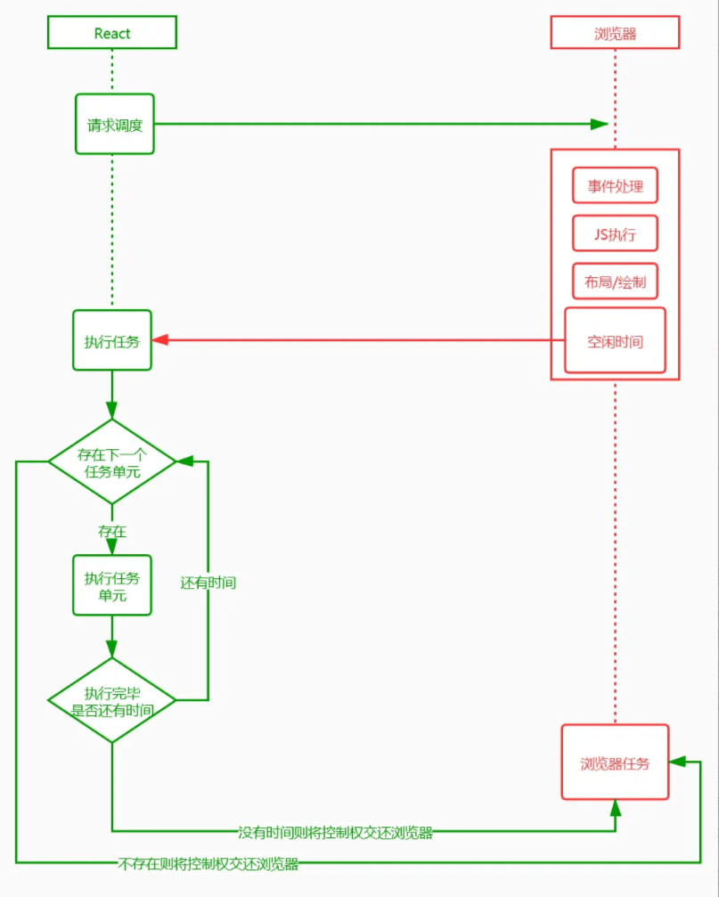

##### 任务具备优先级

React Fiber 除了通过挂起，恢复和终止来控制更新外，还给每个任务分配了优先级。具体点就是在创建或者更新 FiberNode 的时候，通过算法给每个任务分配一个到期时间（expirationTime）。在每个任务执行的时候除了判断剩余时间，如果当前处理节点已经过期，那么无论现在是否有空闲时间都必须执行该任务。过期时间的大小还代表着任务的优先级。

任务在执行过程中顺便收集了每个 FiberNode 的副作用，将有副作用的节点通过 firstEffect、lastEffect、nextEffect 形成一条副作用单链表 A1(TEXT)-B1(TEXT)-C1(TEXT)-C1-C2(TEXT)-C2-B1-B2(TEXT)-B2-A。

其实最终都是为了收集到这条副作用链表，有了它，在接下来的渲染阶段就通过遍历副作用链完成 DOM 更新。这里需要注意，更新真实 DOM 的这个动作是一气呵成的，不能中断，不然会造成视觉上的不连贯（commit）。

#### Fiber 为什么是 React 性能的一个飞跃？

##### 什么是 Fiber

Fiber 的英文含义是“纤维”，它是比线程（Thread）更细的线，比线程（Thread）控制得更精密的执行模型。在广义计算机科学概念中，Fiber 又是一种协作的（Cooperative）编程模型（协程），帮助开发者用一种【既模块化又协作化】的方式来编排代码。

在 React 中，Fiber 就是 React 16 实现的一套新的更新机制，让 React 的更新过程变得可控，避免了之前采用递归需要一气呵成影响性能的做法。

##### React Fiber 中的时间分片

把一个耗时长的任务分成很多小片，每一个小片的运行时间很短，虽然总时间依然很长，但是在每个小片执行完之后，都给其他任务一个执行的机会，这样唯一的线程就不会被独占，其他任务依然有运行的机会。

React Fiber 把更新过程碎片化，每执行完一段更新过程，就把控制权交还给 React 负责任务协调的模块，看看有没有其他紧急任务要做，如果没有就继续去更新，如果有紧急任务，那就去做紧急任务。

##### Stack Reconciler

基于栈的 Reconciler，浏览器引擎会从执行栈的顶端开始执行，执行完毕就弹出当前执行上下文，开始执行下一个函数，直到执行栈被清空才会停止。然后将执行权交还给浏览器。由于 React 将页面视图视作一个个函数执行的结果。每一个页面往往由多个视图组成，这就意味着多个函数的调用。

如果一个页面足够复杂，形成的函数调用栈就会很深。每一次更新，执行栈需要一次性执行完成，中途不能干其他的事儿，只能"一心一意"。结合前面提到的浏览器刷新率，JS 一直执行，浏览器得不到控制权，就不能及时开始下一帧的绘制。如果这个时间超过 16ms，当页面有动画效果需求时，动画因为浏览器不能及时绘制下一帧，这时动画就会出现卡顿。不仅如此，因为事件响应代码是在每一帧开始的时候执行，如果不能及时绘制下一帧，事件响应也会延迟。

##### Fiber Reconciler

链表结构

在 React Fiber 中用链表遍历的方式替代了 React 16 之前的栈递归方案。在 React 16 中使用了大量的链表。

* 使用多向链表的形式替代了原来的树结构；

```javascript
<div id="A">
A1
<div id="B1">
  B1
  <div id="C1"></div>
</div>
<div id="B2">
  B2
</div>
</div>

```

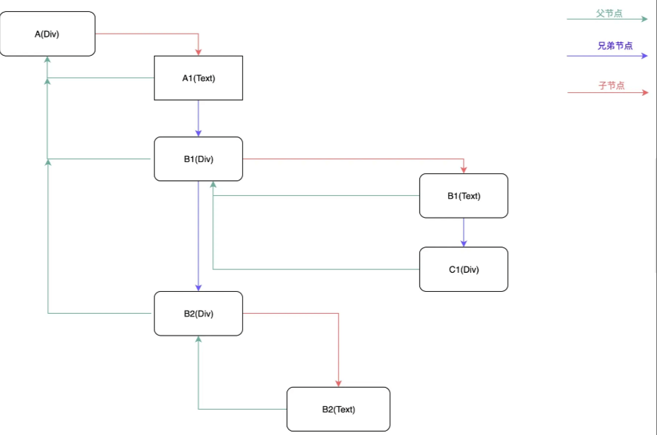

* 副作用单链表；

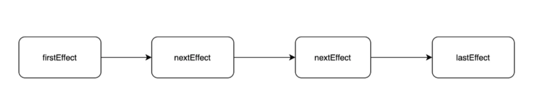

* 状态更新单链表；

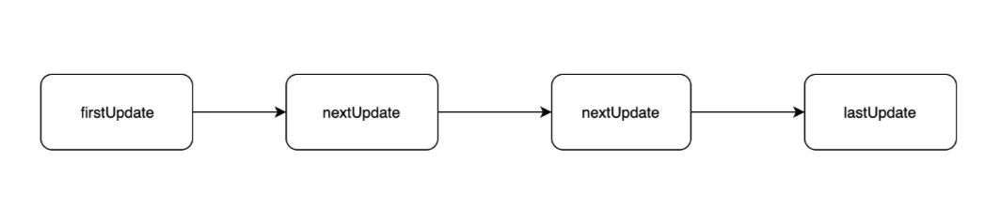

链表是一种简单高效的数据结构，它在当前节点中保存着指向下一个节点的指针；遍历的时候，通过操作指针找到下一个元素。

链表相比顺序结构数据格式的好处就是：

* 操作更高效，比如顺序调整、删除，只需要改变节点的指针指向就好了。
* 不仅可以根据当前节点找到下一个节点，在多向链表中，还可以找到他的父节点或者兄弟节点。

但链表也不是完美的，缺点就是：

* 比顺序结构数据更占用空间，因为每个节点对象还保存有指向下一个对象的指针。
* 不能自由读取，必须找到他的上一个节点。

React 用空间换时间，更高效的操作可以方便根据优先级进行操作。同时可以根据当前节点找到其他节点，在下面提到的挂起和恢复过程中起到了关键作用。

### 生态与工程实践

#### 你在React项目中是如何使用Redux的? 项目结构是如何划分的？（必背）

##### 一、背景

redux是用于数据状态管理，而react是一个视图层面的库

如果将两者连接在一起，可以使用官方推荐react-redux库，其具有高效且灵活的特性

react-redux将组件分成：

* 容器组件：存在逻辑处理
* UI 组件：只负责现显示和交互，内部不处理逻辑，状态由外部控制

通过redux将整个应用状态存储到store中，组件可以派发dispatch行为action给store

其他组件通过订阅store中的状态state来更新自身的视图

##### 二、如何做

使用react-redux分成了两大核心：

* Provider
* connection

###### Provider

在redux中存在一个store用于存储state，如果将这个store存放在顶层元素中，其他组件都被包裹在顶层元素之上

那么所有的组件都能够受到redux的控制，都能够获取到redux中的数据

使用方式如下：

```javascript
<Provider store = {store}>
    <App />
<Provider>

```

###### connection

connect方法将store上的getState 和 dispatch 包装成组件的props

```javascript
import { connect } from "react-redux";

connect(mapStateToProps, mapDispatchToProps)(MyComponent)

```

可以传递两个参数：

* mapStateToProps
* mapDispatchToProps

mapStateToProps

把redux中的数据映射到react中的props中去

```javascript
const mapStateToProps = (state) => {
    return {
        // prop : state.xxx  | 意思是将state中的某个数据映射到props中
        foo: state.bar
    }
}

```

组件内部就能够通过props获取到store中的数据

```javascript
class Foo extends Component {
    constructor(props){
        super(props);
    }
    render(){
        return(
         // 这样子渲染的其实就是state.bar的数据了
            <div>this.props.foo</div>
        )
    }
}
Foo = connect()(Foo)
export default Foo

```

mapDispatchToProps

将redux中的dispatch映射到组件内部的props中

```javascript
const mapDispatchToProps = (dispatch) => { // 默认传递参数就是dispatch
  return {
    onClick: () => {
      dispatch({
        type: 'increatment'
      });
    }
  };
}

```

```javascript
class Foo extends Component {
    constructor(props){
        super(props);
    }
    render(){
        return(

             <button onClick = {this.props.onClick}>点击increase</button>
        )
    }
}
Foo = connect()(Foo);
export default Foo;

```

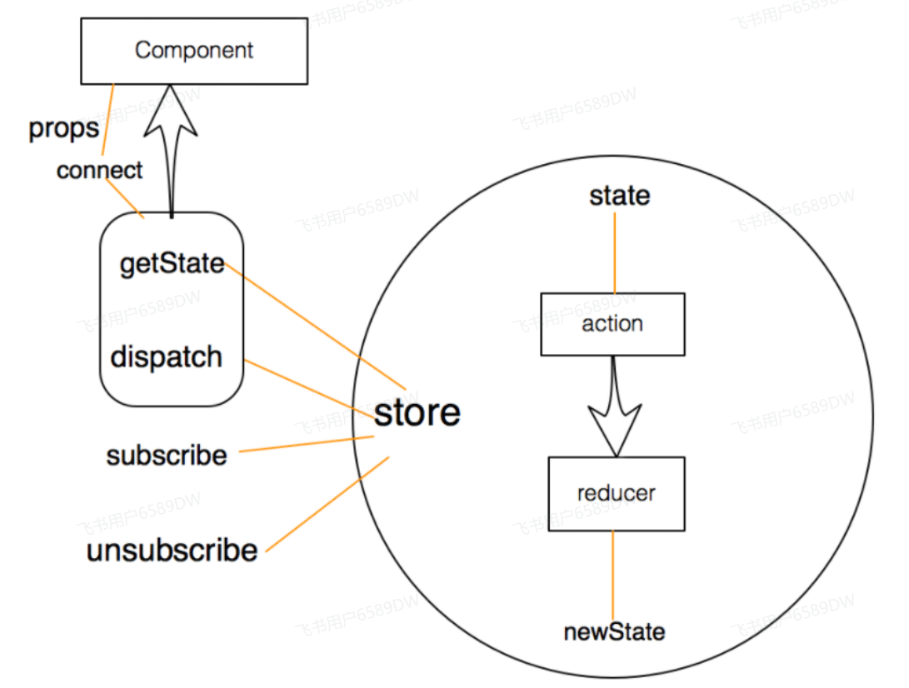

##### 三、项目结构

可以根据项目具体情况进行选择，以下列出两种常见的组织结构

按角色组织（MVC）

角色如下：

* reducers
* actions
* components
* containers

```javascript
reducers/
  todoReducer.js
  filterReducer.js
actions/
  todoAction.js
  filterActions.js
components/
  todoList.js
  todoItem.js
  filter.js
containers/
  todoListContainer.js
  todoItemContainer.js
  filterContainer.js

```

按功能组织

使用redux使用功能组织项目，也就是把完成同一应用功能的代码放在一个目录下，一个应用功能包含多个角色的代码

Redux中，不同的角色就是reducer、actions和视图，而应用功能对应的就是用户界面的交互模块

```javascript
todoList/
  actions.js
  actionTypes.js
  index.js
  reducer.js
  views/
    components.js
    containers.js
filter/
  actions.js
  actionTypes.js
  index.js
  reducer.js
  views/
    components.js
    container.js

```

每个功能模块对应一个目录，每个目录下包含同样的角色文件：

* actionTypes.js 定义action类型
* actions.js 定义action构造函数
* reducer.js 定义这个功能模块如果响应actions.js定义的动作
* views 包含功能模块中所有的React组件，包括展示组件和容器组件
* index.js 把所有的角色导入，统一导出

其中index模块用于导出对外的接口

```javascript
import * as actions from './actions.js';
import reducer from './reducer.js';
import view from './views/container.js';

export { actions, reducer, view };

```

导入方法如下：

```javascript
import { actions, reducer, view as TodoList } from './xxxx'

```

#### React 构建组件的方式有哪些？区别是什么？ （必背）

***构建方式**：
  1. 类组件：`class MyComponent extends React.Component`
  2. 函数组件：`function MyComponent()`
  3. 高阶组件：`const EnhancedComponent = hoc(MyComponent)`
  4. 自定义 Hooks：`const useMyHook = () => { ... }`
***区别**：
  * 类组件功能全面但复杂
  * 函数组件简洁，配合 Hooks 功能完整
  * 高阶组件用于逻辑复用
  * 自定义 Hooks 是函数组件的逻辑复用方式

#### 说说你对immutable的理解？如何应用在react项目中？

##### 一、是什么

Immutable，不可改变的，在计算机中，即指一旦创建，就不能再被更改的数据

对 Immutable 对象的任何修改或添加删除操作都会返回一个新的 Immutable 对象

Immutable 实现的原理是 Persistent Data Structure（持久化数据结构）:

* 用一种数据结构来保存数据
* 当数据被修改时，会返回一个对象，但是新的对象会尽可能的利用之前的数据结构而不会对内存造成浪费

也就是使用旧数据创建新数据时，要保证旧数据同时可用且不变，同时为了避免 deepCopy 把所有节点都复制一遍带来的性能损耗，Immutable 使用了 Structural Sharing（结构共享）

如果对象树中一个节点发生变化，只修改这个节点和受它影响的父节点，其它节点则进行共享

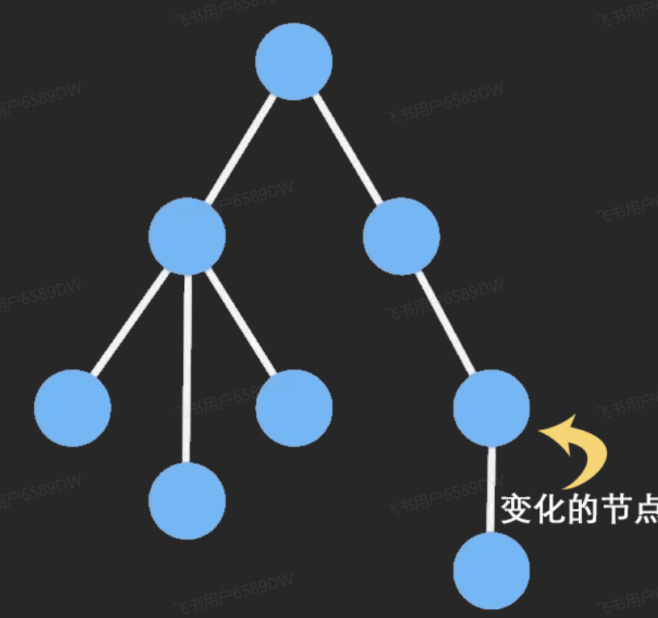

##### 二、如何使用

使用Immutable对象最主要的库是immutable.js

immutable.js 是一个完全独立的库，无论基于什么框架都可以用它

其出现场景在于弥补 Javascript 没有不可变数据结构的问题，通过 structural sharing来解决的性能问题

内部提供了一套完整的 Persistent Data Structure，还有很多易用的数据类型，如Collection、List、Map、Set、Record、Seq，其中：

* List: 有序索引集，类似 JavaScript 中的 Array
* Map: 无序索引集，类似 JavaScript 中的 Object
* Set: 没有重复值的集合

主要的方法如下：

* fromJS()：将一个js数据转换为Immutable类型的数据

```javascript
const obj = Immutable.fromJS({a:'123',b:'234'})

```

* toJS()：将一个Immutable数据转换为JS类型的数据
* is()：对两个对象进行比较

```javascript
import { Map, is } from 'immutable'
const map1 = Map({ a: 1, b: 1, c: 1 })
const map2 = Map({ a: 1, b: 1, c: 1 })
map1 === map2   //false
Object.is(map1, map2) // false
is(map1, map2) // true

```

* get(key)：对数据或对象取值
* getIn(\[]) ：对嵌套对象或数组取值，传参为数组，表示位置

```javascript
let abs = Immutable.fromJS({a: {b:2}});
abs.getIn(['a', 'b']) // 2
abs.getIn(['a', 'c']) // 子级没有值

let arr = Immutable.fromJS([1 ,2, 3, {a: 5}]);
arr.getIn([3, 'a']); // 5
arr.getIn([3, 'c']); // 子级没有值

```

如下例子：使用方法如下：

```javascript
import Immutable from 'immutable';
foo = Immutable.fromJS({a: {b: 1}});
bar = foo.setIn(['a', 'b'], 2);   // 使用 setIn 赋值
console.log(foo.getIn(['a', 'b']));  // 使用 getIn 取值，打印 1
console.log(foo === bar);  //  打印 false

```

如果换到原生的js，则对应如下：

```javascript
let foo = {a: {b: 1}};
let bar = foo;
bar.a.b = 2;
console.log(foo.a.b);  // 打印 2
console.log(foo === bar);  //  打印 true

```

##### 三、在React中应用

使用 Immutable 可以给 React 应用带来性能的优化，主要体现在减少渲染的次数

在做react性能优化的时候，为了避免重复渲染，我们会在shouldComponentUpdate()中做对比，当返回true执行render方法

Immutable通过is方法则可以完成对比，而无需像一样通过深度比较的方式比较

在使用redux过程中也可以结合Immutable，不使用Immutable前修改一个数据需要做一个深拷贝

```javascript
import '_' from 'lodash';
const Component = React.createClass({
  getInitialState() {
    return {
      data: { times: 0 }
    }
  },
  handleAdd() {
    let data = _.cloneDeep(this.state.data);
    data.times = data.times + 1;
    this.setState({ data: data });
  }
}

```

使用 Immutable 后：

```javascript
getInitialState() {
  return {
    data: Map({ times: 0 })
  }
},
  handleAdd() {
    this.setState({ data: this.state.data.update('times', v => v + 1) });
    // 这时的 times 并不会改变
    console.log(this.state.data.get('times'));
  }

```

同理，在redux中也可以将数据进行fromJS处理

```javascript
import * as constants from './constants'
import {fromJS} from 'immutable'
const defaultState = fromJS({ //将数据转化成immutable数据
    home:true,
    focused:false,
    mouseIn:false,
    list:[],
    page:1,
    totalPage:1
})
export default(state=defaultState,action)=>{
    switch(action.type){
        case constants.SEARCH_FOCUS:
            return state.set('focused',true) //更改immutable数据
        case constants.CHANGE_HOME_ACTIVE:
            return state.set('home',action.value)
        case constants.SEARCH_BLUR:
            return state.set('focused',false)
        case constants.CHANGE_LIST:
            // return state.set('list',action.data).set('totalPage',action.totalPage)
            //merge效率更高，执行一次改变多个数据
            return state.merge({
                list:action.data,
                totalPage:action.totalPage
            })
        case constants.MOUSE_ENTER:
            return state.set('mouseIn',true)
        case constants.MOUSE_LEAVE:
            return state.set('mouseIn',false)
        case constants.CHANGE_PAGE:
            return state.set('page',action.page)
        default:
            return state
    }
}

```

#### 说说你在React项目是如何捕获错误的？（必背）

##### 一、是什么

错误在我们日常编写代码是非常常见的

举个例子，在react项目中去编写组件内JavaScript代码错误会导致 React 的内部状态被破坏，导致整个应用崩溃，这是不应该出现的现象

作为一个框架，react也有自身对于错误的处理的解决方案

##### 二、如何做

为了解决出现的错误导致整个应用崩溃的问题，react16引用了错误边界新的概念

错误边界是一种 React 组件，这种组件可以捕获发生在其子组件树任何位置的 JavaScript 错误，并打印这些错误，同时展示降级 UI，而并不会渲染那些发生崩溃的子组件树

错误边界在渲染期间、生命周期方法和整个组件树的构造函数中捕获错误

形成错误边界组件的两个条件：

使用了 static getDerivedStateFromError()

使用了 componentDidCatch()

抛出错误后，请使用 static getDerivedStateFromError() 渲染备用 UI ，使用 componentDidCatch() 打印错误信息，如下：

```javascript
class ErrorBoundary extends React.Component {
  constructor(props) {
    super(props);
    this.state = { hasError: false };
  }

  static getDerivedStateFromError(error) {
    // 更新 state 使下一次渲染能够显示降级后的 UI
    return { hasError: true };
  }

  componentDidCatch(error, errorInfo) {
    // 你同样可以将错误日志上报给服务器
    logErrorToMyService(error, errorInfo);
  }

  render() {
    if (this.state.hasError) {
      // 你可以自定义降级后的 UI 并渲染
      return <h1>Something went wrong.</h1>;
    }

    return this.props.children;
  }
}

```

然后就可以把自身组件的作为错误边界的子组件，如下：

```javascript
<ErrorBoundary>
  <MyWidget />
</ErrorBoundary>

```

下面这些情况无法捕获到异常：

* 事件处理
* 异步代码
* 服务端渲染
* 自身抛出来的错误

在react 16版本之后，会把渲染期间发生的所有错误打印到控制台

除了错误信息和 JavaScript 栈外，React 16 还提供了组件栈追踪。现在你可以准确地查看发生在组件树内的错误信息：

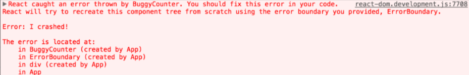

可以看到在错误信息下方文字中存在一个组件栈，便于我们追踪错误

对于错误边界无法捕获的异常，如事件处理过程中发生问题并不会捕获到，是因为其不会在渲染期间触发，并不会导致渲染时候问题

这种情况可以使用js的try...catch...语法，如下：

```javascript
class MyComponent extends React.Component {
  constructor(props) {
    super(props);
    this.state = { error: null };
    this.handleClick = this.handleClick.bind(this);
  }

  handleClick() {
    try {
      // 执行操作，如有错误则会抛出
    } catch (error) {
      this.setState({ error });
    }
  }

  render() {
    if (this.state.error) {
      return <h1>Caught an error.</h1>
    }
    return <button onClick={this.handleClick}>Click Me</button>
  }
}

```

除此之外还可以通过监听onerror事件

```javascript
window.addEventListener('error', function(event) { ... })

```

#### 说说React服务端渲染怎么做？原理是什么？

##### 一、是什么

服务端渲染（Server-Side Rendering ，简称SSR），指由服务侧完成页面的 HTML 结构拼接的页面处理技术，发送到浏览器，然后为其绑定状态与事件，成为完全可交互页面的过程

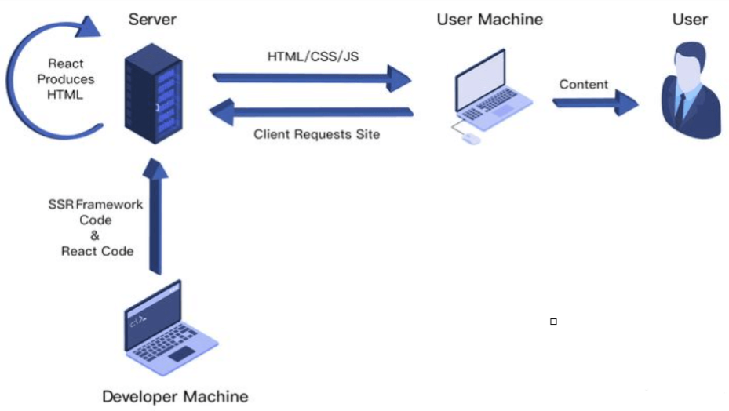

其解决的问题主要有两个：

* SEO，由于搜索引擎爬虫抓取工具可以直接查看完全渲染的页面
* 加速首屏加载，解决首屏白屏问题

##### 二、如何做

在react中，实现SSR主要有两种形式：

* 手动搭建一个 SSR 框架
* 使用成熟的SSR 框架，如 Next.JS

这里主要以手动搭建一个SSR框架进行实现

首先通过express启动一个app.js文件，用于监听3000端口的请求，当请求根目录时，返回HTML，如下：

```javascript
const express = require('express')
const app = express()
app.get('/', (req,res) => res.send(`
<html>
   <head>
       <title>ssr demo</title>
   </head>
   <body>
       Hello world
   </body>
</html>
`))

app.listen(3000, () => console.log('Exampleapp listening on port 3000!'))

```

然后再服务器中编写react代码，在app.js中进行应引用

```javascript
import React from 'react'

const Home = () =>{

    return <div>home</div>

}

export default Home

```

为了让服务器能够识别JSX，这里需要使用webpakc对项目进行打包转换，创建一个配置文件webpack.server.js并进行相关配置，如下：

```javascript
const path = require('path')    //node的path模块
const nodeExternals = require('webpack-node-externals')

module.exports = {
    target:'node',
    mode:'development',           //开发模式
    entry:'./app.js',             //入口
    output: {                     //打包出口
        filename:'bundle.js',     //打包后的文件名
        path:path.resolve(__dirname,'build')    //存放到根目录的build文件夹
    },
    externals: [nodeExternals()],  //保持node中require的引用方式
    module: {
        rules: [{                  //打包规则
           test:   /\.js?$/,       //对所有js文件进行打包
           loader:'babel-loader',  //使用babel-loader进行打包
           exclude: /node_modules/,//不打包node_modules中的js文件
           options: {
               presets: ['react','stage-0',['env', {
                                  //loader时额外的打包规则,对react,JSX，ES6进行转换
                    targets: {
                        browsers: ['last 2versions']   //对主流浏览器最近两个版本进行兼容
                    }
               }]]
           }
       }]
    }
}

```

接着借助react-dom提供了服务端渲染的 renderToString方法，负责把React组件解析成html

```javascript
import express from 'express'
import React from 'react'//引入React以支持JSX的语法
import { renderToString } from 'react-dom/server'//引入renderToString方法
import Home from'./src/containers/Home'

const app= express()
const content = renderToString(<Home/>)
app.get('/',(req,res) => res.send(`
<html>
   <head>
       <title>ssr demo</title>
   </head>
   <body>
        ${content}
   </body>
</html>
`))

app.listen(3001, () => console.log('Exampleapp listening on port 3001!'))

```

上面的过程中，已经能够成功将组件渲染到了页面上

但是像一些事件处理的方法，是无法在服务端完成，因此需要将组件代码在浏览器中再执行一遍，这种服务器端和客户端共用一套代码的方式就称之为同构

通俗讲，“同构”就是一套React代码在服务器上运行一遍，到达浏览器又运行一遍：

* 服务端渲染完成页面结构
* 浏览器端渲染完成事件绑定

浏览器实现事件绑定的方式为让浏览器去拉取JS文件执行，让JS代码来控制，因此需要引入script标签

通过script标签为页面引入客户端执行的react代码，并通过express的static中间件为js文件配置路由，修改如下：

```javascript
import express from 'express'
import React from 'react'//引入React以支持JSX的语法
import { renderToString } from'react-dom/server'//引入renderToString方法
import Home from './src/containers/Home'

const app = express()
app.use(express.static('public'));
//使用express提供的static中间件,中间件会将所有静态文件的路由指向public文件夹
 const content = renderToString(<Home/>)

app.get('/',(req,res)=>res.send(`
<html>
   <head>
       <title>ssr demo</title>
   </head>
   <body>
        ${content}
   <script src="/index.js"></script>
   </body>
</html>
`))

 app.listen(3001, () =>console.log('Example app listening on port 3001!'))

```

然后再客户端执行以下react代码，新建webpack.client.js作为客户端React代码的webpack配置文件如下：

```javascript
const path = require('path')                    //node的path模块

module.exports = {
    mode:'development',                         //开发模式
    entry:'./src/client/index.js',              //入口
    output: {                                   //打包出口
        filename:'index.js',                    //打包后的文件名
        path:path.resolve(__dirname,'public')   //存放到根目录的build文件夹
    },
    module: {
        rules: [{                               //打包规则
           test:   /\.js?$/,                    //对所有js文件进行打包
           loader:'babel-loader',               //使用babel-loader进行打包
           exclude: /node_modules/,             //不打包node_modules中的js文件
           options: {
               presets: ['react','stage-0',['env', {
                    //loader时额外的打包规则,这里对react,JSX进行转换
                    targets: {
                        browsers: ['last 2versions']   //对主流浏览器最近两个版本进行兼容
                    }
               }]]
           }
       }]
    }
}

```

这种方法就能够简单实现首页的react服务端渲染，过程对应如下图：

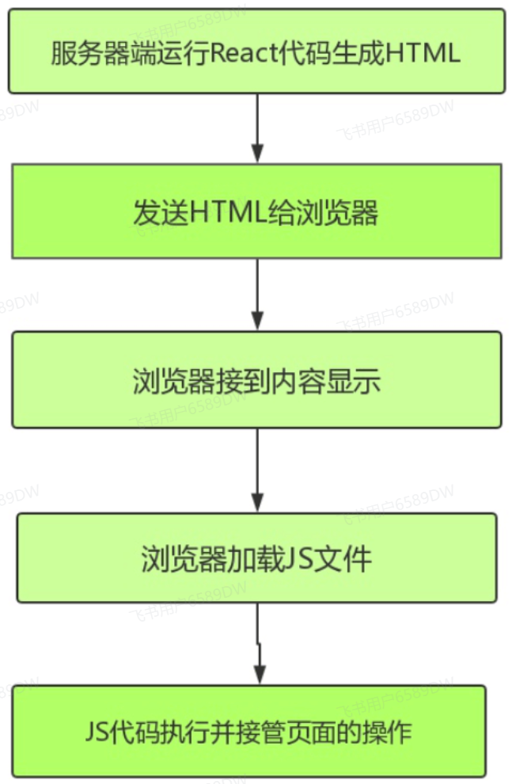

在做完初始渲染的时候，一个应用会存在路由的情况，配置信息如下：

```javascript
import React from 'react'                   //引入React以支持JSX
import { Route } from 'react-router-dom'    //引入路由
import Home from './containers/Home'        //引入Home组件

export default (
    <div>
        <Route path="/" exact component={Home}></Route>
    </div>
)

```

然后可以通过index.js引用路由信息，如下：

```javascript
import React from 'react'
import ReactDom from 'react-dom'
import { BrowserRouter } from'react-router-dom'
import Router from'../Routers'

const App= () => {
    return (
        <BrowserRouter>
           {Router}
        </BrowserRouter>
    )
}

ReactDom.hydrate(<App/>, document.getElementById('root'))

```

这时候控制台会存在报错信息，原因在于每个Route组件外面包裹着一层div，但服务端返回的代码中并没有这个div

解决方法只需要将路由信息在服务端执行一遍，使用使用StaticRouter来替代BrowserRouter，通过context进行参数传递

```javascript
import express from 'express'
import React from 'react'//引入React以支持JSX的语法
import { renderToString } from 'react-dom/server'//引入renderToString方法
import { StaticRouter } from 'react-router-dom'
import Router from '../Routers'

const app = express()
app.use(express.static('public'));
//使用express提供的static中间件,中间件会将所有静态文件的路由指向public文件夹

app.get('/',(req,res)=>{
    const content  = renderToString((
        //传入当前path
        //context为必填参数,用于服务端渲染参数传递
        <StaticRouter location={req.path} context={{}}>
           {Router}
        </StaticRouter>
    ))
    res.send(`
   <html>
       <head>
           <title>ssr demo</title>
       </head>
       <body>
       <div id="root">${content}</div>
       <script src="/index.js"></script>
       </body>
   </html>
    `)
})

app.listen(3001, () => console.log('Exampleapp listening on port 3001!'))

```

这样也就完成了路由的服务端渲染

##### 三、原理

整体react服务端渲染原理并不复杂，具体如下：

node server 接收客户端请求，得到当前的请求url 路径，然后在已有的路由表内查找到对应的组件，拿到需要请求的数据，将数据作为 props、context或者store 形式传入组件

然后基于 react 内置的服务端渲染方法 renderToString()把组件渲染为 html字符串在把最终的 html 进行输出前需要将数据注入到浏览器端

浏览器开始进行渲染和节点对比，然后执行完成组件内事件绑定和一些交互，浏览器重用了服务端输出的 html 节点，整个流程结束

#### react-router 里的 <Link> 标签和 <a> 标签有什么区别？

对比 <a> 标签, Link 避免了不必要的重新渲染。

react-router是伴随着react框架出现的路由系统，它也是公认的一种优秀的路由解决方案。在使用react-router时候，我们常常会使用其自带的路径跳转组件Link,通过实现跳转；

react-router 接管了其默认的链接跳转行为，与传统的页面跳转有区别的是，Link 的 “跳转” 行为只会触发相匹配的对应的页面内容更新，而不会刷新整个页面。

Link 跳转做了三件事情：

* 有onclick那就执行onclick
* click的时候阻止a标签默认事件
* 根据跳转 href，用 history 跳转，此时只是链接变了，并没有刷新页面

而 a 标签就是普通的超链接了，用于从当前页面跳转到href指向的另一个页面（非锚点情况）。

#### 说说你对React Router的理解？常用的Router组件有哪些？

##### 一、是什么

react-router等前端路由的原理大致相同，可以实现无刷新的条件下切换显示不同的页面

路由的本质就是页面的URL发生改变时，页面的显示结果可以根据URL的变化而变化，但是页面不会刷新

因此，可以通过前端路由可以实现单页(SPA)应用

* react-router主要分成了几个不同的包：
* react-router: 实现了路由的核心功能
* react-router-dom： 基于 react-router，加入了在浏览器运行环境下的一些功能
* react-router-native：基于 react-router，加入了 react-native 运行环境下的一些功能
* react-router-config: 用于配置静态路由的工具库

##### 二、有哪些

这里主要讲述的是react-router-dom的常用API，主要是提供了一些组件：

* BrowserRouter、HashRouter
* Route
* Link、NavLink
* switch
* redirect

###### BrowserRouter、HashRouter

Router中包含了对路径改变的监听，并且会将相应的路径传递给子组件

BrowserRouter是history模式，HashRouter模式

使用两者作为最顶层组件包裹其他组件

```javascript
import { BrowserRouter as Router } from "react-router-dom";

export default function App() {
  return (
    <Router>
      <main>
        <nav>
          <ul>
            <li>
              < a href=" ">Home</ a>
            </li>
            <li>
              < a href="/about">About</ a>
            </li>
            <li>
              < a href="/contact">Contact</ a>
            </li>
          </ul>
        </nav>
      </main>
    </Router>
  );
}

```

###### Route

Route用于路径的匹配，然后进行组件的渲染，对应的属性如下：

* path 属性：用于设置匹配到的路径
* component 属性：设置匹配到路径后，渲染的组件
* render 属性：设置匹配到路径后，渲染的内容
* exact 属性：开启精准匹配，只有精准匹配到完全一致的路径，才会渲染对应的组件

```javascript
import { BrowserRouter as Router, Route } from "react-router-dom";

export default function App() {
  return (
    <Router>
      <main>
        <nav>
          <ul>
            <li>
              < a href="/">Home</ a>
            </li>
            <li>
              < a href="/about">About</ a>
            </li>
            <li>
              < a href="/contact">Contact</ a>
            </li>
          </ul>
        </nav>
        <Route path="/" render={() => <h1>Welcome!</h1>} />
      </main>
    </Router>
  );
}

```

###### Link、NavLink

通常路径的跳转是使用Link组件，最终会被渲染成a元素，其中属性to代替a标题的href属性

NavLink是在Link基础之上增加了一些样式属性，例如组件被选中时，发生样式变化，则可以设置NavLink的一下属性：

* activeStyle：活跃时（匹配时）的样式
* activeClassName：活跃时添加的class

如下：

```javascript
<NavLink to="/" exact activeStyle={{color: "red"}}>首页</NavLink>
<NavLink to="/about" activeStyle={{color: "red"}}>关于</NavLink>
<NavLink to="/profile" activeStyle={{color: "red"}}>我的</NavLink>

```

如果需要实现js实现页面的跳转，那么可以通过下面的形式：

通过Route作为顶层组件包裹其他组件后,页面组件就可以接收到一些路由相关的东西，比如props.history

```javascript
const Contact = ({ history }) => (
  <Fragment>
    <h1>Contact</h1>
    <button onClick={() => history.push("/")}>Go to home</button>
    <FakeText />
  </Fragment>
);

```

props 中接收到的history对象具有一些方便的方法，如goBack，goForward,push

###### redirect

用于路由的重定向，当这个组件出现时，就会执行跳转到对应的to路径中，如下例子：

```javascript
const About = ({
  match: {
    params: { name },
  },
}) => (
  // props.match.params.name
  <Fragment>
    {name !== "tom" ? <Redirect to="/" /> : null}
    <h1>About {name}</h1>
    <FakeText />
  </Fragment>
)

```

上述组件当接收到的路由参数name 不等于 tom 的时候，将会自动重定向到首页

###### switch

swich组件的作用适用于当匹配到第一个组件的时候，后面的组件就不应该继续匹配

如下例子：

```javascript
<Switch>
  <Route exact path="/" component={Home} />
  <Route path="/about" component={About} />
  <Route path="/profile" component={Profile} />
  <Route path="/:userid" component={User} />
  <Route component={NoMatch} />
</Switch>

```

如果不使用switch组件进行包裹，相同 path 的就会被匹配到，然后一起展示。

除了一些路由相关的组件之外，react-router还提供一些hooks，如下：

* useHistory
* useParams
* useLocation

###### useHistory

useHistory可以让组件内部直接访问history，无须通过props获取

```javascript
import { useHistory } from "react-router-dom";

const Contact = () => {
  const history = useHistory();
  return (
    <Fragment>
      <h1>Contact</h1>
      <button onClick={() => history.push("/")}>Go to home</button>
    </Fragment>
  );
};

```

###### useParams

```javascript
const About = () => {
  const { name } = useParams();
  return (
    // props.match.params.name
    <Fragment>
      {name !== "John Doe" ? <Redirect to="/" /> : null}
      <h1>About {name}</h1>
      <Route component={Contact} />
    </Fragment>
  );
};

```

###### useLocation

useLocation 会返回当前 URL 的 location 对象

```javascript
<NavLink to="/detail/abc123">详情</NavLink>

<Switch>
    ... 其他Route
    <Route path="/detail/:id" component={Detail}/>
    <Route component={NoMatch} />
</Switch>

```

##### 三、参数传递

这些路由传递参数主要分成了三种形式：

* 动态路由的方式
* search传递参数
* to传入对象

动态路由

动态路由的概念指的是路由中的路径并不会固定

例如将path在Route匹配时写成/detail/:id，那么 /detail/abc、/detail/123都可以匹配到该Route

```javascript
<Switch>
    ... 其他Route
    <Route path="/detail/:id" component={Detail}/>
    <Route component={NoMatch} />
</Switch>

```

获取参数方式如下：

```javascript
console.log(props.match.params.xxx)

```

search传递参数

在跳转的路径中添加了一些query参数；

```javascript
<NavLink to="/detail2?name=why&age=18">详情2</NavLink>

<Switch>
  <Route path="/detail2" component={Detail2}/>
</Switch>

```

获取形式如下：

```javascript
console.log(props.location.search)

```

to传入对象

传递方式如下：

```javascript
<NavLink to={{
    pathname: "/detail2",
    query: {name: "kobe", age: 30},
    state: {height: 1.98, address: "洛杉矶"},
    search: "?apikey=123"
  }}>
  详情2
</NavLink>

```

获取参数的形式如下：

```javascript
console.log(props.location)

```

#### 说说React Router有几种模式，以及实现原理？

##### 一、是什么

在单页应用中，一个web项目只有一个html页面，一旦页面加载完成之后，就不用因为用户的操作而进行页面的重新加载或者跳转，其特性如下：

* 改变 url 且不让浏览器向服务器发送请求
* 在不刷新页面的前提下动态改变浏览器地址栏中的URL地址

其中主要分成了两种模式：

* hash 模式：在url后面加上#，如<http://127.0.0.1:5500/home/#/page1>
* history 模式：允许操作浏览器的曾经在标签页或者框架里访问的会话历史记录

##### 二、使用

React Router对应的hash模式和history模式对应的组件为：

* HashRouter
* BrowserRouter

这两个组件的使用都十分的简单，作为最顶层组件包裹其他组件，如下所示

```javascript
// 1.import { BrowserRouter as Router } from "react-router-dom";
// 2.import { HashRouter as Router } from "react-router-dom";

import React from 'react';
import {
  BrowserRouter as Router,
  // HashRouter as Router
  Switch,
  Route,
} from "react-router-dom";
import Home from './pages/Home';
import Login from './pages/Login';
import Backend from './pages/Backend';
import Admin from './pages/Admin';

function App() {
  return (
    <Router>
        <Route path="/login" component={Login}/>
        <Route path="/backend" component={Backend}/>
        <Route path="/admin" component={Admin}/>
        <Route path="/" component={Home}/>
    </Router>
  );
}

export default App;

```

##### 三、实现原理

路由描述了 URL 与 UI 之间的映射关系，这种映射是单向的，即 URL 变化引起 UI 更新（无需刷新页面）

下面以hash模式为例子，改变hash值并不会导致浏览器向服务器发送请求，浏览器不发出请求，也就不会刷新页面

hash 值改变，触发全局 window 对象上的 hashchange 事件。所以 hash 模式路由就是利用 hashchange 事件监听 URL 的变化，从而进行 DOM 操作来模拟页面跳转

react-router也是基于这个特性实现路由的跳转

下面以HashRouter组件分析进行展开：

###### HashRouter

HashRouter包裹了整应用，

通过window.addEventListener('hashChange',callback)监听hash值的变化，并传递给其嵌套的组件

然后通过context将location数据往后代组件传递，如下：

```javascript
import React, { Component } from 'react';
import { Provider } from './context'
// 该组件下Api提供给子组件使用
class HashRouter extends Component {
  constructor() {
    super()
    this.state = {
      location: {
        pathname: window.location.hash.slice(1) || '/'
      }
    }
  }
  // url路径变化 改变location
  componentDidMount() {
    window.location.hash = window.location.hash || '/'
    window.addEventListener('hashchange', () => {
      this.setState({
        location: {
          ...this.state.location,
          pathname: window.location.hash.slice(1) || '/'
        }
      }, () => console.log(this.state.location))
    })
  }
  render() {
    let value = {
      location: this.state.location
    }
    return (
      <Provider value={value}>
        {
          this.props.children
        }
      </Provider>
    );
  }
}

export default HashRouter;

```

###### Router

Router组件主要做的是通过BrowserRouter传过来的当前值，通过props传进来的path与context传进来的pathname进行匹配，然后决定是否执行渲染组件

```javascript
import React, { Component } from 'react';
import { Consumer } from './context'
const { pathToRegexp } = require("path-to-regexp");
class Route extends Component {
  render() {
    return (
      <Consumer>
        {
          state => {
            console.log(state)
            let {path, component: Component} = this.props
            let pathname = state.location.pathname
            let reg = pathToRegexp(path, [], {end: false})
            // 判断当前path是否包含pathname
            if(pathname.match(reg)) {
              return <Component></Component>
            }
            return null
          }
        }
      </Consumer>
    );
  }
}
export default Route;

```

### 综合与对比

#### React 和 Vue 在技术层面有哪些区别？（选背）

React 和 Vue 是当前比较流行的前端框架，它们在技术层面有以下区别：

* 组件化方式不同：React 是基于组件实现的，组件包含了状态和行为，所有组件共享一个状态树。Vue 也是基于组件实现的，但是每个组件都有自己的状态，并且可以很容易地将数据和行为绑定在一起。
* 数据驱动方式不同：React 使用单向数据流来管理数据，即从父组件到子组件的传递，所以 React 中组件之间的数据交互相对更加复杂。Vue 则使用双向数据绑定来管理数据，使得组件之间的数据交互更加简洁。
* 模板语法不同：React 使用 JSX 语法，将 HTML 和 JavaScript 结合在一起，使得编写组件更加直观和灵活。Vue 则使用模板语法，并且支持模板内的表达式和指令，使得编写组件具有更高的可读性和可维护性。
* 生命周期不同：React 组件的生命周期分为三个阶段：初始化、更新和卸载。Vue 组件的生命周期分为八个阶段：创建、挂载、更新、销毁等。
* 状态管理方式不同：React 使用 Redux 或者 MobX 来管理应用程序的状态。Vue 则提供了自己的状态管理库 Vuex，可以更方便地管理组件之间的共享状态。
* 性能优化方式不同：React 使用虚拟 DOM 技术来实现高效的渲染性能，可以减少每次渲染时需要操作真实 DOM 的次数。Vue 则使用模板编译和响应式系统来实现高效的渲染性能，并且还提供了一些优化技术，例如懒加载和缓存等。

开发人员可以根据项目需求和个人喜好选择合适的框架。

#### taro 的实现原理是怎么样的？

Taro 是一个多端统一开发框架，可以使用一套代码编译成微信小程序、支付宝小程序、百度智能小程序、字节跳动小程序、QQ 小程序、快应用、H5 等多个平台的应用。

Taro 的实现原理主要基于以下几个方面：

1. JSX 转换：Taro 使用 Babel 插件将类似 HTML 的语法转换为 React 组件。在编译过程中，Taro 还会对 JSX 语法进行优化和压缩，以避免生成不必要的代码。
2. 多端适配：Taro 通过封装原生 API 和提供不同的 Polyfill 实现多端适配。例如，在微信小程序中，Taro 封装了 wx 对象，使得可以使用类似 React Native 的组件化开发方式；在 H5 中，Taro 则提供了针对浏览器的 Polyfill。
3. 跨端样式处理：Taro 通过 CSS Modules 技术和 PostCSS 插件来处理 CSS 样式。在编译过程中，Taro 会将样式文件转换为 JavaScript 对象，并按需导入到组件中。同时，Taro 提供了 @import 指令或 scss 语法等方式来支持复杂的样式表达。
4. 构建系统：Taro 使用 webpack 构建工具来打包编译后的代码，并提供了一系列开箱即用的插件、规则和配置项，例如自动化导入组件、静态资源压缩、TypeScript 支持等。
5. 运行时性能优化：Taro 在运行时对代码进行了一些优化，例如使用字典树实现 JSX 解析、避免使用内置事件监听器、减少对原生 API 的调用等方式来优化性能。

Taro 利用 Babel、React、Webpack 等技术，通过封装原生 API 和提供不同的 Polyfill 实现了多端适配，同时也支持复杂的样式表达和自动化导入组件等特性。这些技术的应用使得 Taro 框架在性能、可维护性、跨平台等方面都表现出色。

#### taro 2.x 和 taro 3 最大区别是什么？

Taro 2.x 和 Taro 3 的最大区别可以总结为以下几个方面：

1. 编译方式：Taro 2.x 使用 Gulp 构建工具进行编译，而 Taro 3 改为使用 Webpack 进行构建。这使得 Taro 3 在编译速度、可扩展性、构建配置等方面有了更好的表现。
2. React 版本升级：Taro 2.x 使用的是 React 16 版本，而 Taro 3 升级到了 React 17 版本。React 17 引入了一些新特性，例如以初始渲染器为基础的事件处理、重新设计的事件系统等，从而提高了性能和稳定性。
3. API 改进：Taro 3 对 API 进行了改进，并引入了新的特性。例如，在 JSX 中可以使用 class 关键字来定义 CSS 样式；增加 useReady 钩子函数在小程序生命周期 onReady 被触发时执行；引入了快应用和 H5 等新平台的支持等。
4. 插件机制：Taro 3 引入了插件机制，使得开发者可以通过插件实现更多的功能和特性，例如对 TypeScript 支持的扩展、国际化支持等。
5. 性能优化：Taro 3 在性能方面进行了优化，例如使用虚拟 DOM 进行局部更新，减少对原生 API 的调用等。同时，Taro 3 可以根据平台的不同生成更小的代码包。

Taro 3 引入了一些新特性和优化，并提高了性能、可扩展性和稳定性。

如果需要使用 Taro 框架开发多端应用，建议选择 Taro 3。

#### 单页应用如何提高加载速度？

* 使用代码分割：将代码拆分成小块并按需加载（懒加载），以避免不必要的网络请求和减少加载时间。
* 缓存资源：利用浏览器缓存来存储重复使用的文件，例如 CSS 和 JS 文件、图片等。
* 预加载关键资源：在首次渲染之前，先提前加载关键资源，例如首页所需的 JS、CSS 或数据，以保证关键内容的快速呈现。
* 使用合适的图片格式：选择合适的图片格式（例如 JPEG、PNG、WebP 等），并根据需要进行压缩以减少文件大小。对于一些小图标，可以使用 iconfont 等字体文件来代替。
* 启用 Gzip 压缩：使用服务器端的 Gzip 压缩算法对文件进行压缩，以减少传输时间和带宽消耗。
* 使用 CDN：使用内容分发网络（CDN）来缓存和传递文件，以提高文件的下载速度和可靠性。
* 优化 API 请求：尽可能地减少 API 调用的数量，并使用缓存和延迟加载等技术来优化 API 请求的效率。
* 使用服务器端渲染：使用服务器端渲染（SSR）来生成 HTML，以减少客户端渲染所需的时间和资源。但需要注意，SSR 也可能增加了服务器的负担并使网站更复杂。

#### 如何确保你的构造函数只能被new调用，而不能被普通调用？

明确函数的双重用途

JavaScript 中的函数一般有两种使用方式:

* 当作构造函数使用: new Func()
* 当作普通函数使用: Func()

但 JavaScript 内部并没有区分两者的方式，我们人为规定构造函数名首字母要大写作为区分。也就是说，构造函数被当成普通函数调用不会有报错提示。

下面来举个栗子:

```javascript
// 定义构造函数 Person
function Person(firstName, lastName) {
    this.firstName = firstName;
    this.lastName = lastName;
    this.fullName = this.firstName + this.lastName;
}
// 使用 new 调用
console.log(new Person("战场", "小包"));
// 当作普通函数调用
console.log(Person("战场", "小包"))

```

输出结果:


通过输出结果可以发现，定义的构造函数被当作普通函数来调用，没有任何错误提示。

使用 instanceof 实现

instanceof 基础知识

instanceof 运算符用于检测构造函数的 prototype 属性是否出现在某个实例对象的原型链上。

使用语法:

```javascript
object instanceof constructor

```

我们可以使用 instanceof 检测某个对象是不是另一个对象的实例，例如 new Person() instanceof Person --> true

new 绑定/ 默认绑定

* 通过 new 来调用构造函数，会生成一个新对象，并且把这个新对象绑定为调用函数的 this 。
* 如果普通调用函数，非严格模式 this 指向 window，严格模式指向 undefined

```javascript
function Test() {
    console.log(this)
}
// Window {...}
console.log(Test())
// Test {}
console.log(new Test())

```

使用 new 调用函数和普通调用函数最大的区别在于函数内部 this 指向不同: new 调用后 this 指向实例，普通调用则会指向 window。

instanceof 可以检测某个对象是不是另一个对象的实例。如果为 new 调用， this 指向实例，this instanceof 构造函数 返回值为 true ，普通调用返回值为 false。

代码实现

```javascript
function Person(firstName, lastName) {
    // this instanceof Person
    // 如果返回值为 false，说明为普通调用
    // 返回类型错误信息——当前构造函数需要使用 new 调用
    if (!(this instanceof Person)) {
        throw new TypeError('Function constructor A cannot be invoked without "new"')
    }
    this.firstName = firstName;
    this.lastName = lastName;
    this.fullName = this.firstName + this.lastName;
}
// 当作普通函数调用
// Uncaught TypeError: Function constructor A cannot be invoked without "new"
console.log(Person("战场", "小包"));

```

通过输出结果，我们可以发现，定义的 Person 构造函数已经无法被普通调用了。撒花~~~

但这种方案并不是完美的，存在一点小小的瑕疵。我们可以通过伪造实例的方法骗过构造函数里的判断。

具体实现: JavaScript 提供的 apply/call 方法可以修改 this 指向，如果调用时将 this 指向修改为 Person 实例，就可以成功骗过上面的语法。

```javascript
// 输出结果 undefined
console.log(Person.call(new Person(), "战场", "小包"));

```

这点瑕疵虽说无伤大雅，但经过小包的学习，ES6 中提供了更好的方案。

new.target

JavaScript 官方也发现了这个让人棘手的问题，因此 ES6 中提供了 new.target 属性。

《ECMAScript 6 入门》中讲到: ES6 为 new 命令引入了一个 new.target 属性，该属性一般用在构造函数之中，返回 new 命令作用于的那个构造函数。如果构造函数不是通过 new 命令或 Reflect.construct() 调用的，new.target 会返回 undefined ，因此这个属性可以用来确定构造函数是怎么调用的。

new.target 就是为确定构造函数的调用方式而生的，太符合这个场景了，我们来试一下 new.target 的用法。

```javascript
function Person() {
    console.log(new.target);
}
// new: Person {}
console.log("new: ",new Person())
// not new: undefined
console.log("not new:", Person())

```

所以我们就可以使用 new.target 来非常简单的实现对构造函数的限制。

```javascript
function Person() {
    if (!(new.target)) {
        throw new TypeError('Function constructor A cannot be invoked without "new"')
    }
}
// Uncaught TypeError: Function constructor A cannot be invoked without "new"
console.log("not new:", Person())

```

使用ES6 Class

类也具备限制构造函数只能用 new 调用的作用。

ES6 提供 Class 作为构造函数的语法糖，来实现语义化更好的面向对象编程，并且对 Class 进行了规定：类的构造器必须使用 new 来调用。

因此后续在进行面向对象编程时，强烈推荐使用 ES6 的 Class。 Class 修复了很多 ES5 面向对象编程的缺陷，例如类中的所有方法都是不可枚举的；类的所有方法都无法被当作构造函数使用等。

```javascript
class Person {
    constructor (name) {
        this.name = name;
    }
}
// Uncaught TypeError: Class constructor Person cannot be invoked without 'new'
console.log(Person())

```

学到这里我就不由得好奇了，既然 Class 必须使用 new 来调用，那提供 new.target 属性的意义在哪里？

new.target 实现抽象类

首先来看一下 new.target 在类中使用会返回什么？

```javascript
class Person {
    constructor (name) {
        this.name = name;
        console.log(new.target)
    }
}
new Person()

```

输出结果:

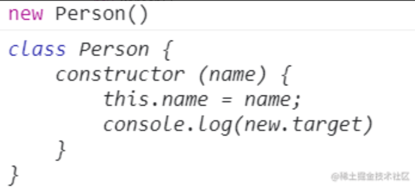

Class 内部调用 new.target，会返回当前 Class。

《ECMAScript 6 入门》中又讲到: 需要注意的是，子类继承父类时，new.target会返回子类。继承中的 new.target 好像有不一样的花样，我们来试一下。

```javascript
class Animal {
    constructor (type, name, age) {
        this.type = type;
        this.name = name;
        this.age = age;
        console.log(new.target)
    }
}
// extends 是 Class 中实现继承的关键字
class Dog extends Animal {
    constructor(name, age) {
        super("dog", "baobao", "1")
    }
}
const dog = new Dog()

```

输出结果:

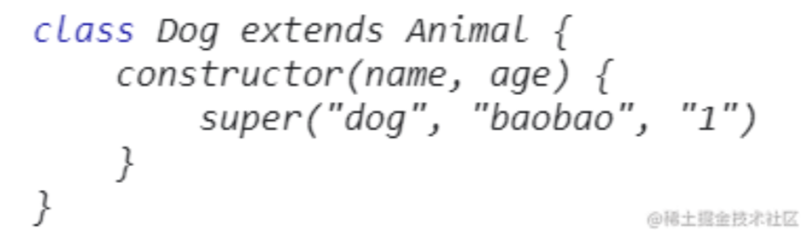

通过上面案例，我们可以发现子类调用和父类调用的返回结果是不同的，我们利用这个特性，就可以实现父类不可调用而子类可以调用的情况——面向对象中的抽象类

抽象类实现

什么是抽象类那？我们以动物世界为例。

我们定义了一个动物类 Animal，并且通过这个类来创建动物，动物是个抽象概念，当你提到动物类时，你并不知道我会创建什么动物。只有将动物实体化，比如说猫，狗，猪啊，这才是具体的动物，并且每个动物的行为都会有所不同。因此我们不应该通过创建 Animal 实例来生成动物，Animal 只是动物抽象概念的集合。

Animal 就是一个抽象类，我们不应该通过它来生成动物，而是通过它的子类，例如 Dog、Cat 等来生成对应的 dog/cat 实例。

new.target 子类调用和父类调用的返回值是不同的，所以我们可以借助 new.target 实现抽象类

抽象类也可以理解为不能独立使用、必须继承后才能使用的类。

```javascript
class Animal {
    constructor (type, name, age) {
        if (new.target === Animal) {
            throw new TypeError("abstract class cannot new")
        }
        this.type = type;
        this.name = name;
        this.age = age;
    }
}
// extends 是 Class 中实现继承的关键字
class Dog extends Animal {
    constructor(name, age) {
        super("dog", "baobao", "1")
    }
}
// Uncaught TypeError: abstract class cannot new
const dog = new Animal("dog", "baobao", 18)

```

##### 总结

本文介绍了三种限制构造函数只能被 new 调用的方案

* 借助 instanceof 和 new 绑定的原理，适用于低版本浏览器
* 借助 new.target 属性，可与 class 配合定义抽象类
* 面向对象编程使用 ES6 class——最佳方案

> 更新: 2025-12-15 04:07:42
> 原文: <https://www.yuque.com/u56987424/lwyx/fed2uiwd0g8xrbza>
