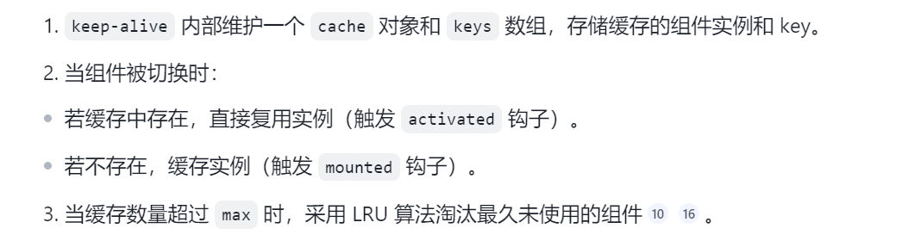

# VUE

> 笔者将从以下方面展开Vue八股的学习
>
> 1. <font style="color:rgba(0, 0, 0, 0.6);background-color:rgb(252, 252, 252);">响应式系统</font>
> 2. <font style="color:rgba(0, 0, 0, 0.6);background-color:rgb(252, 252, 252);">虚拟DOM与渲染机制</font>
> 3. <font style="color:rgba(0, 0, 0, 0.6);background-color:rgb(252, 252, 252);">组件系统</font>
> 4. <font style="color:rgba(0, 0, 0, 0.6);background-color:rgb(252, 252, 252);">状态管理与路由</font>
> 5. <font style="color:rgba(0, 0, 0, 0.6);background-color:rgb(252, 252, 252);">指令、模板与编译</font>
> 6. <font style="color:rgba(0, 0, 0, 0.6);background-color:rgb(252, 252, 252);">高级特性与API</font>
> 7. <font style="color:rgba(0, 0, 0, 0.6);background-color:rgb(252, 252, 252);">工程实践与架构</font>

### <font style="color:#E4495B;background-color:rgb(252, 252, 252);">响应式系统</font>

#### <font style="color:#DF2A3F;">ref和reactivate的区别（必背）</font>

| **<font style="background-color:rgb(252, 252, 252);">特性</font>** | **<font style="background-color:rgb(252, 252, 252);">ref</font>** | **<font style="background-color:rgb(252, 252, 252);">reactive</font>** |
| :---: | :---: | :---: |
| **<font style="background-color:rgb(252, 252, 252);">用途</font>** | <font style="background-color:rgb(252, 252, 252);">定义基本类型（字符串、数字等）或对象类型</font> | <font style="background-color:rgb(252, 252, 252);">仅定义对象类型（对象、数组等）</font> |
| **<font style="background-color:rgb(252, 252, 252);">返回值</font>** | <font style="background-color:rgb(252, 252, 252);">包含</font><code><font style="background-color:rgb(252, 252, 252);">.value</font></code><br/><font style="background-color:rgb(252, 252, 252);">属性的响应式引用对象</font> | <font style="background-color:rgb(252, 252, 252);">原始对象的Proxy代理对象</font> |
| **<font style="background-color:rgb(252, 252, 252);">数据类型</font>** | <font style="background-color:rgb(252, 252, 252);">支持所有类型（基本类型+对象）</font> | <font style="background-color:rgb(252, 252, 252);">仅支持对象或数组</font> |
| **<font style="background-color:rgb(252, 252, 252);">访问方式</font>** | <font style="background-color:rgb(252, 252, 252);">操作数据需</font><code><font style="background-color:rgb(252, 252, 252);">.value</font></code> | <font style="background-color:rgb(252, 252, 252);">直接访问属性，无需</font><code><font style="background-color:rgb(252, 252, 252);">.value</font></code> |

**<font style="color:rgb(26, 32, 41);">ref 的实现机制</font>**

<font style="color:rgb(26, 32, 41);">ref 内部创建一个包含 value 属性的对象，通过 Object.defineProperty 或 Proxy 对 value 属性进行拦截。</font>

<font style="color:rgb(26, 32, 41);">当访问 value 时，触发依赖收集；当修改 value 时，触发派发更新。</font>

<font style="color:rgb(26, 32, 41);">如果传入的是对象或数组，ref 内部会调用 reactive 将其转换为响应式代理对象</font>

**<font style="color:rgb(26, 32, 41);">reactive 的实现机制</font>**

<font style="color:rgb(26, 32, 41);">reactive 使用 Proxy 对目标对象进行代理，拦截对象的读取、赋值、删除等操作。</font>

<font style="color:rgb(26, 32, 41);">当访问对象属性时，触发依赖收集；当修改对象属性时，触发派发更新。</font>

<font style="color:rgb(26, 32, 41);">Proxy 可以监听动态新增的属性和数组变化，无需额外处理</font>

#### vue源码中使用weakmap和set的场景介绍（了解）

在Vue.js的源码中，`WeakMap`和`Set`被用于实现响应式系统的一部分，特别是用于依赖收集和派发更新。以下是一些具体的场景和它们的使用方式：

WeakMap的使用场景

Vue.js使用`WeakMap`来存储组件实例与它们的渲染函数之间的映射关系，以及组件实例与它们的依赖之间的映射关系。以下是两个主要的使用场景：

**组件实例与渲染函数**：

Vue.js使用`WeakMap`来存储每个组件实例到其渲染函数的映射。由于组件实例是渲染函数的唯一所有者，使用`WeakMap`可以确保当组件实例被销毁时，渲染函数的引用也会被垃圾回收，从而避免内存泄漏。

**组件实例与依赖**：

在Vue的响应式系统中，每个组件实例都可能有一些依赖，这些依赖需要在组件的数据变化时被通知。`WeakMap`用于存储组件实例与这些依赖之间的映射。这样，当组件实例不再被需要时，依赖也可以被垃圾回收。

***

**Set的使用场景**

`Set`在Vue.js中用于存储观察者（watchers）和依赖。以下是具体的使用场景：

**依赖收集**：

当组件的渲染函数或计算属性被访问时，它们会读取响应式数据。Vue.js使用`Set`来存储所有依赖于特定响应式数据的观察者（watchers）。这样，当数据变化时，可以通知所有依赖于该数据的观察者。

**防止重复依赖**：

由于`Set`不允许重复的元素，它确保了同一个观察者不会被添加到依赖集合中多次，从而避免了不必要的更新

#### 依赖收集结构变更理由，怎么清除的依赖（了解）

**依赖收集结构变更理由**

在Vue.js的早期版本中，依赖收集是使用`Array`来实现的。然而，使用`Set`代替`Array`有以下几个理由：

* **性能**：`Set`在添加和删除元素时通常比`Array`更高效，因为它不需要检查元素是否已存在。
* **简洁性**：使用`Set`可以简化依赖收集的代码，因为`Set`提供了更直接的API来处理集合操作。

**怎么清除依赖**

在Vue.js中，依赖的清除通常发生在以下两个场景：

**组件销毁时**：

当组件实例被销毁时，Vue.js会遍历所有依赖于该组件实例的依赖集合，并将该组件实例从每个依赖集合中移除。由于使用了`WeakMap`和`Set`，这个过程可以自动处理垃圾回收。

**观察者更新时**：

当观察者（watcher）被通知更新时，它可能会从其依赖集合中移除自己，特别是如果它是一个一次性观察者或者在某些条件下不再需要该依赖。

#### <font style="color:#DF2A3F;">响应式数据系统（必背）</font>

Vue 的数据响应式系统通过 object.defineProperty或者ES6的 Proxy 来实现，主要解决了以下问题:

* 数据绑定:保证了视图与数据的同步更新，当数据发生变化时，视图会自动更新，避免了手动操作 DOM 的繁琐和易出错性。
* 依赖追踪:Vue 能够追踪每个数据的依赖关系，即哪些组件或者计算属性依赖于某个数据。当数据变化时，自动更新依赖的组件或者计算属性

#### <font style="color:#DF2A3F;">vue2双向绑定原理（必背）</font>

1. 采用数据劫持 结合 发布者-订阅者模式的方式
2. data数据在初始化的时候，会实例化一个Observe类，它会将data数据进行递归遍历，并通过Object.defineProperty方法，给每个值添加上一个getter和一个setter
3. 在数据读取的时候会触发getter进行依赖（Watcher）收集，当数据改变时，会触发setter，对刚刚收集的依赖进行触发，并且更新watcher通知视图进行渲染
4. 该方法只能监听到数据的修改，监听不到数据的新增和删除，从而不能触发组件更新渲染
5. vue2中会对数组的新增删除方法push、pop、shift、unshift、splice、sort、reserve通过重写的形式，在拦截里面进行手动收集触发依赖更新

#### <font style="color:#DF2A3F;">vue3双向绑定原理（必背）</font>

1. Vue3采用了Proxy代理的方式，Proxy是ES6引入的一个新特性，它提供了一个用于创建代理对象的构造函数。
2. 它是对整个对象的监听和拦截，可以对对象所有操作进行处理。
3. 而Object.defineProperty只能监听单个属性的读写，无法监听新增、删除等操作

#### <font style="color:#DF2A3F;">proxy有什么缺点（必背）</font>

**<font style="color:rgb(0, 0, 0);">性能开销</font>**<font style="color:rgb(0, 0, 0);">：Proxy 的拦截操作（get、set等）本身会比直接操作对象属性稍慢。在处理</font>**<font style="color:rgb(0, 0, 0);">大量数据</font>**<font style="color:rgb(0, 0, 0);">或</font>**<font style="color:rgb(0, 0, 0);">频繁更新</font>**<font style="color:rgb(0, 0, 0);">的场景下，这种开销可能会累积，从而影响性能</font>

* **<font style="background-color:rgba(0, 0, 0, 0.05);"></font>**<font style="color:rgb(0, 0, 0);">Vue 3 的响应式系统对嵌套对象采用</font>**<font style="color:rgb(0, 0, 0);">惰性代理</font>**<font style="color:rgb(0, 0, 0);">，即只有在访问深层属性时才会递归地将其转换为响应式对象。虽然这避免了初始化时不必要的性能消耗，但也意味着</font>**<font style="color:rgb(0, 0, 0);">首次访问深度嵌套属性时，会逐层创建 Proxy</font>**<font style="color:rgb(0, 0, 0);">，对于嵌套层级非常深的大型数据结构（如复杂的树状数据），这可能带来一定的性能压力</font>**<font style="background-color:rgba(0, 0, 0, 0.05);">5</font>**<font style="color:rgb(0, 0, 0);">。</font>

**<font style="color:rgb(0, 0, 0);">依赖收集是行为驱动的</font>**<font style="color:rgb(0, 0, 0);">：Vue 3 的响应式系统</font>**<font style="color:rgb(0, 0, 0);">只在副作用函数（如渲染函数、</font>**<code>**<font style="color:rgb(0, 0, 0);">watchEffect</font>**</code>**<font style="color:rgb(0, 0, 0);">）实际执行并访问到具体属性时，才会建立依赖关系</font>**

* <font style="color:rgb(0, 0, 0);">这意味着如果某个属性存在于对象中，但在当前的函数执行路径下未被访问（例如在 </font><code><font style="color:rgb(0, 0, 0);">if/else</font></code><font style="color:rgb(0, 0, 0);">的条件分支中），那么该属性的变化</font>**<font style="color:rgb(0, 0, 0);">不会</font>**<font style="color:rgb(0, 0, 0);">触发副作用函数的重新执行。这要求开发者对依赖收集的时机有清晰的认识，否则可能遇到“数据变了但视图没更新”的情况。</font>

**<font style="color:rgb(0, 0, 0);">特定操作无法代理</font>**<font style="color:rgb(0, 0, 0);">：</font>

* **<font style="color:rgb(0, 0, 0);">存在性检查 (</font>**<code>**<font style="color:rgb(0, 0, 0);">in</font>**</code>**<font style="color:rgb(0, 0, 0);">操作符) 和属性枚举 (</font>**<code>**<font style="color:rgb(0, 0, 0);">Object.keys</font>**</code>**<font style="color:rgb(0, 0, 0);">)</font>**<font style="color:rgb(0, 0, 0);">: Proxy 可以拦截 </font><code><font style="color:rgb(0, 0, 0);">in</font></code><font style="color:rgb(0, 0, 0);">和 </font><code><font style="color:rgb(0, 0, 0);">Object.keys</font></code><font style="color:rgb(0, 0, 0);">操作，但其响应性在这些方面可能不如直接的属性访问和设置那么直观和强健</font>
* **<font style="color:rgb(0, 0, 0);">原型链属性无法追踪</font>**<font style="color:rgb(0, 0, 0);">: 如果对象继承自另一个对象，那么访问其原型链上的属性</font>**<font style="color:rgb(0, 0, 0);">不会</font>**<font style="color:rgb(0, 0, 0);">被当前对象的 Proxy 拦截，因此也无法建立响应式依赖</font>

#### vue如何进行依赖收集

1. 依赖收集发生在defineReactive()方法中，在方法内new Dep()实例化一个Dep()实例
2. 然后在getter中通过dep.depend()方法对数据依赖进行收集，然后在settter中通过dep.notify()通知更新
3. 整个Dep其实就是一个观察者，把收集的依赖存储起来，在需要的时候进行调用
4. 在收集数据依赖的时候，会为数据创建一个Watcher，当数据发生改变通知每个Watcher，由Wathcer进行更新渲染。

#### defineReactive 简要实现

defineReactive 方法定义对象属性为响应式，主要步骤:

1. 依赖管理:创建一个 Dep 实例管理依赖。
2. 递归观察: 使用 observe 递归地将属性值转化为响应式。
3. 定义 getter 和 setter:使用 object.defineProperty 定义属性的 getter 和 setter。在 getter 中收集依赖，在 setter 中通知依赖更新

#### data是函数而不是对象

因为对象是一个引用类型，如果data是一个对象的情况下会造成多个组件共用一个data

data为一个函数，每个组件都会有自己的私有数据空间，不会干扰其他组件的运行

#### <font style="color:#DF2A3F;background-color:rgb(252, 252, 252);">vue的单向数据流</font><font style="color:#DF2A3F;">（必背）</font>

* **<font style="color:rgba(0, 0, 0, 0.9);background-color:rgb(252, 252, 252);">核心原理：单向数据流的设计</font>**

**<font style="color:rgba(0, 0, 0, 0.9);background-color:rgb(252, 252, 252);">数据流向规则</font>**

**<font style="color:rgba(0, 0, 0, 0.9);background-color:rgb(252, 252, 252);">父 → 子</font>**<font style="color:rgba(0, 0, 0, 0.9);background-color:rgb(252, 252, 252);">：父组件通过 </font><code><font style="color:rgba(0, 0, 0, 0.9);background-color:rgb(252, 252, 252);">props</font></code><font style="color:rgba(0, 0, 0, 0.9);background-color:rgb(252, 252, 252);">向下传递数据，子组件只能读取无法直接修改</font>

**<font style="color:rgba(0, 0, 0, 0.9);background-color:rgb(252, 252, 252);">子 → 父</font>**<font style="color:rgba(0, 0, 0, 0.9);background-color:rgb(252, 252, 252);">：子组件通过 </font><code><font style="color:rgba(0, 0, 0, 0.9);background-color:rgb(252, 252, 252);">$emit</font></code><font style="color:rgba(0, 0, 0, 0.9);background-color:rgb(252, 252, 252);">触发事件，父组件监听事件后自行更新数据</font>

**<font style="color:rgba(0, 0, 0, 0.9);background-color:rgb(252, 252, 252);">底层机制</font>**<font style="color:rgba(0, 0, 0, 0.9);background-color:rgb(252, 252, 252);">：Vue 的响应式系统（基于 </font><code><font style="color:rgba(0, 0, 0, 0.9);background-color:rgb(252, 252, 252);">Object.defineProperty</font></code><font style="color:rgba(0, 0, 0, 0.9);background-color:rgb(252, 252, 252);">或 </font><code><font style="color:rgba(0, 0, 0, 0.9);background-color:rgb(252, 252, 252);">Proxy</font></code><font style="color:rgba(0, 0, 0, 0.9);background-color:rgb(252, 252, 252);">）自动追踪依赖，父组件数据变化时触发子组件更新</font>

**<font style="color:rgba(0, 0, 0, 0.9);background-color:rgb(252, 252, 252);">强制规则：Props 不可变性</font>**

<font style="color:rgba(0, 0, 0, 0.9);background-color:rgb(252, 252, 252);">直接修改 </font><code><font style="color:rgba(0, 0, 0, 0.9);background-color:rgb(252, 252, 252);">props</font></code><font style="color:rgba(0, 0, 0, 0.9);background-color:rgb(252, 252, 252);">会触发警告，因为这会破坏单向流（例：子组件中 </font><code><font style="color:rgba(0, 0, 0, 0.9);background-color:rgb(252, 252, 252);">this.message = 'new'</font></code><font style="color:rgba(0, 0, 0, 0.9);background-color:rgb(252, 252, 252);">无效）</font>

**<font style="color:rgba(0, 0, 0, 0.9);background-color:rgb(252, 252, 252);">正确修改方式</font>**<font style="color:rgba(0, 0, 0, 0.9);background-color:rgb(252, 252, 252);">：</font>

* **<font style="color:rgba(0, 0, 0, 0.9);background-color:rgb(252, 252, 252);">本地化</font>**<font style="color:rgba(0, 0, 0, 0.9);background-color:rgb(252, 252, 252);">：将 </font><code><font style="color:rgba(0, 0, 0, 0.9);background-color:rgb(252, 252, 252);">props</font></code><font style="color:rgba(0, 0, 0, 0.9);background-color:rgb(252, 252, 252);">复制到子组件的 </font><code><font style="color:rgba(0, 0, 0, 0.9);background-color:rgb(252, 252, 252);">data</font></code><font style="color:rgba(0, 0, 0, 0.9);background-color:rgb(252, 252, 252);">或 </font><code><font style="color:rgba(0, 0, 0, 0.9);background-color:rgb(252, 252, 252);">computed</font></code><font style="color:rgba(0, 0, 0, 0.9);background-color:rgb(252, 252, 252);">属性</font>

* **<font style="color:rgba(0, 0, 0, 0.9);background-color:rgb(252, 252, 252);">事件通知</font>**<font style="color:rgba(0, 0, 0, 0.9);background-color:rgb(252, 252, 252);">：子组件 </font><code><font style="color:rgba(0, 0, 0, 0.9);background-color:rgb(252, 252, 252);">$emit</font></code><font style="color:rgba(0, 0, 0, 0.9);background-color:rgb(252, 252, 252);">事件，父组件接收后更新原始数据</font>

* **<font style="color:rgba(0, 0, 0, 0.9);background-color:rgb(252, 252, 252);">优势与设计价值</font>**

**<font style="color:rgba(0, 0, 0, 0.9);background-color:rgb(252, 252, 252);">可预测性：</font>**<font style="color:rgba(0, 0, 0, 0.9);background-color:rgb(252, 252, 252);">数据流动路径固定（父→子→父），状态变更来源清晰，调试时易追溯问题</font>

**<font style="color:rgba(0, 0, 0, 0.9);background-color:rgb(252, 252, 252);">组件解耦：</font>**<font style="color:rgba(0, 0, 0, 0.9);background-color:rgb(252, 252, 252);">子组件不依赖父组件的内部实现，仅通过接口（props/events）交互，提升复用性</font>

**<font style="color:rgba(0, 0, 0, 0.9);background-color:rgb(252, 252, 252);">性能优化：</font>**<font style="color:rgba(0, 0, 0, 0.9);background-color:rgb(252, 252, 252);">响应式系统精确追踪依赖关系，避免不必要的子组件渲染</font>

**<font style="color:rgba(0, 0, 0, 0.9);background-color:rgb(252, 252, 252);">维护性：</font>**<font style="color:rgba(0, 0, 0, 0.9);background-color:rgb(252, 252, 252);">强制规范数据修改入口，减少隐蔽的副作用（如子组件意外修改父状态）</font>

#### 说一下 vm.$set 原理

1. vm.$set 是 Vue 中用于在对象上设置属性并确保新属性是响应式的方法。其实现原理可以简化为以下几个步骤
2. 处理数组情况: 如果目标是数组，并且键是有效的数组索引，使用 splice 方法添加新元素以保持响应性。
3. 处理已有属性: 如果属性已经存在于对象中，直接赋值。
4. 处理新属性: 如果目标对象不是响应式对象，直接赋值新属性。
5. 添加响应式新属性: 如果目标对象是响应式的，通过 defineReactive 方法将新属性定义为响应式。这包括定义 getter 和 setter。
6. 通知依赖更新: 调用 ob.dep.notify()通知所有依赖于该对象的 watchers 执行更新。

#### 如何手动触发响应式更新

| **方法** | **适用场景** | **优点** | **缺点** | **Vue 版本** |
| :--- | :--- | :--- | :--- | :--- |
| <code>**this.$forceUpdate()**</code> | 数据变化未被 Vue 检测到（如非响应式数据变化），但仍需更新视图时 | 使用简单，可强制当前组件重新渲染 | 可能造成性能浪费，不推荐频繁使用 | 2.x, 3.x |
| **修改**\*\* **<code>**key**</code>**属性** | 需要**完全重置组件状态\*\*（如表单重置）、强制组件完全重新创建时 | 能彻底重新渲染组件，确保状态全新 | 组件会完全销毁并重建，可能略有性能开销 | 2.x, 3.x |
| **变更响应式数据** | **最推荐**的方式。通过修改 Vue 管理的响应式数据（如 `data`、`ref`、`reactive`等）来自然触发更新 | 符合 Vue 设计理念，性能最佳，可维护性高 | 无 | 2.x, 3.x |
| <code>**triggerRef()**</code> | 在 Vue 3 中，手动通知由 `ref`创建的响应式数据更新，即使其值未变 | 针对 `ref`数据提供更细粒度的控制 | 仅适用于 Vue 3 的 `ref` | 3.x |

### <font style="color:#F38F39;background-color:rgb(252, 252, 252);">虚拟DOM与渲染机制</font>

#### <font style="color:#DF2A3F;">虚拟 DOM 和 Diff 算法优势（必背）</font>

虚拟 DOM 是一种内存中的表示结构，它是对真实 DOM 的抽象。Diff 算法是一种高效更新 DOM 的策略，它通过比较新旧虚拟 DOM 树的差异，最小化了更新操作，提高了页面的渲染效率

* 性能优化:直接操作真实 DOM 是非常昂贵的，而虚拟 DOM 可以在内存中快速进行比较和计算差异。Diff 算法帮助减少了更新操作的次数和范围，从而提升了页面渲染的性能。
* 批量更新:Diff算法能将多次 DOM 更新操作合并为一次，避免了频繁的 DOM 操作，减少浏览器重排重绘。
* 跨平台兼容:虚拟 DOM 和 Diff 算法使得 Vue 可以运行在不同的平台上，例如浏览器、Weex 等，统一了渲染逻辑和数据响应式的实现。
* 更新效率:即使是响应式系统可以自动更新视图，但是如果每次数据变化都直接操作真实 DOM，可能会带来性能问题。Diff 算法可以智能地比较新旧 DOM 树的变化，只更新必要的部分，从而提高了更新效率。

#### <font style="color:#DF2A3F;">虚拟dom渲染到页面的时候，框架会做哪些处理?（必背）</font>

当虚拟DOM渲染到页面时，框架通常会执行以下动作:

1. Diff算法:框架会将新的虚拟DOM与旧的虚拟DOM进行对比，找出它们之间的差异。这个过程称为Diff算法。

Diff算法的目标是通过最小化操作次数来更新真实DOM，以提高性能。

2. 创建和更新DOM节点:根据Diff算法的结果，框架会创建或更新需要改变的DOM节点。如果一个节点在新的虚拟DOM中存在但在旧的虚拟DOM中不存在，框架会创建该节点并添加到页面上。如果一个节点在新的虚拟DOM和旧的虚拟DOM中都存在，但其属性或子节点发生变化，框架会更新相应的DOM节点。这样可以确保只有实际需要更改的部分才会重新渲染，减少不必要的操作。
3. 处理事件绑定:框架会重新绑定事件处理程序，以便在更新后正确响应用户交互。这包括添加、更新或删除事件监听器。
4. 卸载节点:如果一个节点在新的虚拟DOM中不存在但在旧的虚拟DOM中存在，框架会从页面上移除该节点。这可以防止内存泄漏和资源浪费。
5. 触发生命周期钩子:在渲染到页面后，框架会触发相应的生命周期钩子函数(如Vue中的 mounted)，以便开

发人员可以在适当的时机执行自定义操作

#### <font style="color:#ED740C;">vue3、vue2在虚拟dom上的算法区别（加分）</font>

1. Diff 算法的优化\
   Vue 2：采用双端比较算法，通过同时对比新旧虚拟 DOM 的首尾节点来高效更新。但在处理大规模数据或复杂嵌套结构时，仍可能存在不必要的 DOM 操作。\
   Vue 3：引入了更高效的快速 Diff 算法，结合 PatchFlag 和 Block Tree 等技术，进一步减少了不必要的 DOM 操作和重新渲染。这种优化尤其适用于大规模数据场景，显著提升了渲染性能。
2. PatchFlag 和 Block Tree\
   Vue 3 通过 PatchFlag 标记动态节点，使 Diff 算法能够更精准地定位需要更新的部分，避免全量比较。同时，Block Tree 的引入优化了组件树的更新逻辑，减少了不必要的渲染开销。
3. 虚拟 DOM 的重绘优化\
   Vue 3 对虚拟 DOM 的重绘过程进行了重构，通过更轻量化的数据结构和算法，降低了虚拟 DOM 的创建和更新成本。这种优化使得 Vue 3 在处理高频更新或复杂 UI 时表现更佳。
4. 渲染模式的创新\
   Vue 3.6 引入了 Vapor Mode 渲染模式，这是一种更贴近原生 DOM 的渲染方式，试图通过底层重构进一步提升性能。这一模式虽然尚未完全成熟，但展示了 Vue 团队对虚拟 DOM 优化的持续探索。
5. 性能对比\
   Vue 3 的虚拟 DOM 和 Diff 算法在整体性能上优于 Vue 2，尤其是在处理大规模数据或复杂组件时，其更新效率和渲染速度提升明显。

#### vue3 为什么不需要时间分片（了解）

Vue3不需要时间分片主要是因为它的核心渲染机制和性能优化策略已经足够高效，能够在大多数情况下提供流畅的用户体验。以下是详细的原因:

**1.编译器优化**

Vue3 引入了一个全新的编译器，能够生成更高效的渲染函数。这个编译器在编译过程中进行了一系列优化，例如:

* 静态提升:将不变的节点提升为常量，只在初次染时计算一次
* 预字符串化:将静态内容直接转化为字符串，减少了运行时的开销
* 缓存事件处理程序:避免了不必要的重新绑定

这些优化措施大大减少了 Vue 3 在更新 DOM 时的计算量，使得渲染过程更加高效。

**2.响应式系统的改进**

Vue3 使用了基于代理的响应式系统，替代了 Vue2中基于 object.defineProperty 的实现。新的响应式系统更加高效，具备以下优点:

* 精细的依赖追踪:只追踪实际使用的属性，避免了不必要的依赖收集
* 懒惰计算:仅在需要时才计算依赖，减少了计算量

这些改进使得 Vue 3 能够更快速地响应数据变化，从而减少了渲染开销

**3.虚拟 DOM 和 Diff 算法的优化**

Vue3 对虚拟 DOM 及其 diff 算法进行了优化，使得差异计算更加高效:

* 静态标记:编译期间标记静态节点，跳过不变的部分
* 块级优化:将动态节点分块，只对发生变化的块进行更新，这些优化措施减少了 DOM 更新的频率和范围，提高了整体染性能

**4.单次异步队列**

Vue3 的更新机制基于单次异步队列，它确保在同一事件循环中只进行一次批量更新。这种方式减少了不必要的重复计算和 DOM 操作，使得更新过程更加高效。

**5.自动批处理**

Vue3实现了自动批处理机制，在同一个事件循环中对多次数据更新进行合并，从而减少了渲染次数。这种机制在避免频繁重绘的同时，保证了界面的流畅性。

#### <font style="color:#DF2A3F;">vue的treeSahking（必背）</font>

* <font style="color:rgb(26, 32, 41);">Vue3的Tree Shaking是一种优化技术，主要用于减少打包体积并提升应用性能。</font>
* <font style="color:rgb(26, 32, 41);">在前端开发中，Tree Shaking通过移除未使用的代码来实现这一目标</font>\*\*\*\*<font style="color:rgb(26, 32, 41);">。</font>
* <font style="color:rgb(26, 32, 41);">具体来说，当Vue3项目进行打包时，Tree Shaking会分析代码中的依赖关系，仅保留实际被引用的部分，而未被使用的功能模块（如某些组件、指令或工具函数）则会被排除在最终打包文件之外。这种机制特别适用于Vue3的模块化架构，因为其核心库和功能均以ES模块形式组织，为静态分析提供了便利</font>\*\*\*\*<font style="color:rgb(26, 32, 41);">。</font>
* <font style="color:rgb(26, 32, 41);">通过Tree Shaking优化，开发者可以显著降低应用的初始加载时间，尤其在大型项目中效果更为明显。例如，若项目中未使用Vue3的某些内置指令（如v-model或v-show），相关代码便不会被打包进最终产物，从而减少冗余资源。</font>

#### <font style="color:#DF2A3F;">v-if和v-show（必背）</font>

1. 都通过条件来控制元素的显示或隐藏
2. 渲染机制 - DOM操作 - 初始渲染开销 - 切换开销 - 使用场景
3. 页面中的复杂组件 只在特定情况下显示/tab切换 下拉菜单等频繁显示或隐藏的组件

#### 为什么Vue中的v-if和v-for不建议一起用?

一、作用

v-if 指令用于条件性地渲染一块内容。这块内容只会在指令的表达式返回 true 值的时候被渲染

v-for指令基于一个数组来渲染一个列表。v-for 指令需要使用 item in items 形式的特殊语法，其中items 是源数据数组或者对象，而 item 则是被迭代的数组元素的别名在 v-for 的时候，建议设置 key 值，并且保证每个 key 值是独一无二的，这便于 diff 算法进行优化两者在用法上

```javascript
<Modal v-if="isShow" />
<li v-for="item in items" :key="item.id">
    {{ item.label }}
</li>
```

**二、优先级**

v-if与v-for 都是 vue 模板系统中的指令

在 vue 模板编译的时候，会将指令系统转化成可执行的 render 函数

在 Vue2当中，v-for的优先级更高，而在vue3 当中，则是v-if的优先级更高:

在 vue3当中，做了v-if的提升优化，去除了没有必要的计算，但同时也会带来一个无法取到 v-for 当中遍历的item问题，这就需要开发者们采取其他灵活的方式去解决这种问题。

**三、注意事项**

1.永远不要把 v-if 和 v-for 同时用在同一个元素上，带来性能方面的浪费(每次渲染都会先循环再进行条件判断)

2.如果避免出现这种情况，则在外层嵌套 template(页面渲染不生成 dom 节点)，在这一层进行v-if判断，然2.后在内部进行v-for循环

#### vue列表为什么要加key

1. 为了性能优化：

* 当数据变化时，vue依赖虚拟dom+diff来进行高效更新，如果没有key可能导致采用就地复用的逻辑
* 在进行节点比对时，加key使得每个节点具有唯一性 渲染变化
* 如果就地复用，会造成不必要的dom操作，还可能导致状态混乱
* 如果含有表单项，可能造成数据偏移（渲染错位）

2. 不能使用index，列表发生变化时，index会重新分配，导致key变化 使用唯一且稳定的值

#### <font style="color:#DF2A3F;">长列表渲染怎么优化（必背）</font>

**<font style="color:rgb(26, 32, 41);">一、懒加载</font>**

<font style="color:rgb(26, 32, 41);">懒加载是一种按需加载数据的方式，适用于长列表场景。通过仅渲染当前可见区域的数据，可以显著减少初始加载时间和内存占用。例如，当用户滚动到列表底部时，再加载下一部分数据。</font>

**<font style="color:rgb(26, 32, 41);">二、虚拟列表</font>**

<font style="color:rgb(26, 32, 41);">虚拟列表（或称“窗口化”）是一种高效的渲染优化技术，它只渲染当前可视区域内的列表项，而不是整个列表。这种方法大幅减少了DOM操作和渲染负担，尤其适合数据量极大的场景。</font>

**<font style="color:rgb(26, 32, 41);">三、分页加载</font>**

<font style="color:rgb(26, 32, 41);">分页加载将数据分成多个页面，用户每次只加载和渲染一部分数据。这种方式可以平衡性能与用户体验，适合电商商品列表、新闻资讯等场景。</font>

**<font style="color:rgb(26, 32, 41);">四、减少DOM操作</font>**

<font style="color:rgb(26, 32, 41);">在长列表中，频繁的DOM操作会导致性能下降。可以通过以下方式优化：</font>

<font style="color:rgb(26, 32, 41);">使用文档片段（DocumentFragment）批量更新DOM。</font>

<font style="color:rgb(26, 32, 41);">避免在滚动事件中直接操作DOM，改用防抖（debounce）或节流（throttle）技术。</font>

**<font style="color:rgb(26, 32, 41);">五、使用轻量级组件</font>**

<font style="color:rgb(26, 32, 41);">在开发长列表时，尽量使用轻量级的组件，避免复杂的嵌套结构和冗余的样式。这样可以减少渲染时间和内存占用。</font>

### <font style="color:#EDCE02;background-color:rgb(252, 252, 252);">组件系统</font>

#### <font style="color:#DF2A3F;">vue生命周期（必背）</font>

<font style="color:rgb(26, 32, 41);">Vue生命周期钩子函数描述了组件从创建到销毁的执行过程，开发者可以利用来在组件不同时期指定特定逻辑，</font>

* <font style="color:rgb(26, 32, 41);">beforeCreate：实例初始化之后，数据观测和事件配置之前，无法访问data，methods，初始化非响应式变量</font>
* <font style="color:rgb(26, 32, 41);">created：实例创建完成，但DOM树未挂载，简单ajax，页面初始化</font>
* <font style="color:rgb(26, 32, 41);">beforeMount：挂载前，首次调用render函数</font>
* <font style="color:rgb(26, 32, 41);">mounted：实例挂载到dom上后调用、可以访问dom节点，$ref属性可用,获取vnode节点，操作dom，发ajax</font>
* <font style="color:rgb(26, 32, 41);">beforeUpdate：响应式数据更新时，虚拟dom重新调用前，可以在更新前访问现有dom，移除事件监听器</font>
* <font style="color:rgb(26, 32, 41);">updated：虚拟dom重新渲染和打补丁之后，组件dom已经更新，可以进行基于dom的操作，避免进行数据操作，以免造成死循环</font>
* <font style="color:rgb(26, 32, 41);">beforeDestory：实例销毁之前可以调用，实例仍然可用，this可以获取到实例，销毁定时器，解绑全局事件，销毁插件对象</font>
* <font style="color:rgb(26, 32, 41);">destoryed：实例销毁后调用，所有的事件监听器和子实例都被移除，清理工作</font>

#### <font style="color:#DF2A3F;background-color:rgb(252, 252, 252);">组件通信最佳实践总结</font><font style="color:#DF2A3F;">（必背）</font>

| **<font style="background-color:rgb(252, 252, 252);">场景</font>** | **<font style="background-color:rgb(252, 252, 252);">推荐方案</font>** | **<font style="background-color:rgb(252, 252, 252);">示例/说明</font>** |
| :---: | :---: | :---: |
| <font style="background-color:rgb(252, 252, 252);">父子组件通信</font> | <font style="background-color:rgb(252, 252, 252);">Props + Events</font> | <font style="background-color:rgb(252, 252, 252);">父传数据、子触发事件</font> |
| <font style="background-color:rgb(252, 252, 252);">跨层级/多组件共享状态</font> | <font style="background-color:rgb(252, 252, 252);">Vuex (Pinia)</font> | <font style="background-color:rgb(252, 252, 252);">集中管理状态</font> |
| <font style="background-color:rgb(252, 252, 252);">避免直接修改引用类型</font> | <font style="background-color:rgb(252, 252, 252);">深拷贝或事件通知</font> | <font style="background-color:rgb(252, 252, 252);">保持 Props 只读性</font> |
| <font style="background-color:rgb(252, 252, 252);">表单控件双向绑定</font> | <code><font style="background-color:rgb(252, 252, 252);">v-model</font></code><font style="background-color:rgb(252, 252, 252);">（语法糖）</font> | <font style="background-color:rgb(252, 252, 252);">等价于 </font><code><font style="background-color:rgb(252, 252, 252);">:value</font></code><font style="background-color:rgb(252, 252, 252);">+ </font><code><font style="background-color:rgb(252, 252, 252);">@input</font></code> |
| <font style="background-color:rgb(252, 252, 252);">复杂数据处理</font> | <font style="background-color:rgb(252, 252, 252);">计算属性（</font><code><font style="background-color:rgb(252, 252, 252);">computed</font></code><font style="background-color:rgb(252, 252, 252);">）</font> | <font style="background-color:rgb(252, 252, 252);">基于 props 派生新数据</font> |

#### <font style="color:#DF2A3F;">动态组件和异步组件（必背）</font>

1. 动态组件：通过\<component is:"currentComponent"> 动态切换组件
2. 异步组件：通过defineAsyncComponent或者路由懒加载(()=>import('./Component.vue'))优化首屏加载性能

#### <font style="color:#DF2A3F;">vue的keep-alive（必背）</font>

1. vue提供的一个内置组件，用于缓存组件实例，避免重复渲染和销毁，从而提升性能，适用于复杂内容多且无需频繁切换的组件
2. 被包括的组件会被缓存，切换时会从缓存中加载，而不是重新创建和销毁
3. 基本用法、条件缓存include，exclude、在路由中添加meta属性
4. 生命周期钩子函数：触发两个特殊的生命周期钩子函数activated，deactivated
5. 固定数据的组件、频繁切换的组件、性能优化
6. 组件状态保持、内存占用、动态组件

#### <font style="color:#DF2A3F;">keep-alive的原理（必背）</font>



#### <font style="color:#DF2A3F;">keepalive如何移除缓存（必背）</font>

如果使用 Vue Router 的 `<keep-alive>` 缓存页面，可以通过以下方式移除或禁用缓存：

**1. 全局移除：直接删除模板中的 **<code>**<keep-alive>**</code>** 标签**

```javascript
<!-- Before -->
  <template>
  <keep-alive>
  <router-view />
  </keep-alive>
  </template>

  <!-- After -->
  <template>
  <router-view /> <!-- 移除 keep-alive -->
  </template>
```

\*\*2. 局部禁用缓存：在路由配置中设置 \*\*<code>**noCache: true**</code>

```javascript
// router/index.js
const routes = [
  {
    path: '/example',
    component: ExampleComponent,
    meta: { noCache: true } // 禁用该路由的缓存
  }
];
```

**3. 动态清除缓存：在组件内手动销毁缓存**

```javascript
export default {
  beforeRouteLeave(to, from, next) {
    if (from.meta.noCache) {
      const key = this.$route.fullPath;
      this.$cache.delete(key); // 如果使用了第三方缓存库 vue-lru-cache
    }
    next();
  }
};
```

#### keep-alive会遇到哪些问题

1.<code>**<font style="color:rgb(26, 32, 41);">keep-alive</font>**</code>**<font style="color:rgb(26, 32, 41);"> 不生效</font>**

问题描述：当使用 keep-alive 包裹组件时，组件状态未保留或未缓存。\
可能原因：\
未正确配置 include 或 exclude 属性，导致组件未被匹配。\
组件未在 router-view 中使用，或嵌套结构不合理。\
解决方法：检查 include 和 exclude 的配置，确保组件名称正确匹配。\
2\. **生命周期钩子未触发**\
问题描述：被 keep-alive 缓存的组件不会触发 mounted 和 destroyed 钩子。\
可能原因：keep-alive 会阻止组件的销毁，因此 destroyed 不会触发；而 mounted 只在首次加载时触发。\
解决方法：使用 activated 和 deactivated 钩子替代 mounted 和 destroyed，这两个钩子会在组件被激活或停用时触发。\
3\. **内存泄漏**\
问题描述：长期使用 keep-alive 可能导致内存占用过高，尤其是在频繁切换组件时。\
可能原因：未及时清理不再需要的组件实例，或未合理设置 max 属性限制缓存数量。\
解决方法：通过 include 和 exclude 精确控制缓存范围，或使用 max 属性限制缓存实例数量。\
4.\*\* 组件状态异常\*\*\
问题描述：组件在切换后状态未正确恢复或显示异常。\
可能原因：组件内部依赖全局状态或外部数据，而这些数据在缓存期间发生了变化。\
解决方法：在 activated 钩子中重新请求数据或重置状态，确保组件显示正确。\
5\. **嵌套 keep-alive 问题**\
问题描述：在嵌套结构中使用 keep-alive 时，可能出现缓存失效或状态混乱。\
可能原因：嵌套层级过深或配置不当，导致 keep-alive 的作用范围不明确。\
解决方法：简化嵌套结构，或通过 include 和 exclude 明确指定需要缓存的组件。\
6\. **性能问题**\
问题描述：keep-alive 的使用可能导致页面切换卡顿或加载延迟。\
可能原因：缓存了过多大型组件或复杂组件，导致渲染性能下降。\
解决方法：合理配置缓存范围，避免缓存不必要的组件，或使用 v-if 和 v-show 结合优化渲染

#### vue组件里写的原生addEventListeners监听事件，要手动去销毁吗?为什么?

在 Vue 组件中，如果你使用 addEventListener 添加了原生的 DOM 事件监听器，通常需要在组件销毁时手动移除这些监听器。

原因如下:

* **内存泄漏**: 如果不手动移除事件监听器，监听器会继续存在于内存中，即使对应的 DOM 元素已经被移除。这会导致内存泄漏，因为监听器持有对 DOM 元素的引用，导致垃圾回收机制无法回收这些元素。
* **意外行为**: 如果监听器没有被移除，在组件销毁后这些监听器可能会继续响应事件，这可能导致应用程序的意外行为或错误。
* **性能问题**: 随着时间的推移，未移除的事件监听器会堆积，导致性能下降，尤其是在频繁创建和销毁组件的情况下。

在 Vue 组件中，可以利用生命周期钩子来添加和移除事件监听器

```javascript
<template>
  <div ref="myElement">点击我</div>
</template>
<script>
export defaultf
  mounted(){
  /! 在组件挂载时添加事件监听器
    this.$refs.myElement.addEventListener('click', this.handleclick);
  },
  beforeDestroy(){
    // 在组件销毁前移除事件监听器
    this.$refs.myElement.removeEventListener('click', this.handleClick);
    methods:fhandleclick(event)fconsole.log('元素被点击了');
  }
}
</script>
```

#### postMessage和onMessage属于那种设计模式

1. <font style="color:rgb(26, 32, 41);">观察者模式是一种行为型设计模式，它定义了对象之间的一对多依赖关系，当一个对象的状态发生改变时，所有依赖于它的对象都会收到通知并自动更新</font>
2. <font style="color:rgb(26, 32, 41);">这种模式的核心思想是 解耦，即 发布者（Subject） 和 订阅者（Observer） 之间不需要直接通信，而是通过一个中间媒介（如事件系统）进行通信。</font>
3. *<u><font style="color:rgb(26, 32, 41);">Web Worker 与主线程的通信中的观察者模式</font></u>*

**<font style="color:rgb(26, 32, 41);">主线程作为发布者</font>**<font style="color:rgb(26, 32, 41);">：当主线程向 Worker 发送数据时，使用 </font><code><font style="color:rgb(26, 32, 41);">worker.postMessage(data)</font></code><font style="color:rgb(26, 32, 41);">，相当于发布一个事件。</font>

**<font style="color:rgb(26, 32, 41);">Worker 作为订阅者</font>**<font style="color:rgb(26, 32, 41);">：Worker 通过 </font><code><font style="color:rgb(26, 32, 41);">self.onmessage = function(event) { ... }</font></code><font style="color:rgb(26, 32, 41);"> 监听主线程发送的消息，这相当于订阅一个事件。</font>

**<font style="color:rgb(26, 32, 41);">Worker 作为发布者</font>**<font style="color:rgb(26, 32, 41);">：Worker 也可以通过 </font><code><font style="color:rgb(26, 32, 41);">self.postMessage(data)</font></code><font style="color:rgb(26, 32, 41);"> 向主线程发送数据。</font>

**<font style="color:rgb(26, 32, 41);">主线程作为订阅者</font>**<font style="color:rgb(26, 32, 41);">：主线程通过 </font><code><font style="color:rgb(26, 32, 41);">worker.onmessage = function(event) { ... }</font></code><font style="color:rgb(26, 32, 41);"> 监听 Worker 发送的消息。</font>

#### <font style="color:#DF2A3F;">动态组件（了解）</font>

<font style="color:rgb(0, 0, 0);">Vue 3 的动态组件和异步加载机制是优化项目体积和性能的利器。它们主要通过 </font>**<font style="color:rgb(0, 0, 0);">代码分割（Code Splitting）</font>**<font style="color:rgb(0, 0, 0);"> 和 </font>**<font style="color:rgb(0, 0, 0);">按需加载</font>**<font style="color:rgb(0, 0, 0);"> 来实现减少打包体积的目的。下面我们来看看它的工作原理和具体使用方法。</font>

##### 动态组件如何减少打包体积

<font style="color:rgb(0, 0, 0);">传统的打包方式会把所有组件代码都合并到一个大文件中。而动态组件借助现代构建工具（如 Webpack 或 Vite），允许你将某些组件分离成独立的代码块（chunk），这些代码块</font>**<font style="color:rgb(0, 0, 0);">只在需要时才被加载</font>**<font style="color:rgb(0, 0, 0);">。</font>

| **特性** | **传统静态导入** | **动态导入 (代码分割)** |
| :--- | :--- | :--- |
| **打包方式** | 组件代码会打入主包 | 组件代码会被分离成独立的 chunk(chunk) |
| **加载时机** | 应用初始化时立即加载 | 只有当组件需要被渲染或预加载时才会加载 |
| **网络请求** | 无额外请求 (但初始包更大) | 有额外请求 (但初始包更小) |
| **适用场景** | 核心组件、小组件 | 非核心组件、大组件、路由组件 |
| **Tree Shaking** | 生效，但组件本身只要被导入，即使未使用，通常也会被打包 | 生效，且组件未被引用则不会生成任何 chunk，完美实现按需加载 |

**<font style="color:rgb(0, 0, 0);">核心原理：</font>**

* **<font style="color:rgb(0, 0, 0);">编译时分割</font>**<font style="color:rgb(0, 0, 0);">：当你使用 </font><code><font style="color:rgb(0, 0, 0);">import()</font></code><font style="color:rgb(0, 0, 0);">语法（Vue 3 中通常配合 </font><code><font style="color:rgb(0, 0, 0);">defineAsyncComponent</font></code><font style="color:rgb(0, 0, 0);">）时，构建工具（如 Webpack 或 Vite）会识别这是一个代码分割点，并自动将该组件</font>**<font style="color:rgb(0, 0, 0);">单独打包成一个文件</font>**<font style="color:rgb(0, 0, 0);">，而不是合并到主包中</font>
* **<font style="color:rgb(0, 0, 0);">运行时按需加载</font>**<font style="color:rgb(0, 0, 0);">：当你的应用运行到需要渲染这个动态组件时，Vue 才会发起一个</font>**<font style="color:rgb(0, 0, 0);">网络请求</font>**<font style="color:rgb(0, 0, 0);">（如果你的项目配置了懒加载）去获取这个独立的 JS 文件。这意味着初始加载时，用户不需要下载那些可能根本用不到的组件代码，从而显著减少</font>**<font style="color:rgb(0, 0, 0);">初始加载时间</font>**

##### 1. 定义异步组件 (使用 `defineAsyncComponent`)

<font style="color:rgb(0, 0, 0);">使用</font><font style="color:rgb(0, 0, 0);"> </font><code><font style="color:rgb(0, 0, 0);">defineAsyncComponent</font></code><font style="color:rgb(0, 0, 0);">来定义一个异步组件。最常见的做法是传入一个返回</font><font style="color:rgb(0, 0, 0);"> </font><code><font style="color:rgb(0, 0, 0);">import()</font></code><font style="color:rgb(0, 0, 0);">函数的加载器。</font>

```javascript
import { defineAsyncComponent } from 'vue';

// 简单定义：基础异步组件
const AsyncModal = defineAsyncComponent(() =>
  import('./components/MyModal.vue')
                                       );

// 高级定义：配置加载状态和错误处理组件
const AsyncHeavyComponent = defineAsyncComponent({
  loader: () => import('./components/HeavyComponent.vue'),
  loadingComponent: LoadingSpinner, // 加载时显示的组件
  errorComponent: ErrorComponent,    // 加载失败时显示的组件
  delay: 200,                       // 延迟多少毫秒显示 loadingComponent
  timeout: 3000                     // 加载超时时间
});
```

##### 2. 使用 Suspense 处理异步依赖

<font style="color:rgb(0, 0, 0);">异步组件在加载过程中是“悬停”的，直到组件被加载完成。为了提供更好的用户体验，我们通常需要处理加载中和加载失败的状态。Vue 3 提供了 </font><code>**<font style="color:rgb(0, 0, 0);"><Suspense></font>**</code><font style="color:rgb(0, 0, 0);"> 组件来优雅地处理这个问题。</font>

```vue
<template>
  <button @click="showHeavy = true">加载重型组件</button>
  <Suspense v-if="showHeavy">
    <!-- 默认插槽渲染异步组件 -->
    <template #default>
      <AsyncHeavyComponent />
    </template>
    <!-- fallback 插槽渲染加载状态 -->
    <template #fallback>
      <LoadingSpinner />
    </template>
  </Suspense>
</template>

<script setup>
  import { ref } from 'vue';
  import AsyncHeavyComponent from './components/AsyncHeavyComponent.vue';
  import LoadingSpinner from './components/LoadingSpinner.vue';

  const showHeavy = ref(false);
</script>
```

##### 3. 与 KeepAlive 结合使用

<font style="color:rgb(0, 0, 0);">如果你希望动态组件在切换时能</font>**<font style="color:rgb(0, 0, 0);">保持状态</font>**<font style="color:rgb(0, 0, 0);">（例如表单输入内容、滚动位置），可以用</font><font style="color:rgb(0, 0, 0);"> </font><code><font style="color:rgb(0, 0, 0);"><KeepAlive></font></code><font style="color:rgb(0, 0, 0);">组件包裹它，这样可以避免组件被频繁销毁和重新创建。</font>

```javascript
<KeepAlive>
  <component :is="currentComponent"></component>
  </KeepAlive>
```

##### 其他减少打包体积的建议

<font style="color:rgb(0, 0, 0);">除了使用动态组件，还可以结合以下策略进一步优化：</font>

* **<font style="color:rgb(0, 0, 0);">路由懒加载</font>**<font style="color:rgb(0, 0, 0);">：这是动态组件最典型的应用场景。使用 Vue Router 时，可以将路由组件定义为异步组件</font>

```javascript
const routes = [
  {
    path: '/profile',
    component: () => import('./views/UserProfile.vue') // 懒加载
  }
];
```

* **<font style="color:rgb(0, 0, 0);">第三方库的按需引入</font>**<font style="color:rgb(0, 0, 0);">：例如，使用 </font><code><font style="color:rgb(0, 0, 0);">lodash-es</font></code><font style="color:rgb(0, 0, 0);">替代 </font><code><font style="color:rgb(0, 0, 0);">lodash</font></code><font style="color:rgb(0, 0, 0);">，或者使用 UI 库（如 Element Plus、Ant Design Vue）提供的按需导入功能，避免引入整个库</font>
* **<font style="color:rgb(0, 0, 0);">使用构建分析工具</font>**<font style="color:rgb(0, 0, 0);">：利用 </font><code><font style="color:rgb(0, 0, 0);">webpack-bundle-analyzer</font></code><font style="color:rgb(0, 0, 0);">或 Vite 的类似插件分析打包产物，找出体积过大的模块，并针对性地进行优化</font>

### <font style="color:#8CCF17;background-color:rgb(252, 252, 252);">状态管理与路由</font>

#### <font style="color:#DF2A3F;">Pinia（重要）</font>

1. Vue.js的状态管理库，提供了更加高效简洁的Composition API,拥抱Vue3,适配TS类型推断
2. 天然模块化，store间彼此独立，而vuex需要手动分割modules
3. state(存储应用的状态，使用ref或者reactive来定响应式变量，返回一个有初始状态的响应式对象，修改时会触发视图更新)
4. actions（组件的methods，用于执行异步操作，定义业务逻辑，修改state的值）
5. getters（计算属性，state的派生值，有缓存，只有依赖项发生变化时才变化）
6. 无Mutations，actions可以直接修改state，更加轻量级，天然支持模块热更新（HMR）

#### <font style="color:#DF2A3F;">Vuex（重要）</font>

Vuex是专门为Vue设计的状态管理，Vue从store中读取数据后，数据发生改变，组件中的数据也会发生变化。

Vue Components 负责接收用户操作交互行为，执行dispatch触发对应的action进行回应

* dispatch唯一能执行action的方法  action用来接收components的交互行为，包含异步同步操作
* commit对mutation进行提交，唯一能执行mutation的方法
* mutation唯一可以修改state状态的方法 state页面状态管理容器，用于存储状态
* getters读取state方法

Vue组件接收交互行为，调用dispatch方法触发action相关处理，若页面状态需要改变，则调用commit方法提交mutation修改state，通过getters获取到state新值，重新渲染Vue Components，界面随之更新。

#### vue-router底层原理

##### 路由模式实现原理

🔹 **Hash 模式**

<font style="color:rgb(0, 0, 0);">Hash 模式是默认模式，它利用 URL 的 hash（</font><code><font style="color:rgb(0, 0, 0);">#</font></code><font style="color:rgb(0, 0, 0);"> 后面的部分）来实现路由变化</font>

* **<font style="color:rgb(0, 0, 0);">实现原理</font>**<font style="color:rgb(0, 0, 0);">：通过监听 </font><code><font style="color:rgb(0, 0, 0);">hashchange</font></code><font style="color:rgb(0, 0, 0);"> 事件来响应 URL hash 的变化</font>**<font style="background-color:rgba(0, 0, 0, 0.05);">13</font>**<font style="color:rgb(0, 0, 0);">。当 hash 改变时，Vue Router 会解析出新的路径，匹配对应的组件并渲染</font>
* **<font style="color:rgb(0, 0, 0);">特点</font>**<font style="color:rgb(0, 0, 0);">：兼容性好（支持到 IE9），不需要服务器额外配置，因为 hash 值不会随 HTTP 请求发送到服务器</font>**<font style="background-color:rgba(0, 0, 0, 0.05);">3</font>**<font style="color:rgb(0, 0, 0);">。但 URL 中会包含 </font><code><font style="color:rgb(0, 0, 0);">#</font></code><font style="color:rgb(0, 0, 0);">，不够美观</font>**<font style="background-color:rgba(0, 0, 0, 0.05);"></font>**<font style="color:rgb(0, 0, 0);">。</font>

**🔹**\*\* History 模式\*\*

<font style="color:rgb(0, 0, 0);">History 模式利用 HTML5 History API（</font><code><font style="color:rgb(0, 0, 0);">pushState</font></code><font style="color:rgb(0, 0, 0);">、</font><code><font style="color:rgb(0, 0, 0);">replaceState</font></code><font style="color:rgb(0, 0, 0);">）来操作浏览器的会话历史栈</font>

* **<font style="color:rgb(0, 0, 0);">实现原理</font>**<font style="color:rgb(0, 0, 0);">：通过 </font><code><font style="color:rgb(0, 0, 0);">history.pushState()</font></code><font style="color:rgb(0, 0, 0);"> 或 </font><code><font style="color:rgb(0, 0, 0);">history.replaceState()</font></code><font style="color:rgb(0, 0, 0);"> 改变 URL 而不刷新页面，并监听 </font><code><font style="color:rgb(0, 0, 0);">popstate</font></code><font style="color:rgb(0, 0, 0);"> 事件来响应浏览器的前进/后退操作。</font>
* **<font style="color:rgb(0, 0, 0);">特点</font>**<font style="color:rgb(0, 0, 0);">：URL 更美观，没有 </font><code><font style="color:rgb(0, 0, 0);">#</font></code><font style="color:rgb(0, 0, 0);">。但需要服务器支持（配置 Fallback，确保直接访问或刷新子路由时返回 </font><code><font style="color:rgb(0, 0, 0);">index.html</font></code><font style="color:rgb(0, 0, 0);">），否则可能导致 404 错误</font>**<font style="background-color:rgba(0, 0, 0, 0.05);"></font>**<font style="color:rgb(0, 0, 0);">。</font>

**🔹**\*\* Abstract 模式\*\*

<font style="color:rgb(0, 0, 0);">Abstract 模式用于非浏览器环境（如 Node.js、移动端原生环境）。路由信息保存在内存中，不与浏览器 URL 交互</font>

##### 路由匹配机制

<font style="color:rgb(0, 0, 0);">Vue Router 的核心功能之一是将 URL 路径映射到对应的组件。</font>

* <font style="color:rgb(0, 0, 0);">路由映射表：初始化时，Vue Router 会根据开发者定义的路由配置（</font><code><font style="color:rgb(0, 0, 0);">routes</font></code><font style="color:rgb(0, 0, 0);"> 数组）创建一个路由映射表。这个表记录了路径（</font><code><font style="color:rgb(0, 0, 0);">path</font></code><font style="color:rgb(0, 0, 0);">）与组件（</font><code><font style="color:rgb(0, 0, 0);">component</font></code><font style="color:rgb(0, 0, 0);">）的对应关系，支持静态路由、动态路由（如 </font><code><font style="color:rgb(0, 0, 0);">/user/:id</font></code><font style="color:rgb(0, 0, 0);">）、嵌套路由和通配符。</font>

```javascript
const routes = [
  { path: '/home', component: HomeComponent },
  { path: '/user/:id', component: UserComponent } // 动态路由
];
```

* <font style="color:rgb(0, 0, 0);">匹配算法：当 URL 发生变化时，Vue Router 会按优先级（通常路径越具体优先级越高）遍历路由映射表，使用路径解析和正则表达式来匹配当前路径并提取动态参数（如 </font><code><font style="color:rgb(0, 0, 0);">:id</font></code><font style="color:rgb(0, 0, 0);">）。匹配成功后，会找到对应的组件。</font>

##### 导航守卫系统

<font style="color:rgb(0, 0, 0);">导航守卫是 Vue Router 提供的钩子函数，允许在路由导航不同阶段介入，进行权限控制、数据预取操作</font>

<font style="color:rgb(0, 0, 0);">导航守卫的执行流程遵循一个完整的解析流程，确保钩子函数按特定顺序执行</font>

1. **<font style="color:rgb(0, 0, 0);">导航被触发</font>**<font style="color:rgb(0, 0, 0);">（例如用户点击链接或调用 </font><code><font style="color:rgb(0, 0, 0);">router.push</font></code><font style="color:rgb(0, 0, 0);">）</font>
2. <font style="color:rgb(0, 0, 0);">在失活的组件里调用 </font><code><font style="color:rgb(0, 0, 0);">beforeRouteLeave</font></code><font style="color:rgb(0, 0, 0);"> 守卫</font>
3. <font style="color:rgb(0, 0, 0);">调用全局的 </font><code><font style="color:rgb(0, 0, 0);">beforeEach</font></code><font style="color:rgb(0, 0, 0);"> 守卫</font>
4. <font style="color:rgb(0, 0, 0);">在重用的组件里调用 </font><code><font style="color:rgb(0, 0, 0);">beforeRouteUpdate</font></code><font style="color:rgb(0, 0, 0);"> 守卫（如果组件复用）</font>
5. <font style="color:rgb(0, 0, 0);">在路由配置里调用 </font><code><font style="color:rgb(0, 0, 0);">beforeEnter</font></code><font style="color:rgb(0, 0, 0);"> 守卫（路由独享守卫）</font>
6. <font style="color:rgb(0, 0, 0);">解析异步路由组件（如果路由组件是懒加载的）</font>**<font style="background-color:rgba(0, 0, 0, 0.05);"></font>**
7. <font style="color:rgb(0, 0, 0);">在被激活的组件里调用 </font><code><font style="color:rgb(0, 0, 0);">beforeRouteEnter</font></code><font style="color:rgb(0, 0, 0);"> 守卫</font>**<font style="background-color:rgba(0, 0, 0, 0.05);"></font>**
8. <font style="color:rgb(0, 0, 0);">调用全局的 </font><code><font style="color:rgb(0, 0, 0);">beforeResolve</font></code><font style="color:rgb(0, 0, 0);"> 守卫</font>
9. \*\*\*\***<font style="color:rgb(0, 0, 0);">导航被确认</font>**<font style="color:rgb(0, 0, 0);">。</font>
10. <font style="color:rgb(0, 0, 0);">调用全局的 </font><code><font style="color:rgb(0, 0, 0);">afterEach</font></code><font style="color:rgb(0, 0, 0);"> 钩子（注意，这个钩子没有 </font><code><font style="color:rgb(0, 0, 0);">next</font></code><font style="color:rgb(0, 0, 0);"> 参数，也不会改变导航本身）</font>
11. <font style="color:rgb(0, 0, 0);">触发 DOM 更新，渲染新组件</font>
12. <font style="color:rgb(0, 0, 0);">在 </font><code><font style="color:rgb(0, 0, 0);">beforeRouteEnter</font></code><font style="color:rgb(0, 0, 0);"> 守卫中传给 </font><code><font style="color:rgb(0, 0, 0);">next</font></code><font style="color:rgb(0, 0, 0);"> 的回调函数被调用，并将组件实例作为参数传入</font>

##### 响应式状态管理与组件渲染

<font style="color:rgb(0, 0, 0);">Vue Router 与 Vue 的响应式系统深度集成，确保视图能随路由变化而更新。</font>

* **<font style="color:rgb(0, 0, 0);">响应式状态</font>**<font style="color:rgb(0, 0, 0);">：Vue Router 内部维护了一个响应式的当前路由对象（例如 </font><code><font style="color:rgb(0, 0, 0);">currentRoute</font></code><font style="color:rgb(0, 0, 0);">，在 Vue 2 中可能是 </font><code><font style="color:rgb(0, 0, 0);">Vue.observable</font></code><font style="color:rgb(0, 0, 0);"> 创建，在 Vue 3 中使用 </font><code><font style="color:rgb(0, 0, 0);">ref</font></code><font style="color:rgb(0, 0, 0);">/</font><code><font style="color:rgb(0, 0, 0);">reactive</font></code><font style="color:rgb(0, 0, 0);">）。这个对象包含了当前路径、参数、查询字符串等信息。当路由变化时，这个对象会被更新</font>**<font style="background-color:rgba(0, 0, 0, 0.05);">25</font>**<font style="color:rgb(0, 0, 0);">。</font>
* **<font style="color:rgb(0, 0, 0);">组件渲染</font>**<font style="color:rgb(0, 0, 0);">：</font><code><font style="color:rgb(0, 0, 0);"><router-view></font></code><font style="color:rgb(0, 0, 0);"> 组件是渲染的出口。它本质上是一个</font>**<font style="color:rgb(0, 0, 0);">函数式组件</font>**<font style="color:rgb(0, 0, 0);">，会监听上述响应式的当前路由对象。当 </font><code><font style="color:rgb(0, 0, 0);">currentRoute</font></code><font style="color:rgb(0, 0, 0);"> 变化时，</font><code><font style="color:rgb(0, 0, 0);"><router-view></font></code><font style="color:rgb(0, 0, 0);"> 会根据匹配到的组件，使用 Vue 的渲染函数（</font><code><font style="color:rgb(0, 0, 0);">h</font></code><font style="color:rgb(0, 0, 0);"> 函数）动态渲染对应的组件到 DOM 中</font>

##### 路由懒加载

<font style="color:rgb(0, 0, 0);">为优化应用性能，Vue Router 支持路由懒加载。它结合 Webpack 的代码分割功能，使得路由对应的组件只在被访问时才加载</font>

* **<font style="color:rgb(0, 0, 0);">实现原理</font>**<font style="color:rgb(0, 0, 0);">：使用动态 </font><code><font style="color:rgb(0, 0, 0);">import()</font></code><font style="color:rgb(0, 0, 0);"> 语法定义路由组件，这会返回一个 Promise</font>**<font style="background-color:rgba(0, 0, 0, 0.05);">15</font>**<font style="color:rgb(0, 0, 0);">。</font>

```javascript
const routes = [
  {
    path: '/about',
    component: () => import(/* webpackChunkName: "about" */ './views/About.vue') // 懒加载
  }
];
```

* **<font style="color:rgb(0, 0, 0);">工作流程</font>**<font style="color:rgb(0, 0, 0);">：当路由被匹配时，Vue Router 会等待该 Promise 解析（即组件加载完成）后再进行渲染</font>

##### 核心模块协作

<font style="color:rgb(0, 0, 0);">Vue Router 的底层可以看作几个核心模块的协同工作</font>

1. \*\*\*\***<font style="color:rgb(0, 0, 0);">路由注册系统 (Matcher)</font>**<font style="color:rgb(0, 0, 0);">：负责根据配置生成路由映射表，并提供路径匹配功能</font>**<font style="background-color:rgba(0, 0, 0, 0.05);">2</font>**<font style="color:rgb(0, 0, 0);">。</font>
2. **<font style="color:rgb(0, 0, 0);">历史管理器 (History)</font>**<font style="color:rgb(0, 0, 0);">：根据指定模式（hash/history/abstract）管理浏览器地址栏变化，并触发路由更新</font>**<font style="background-color:rgba(0, 0, 0, 0.05);">2</font>**<font style="color:rgb(0, 0, 0);">。</font>
3. \*\*\*\***<font style="color:rgb(0, 0, 0);">导航守卫系统</font>**<font style="color:rgb(0, 0, 0);">：控制导航流程，执行钩子函数</font>**<font style="background-color:rgba(0, 0, 0, 0.05);">2</font>**<font style="color:rgb(0, 0, 0);">。</font>
4. \*\*\*\***<font style="color:rgb(0, 0, 0);">响应式状态管理</font>**<font style="color:rgb(0, 0, 0);">：维护当前路由的响应式状态</font>**<font style="background-color:rgba(0, 0, 0, 0.05);">2</font>**<font style="color:rgb(0, 0, 0);">。</font>
5. **<font style="color:rgb(0, 0, 0);">路由组件渲染系统</font>**<font style="color:rgb(0, 0, 0);">：通过 </font><code><font style="color:rgb(0, 0, 0);"><router-view></font></code><font style="color:rgb(0, 0, 0);"> 和 </font><code><font style="color:rgb(0, 0, 0);"><router-link></font></code><font style="color:rgb(0, 0, 0);"> 实现组件的渲染和导航</font>**<font style="background-color:rgba(0, 0, 0, 0.05);">2</font>**<font style="color:rgb(0, 0, 0);">。</font>

#### route和router

$route 是路由信息，包括path、params、query、name等路由信息参数

$router 是路由实例，包含了路由跳转方法、钩子函数等

**如何设置动态路由**

params传参

* 路由配置： /index/:id
* 路由跳转：this.$router.push({name: 'index', params: {id: "zs"}});
* 路由参数获取：$route.params.id
* 最后形成的路由：/index/zs

query传参

* 路由配置：/index 正常的路由配置
* 路由跳转：this.$rouetr.push({path: 'index', query:{id: "zs"}});
* 路由参数获取：$route.query.id
* 最后形成的路由：/index?id=zs

**区别**

获取参数方式不一样，一个通过$route.params，一个通过 $route.query

参数的生命周期不一样，query参数在URL地址栏中显示不容易丢失，params参数不会在地址栏显示，刷新后会消失

#### <font style="color:#DF2A3F;">HashRouter和HistoryRouter区别（必背）</font>

1. 路由的实现形式，区别在于url的表现形式，实现原理和后端要求
2. HashRouter ：# 监听location.hash/兼容性好 支持所有浏览器 不需要后端额外配置/路由切换，监听变化window.onHahChange 渲染对应组件
3. HistoryRouter：无# 通过H5的history.pushState() 和history.replaceState()/需要HTML5支持 需要后端配置支持 支持seo/window.inpopState

#### 导航守卫

* 全局守卫：beforeEach(跳转前鉴权) afterEach(跳转后操作)
* 路由独享守卫：beforeEnter
* 组件内守卫：beforeRouteEnter(无法访问this),beforeRouteUpdate

| **守卫类型** | **触发时机** | **典型场景** | **访问**\*\* \*\*<code>**this**</code> |
| :---: | :---: | :---: | :---: |
| `beforeEach` | 全局跳转前 | 登录验证、全局权限控制 | ❌ |
| `afterEach` | 导航完成后 | 页面统计、滚动复位 | ❌ |
| `beforeEnter` | 特定路由进入前 | 付费内容访问控制 | ❌ |
| `beforeRouteEnter` | 组件激活前（实例未创建） | 数据预加载、组件级权限校验 | ❌（需回调） |
| `beforeRouteUpdate` | 路由参数变化（组件复用时） | 动态参数响应（如ID变化刷新数据） | ✅ |
| `beforeRouteLeave` | 离开组件前 | 防止未保存离开、清理资源 | ✅ |

#### Vue Router 中的路由守卫

**<font style="color:rgb(0, 0, 0);">关键点：</font>**

<font style="color:rgb(0, 0, 0);">可以写多次： 你可以在同一个级别（例如全局）注册多个相同类型的守卫（比如多个 </font><code><font style="color:rgb(0, 0, 0);">beforeEach</font></code><font style="color:rgb(0, 0, 0);">）。</font>

**<font style="color:rgb(0, 0, 0);">执行顺序：</font>**

* <font style="color:rgb(0, 0, 0);">全局守卫 (</font><code><font style="color:rgb(0, 0, 0);">beforeEach</font></code><font style="color:rgb(0, 0, 0);">)： 按照注册的先后顺序依次执行</font>
* <font style="color:rgb(0, 0, 0);">路由独享守卫 (</font><code><font style="color:rgb(0, 0, 0);">beforeEnter</font></code><font style="color:rgb(0, 0, 0);">)： 在匹配到该路由的全局守卫之后执行</font>
* <font style="color:rgb(0, 0, 0);">组件内守卫 (</font><code><font style="color:rgb(0, 0, 0);">beforeRouteEnter</font></code><font style="color:rgb(0, 0, 0);">, </font><code><font style="color:rgb(0, 0, 0);">beforeRouteUpdate</font></code><font style="color:rgb(0, 0, 0);">, </font><code><font style="color:rgb(0, 0, 0);">beforeRouteLeave</font></code><font style="color:rgb(0, 0, 0);">)： 路由独享守卫之后执行</font>

**<font style="color:rgb(0, 0, 0);">守卫链：</font>**

<font style="color:rgb(0, 0, 0);">导航守卫的执行是一个异步解析链。每个守卫接收三个参数：</font>

* <code><font style="color:rgb(0, 0, 0);">to</font></code><font style="color:rgb(0, 0, 0);">: 即将进入的目标路由对象</font>
* <code><font style="color:rgb(0, 0, 0);">from</font></code><font style="color:rgb(0, 0, 0);">: 当前导航正要离开的路由对象</font>
* <code><font style="color:rgb(0, 0, 0);">next</font></code><font style="color:rgb(0, 0, 0);">: 必须调用的函数，决定导航行为 (</font><code><font style="color:rgb(0, 0, 0);">next()</font></code><font style="color:rgb(0, 0, 0);">, </font><code><font style="color:rgb(0, 0, 0);">next(false)</font></code><font style="color:rgb(0, 0, 0);">, </font><code><font style="color:rgb(0, 0, 0);">next('/path')</font></code><font style="color:rgb(0, 0, 0);">, </font><code><font style="color:rgb(0, 0, 0);">next(error)</font></code><font style="color:rgb(0, 0, 0);">)</font>

**<font style="color:rgb(0, 0, 0);">示例：注册多个全局</font>\*\*\*\*<font style="color:rgb(0, 0, 0);"> </font>**<code>**<font style="color:rgb(0, 0, 0);">beforeEach</font>**</code>**<font style="color:rgb(0, 0, 0);"> </font>\*\*\*\*<font style="color:rgb(0, 0, 0);">守卫</font>**

```javascript
// router/index.js (Vue Router)
import router from './router'; // 假设你已经创建了 router 实例

// 第一个全局前置守卫
router.beforeEach((to, from, next) => {
  console.log('Global Guard 1: Checking authentication...');
  if (to.meta.requiresAuth && !isAuthenticated()) {
    next('/login'); // 重定向到登录页
  } else {
    next(); // 放行
  }
});

// 第二个全局前置守卫 (可以注册多个!)
router.beforeEach((to, from, next) => {
  console.log('Global Guard 2: Logging navigation...');
  logNavigation(to, from); // 记录导航日志
  next(); // 必须调用 next() 继续
});

// 路由独享守卫 (在某个路由配置上)
const routes = [
  {
    path: '/admin',
    component: AdminDashboard,
    meta: { requiresAuth: true, requiresAdmin: true },
    beforeEnter: (to, from, next) => { // 路由独享守卫
      console.log('Per-route Guard for /admin: Checking admin role...');
      if (!isAdmin()) {
        next('/forbidden'); // 重定向到无权限页
      } else {
        next();
      }
    }
  },
  // ...其他路由
];
```

**<font style="color:rgb(0, 0, 0);">执行流程示例 (访问 </font>**<code>**<font style="color:rgb(0, 0, 0);">/admin</font>**</code>**<font style="color:rgb(0, 0, 0);">):</font>**

1. <code><font style="color:rgb(0, 0, 0);">Global Guard 1</font></code><font style="color:rgb(0, 0, 0);"> 执行：检查是否需要认证 (</font><code><font style="color:rgb(0, 0, 0);">requiresAuth: true</font></code><font style="color:rgb(0, 0, 0);">)，假设用户已登录 (</font><code><font style="color:rgb(0, 0, 0);">isAuthenticated() === true</font></code><font style="color:rgb(0, 0, 0);">)，调用 </font><code><font style="color:rgb(0, 0, 0);">next()</font></code><font style="color:rgb(0, 0, 0);">。</font>
2. <code><font style="color:rgb(0, 0, 0);">Global Guard 2</font></code><font style="color:rgb(0, 0, 0);"> 执行：记录日志，调用 </font><code><font style="color:rgb(0, 0, 0);">next()</font></code><font style="color:rgb(0, 0, 0);">。</font>
3. <font style="color:rgb(0, 0, 0);">路由匹配到 </font><code><font style="color:rgb(0, 0, 0);">/admin</font></code><font style="color:rgb(0, 0, 0);">，执行其 </font>**<font style="color:rgb(0, 0, 0);">路由独享守卫</font>**<font style="color:rgb(0, 0, 0);"> </font><code><font style="color:rgb(0, 0, 0);">beforeEnter</font></code><font style="color:rgb(0, 0, 0);">：检查是否是管理员 (</font><code><font style="color:rgb(0, 0, 0);">requiresAdmin: true</font></code><font style="color:rgb(0, 0, 0);">)，假设用户是管理员 (</font><code><font style="color:rgb(0, 0, 0);">isAdmin() === true</font></code><font style="color:rgb(0, 0, 0);">)，调用 </font><code><font style="color:rgb(0, 0, 0);">next()</font></code><font style="color:rgb(0, 0, 0);">。</font>
4. <font style="color:rgb(0, 0, 0);">导航确认，开始渲染 </font><code><font style="color:rgb(0, 0, 0);">/admin</font></code><font style="color:rgb(0, 0, 0);"> 对应的组件 (</font><code><font style="color:rgb(0, 0, 0);">AdminDashboard</font></code><font style="color:rgb(0, 0, 0);">)。</font>
5. <font style="color:rgb(0, 0, 0);">如果 </font><code><font style="color:rgb(0, 0, 0);">AdminDashboard</font></code><font style="color:rgb(0, 0, 0);"> 组件定义了 </font><code><font style="color:rgb(0, 0, 0);">beforeRouteEnter</font></code><font style="color:rgb(0, 0, 0);"> 守卫，它会在此时执行（在组件实例创建</font>**<font style="color:rgb(0, 0, 0);">之前</font>**<font style="color:rgb(0, 0, 0);">，所以不能访问 </font><code><font style="color:rgb(0, 0, 0);">this</font></code><font style="color:rgb(0, 0, 0);">）。</font>
6. <font style="color:rgb(0, 0, 0);">组件渲染完成。</font>
7. <font style="color:rgb(0, 0, 0);">任何全局 </font><code><font style="color:rgb(0, 0, 0);">afterEach</font></code><font style="color:rgb(0, 0, 0);"> 守卫执行（如果有）。</font>

**<font style="color:rgb(0, 0, 0);">重要提示：</font>**

* <code>**<font style="color:rgb(0, 0, 0);">next</font>**</code>**<font style="color:rgb(0, 0, 0);"> 函数必须调用：</font>**<font style="color:rgb(0, 0, 0);"> 每个守卫</font>**<font style="color:rgb(0, 0, 0);">必须</font>**<font style="color:rgb(0, 0, 0);">调用 </font><code><font style="color:rgb(0, 0, 0);">next()</font></code><font style="color:rgb(0, 0, 0);"> 一次，否则导航会一直处于</font>**<font style="color:rgb(0, 0, 0);">挂起状态</font>**<font style="color:rgb(0, 0, 0);">，页面不会跳转。</font>
* **<font style="color:rgb(0, 0, 0);">顺序控制：</font>**<font style="color:rgb(0, 0, 0);"> 全局守卫按注册顺序执行。路由独享守卫和组件内守卫按路由匹配顺序执行。</font>
* **<font style="color:rgb(0, 0, 0);">短路：</font>**<font style="color:rgb(0, 0, 0);"> 如果某个守卫调用了 </font><code><font style="color:rgb(0, 0, 0);">next(false)</font></code><font style="color:rgb(0, 0, 0);"> 或 </font><code><font style="color:rgb(0, 0, 0);">next('/login')</font></code><font style="color:rgb(0, 0, 0);"> 等，它会</font>**<font style="color:rgb(0, 0, 0);">中断</font>**<font style="color:rgb(0, 0, 0);">当前导航链，后续守卫（包括同级别的其他守卫）</font>**<font style="color:rgb(0, 0, 0);">不会执行</font>**<font style="color:rgb(0, 0, 0);">。例如，如果 </font><code><font style="color:rgb(0, 0, 0);">Global Guard 1</font></code><font style="color:rgb(0, 0, 0);"> 调用了 </font><code><font style="color:rgb(0, 0, 0);">next('/login')</font></code><font style="color:rgb(0, 0, 0);">，那么 </font><code><font style="color:rgb(0, 0, 0);">Global Guard 2</font></code><font style="color:rgb(0, 0, 0);"> 和 </font><code><font style="color:rgb(0, 0, 0);">/admin</font></code><font style="color:rgb(0, 0, 0);"> 的 </font><code><font style="color:rgb(0, 0, 0);">beforeEnter</font></code><font style="color:rgb(0, 0, 0);"> 都不会执行。</font>
* **<font style="color:rgb(0, 0, 0);">异步守卫：</font>**<font style="color:rgb(0, 0, 0);"> 守卫可以是异步函数（返回 Promise 或使用 </font><code><font style="color:rgb(0, 0, 0);">async/await</font></code><font style="color:rgb(0, 0, 0);">）。导航会等待所有守卫解析（resolve）后才继续。在 </font><code><font style="color:rgb(0, 0, 0);">next</font></code><font style="color:rgb(0, 0, 0);"> 中传递的参数也会被解析</font>

#### <font style="color:#DF2A3F;">从vuex迁移到pinia的挑战（重要）</font>

**迁移过程**

重写store的逻辑（state,mutations,getters,actions）

逐渐替换组件中的调用（this.$store.user.name,this.$store.dispatch('user/loadUser')）

**遇到的挑战**

问题 1：全局 Store 注入的依赖丢失

场景：Vuex 插件（如持久化插件）依赖全局 store 实例

```javascript
// Pinia 插件写法
const pinia = createPinia();
pinia.use(({ store }) => {
  store.$subscribe(() => { /* 持久化逻辑 */ });
});
```

问题 2：模块间循环依赖

场景：Store A 依赖 Store B 的数据，反之亦然。

解决：在 `actions` 内部动态引入：

```javascript
// userStore.js
const useUserStore = defineStore('user', () => {
  const loadWithCart = async () => {
    const cartStore = useCartStore(); // 在函数内调用
    // ...
  };
});
```

问题 3：TypeScript 类型扩展

场景：Vuex 需要扩展 `RootState` 类型。

Pinia 方案：自动类型合并：

```javascript
// types.d.ts
interface UserState {
  name: string;
  role: 'admin' | 'user';
}

declare module 'pinia' {
  export interface DefineStoreOptions<Id, S, G, A> {
    // 全局扩展选项 (如持久化配置)
    persist?: boolean;
}
}
```

问题 4：Devtools 兼容性

现象：迁移后 Vue Devtools 不显示状态更新。

解决：

确保 Pinia 版本 > 2.0 且激活开发模式：

```javascript
const pinia = createPinia();
app.use(pinia);
```

检查 Vue Devtools 是否支持当前 Vue 3 版本。

**迁移后收益**

代码量减少 30%-50%：移除 `mutations` 和模块注册样板代码。

开发体验提升：

TypeScript 类型提示完善

Composition API 集成更自然

性能优化空间：支持按需加载 Store（如结合 `defineAsyncComponent`）。

### <font style="color:#4861E0;background-color:rgb(252, 252, 252);">指令、模板与编译</font>

#### v-html

**原理：**

会先移除节点下的所有节点，调用html方法

通过addProp添加innerHTML属性，归根结底还是设置innerHTML为v-html的值

**<font style="color:rgb(26, 32, 41);">安全风险：</font>**

<font style="color:rgb(26, 32, 41);">使用v-html需特别注意XSS（跨站脚本攻击）风险。若HTML内容包含恶意脚本（如</font><code><font style="color:rgb(26, 32, 41);"><script></font></code><font style="color:rgb(26, 32, 41);">标签或事件监听器），可能被直接执行，威胁用户安全</font>\*\*\*\*<font style="color:rgb(26, 32, 41);">。因此：</font>

1. **<font style="color:rgb(26, 32, 41);">避免直接渲染用户输入</font>**<font style="color:rgb(26, 32, 41);">：除非经过严格过滤，否则不要将未处理的用户输入绑定到v-html</font>\*\*\*\*
2. **<font style="color:rgb(26, 32, 41);">内容净化</font>**<font style="color:rgb(26, 32, 41);">：可使用DOMPurify等库对HTML进行过滤，移除危险代码</font>

**<font style="color:rgb(26, 32, 41);">其他注意事项：</font>**

* **<font style="color:rgb(26, 32, 41);">与普通插值的区别</font>**<font style="color:rgb(26, 32, 41);">：</font><code><font style="color:rgb(26, 32, 41);">{{ }}</font></code><font style="color:rgb(26, 32, 41);">会转义HTML标签，而v-html会直接解析渲染</font>\*\*\*\*
* **<font style="color:rgb(26, 32, 41);">Vue3中的改进</font>**<font style="color:rgb(26, 32, 41);">：Vue3对v-html的安全性要求更严格，建议结合模板字符串或组件插槽（如</font><code><font style="color:rgb(26, 32, 41);"><slot></font></code><font style="color:rgb(26, 32, 41);">）作为替代方案</font>

#### <font style="color:#DF2A3F;">v-model（必背）</font>

Vue 中数据双向绑定是一个指令v-model，可以绑定一个响应式数据到视图，同时视图的变化能改变该值。

* 当作用在表单上：通过v-bind:value绑定数据，v-on:input来监听数据变化并修改value
* 当作用在组件上：本质上是一个父子通信语法糖，通过props和$emit实现

#### <font style="color:#DF2A3F;">template编译时机、最终产物（重要）</font>

*<u>Vue 的模板编译过程通常发生在以下几个关键时机：</u>*

1. 创建 Vue 实例时

描述：当使用 `new Vue()` 创建一个 Vue 实例时，Vue 会立即编译模板。

过程：

初始化：Vue 实例初始化时，会检查是否有 `template` 属性。

编译模板：如果有模板，Vue 会将模板编译成渲染函数。

创建虚拟 DOM：渲染函数生成虚拟 DOM，然后通过真实 DOM 渲染。

2. 组件挂载时

描述：当一个组件被挂载到 DOM 上时，Vue 会编译该组件的模板。

过程：

组件注册：组件被注册到 Vue 实例或全局 Vue 对象上。

组件初始化：组件被实例化，并检查模板。

编译模板：模板被编译成渲染函数。

挂载到 DOM：渲染函数生成虚拟 DOM，并最终挂载到实际 DOM 上。

3. 模板发生变化时

描述：当 Vue 监测到模板中绑定的数据发生变化时，会触发重新编译。

过程：

数据变化：数据变化被 Vue 的观察者检测到。

触发更新：观察者通知依赖该数据的组件或实例。

重新编译模板：模板重新编译，生成新的虚拟 DOM。

更新 DOM：新的虚拟 DOM 与旧的虚拟 DOM 进行比较，更新实际 DOM。

***

*<u>模板的编译过程</u>*

Vue 的模板编译过程可以分为以下几个步骤：

1. 解析模板

描述：将模板字符串解析成抽象语法树（AST）。

过程：

词法分析：将模板字符串拆解成一系列的词法单元（tokens）。

语法分析：将 tokens 组合成 AST。

2. 优化 AST

描述：对 AST 进行静态节点的标记，以便跳过不需要更新的部分。

过程：

静态节点标记：标记那些在整个组件生命周期内都不会改变的部分。

3. 生成渲染函数

描述：将优化后的 AST 转换成渲染函数的代码字符串。

过程：

代码生成：将 AST 转换为渲染函数的代码字符串。

4. 创建虚拟 DOM

描述：渲染函数返回的虚拟 DOM 是一个轻量级的 JavaScript 对象，它描述了真实 DOM 的结构。

过程：

虚拟 DOM 节点：每个虚拟 DOM 节点包含标签名、属性、子节点等信息。

虚拟 DOM 树：渲染函数生成的虚拟 DOM 节点构成了一个树形结构，代表了组件的 UI 结构。

5. 更新 DOM

描述：虚拟 DOM 树创建后，Vue 会将其与上一次渲染的虚拟 DOM 树进行比较（即 diff 算法），并计算出最小的 DOM 变化。然后，Vue 会将这些变化应用到实际的 DOM 中。

过程：

Diff 算法：比较新旧虚拟 DOM 树，找出差异。

Patch 过程：将差异应用到实际 DOM 中，更新视图。

***

*<u>模板的最终产物</u>*

Vue 模板的最终产物是渲染函数，它是一个可执行的 JavaScript 函数，用于生成虚拟 DOM。渲染函数的结构通常如下：

```javascript
function render() {
  return _c('div', {
    attrs: { id: 'app' }
  }, [
    _v(_s(message)),
    _v(_s(show ? 'Hello, Vue!' : '')),
    _l(items, function (item) {
      return _c('li', {
        key: item.id
      }, _v(_s(item.text)))
    })
  ])
}
```

`_c`：用于创建虚拟 DOM 节点。

`_v`：用于创建文本节点。

`_s`：用于将数据转换为字符串。

`_l`：用于处理 `v-for` 指令，生成列表。

#### 模板、render、jsx三者区别

| **特性** | **模板** | **Render 函数** | **JSX** |
| :--- | :--- | :--- | :--- |
| **语法形式** | HTML-like 声明式模板 | JavaScript 函数式编程 | HTML-like 声明式模板（通过 JSX） |
| **灵活性** | 有限（受限于模板语法规则） | 极高（可使用完整 JavaScript 能力） | 高（通过 JSX 可以使用 HTML-like 语法） |
| **动态组件** | 需要 `v-if`<br/>/`v-for`<br/> 等指令 | 直接使用 JavaScript 逻辑控制 | 直接使用 JavaScript 逻辑控制 |
| **JSX 支持** | 不支持 | 不支持 | 支持（需配置 Babel 插件） |
| **类型支持** | 有限（TypeScript 支持较弱） | 更好（适合 TypeScript 开发） | 更好（适合 TypeScript 开发） |
| **编译优化** | 自动优化（模板预编译） | 需要手动优化（更贴近底层） | 自动优化（通过 JSX 转换为 render 函数） |
| **学习曲线** | 低（易上手） | 高（需理解虚拟 DOM 和函数式编程） | 中等（需熟悉 JSX 和 Vue 的 render 函数） |
| **调试难度** | 容易（可视化结构） | 较难（需要理解虚拟 DOM 结构） | 中等（需理解 JSX 和虚拟 DOM 结构） |

#### 如何打破 scope 对样式隔离的限制?

在 Vue 中，作用域样式(Scoped Styles)的目的是将样式限制在单个组件的作用域中，以确保样式不会被其他组件影响。然而，有时候你可能需要打破作用域限制，让样式能够在组件外部生效。以下是几种打破作用域限制的方式:

1. 使用 /deep/或 ::v-deep

在样式中使用 /deep/或::v-deep(Vue 2.x中的别名)选择器可以覆盖作用域限制。

这样可以使得样式选择器的范围扩大到所有子组件，甚至是整个应用程序的 DOM 树。。

例如，使用.container /deep/.child可以选择.child 类名的元素，即使 .child 是在另一个组件中定义的。

2. 使用全局样式

如果你希望一些样式在多个组件之间共享，并且不受作用域限制，可以使用全局样式。在 Vue 单文件组件中，可以在<style>标签外部或使用 @import 引入全局样式文件，这样样式将不受作用域限制。

3. 使用类名继承

如果你希望某些样式继承自父组件或特定组件的样式，可以使用类名继承。

在子组件的<style>标签中使用 @extend 来继承父组件或其他组件的样式，这样可以打破作用域限制。

需要注意的是，打破作用域限制可能会导致样式冲突和不可预测的结果。建议尽量遵循作用域限制，仅在必要时才使用上述方法来打破限制。同时，合理地组织组件结构和样式层级，可以更好地管理样式和避免冲突。

#### Scoped Styles 为什么可以实现样式隔离?

在 Vue 中，作用域样式(Scoped Styles)是通过以下原理实现的:

**1.唯一选择器:**

当 Vue 编译单文件组件时，在样式中使用 scoped 特性或 module 特性时，Vue 会为每个样式选择器生成一个唯一的属性选择器。

这里的唯一选择器是类似于\[data-v-xxxxxxx〕的属性选择器，其中 xxxxxxx 是一个唯一的标识符

**2.编译时转换:**

Vue 在编译过程中会解析单文件组件的模板，并对样式进行处理。

对于具有 scoped 特性的样式，Vue 会将选择器转换为带有唯一属性选择器的形式，例如 .class 会被转换为.class\[data-v-xxxxxxx]。

对于具有 module特性的样式，Vue 会为每个选择器生成一个唯一的类名，并将类名与元素关联起来。

**3.渲染时应用:**

在组件渲染过程中，Vue 会为组件的根元素添加一个属性值为唯一标识符的属性，例如 data-v-XXXXXXX 。

当组件渲染完成后，样式选择器中的唯一属性选择器或唯一类名将与组件根元素的属性匹配，从而实现样式的隔离。

这样，只有具有相同属性值的元素才会应用相应的样式，避免了样式冲突和泄漏。

通过以上原理，Vue 实现了作用域样式的隔离。每个组件的样式都被限制在自己的作用域内，不会影响其他组件或全局样式。这种方式实现了组件级别的样式隔离，使得组件可以更好地封装和重用，同时减少了样式冲突的可能

性

#### <font style="color:#DF2A3F;">vue语法糖（必背）</font>

语法糖是一种简化代码的书写方式，其本质是底层功能的一种便捷表达

1. 插值语法糖 形式：{{ }} 作用：用于在模板中动态渲染数据
2. v-bind 语法糖 形式：作用：动态绑定HTML属性到JavaScript表达式
3. v-on 语法糖 形式：@ 作用：绑定事件监听器
4. Vue 3引入：<script setup> 是Vue 3新增的语法糖，用于简化组件逻辑组织
5. v-model 的升级 Vue 2：主要用于表单输入的双向绑定 Vue 3：支持在自定义组件上使用多个 v-model，并通过参数区分绑定属性。

### <font style="color:#7E45E8;background-color:rgb(252, 252, 252);">高级特性与API</font>

#### <font style="color:#DF2A3F;">vue3和vue2的区别（重要）</font>

1. 响应式数据系统：vue3使用Proxy，代替了2的Object.defindeProperty,支持深层对象和数据监听
2. Composition API：提供了更为灵活的代码组织方式，替代Options API的逻辑分散问题
3. 性能优化：通过静态提升和Patch flag减少了虚拟DOM对比开销
4. Vue3引入了Teleprot组件，可以将DOM元素渲染到DOM的其他位置，用于创建模态框、弹出框等
5. Vue3核心库的依赖更少，减少打包体积

#### <font style="color:#DF2A3F;">compostion 和 options api介绍与区别（重要）</font>

在Vue.js中，Composition API和Options API是两种不同的组件编写方式。它们都用于定义组件的逻辑，但它们在组织代码的方式上有显著差异

1. **逻辑组织**：

* Options API：逻辑分散在不同的选项中，如`data`、`methods`、`computed`等。
* Composition API：逻辑在`setup`函数中集中组织，可以根据功能模块化。

2. **复用性**：

* Options API：逻辑复用较难，通常依赖于mixins或继承。
* Composition API：逻辑复用更简单，通过提取和重用`setup`函数中的代码。

3. **类型支持**：

* Options API：类型推断相对容易，因为每个选项的作用是明确的。
* Composition API：可能需要更多的类型注解，但提供了更灵活的类型支持。

4. **响应式引用**：

* Options API：使用`this`来访问组件实例上的属性和方法。
* Composition API：使用`ref`和`reactive`来创建响应式引用，并在`setup`函数中直接使用。

5. **生命周期钩子**：

* Options API：直接在选项对象中定义生命周期钩子。
* Composition API：在`setup`函数中使用生命周期钩子函数，如`onMounted`、`onUpdated`、`onUnmounted`。

总的来说，Composition API提供了更灵活和模块化的方式来编写组件逻辑，特别是在处理复杂组件时，它可以帮助更好地组织和复用代码。而Options API则更适用于简单组件或对于Vue 2的迁移项目。Vue 3同时支持这两种API，开发者可以根据自己的需求选择使用。

#### <font style="color:#DF2A3F;">computed 和 watch 区别（重要）</font>

computed是基于依赖的缓存属性 当依赖的数据变化时才进行数据更新

* 往往用于依赖缓存的场景，主要负责同步逻辑，声明式
* 适用于需要根据其他数据计算，逻辑复杂且依赖变化不频繁
* 如计算商品总价、格式化显示数据

watch：用于监听数据变化，是无缓存的，同时支持异步逻辑，灵活性更强

* 在数据变化时执行异步操作 或 复杂逻辑，也可以在监听数据变化时并执行副作用
* 用于搜索框发生变化时发送请求、表单输入时实时验证

#### <font style="color:#DF2A3F;">watch和watcheffect（重要）</font>

| **特性** | \*\*Vue2 的 \*\*<code>**watch**</code> | \*\*Vue3 的 \*\*<code>**watchEffect**</code> |
| :--- | :--- | :--- |
| **依赖追踪** | 需手动指定依赖（如 `watch: { data: {} }`） | 自动追踪所有读取的响应式变量（深度监听） |
| **语法结构** | 选项式 API（位于 `export default` 对象中） | Composition API（函数式，需 `import { watchEffect }`） |
| **回调执行时机** | 立即执行一次，之后在依赖变化时触发 | 惰性执行（首次访问时执行，依赖变化时触发） |
| **清理机制** | 需手动调用 `this.$watch(...).remove()` | 自动清理（组件销毁时自动移除） |
| **适用场景** | 选项式 API 项目，简单数据监听 | Composition API 项目，复杂响应式逻辑 |

#### computed 计算值为什么还可以依赖另外一个 computed 计算值

在 Vue 中，computed 计算属性可以依赖其他 computed 计算属性，因为 Vue 的响应式系统能够正确地追踪依赖关系

**响应式系统的依赖追踪**

Vue 的响应式系统通过依赖收集和依赖追踪来实现。当一个响应式属性被读取时，Vue 会记录下当前的依赖(即哪个组件或者计算属性正在读取这个值)。当这个属性发生变化时，Vue 会通知这些依赖进行更新

**computed 计算属性的实现**

computed 计算属性本质上是具有缓存功能的特殊方法。它们只有在其依赖的响应式属性发生变化时才会重新计算，否则返回缓存的值

**依赖其他计算属性**

当一个 computed 计算属性依赖另一个 computed 计算属性时，Vue 能够正确地追踪这些依赖关系。这是因为

1. 依赖收集: 当第一个计算属性被访问时，它的 getter 会被调用，并且 Vue 会记录下这个依赖关系。这个过程包括记录依赖的其他计算属性
2. 缓存机制: 如果另一个计算属性的值没有改变，Vue 不会重复计算它，而是直接使用缓存值，这保证性能优化
3. 更新机制：当基础的响应式属性发生变化时，所有依赖它的计算属性都会被重新计算，并且最终更新到组件的渲染中

#### 如何应对监听的newValue和oldValue一样的场景

| **场景** | **问题** | **解决方案** |
| :--- | :--- | :--- |
| **基本数据类型** | 手动赋相同值，`newValue`<br/> 和 `oldValue`<br/> 一样。 | 在 `watch`<br/> 回调中增加 `if (newVal !== oldVal)`<br/> 判断。 |
| **对象/数组** | 修改内部属性，`deep: true`<br/> 会触发，但 `newValue`<br/> 和 `oldValue`<br/> 是**同一个引用**。 | 在 `watch`<br/> 回调中使用 `JSON.stringify(newVal) !== JSON.stringify(oldVal)`<br/> 进行深度比较。 |
| **Vue 3 Composition API** | 需要自动追踪依赖，但不直接提供新旧值。 | 使用 `watchEffect`<br/> 或 `watch`<br/> 的 `getter`<br/> 函数形式。 |

#### webSocket如何兼容低浏览器

* Adobe Flash Socket;
* ActiveX HTMLFile(IE);
* 基于 multipart 编码发送 XHR;
* 基于长轮询的 XHR;

#### 有没有封装过vue的自定义hooks（加分）

<font style="color:rgb(26, 32, 41);">一、</font>**<font style="color:rgb(26, 32, 41);">为什么需要封装自定义 Hooks？</font>**

*<u><font style="color:rgb(26, 32, 41);">在没有 Hooks 之前，我们可能会遇到以下问题：</font></u>*

<font style="color:rgb(26, 32, 41);">逻辑复用困难</font><font style="color:rgb(26, 32, 41);">：如果多个组件有相似的功能逻辑（如数据获取、表单验证、权限判断等），只能通过</font><font style="color:rgb(26, 32, 41);"> </font><code><font style="color:rgb(26, 32, 41);">mixins</font></code><font style="color:rgb(26, 32, 41);"> </font><font style="color:rgb(26, 32, 41);">或将逻辑复制粘贴到各个组件中。</font><code><font style="color:rgb(26, 32, 41);">mixins</font></code><font style="color:rgb(26, 32, 41);"> </font><font style="color:rgb(26, 32, 41);">存在数据来源不清晰、方法命名冲突等问题。</font>

<font style="color:rgb(26, 32, 41);">组件臃肿</font><font style="color:rgb(26, 32, 41);">：一个组件文件中可能包含大量不相关的逻辑，比如数据处理、事件监听、API 调用等，导致组件难以理解和维护。</font>

<font style="color:rgb(26, 32, 41);">逻辑与视图耦合</font><font style="color:rgb(26, 32, 41);">：业务逻辑直接写在组件的生命周期钩子或方法中，难以进行单元测试。</font>

*<u><font style="color:rgb(26, 32, 41);">自定义 Hooks 的出现完美解决了这些问题：</font></u>*

<font style="color:rgb(26, 32, 41);">逻辑复用</font><font style="color:rgb(26, 32, 41);">：将可复用的逻辑封装成一个函数（Hook），任何组件都可以按需引入。</font>

<font style="color:rgb(26, 32, 41);">逻辑清晰</font><font style="color:rgb(26, 32, 41);">：将复杂的逻辑从组件中抽离，让组件只负责渲染 UI，代码结构更清晰。</font>

<font style="color:rgb(26, 32, 41);">依赖注入</font><font style="color:rgb(26, 32, 41);">：像 React Hooks 一样，可以依赖 Vue 的响应式系统 (</font><code><font style="color:rgb(26, 32, 41);">ref</font></code><font style="color:rgb(26, 32, 41);">,</font><font style="color:rgb(26, 32, 41);"> </font><code><font style="color:rgb(26, 32, 41);">reactive</font></code><font style="color:rgb(26, 32, 41);">,</font><font style="color:rgb(26, 32, 41);"> </font><code><font style="color:rgb(26, 32, 41);">computed</font></code><font style="color:rgb(26, 32, 41);"> </font><font style="color:rgb(26, 32, 41);">等)。</font>

<font style="color:rgb(26, 32, 41);">易于测试：逻辑是独立的纯函数，可以轻松地进行单元测试。</font>

***

**项目中的具体封装案例**

在实际项目中，我们会封装各种各样的 Hooks 来处理特定场景。以下是几个非常实用的例子：

案例1：数据请求 - `useFetch`

这是最经典的场景，封装一个通用的数据请求 Hook。

```javascript
// composables/useFetch.js
import { ref, onMounted } from 'vue';

export function useFetch(url) {
  const data = ref(null);
  const error = ref(null);
  const isLoading = ref(false);

  const fetchData = async () => {
    isLoading.value = true;
    error.value = null;
    try {
      const response = await fetch(url);
      if (!response.ok) {
        throw new Error(`HTTP error! status: ${response.status}`);
      }
      data.value = await response.json();
    } catch (err) {
      error.value = err;
    } finally {
      isLoading.value = false;
    }
  };

  onMounted(fetchData);

  return { data, error, isLoading, refetch: fetchData };
}
```

使用场景：任何需要从 API 获取数据的列表页、详情页等。

案例2：本地存储 - `useLocalStorage`

封装一个与浏览器 localStorage 交互的 Hook，实现数据的持久化。

```javascript
// composables/useLocalStorage.js
import { ref, watch } from 'vue';

export function useLocalStorage(key, initialValue) {
  const storedValue = ref(localStorage.getItem(key) ? JSON.parse(localStorage.getItem(key)) : initialValue);

  const setValue = (value) => {
    storedValue.value = value;
    localStorage.setItem(key, JSON.stringify(value));
  };

  // 当值变化时，自动同步到 localStorage
  watch(storedValue, (newVal) => {
    localStorage.setItem(key, JSON.stringify(newVal));
  }, { deep: true });

  return [storedValue, setValue];
}
```

使用场景：用户的主题偏好、购物车信息、表单草稿等。

案例3：权限控制 - `usePermission`

封装一个根据用户角色判断是否有权限执行某个操作的 Hook。

```javascript
// composables/usePermission.js
import { computed } from 'vue';

export function usePermission(userRoles) {
  const hasPermission = (requiredRole) => {
    // 假设 'admin' 是最高权限
    if (userRoles.value.includes('admin')) return true;
    return userRoles.value.includes(requiredRole);
  };

  const canEdit = computed(() => hasPermission('editor'));
  const canDelete = computed(() => hasPermission('admin'));

  return {
    hasPermission,
    canEdit,
    canDelete,
  };
}
```

使用场景：后台管理系统，根据用户角色动态显示或隐藏按钮、菜单。

案例4：窗口大小监听 - `useWindowSize`

封装一个监听浏览器窗口尺寸变化的 Hook。

```javascript
// composables/useWindowSize.js
import { ref, onMounted, onUnmounted } from 'vue';

export function useWindowSize() {
  const width = ref(window.innerWidth);
  const height = ref(window.innerHeight);

  const update = () => {
    width.value = window.innerWidth;
    height.value = window.innerHeight;
  };

  onMounted(() => {
    window.addEventListener('resize', update);
  });

  onUnmounted(() => {
    window.removeEventListener('resize', update);
  });

  return { width, height };
}
```

使用场景：响应式布局，根据屏幕宽度切换组件样式或布局。

#### 自定义指令是什么?有哪些应用场景?

在 Vue 中，自定义指令(Custom Directive)是一种用于扩展 Vue 的模板语法的机制。通过自定义指令，你可以在 DOM 元素上添加自定义行为，并在元素插入、更新和移除时进行相应的操作。自定义指令由 Vue.directive 函数定义，它接收两个参数:指令名称和指令选项对象。指令选项对象包含一系列钩子函数，用于定义指令的行为。

以下是一些常见的自定义指令应用场景:

**1.操作 DOM:**

自定义指令可以用于直接操作 DOM 元素，例如修改元素的样式、属性、事件绑定等。你可以通过在指令的钩子函数中访问和操作 DOM 元素。

**2.表单验证:**

你可以创建自定义指令来实现表单验证逻辑。通过自定义指令，你可以监听输入框的值变化，并根据自定义的验证规则进行验证，以便提供实时的反馈。

**3..权限控制:**

自定义指令可以用于权限控制场景，例如根据用户权限来隐藏或禁用某些元素。你可以在自定义指令中根据用户权限进行条件判断，并修改元素的显示或行为。

**4.第三方库集成:**

当你需要在 Vue 中使用第三方库或插件时，可以使用自定义指令来进行集成。你可以创建一个自定义指令，在其中初始化和配置第三方库，并在适当的时机调用库的方法。

**5.动画和过渡效果:**

自定义指令可以与 Vue 的过渡系统一起使用，实现自定义的动画和过渡效果。你可以在自定义指令中监听过渡钩子函数，并根据需要操作元素的样式或类名来实现过渡效果。

这只是一些常见的应用场景，实际上白定义指令的应用范围非常广泛，可以根据具体需求进行灵活的使用。通过自定义指令，你可以扩展 Vue 的能力，实现更复杂和灵活的交互行为。

#### <font style="color:#DF2A3F;">Vue中，created和mounted两个钩子之间调用时间差值受什么影响?（重要）</font>

created 和 mounted 这两个生命周期钩子，分别在实例创建和挂载的不同阶段被调用。它们之间的时间差值主要受以下几个因素的影响

1. **模板编译时间**

当实例被创建时，Vue 会编译模板(或将模板转换为渲染函数)，这个过程在created 钩子之前完成。如果模板非常复杂或包含大量指令、组件，这个过程会更耗时，从而延长created 和 mounted 之间的时间差。

2. **虚拟 DOM 渲染时间**

在 mounted 钩子调用之前，Vue 会将虚拟 DOM 渲染为实际的 DOM 元素。渲染复杂的组件树或处理大量数据绑定会增加这段时间。

3. **异步操作**

如果在 created 钩子中发起了异步操作(如 API请求)，这些操作本身不会直接影响 created 和mounted 的时间差，但如果这些操作涉及数据更新，可能会间接增加挂载时间

4. **浏览器性能**

浏览器的性能和设备的硬件配置也会影响模板编译和 DOM 渲染的速度，从而影响这两个钩子之间的时间差。

5. **其他钩子执行时间**

在 beforeCreate、created、beforeMount 等钩子中执行的代码也会影响到 mounted 钩子的触发时间。如果这些钩子中有大量计算或耗时操作，也会增加时间差。

总结起来，created 和 mounted 之间的时间差主要受到模板编译、虚拟 DOM 渲染的复杂性、异步操作、浏览器性能及其他生命周期钩子中执行代码的影响。

在编写 Vue 应用时，优化这些方面可以减少 created 和mounted 之间的时间差，提高应用性能。

#### <font style="color:#DF2A3F;">vue中，推荐在哪个生命周期发起请求（重要）</font>

推荐在 mounted 生命周期钩子中发起请求。这样做有几个重要的理由:

**1.确保 DOM 已经被渲染:**

mounted 钩子在组件的 DOM 已经被插入文档之后调用。这意味着你可以确保所有的 DOM 元素都已经存在，如果你的请求结果需要直接操作或依赖这些 DOM 元素，那么在 mounted 中发起请求是安全的。

**2.避免不必要的请求:**

在 created 钩子中发起请求有时会导致在组件还没有挂载时请求数据。如果组件在请求完成之前被销毁可能会引发内存泄漏或不必要的资源浪费。因此，等待组件挂载完成再发起请求可以减少这些潜在问题。

**3.处理组件状态:**

在 mounted 钩子中发起请求，能够确保你有机会在请求开始前处理组件的状态(例如设置加载状态)，并。且在请求完成后更新组件的状态(例如显示数据或处理错误)。

*<u>尽管 mounted 是推荐的生命周期钩子，但也有一些特定场景可能需要在 created 钩子中发起请求</u>*

#### $nextTick

**定义：**

vue提供的一个方法，用于在dom更新后获取到最新dom，主要作用是解决异步更新dom获取不到最新dom问题

**作用：**

延迟回调 异步渲染

获取更新后的dom，在created操作中操作dom，在自定义指令中操作dom

**原理：**

vue数据更新是异步的 而是将更新操作推入一个队列中 等待同一事件循环的数据更新完成后 统一操作dom

### <font style="color:#E746A4;background-color:rgb(252, 252, 252);">工程实践与架构</font>

#### Vue3.0 性能提升主要是通过哪几方面体现的

**编译阶段**

回顾 vue2，我们知道每个组件实例都对应一个 watcher 实例，它会在组件渲染的过程中把用到的数据property 记录为依赖，当依赖发生改变，触发 setter ，则会通知 watcher，从而使关联的组件重新渲染

因此，Vue3在编译阶段，做了进一步优化。主要有如下

* diff算法优化
* 静态提升
* 事件监听缓存
* SSR优化

**diff算法优化**

vue3 在 diff 算法中相比 vue2 增加了静态标记,

关于这个静态标记，其作用是为了会发生变化的地方添加一个 flag 标记，下次发生变化时直接找该地方进行比较

**静态提升**

Vue3 中对不参与更新的元素会做静态提升，只会被创建一次，在渲染时直接复用这样就免去了重复的创建节点，大型应用会受益于这个改动，免去了重复的创建操作，优化了运行时候的内存占用

**事件监听缓存**

**SSR优化**

**源码体积**

**响应式系统**

#### 大型项目中，Vue项目怎么划分结构和划分组件比较合理呢?

**一、为什么要划分**

使用 vue 构建项目，项目结构清晰会提高开发效率，熟悉项目的各种配置同样会让开发效率更高在划分项目结构的时候，需要遵循一些基本的原则:

* 文件夹和文件夹内部文件的语义一致性
* 单一入口/出口
* 就近原则，紧耦合的文件应该放到一起，且应以相对路径引用
* 公共的文件应该以绝对路径的方式从根目录引用
* /src外的文件不应该被引入

*<u></u>*

*<u>文件夹和文件夹内部文件的语义一致性</u>*

我们的目录结构都会有一个文件夹是按照路由模块来划分的，如 pages 文件夹，这个文件夹里面应该包含我们项目所有的路由模块，并且仅应该包含路由模块，而不应该有别的其他的非路由模块的文件来

这样做的好处在于一眼就从 pages文件夹看出这个项目的路由有哪些

*<u>单一入口/出口</u>*

举个例子，在 pages 文件夹里面存在一个 seller 文件夹，这时候 seller 文件夹应该作为一个独立的模块由外部引入，并且 seller/index.js 应该作为外部引入 seller 模块的唯一入口

```javascript
// 错误用法
import sellerReducer from 'src/pages/seller/reducer'
// 正确用法
import {reducer as sellerReducer )from 'src/pages/seller'
```

这样做的好处在于，无论你的模块文件夹内部有多乱，外部引用的时候，都是从一个入口文件引入，这样就很好的实现了隔离，如果后续有重构需求，你就会发现这种方式的优点

*<u>就近原则，紧耦合的文件应该放到一起，且应以相对路径引用</u>*

使用相对路径可以保证模块内部的独立性

这样做的好处在于，无论你的模块文件夹内部有多乱，外部引用的时候，都是从一个入口文件引入，这样就很好的实现了隔离，如果后续有重构需求，你就会发现这种方式的优点

```javascript
// 正确用法
import styles from./index.module.scss'
// 错误用法户
import styles from 'src/pages/seller/index.module.scss4'
```

举个例子

假设我们现在的 seller 目录是在 src/pages/seller，如果我们后续发生了路由变更，需要加一个层级，变成src/pages/user/seller.

如果我们采用第一种相对路径的方式，那就可以直接将整个文件夹拖过去就好，seller 文件夹内部不需要做任何变更。

但是如果我们采用第二种绝对路径的方式，移动文件夹的同时，还需要对每个import的路径做修改

*<u>公共的文件应该以绝对路径的方式从根目录引用</u>*

公共指的是多个路由模块共用，如一些公共的组件，我们可以放在src/components下在使用到的页面中，采用绝对路径的形式引用

```javascript
// 错误用法
import Input from'../../components/input'
// 正确用法
import Input from 'src/components/input'
```

同样的，如果我们需要对文件夹结构进行调整。将/src/components/input变成/src/components/new/input，如果使用绝对路径，只需要全局搜索替换再加上绝对路径有全局的语义，相对路径有独立模块的语义

*<u></u>*

*<u>/src外的文件不应该被引入</u>*

vue-cli 脚手架已经帮我们做了相关的约束了，正常我们的前端项目都会有个 src 文件夹，里面放着所有的项目需要的资源，js，css，png，svg 等等。src 外会放一些项目配置，依赖，环境等文件这样的好处是方便划分项目代码文件和配置文件

#### <font style="color:#DF2A3F;">MVVM模式是什么（必背）</font>

MVVM，通过双向绑定实现数据和视图的自动同步

* Model:数据层，负责业务逻辑
* View：UI层，负责数据展示
* ViewModel：双向绑定桥梁，实现数据和视图的自动同步

#### <font style="color:#DF2A3F;">SSR是什么?Vue中怎么实现?（重要）</font>

SSR是一种将应用程序的界面在服务器上进行预先渲染并以 HTML 形式发送到客户端的技术。与传统的客户端渲染(CSR)相比，SSR 在服务器端生成完整HTML页面，然后将其发送到浏览器，提供更好的性能和搜索引擎优化。

在传统的客户端渲染中，浏览器会下载一个包含 JavaScript 代码的文件，并在客户端执行该代码来构建和呈现页面。这意味着页面初始加载时只是一个空壳，页面内容需要在浏览器中通过 JavaScript 进行渲染。

而在 SSR 中，服务器接收到请求后，会根据请求的路由和数据，预先生成完整的 HTML 页面，其中包含了初始状态下的页面内容。服务器将这个完整的 HTML 页面发送给浏览器，浏览器无需再执行额外的 JavaScript，即可直接展示出页面内容。

**SSR 的优势包括:**

* 更快的首次渲染:由于服务器在响应请求时已经生成了完整的 HTML 页面，所以用户打开页面时可以立即看到内容，无需等待 JavaScript 下载和执行。
* 更好的搜索引擎优化(SEO):搜索引擎爬虫能够抓取到完整的 HTML 页面，并且页面内容可直接被搜索引擎索引。更好的用户体验:页面内容在服务器端渲染完成后即可展示，减少了白屏时间和加载等待

需要注意的是，SSR 可能会增加服务器负载和响应时间，并且涉及到一些复杂性，例如处理路由、状态管理等。因此，在选择是否使用 SSR 时，需要根据项目需求和复杂性来权衡利弊

**怎么使用 Vue 框架实现 SSR**

可以按照以下步骤进行操作:

**1.安装相关依赖:**

首先，确保你的项目中已经安装了 Vue 相关的依赖和构建工具，如 Vue、Vue Router、Vue Server0Renderer等

**2.创建服务器入口文件:**

在项目中创建一个服务器入口文件，通常命名为server.js或类似名称。。

在该文件中，引入必要的模块，包括 Vue、Vue Server Renderer、Express(或其他后端框架)等。

创建一个 Express 应用实例，并设置路由处理器来处理不同请求。。

**3.编写服务器端渲染逻辑:**

在服务器入口文件中，编写服务器端渲染的逻辑

创建一个 Vue 实例，并配置路由、数据等相关内容

使用 Vue Server Renderer的 createRenderer 方法创建一个 renderer 实例

在路由处理器酚始中调用 renderer 实例的 renderTostring 方法来将 Vue 实例渲染为字符串

**4.处理静态资源:**

在服务器端渲染时，需要处理静态资源(如样式表、图片等)的加载和引用。

可以使用 Webpack 进行服务器端渲染的配置，以处理静态资源的导出和加载。

**5.客户端激活:**

在服务器端渲染后，需要在客户端激活 Vue 实例，以便能够响应交互事件和更新页面。。可以通过在 HTML 中插入一个 JavaScript 脚本，并在脚本中使用 createApp 方法来创建客户端应用程序0实例。

#### **<font style="color:#DF2A3F;">Vue3 的 v-model 改进</font>**<font style="color:#DF2A3F;">（重要）</font>

**1. 新的语法特性**

• **自动解包（Unpacking）**：

直接绑定对象/数组，自动解包 `value` 和 `onChange`：

```javascript
<!-- Vue3 示例 -->
  <template>
  <!-- 绑定字符串 -->
  <MyInput v-model="text" />

  <!-- 绑定对象（自动解包 value 和 onChange） -->
  <MyInput v-model: { value: user.name, onChange: handleNameChange } />

  <!-- 绑定数组 -->
  <MySelect v-model: { value: selectedItems } />
  </template>
```

• **显式解构**：

可显式指定 `value` 和 `onChange`：

```javascript
<MyInput v-model: { 
  value: formData.email, 
    onChange: (e) => formData.email = e.target.value 
} />
```

**2. 组件声明优化**

```javascript
<!-- Vue3 组件 -->
  <script setup>
  import { ref } from 'vue';

const emit = defineEmits(['update:modelValue']); // 自动绑定 emit

defineProps({
  modelValue: String, // 类型声明（可选）
});
</script>

  <template>
  <input 
:value="modelValue" 
@input="emit('update:modelValue', $event.target.value)"
  >
  </template>
```

**3. 类型推断增强**

• **TypeScript 支持**：

```javascript
interface MyInputProps {
  modelValue: string;
}

const props = defineProps<MyInputProps>();
```

#### <font style="color:#ED740C;">vue和react的不同点（选背）</font>

* 模版语法不同，react采用JSX语法，vue使用基于HTML的模版语法
* 数据绑定不同，vue 使用双向数据绑定，react 则需要手动控制组件的状态和属性。
* 状态管理不同，vue使用vuex状态管理，react使用redux状态管理
* 组件通信不同，vue使用props和事件的方式进行父子组件通信，react则通过props和回调函数的方式进行通信。
* 生命周期不同，vue有8个生命周期钩子，react有10个
* 响应式原理不同，vue使用双向绑定来实现数据更新，react则通过单向数据流来实现

#### vue和react的相同点

* 组件化开发：Vue 和 React 都采用了组件化开发的方式，将用户界面划分为独立、可复用的组件，从而使代码更加模块化、可维护和可扩展。
* 虚拟 DOM：Vue 和 React 都使用虚拟 DOM 技术，通过在 JavaScript 和真实 DOM 之间建立一个轻量级的虚拟 DOM 层，实现高效的 DOM 更新和渲染。
* 响应式更新：Vue 和 React 都支持响应式更新，即当数据发生变化时，会自动更新相关的组件和视图，以保持用户界面的同步性。
* 集成能力：Vue 和 React 都具有良好的集成能力，可以与其他库和框架进行整合，例如 Vue 可以与 Vuex、Vue Router 等配套使用，React 可以与 Redux、React Router 等配套使用

#### canvas 和 webgl有什么区别?

Canvas和WebGL都是用于在Web浏览器中绘制图形和动画的技术，但它们在实现和功能上有一些区别:

**1.渲染方式:**

Canvas:Canvas使用2D渲染上下文(2D context)来绘制图形和图像。它基于像素的绘图系统，通过JavaScript脚本控制渲染过程。

WebGL:WebGL (Web Graphics Library)是基于OpenGL ES标准的JavaScript API，它可以利用GPU进行硬。件加速的3D图形渲染。WebGL使用着色器(shaders)编程，允许更复杂和高性能的图形染。

**2.功能和复杂性:**

Canvas:Canvas提供了简单的2D图形绘制功能，包括绘制基本形状、路径、文本和图像等。它适用于绘制0简单的图形和动画。

WebGL:WebGL提供了强大的3D图形渲染功能，包括高级的着色器编程、纹理映射、深度缓冲、光照效果等。它适用于创建复杂的3D图形、游戏和交互式可视化。

**3.编程难度:**

Canvas:使用Canvas进行2D图形绘制相对简单，仅需基本的]avaScript知识和绘图API的了解即可开始绘制。

WebGL:WebGL的编程相对复杂，需要了解着色器编程和3D图形渲染的概念。使用WebGL需要掌握OpenGL ES或类似的图形编程知识，

选择Canvas还是WebGL取决于具体的需求。如果只需要简单的2D图形和动画，Canvas是一个不错的选择。但如果需要更高级的3D图形渲染和性能，或者开发复杂的游戏或可视化应用程序，那么WebGL可能更适合。

#### <font style="color:#DF2A3F;">讲讲vue的打包过程</font><font style="color:#DF2A3F;">（重要）</font>

Vue.js 应用的打包是一个将开发环境的源代码转换为优化后的静态资源文件，以便在生产环境中高效运行的过程。这个过程涉及代码编译、模块打包、资源优化等多个步骤

**优化打包结果**

打包的目的是为了更好的生产环境性能，以下是一些常见的优化措施：

* **代码分割与懒加载**：将代码分成多个块，按需加载。Vue Router 的路由懒加载是典型应用
* **Tree Shaking**：移除 JavaScript 上下文中未引用的代码（dead-code）。ES6 模块语法（`import`/`export`）是前提。打包工具（如 Webpack 和 Rollup）在生产模式会自动启用
* **压缩资源**：使用 Webpack 的 `TerserPlugin` 压缩 JS，`CssMinimizerWebpackPlugin` 压缩 CSS，以及对图片资源进行压缩和优化
* **利用浏览器缓存**：通过给输出的文件名添加哈希值（例如 `bundle.[hash].js`）实现长期缓存
* **CDN 加速**：将第三方库（如 Vue、Vue Router、Vuex、Axios）通过 CDN 引入，减小 bundle 体积

通常需在 `index.html` 中引入 CDN 链接，并在 `vue.config.js` 中用 `configureWebpack.externals` 告知构建工具。

* **Bundle 分析**：使用 `webpack-bundle-analyzer` 等工具可视化分析打包后各模块的体积，针对性优化。

***

**部署打包文件**

打包生成的 `dist` 目录是纯静态资源，可以部署到任何静态文件服务器或云服务上

1. **本地预览**：打包完成后，可以使用 `npm run serve`（Vue CLI）或使用本地服务器（如 `serve` 包）在本地预览生产环境构建的效果
2. **部署到服务器**：将 `dist` 目录上传至 Web 服务器（如 Nginx、Apache）的指定目录，并正确配置服务器
3. **Docker 部署**：对于复杂应用，容器化部署方便且环境一致。
4. **自动化部署 (CI/CD)**：结合 GitLab CI、Jenkins、GitHub Actions 等工具，可以实现提交代码后自动构建、测试和部署

***

**常见问题与解决**

* **打包后白屏**：检查 `publicPath` 和路由的 `history` 模式是否正确配置。若使用 `history` 模式，服务器需正确配置 fallback
* **资源路径错误**：确保相对路径和 `publicPath` 配置正确，尤其当应用部署在非根目录时
* **打包文件过大**：检查并优化，如代码分割、懒加载、CDN、压缩、Tree Shaking、分析 bundle 等。
* **环境变量问题**：确保生产环境变量已正确设置并在代码中引用（如 `process.env`）


> 更新: 2025-12-17 14:28:39  
> 原文: <https://www.yuque.com/u56987424/lwyx/pczbkmpcbs386ycf>