# 工程化

### <font style="color:#F38F39;">Webpack 核心机制</font>

#### <font style="color:#DF2A3F;">什么是Webpack（必看）</font>

前端项目由什么构成? —— 资源

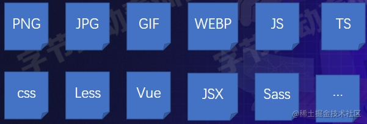

旧时代手动管理这些资源，但有以下几个对开发效率影响非常大的缺点：

* 依赖手工，比如有50个JS文件……操作过程繁琐
* 当代码文件之间有依赖的时候，就得严格按依赖顺序书写
* 开发与生产环境一致，难以接入TS或JS新特性
* 比较难接入Less、Sass等工具
* JS、 图片、CSS资源管理模型不一致

后来，出现了很多前端工程化工具，特别是Webpack

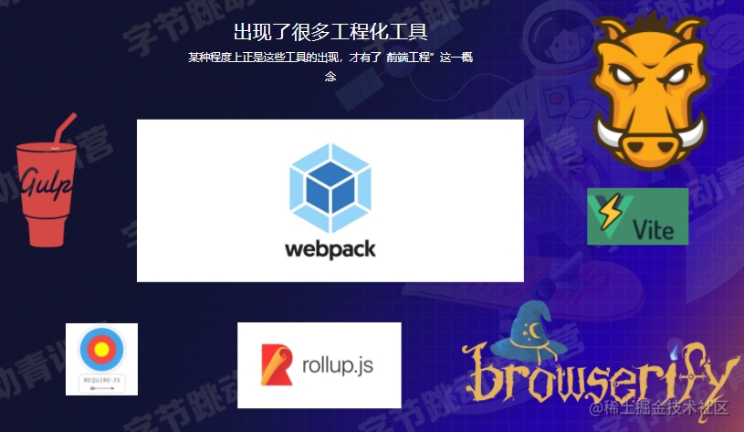

Web本质上是一种前端资源编译、打包工具

* 多份资源文件打包成一个Bundle
* 支持
  * Babel、Eslint、 TS、 CoffeScript、Less、 Sass
* 支持模块化处理css、图片等资源文件
* 支持 HMR + 开发服务器
* 支持持续监听、持续构建
* 支持代码分离
* 支持 Tree-shaking
* 支持 Sourcemap
* ...

#### <font style="color:#DF2A3F;">Webpack打包核心流程（必看）</font>

Entry => Dependencies Lookup => Transform => Bundle => Output

极度简化版：

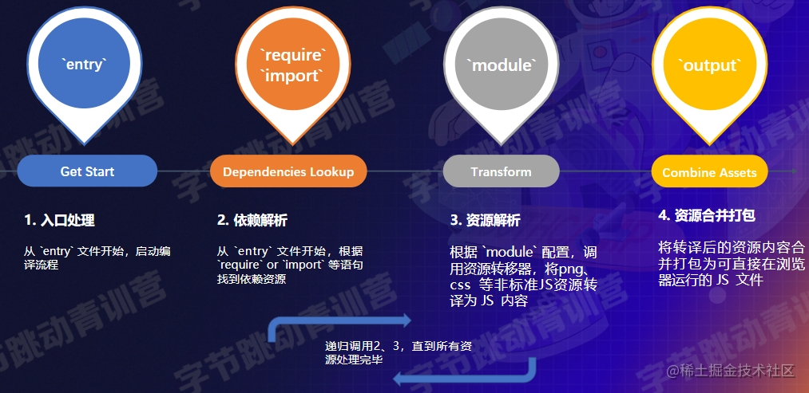

1. 从entry中的入口文件开始启动编译
2. 依赖解析：根据`require` 或者 `import` 等语句找到以来资源
3. 根据`module` 配置，调用资源转移器将非JS资源编译为JS内容，直至所有资源处理完毕
4. 资源合并打包：将转译后的资源内容合并打包为可直接在浏览器运行的JS文件

模块化 + 一致性

* 多个文件资源合并成一个，减少http请求数
* 支持模块化开发
* 支持高级JS特性
* 支持Typescript、 CoffeeScript 方言
* 统一图片、CSS、字体等其它资源的处理模型
* Etc...

***

**关键配置项（如何使用？）**

关于Webpack的使用方法，基本都围绕 配置 展开，而这些配置大致可划分为两类：

* 流程类：作用于流程中某个or若干个环节，直接影响打包效果的配置项
* 工具类：主流程之外，提供更多工程化能力的配置项

ps：官网文档确实，看不太懂（）

配置总览：

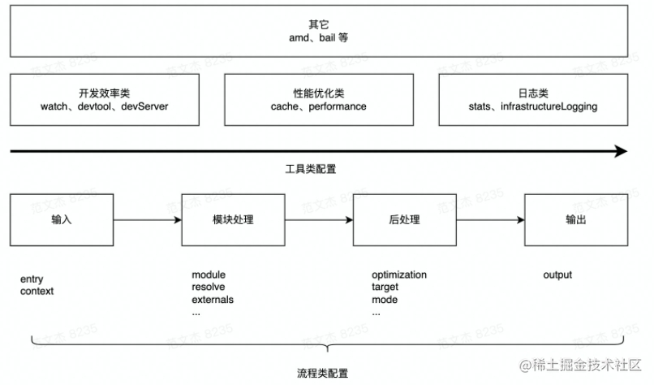

按使用频率，主要有以下几大配置项

* entry/output——程序输入输出，必需的
* module/plugins
  * 如图，比如我这个项目需要加载less文件，需要导入以下loader等


* mode
* watch/devServer/devtool

[Webpack配置官方文档](https://webpack.js.org/configuration/)

**使用Webpack处理CSS/less等**

安装Loader

1.

```bash
npm add -D css- Loader style-loader
```

2. 添加module处理css文件

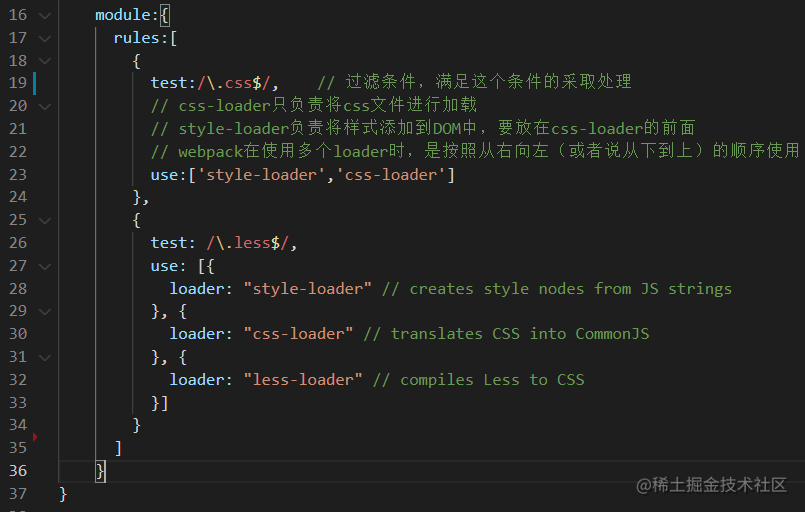

***

**使用Webpack接入Babel**

安装依赖

1.

```javascript
npm -D @babel/core @babel/preset-env babel-loader
```

2. 声明入口 `entry `& 产物出口`output`

添加module处理css文件

3.

```javascript
module:{
  rules:[
    {
      test:/\.js?$/,
      use:[{
        loader: 'babel-loader',
        options: {
          presets: [
            [
              '@babel/preset-env'
            ]
          ]
        }
      }]
    }
  ]
}
```

4. 执行 `npx webpack`

**使用Webpack生成html**

安装依赖

1.

```javascript
npm i -D html-webpack-plugin
```

2. 配置

```javascript
const path = require( ”path");
const HtmlWebpackPlugin = require('html-webpack-plugin');
module.exports = {
  entry: "./src/index",
  output: {
    filename:“ [name]. js",
    path: path.join(__dirname, "./dist"),
  },
  plugins: [new HtmlWebpackPlugin()]
};
```

1. 执行`npx webpack`

***

**使用Webpack——HMR**

Hot Module Replacement——模块热替换（写的代码会被立刻更新到浏览器上~）

开启HMR

1.

```javascript
module.exports={
  // ...
  devServer: {
    hot:true; // 必需
  }
};
```

**使用Webpack——Tree-Shaking**

Tree-Shaking -树摇，用于删除Dead Code

Dead Code

* 代码没有被用到，不可到达
* 代码的执行结果不会被用到
* 代码只读不写

Tree-Shaking

* 模块导出了，但未被其他模块使用

开启步骤？

* mode: "production"
* optimization: {usedExports: true}

复制

```javascript
module.exports = {
  entry: "./src/ index",
  mode: "production",
  devtool: false,
  optimization: {
    usedExports: true, 
  },
};
```

ps：对工具类库如Lodash有奇效，能大大减小产物体积

**其他工具**

* 缓存
* Sourcemap （前面的课程中有提过）
* 性能监控
* 日志
* 代码压缩
* 分包
* ...

***

**思考题**

* 除上面提到的内容，还有哪些配置可划分为“流程类” 配置？
* 工具类配置具体有什么作用？包括 devtool/cache/stat 等

#### 理解Loader

Loader核心功能：将非JS资源转换为JS资源

安装Loader

1.

```javascript
npm add -D css-loader style-loader less-loader
```

2. 添加module处理less文件

```javascript
module.exports = { 
  module: {
    rules: [
      {
        test: /\.less$/i,
        use:[
          "style-loader",
          "css-loader",
          "less-loader"，
        ],
      },
    ],
  },
};
```

##### 认识Loader：链式调用

* less-loader: 实现less => css的转换
* css-loader: 实现css => js的转换，将CSS包装成类似module.exports = "${css}" 的内容，包装后的内容符合JavaScript 语法
* style-loader：将css模块包进require语句，并在运行时调用injectStyle等函数将内容注入到页面的style标签

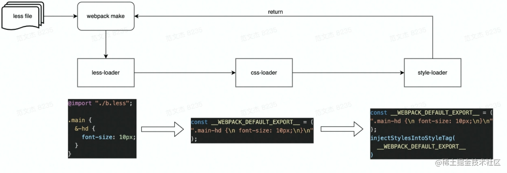

##### 认识Loader：其他特性

特点

* 链式执行
* 支持异步执行
* 分normal、pitch两种模式

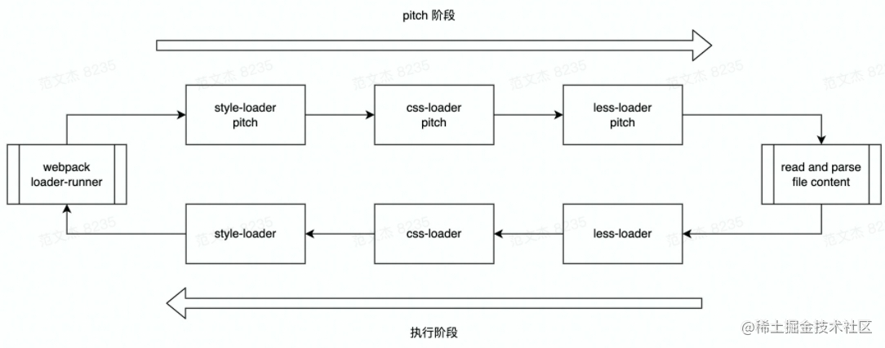

```javascript
module.exports = function(source, sourceMap?, data?) {
  // source 为loader的输入
  //可能是文件内容，也可能是上一个loader处理结果
  return source;
};
```

##### 常用Loader

* 站在使用角度，建议掌握这些常见Loader的功能、配置方法

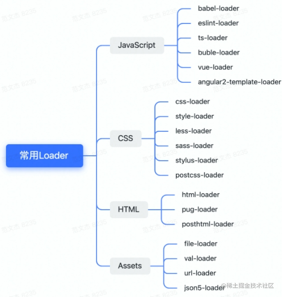

##### 思考题

* Loader输入是什么？要求的输出是什么？
* Loader的链式调用是什么意思？如何串联多个Loader？
* Loader中如何处理异步场景？要抛一个异常的话要怎么抛

#### 理解插件Plugin

##### 什么是插件

* 很多知名工具，如:
  * VS Code、Web Storm、Chrome、Firefox
  * Babel、Webpack、 Rollup、 Eslint
  * Vue、Redux、 Quill、 Axios
* 等等，都设计了所谓"插件”架构，为什么?

插件可以提升整个应用的拓展性

假设一个应用没有任何插件，整一个就是特别复杂的过程，那么：

* 新人需要了解整个流程细节，上手成本高
* 功能迭代成本高，牵一发动全身
* 功能僵化，作为开源项目而言缺乏成长性

心智成本高 => 可维护性低 => 生命力弱 插件架构精髓：对扩展开放，对修改封闭，其实就是开闭原则

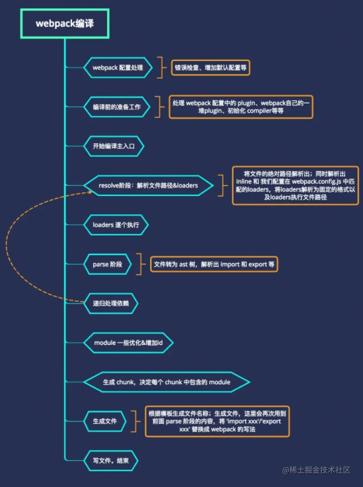

甚至，Webpack本身的很多功能也是基于插件实现的

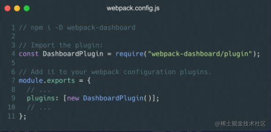

##### 如何编写插件

首先：插件围绕 钩子 展开

复制

```javascript
class SomePlugin {
  apply(compile) {
    compiler.hooks.thisCompilation.tap('SomePlugin', (compilation) => {
    })
  }
}
```

钩子

1. 时机：编译过程的特定节点，Webpack会以钩子形式通知插件此刻正在发生什么事情；
2. 上下文：通过tapable提供的回调机制，以参数方式传递上下文信息;
3. 交互：在上下文参数对象中附带了很多存在side effect的交互接口，插件可以通过这些接口改变

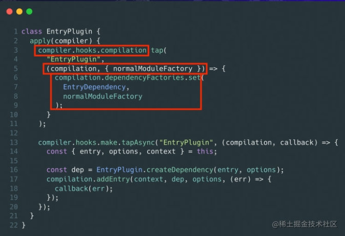

时机：compier.hooks.compilation

参数：compilation等

交互：dependencyFactories.set

#### loader和Plugin

**<font style="color:#000000;">你知道哪些 Loader 吗？</font>**

* <font style="color:#000000;">babel-loader：把 ES6 转换成 ES5</font>
* <font style="color:#000000;">less-loader：将 Less 代码转换成CSS</font>
* <font style="color:#000000;">sass-loader：将 SCSS/SASS 代码转换成CSS</font>
* <font style="color:#000000;">css-loader：加载 CSS，支持模块化、压缩、文件导入等特性</font>
* <font style="color:#000000;">style-loader：把 CSS 代码注入到 JavaScript 中，通过 DOM 操作去加载 CSS</font>
* <font style="color:#000000;">@svgr/webpack ：是一个 Webpack 插件，用于将 SVG 文件转换为 React 组件</font>
* <font style="color:#000000;">postcss-loader：扩展 CSS 语法，可以配合 autoprefixer 插件自动补齐 CSS3 前缀</font>
* <font style="color:#000000;">file-loader：把文件输出到文件夹中，在代码中通过相对 URL 去引用输出的文件 (处理图片和字体)</font>
* <font style="color:#000000;">url-loader：与 file-loader 类似，区别是用户可以设置一个阈值，大于阈值会交给 file-loader 处理，小于阈值时返回文件 base64 形式编码 (处理图片和字体)</font>
* <font style="color:#000000;">ts-loader: 将 TypeScript 转换成 JavaScript</font>
* <font style="color:#000000;">image-loader：加载并且压缩图片文件</font>
* <font style="color:#000000;">raw-loader：加载文件原始内容（utf-8）</font>
* <font style="color:#000000;">source-map-loader</font><font style="color:#000000;">：加载额外的 Source Map 文件，以方便断点调试</font>
* <font style="color:#000000;">svg-inline-loader：将压缩后的 SVG 内容注入代码中</font>
* <font style="color:#000000;">json-loader</font><font style="color:#000000;"> 加载 JSON 文件（默认包含）</font>
* <font style="color:#000000;">handlebars-loader: 将 Handlebars 模版编译成函数并返回</font>
* <font style="color:#000000;">awesome-typescript-loader：将 TypeScript 转换成 JavaScript，性能优于 ts-loader</font>
* <font style="color:#000000;">eslint-loader</font><font style="color:#000000;">：通过 ESLint 检查 JavaScript 代码</font>
* <font style="color:#000000;">tslint-loader</font><font style="color:#000000;">：通过 TSLint检查 TypeScript 代码</font>
* <font style="color:#000000;">mocha-loader</font><font style="color:#000000;">：加载 Mocha 测试用例的代码</font>
* <font style="color:#000000;">coverjs-loader</font><font style="color:#000000;">：计算测试的覆盖率</font>
* <font style="color:#000000;">vue-loader</font><font style="color:#000000;">：加载 Vue.js 单文件组件</font>
* <font style="color:#000000;">i18n-loader</font><font style="color:#000000;">: 国际化</font>
* <font style="color:#000000;">cache-loader: 可以在一些性能开销较大的 Loader 之前添加，目的是将结果缓存到磁盘里</font>

**<font style="color:#000000;">你知道哪些 Pugin 吗？</font>**

* <font style="color:#000000;">clean-webpack-plugin: 用于在构建新版本的项目时自动清理输出目录。这样可以确保每次构建时，输出目录只包含最新的构建文件，而不会保留旧的、过时的文件。</font>
* <font style="color:#000000;">mini-css-extract-plugin: 分离样式文件，CSS 提取为独立文件，支持按需加载</font>
* <font style="color:#000000;">html-webpack-plugin：简化 HTML 文件创建 (依赖于 html-loader)</font>
* <font style="color:#000000;">webpack-bundle-analyzer: 可视化 Webpack 输出文件的体积 </font>
* <font style="color:#000000;">terser-webpack-plugin: 支持压缩 ES6 (Webpack4)</font>
* <font style="color:#000000;">define-plugin</font><font style="color:#000000;">：定义环境变量 (Webpack4 之后指定 mode 会自动配置)</font>
* <font style="color:#000000;">ignore-plugin：忽略部分文件</font>
* <font style="color:#000000;">web-webpack-plugin：可方便地为单页应用输出 HTML，比 html-webpack-plugin 好用</font>
* <font style="color:#000000;">webpack-parallel-uglify-plugin: 多进程执行代码压缩，提升构建速度</font>
* <font style="color:#000000;">serviceworker-webpack-plugin：为网页应用增加离线缓存功能</font>
* <font style="color:#000000;">ModuleConcatenationPlugin</font><font style="color:#000000;">: 开启 Scope Hoisting</font>
* <font style="color:#000000;">speed-measure-webpack-plugin: 可以看到每个 Loader 和 Plugin 执行耗时 (整个打包耗时、每个 Plugin 和 Loader 耗时)</font>

**<font style="color:#000000;">Pugin 实现机制</font>**

* <font style="color:rgb(37, 41, 51);">「创建」—— </font><code><font style="color:rgb(37, 41, 51);">webpack</font></code><font style="color:rgb(37, 41, 51);"> 在其内部对象上创建各种钩子；</font>
* <font style="color:rgb(37, 41, 51);">「注册」—— 插件将自己的方法注册到对应钩子上，交给 </font><code><font style="color:rgb(37, 41, 51);">webpack</font></code><font style="color:rgb(37, 41, 51);">；</font>
* <font style="color:rgb(37, 41, 51);">「调用」—— </font><code><font style="color:rgb(37, 41, 51);">webpack</font></code><font style="color:rgb(37, 41, 51);"> 编译过程中，会适时地触发相应钩子，因此也就触发了插件的方法。</font>

**<font style="color:#000000;">你用过哪些可以提高效率的插件？</font>**

<font style="color:#000000;">webpack-dashboard：可以更友好的展示相关打包信息。</font>

<font style="color:#000000;">webpack-merge：提取公共配置，减少重复配置代码</font>

<font style="color:#000000;">speed-measure-webpack-plugin：简称 SMP，分析出 Webpack 打包过程中 Loader 和 Plugin 的耗时，有助于找到构建过程中的性能瓶颈。</font>

<font style="color:#000000;">size-plugin：监控资源体积变化，尽早发现问题</font>

<font style="color:#000000;">HotModuleReplacementPlugin：模块热替换</font>

**<font style="color:#000000;">说一说Loader和Plugin的区别？</font>**

1. **<font style="color:#000000;">Loader</font>**

* <font style="color:#000000;">Loader 由于 webpack 本身只能打包 commonjs 规范的js文件，所以，针对 css，图片等格式的文件没法打包，就需要引入第三方的模块进行打包。</font>
* <font style="color:#000000;">所以 Loader 就成了翻译官，对其他类型的资源进行转译的预处理工作。</font>
* <font style="color:#000000;">loader虽然是扩展了 webpack ，但是它只专注于转化文件（transform）这一个领域，完成压缩，打包，语言翻译。</font>
* <font style="color:#000000;">所以Loader本质就是一个函数，在该函数中对接收到的内容进行转换，返回转换后的结果。</font>

2. **<font style="color:#000000;">Plugin</font>**

* <font style="color:#000000;">Plugin 也是为了扩展 webpack 的功能，但是 plugin 是作用于webpack本身上的。</font>
* <font style="color:#000000;">而且 plugin 不仅只局限在打包，资源的加载上，它的功能要更加丰富。</font>
* <font style="color:#000000;">从打包优化和压缩，到重新定义环境变量，功能强大到可以用来处理各种各样的任务。</font>

2. **<font style="color:#000000;">Loader和Plugin的区别</font>**
3. **<font style="color:#000000;">职责不同：</font>**
   1. <font style="color:#000000;">Loader负责文件的转换，将不同类型的文件转换成Webpack可识别的模块； </font>
   2. <font style="color:#000000;">Plugin则更侧重于扩展Webpack的功能，可以对Webpack输出的结果进行优化、处理和修改。</font>
4. **<font style="color:#000000;">使用方式不同：</font>**
   1. <font style="color:#000000;">Loader通过module.rules配置使用，可以用于文件类型转换，例如将LESS、SCSS、ES6、JSX等文件转换并打包成最终的静态资源文件；</font>
   2. <font style="color:#000000;">Plugin则通过插件机制绑定到Webpack实例上，在Webpack构建生命周期的不同节点执行特定的操作。</font>
5. **<font style="color:#000000;">作用范围不同：</font>**
   1. <font style="color:#000000;">Loader是针对每个模块进行处理，对于特定类型的文件，Webpack在打包的过程中，找到对应的Loader进行处理，其作用范围仅限于自己匹配的文件；</font>
   2. <font style="color:#000000;">Plugin则作用于构建过程的整个生命周期中，Webpack 运行的生命周期中会广播出许多事件，Plugin 可以监听这些事件，在合适的时机通过 Webpack 提供的 API 改变输出结果。</font>
6. **<font style="color:#000000;">编写方式不同：</font>**
   1. <font style="color:#000000;">由于Loader和Plugin处理的方式不同，因此它们的编写方式也不同。</font>
   2. <font style="color:#000000;">Loader一般是以纯函数的形式编写，接受模块源码作为输入，输出转换后的结果；</font>
   3. <font style="color:#000000;">Plugin则是一个JavaScript类，包含一个apply方法，用于接收Webpack的Compiler对象，通过Compiler对象可以获取到Webpack在打包过程中产生的各种hook，然后在hook中完成特定操作。</font>

<font style="color:#000000;">总之，Loader和Plugin都是Webpack中非常重要的概念，分别承担着不同的职责，在Webpack的构建过程中发挥着各自独特的作用。</font>

#### dev server 常见配置

* <font style="color:rgb(0, 0, 0);">contentBase</font><font style="color:rgb(0, 0, 0);">: 告诉服务器从哪里提供内容。默认情况下，将使用当前工作目录作为提供内容的位置。</font>
* <font style="color:rgb(0, 0, 0);">host</font><font style="color:rgb(0, 0, 0);">: 设置开发服务器的主机地址，默认是</font><font style="color:rgb(0, 0, 0);"> </font><font style="color:rgb(0, 0, 0);">localhost</font><font style="color:rgb(0, 0, 0);">。</font>
* <font style="color:rgb(0, 0, 0);">port</font><font style="color:rgb(0, 0, 0);">: 设置开发服务器的端口号，默认是</font><font style="color:rgb(0, 0, 0);"> </font><font style="color:rgb(0, 0, 0);">8080</font><font style="color:rgb(0, 0, 0);">。</font>
* <font style="color:rgb(0, 0, 0);">open</font><font style="color:rgb(0, 0, 0);">: 设置为</font><font style="color:rgb(0, 0, 0);"> </font><font style="color:rgb(0, 0, 0);">true</font><font style="color:rgb(0, 0, 0);"> </font><font style="color:rgb(0, 0, 0);">时，开发服务器启动后将自动打开浏览器。</font>
* <font style="color:rgb(0, 0, 0);">hot</font><font style="color:rgb(0, 0, 0);">: 开启热模块替换功能，即如果模块更新了，只替换更新了的部分，网页不会全部刷新。</font>
* <font style="color:rgb(0, 0, 0);">historyApiFallback</font><font style="color:rgb(0, 0, 0);">: 任意的404响应都可能需要被替换为</font><font style="color:rgb(0, 0, 0);"> </font><font style="color:rgb(0, 0, 0);">index.html</font><font style="color:rgb(0, 0, 0);">。对于单页应用来说非常有用。</font>
* <font style="color:rgb(0, 0, 0);">headers</font><font style="color:rgb(0, 0, 0);">: 允许开发者自定义服务器响应的 HTTP 头。</font>
* <font style="color:rgb(0, 0, 0);">proxy</font><font style="color:rgb(0, 0, 0);">: 代理配置，可以将特定的 API 请求代理到另一台服务器上。</font>
* <font style="color:rgb(0, 0, 0);">compress</font><font style="color:rgb(0, 0, 0);">: 为所有服务启用 gzip 压缩。</font>

```jsx
// 开发服务器配置
devServer: {
  // 设置服务器访问的基本目录
  contentBase: path.join(__dirname, 'dist'), 
    // 服务器 IP 地址，可以使用 'localhost'
    host: 'localhost', 
    // 服务器端口号
    port: 8080,
    // 自动打开浏览器
    open: true, 
    // 热模块替换功能
    hot: true, 
    // 当使用 HTML5 History API 时，任意的 404 响应都可能需要被替代为 index.html
    historyApiFallback: true, 
    // 在所有响应中添加首部内容：
    headers: {
    'Access-Control-Allow-Origin': '*',
      },
  // 代理配置
  proxy: {
    '/api': {
      target: 'http://localhost:3000',
        pathRewrite: {'^/api' : ''},
        secure: false,
        changeOrigin: true,
        },
        },
      // 开启所有服务的 gzip 压缩：
      compress: true, 
        },
  };
```

#### Webpack的构建及原理

**<font style="color:#000000;">Webpack构建流程简单说一下</font>**

<font style="color:#000000;">Webpack 的运行流程是一个串行的过程，从启动到结束会依次执行以下流程：</font>

* **<font style="color:#000000;">初始化参数</font>**<font style="color:#000000;">：</font><font style="color:black;">从配置文件和 Shell 语句中读取与合并参数，得出最终的参数</font>
* **<font style="color:black;">开始编译</font>**<font style="color:black;">：用上一步得到的参数初始 </font><code><font style="color:black;">Compiler</font></code><font style="color:black;"> 对象，加载所有配置的插件，通 过执行对象的 </font><code><font style="color:black;">run</font></code><font style="color:black;"> 方法开始执行编译</font>
* **<font style="color:black;">确定入口：</font>**<font style="color:black;">根据配置中的 </font><code><font style="color:black;">Entry</font></code><font style="color:black;"> 找出所有入口文件</font>
* **<font style="color:#000000;">编译构建流程</font>**<font style="color:#000000;">：从 入口文件 出发，针对每个 模块 串行调用对应的 </font><code><font style="color:#000000;">Loader</font></code><font style="color:#000000;"> 去翻译文件内容，，递归地进行编译处理。</font>
* **<font style="color:black;">完成模块编译</font>**<font style="color:black;">  </font>翻译完所有模块后， 得到了每个模块被编译后的最终内容及它们之间的依赖关系
* **<font style="color:#000000;">输出流程</font>**<font style="color:#000000;">：</font>根据入口和模块之间的依赖关系，对<font style="color:#000000;">编译后的 模块 组合成 </font><code><font style="color:#000000;">Chunk</font></code><font style="color:#000000;">，把 </font><code><font style="color:#000000;">Chunk</font></code><font style="color:#000000;"> 转换成文件，输出到文件系统。</font>

<font style="color:#000000;">在以上过程中，Webpack 会在特定的时间点广播出特定的事件，插件在监听到目标事件后会执行特定的逻辑，并且插件可以调用 Webpack 提供的 API 改变 Webpack 的运行结果。</font>

<font style="color:#000000;">简单说</font>

* <font style="color:#000000;">初始化：启动构建，读取与合并配置参数，加载 Plugin，实例化 Compiler</font>
* <font style="color:#000000;">编译：从 Entry 出发，针对每个 Module 串行调用对应的 Loader 去翻译文件的内容，再找到该 Module 依赖的 Module，递归地进行编译处理</font>
* <font style="color:#000000;">输出：将编译后的 Module 组合成 Chunk，将 Chunk 转换成文件，输出到文件系统中</font>

**<font style="color:#000000;">Webpack 的原理了解吗？</font>**

<font style="color:#000000;">Webpack 的实现原理是将整个应用程序看做一个模块化的系统，通过分析模块之间的依赖关系来构建打包后的文件。</font>

1. <font style="color:#000000;">具体来说，Webpack 会从入口文件开始，递归地分析每个模块所依赖的其他模块，然后将这些模块打包成一个或多个文件。</font>
2. <font style="color:#000000;">Webpack 的核心是一个叫做“Compiler”的对象，它会对整个应用程序进行分析，生成一个“Compilation”对象，该对象包含了所有模块的依赖关系图和打包后的代码。</font>
3. <font style="color:#000000;">Webpack 的另一个核心概念是“Loader”和“Plugin”。</font>

* <font style="color:#000000;">Loader 是一个文件转换器，用于将文件从一种格式转换为另一种格式，例如将 ES6 转换为 ES5，或将 Sass 转换为 CSS。</font>
* <font style="color:#000000;">Plugin 则是用来扩展 Webpack 的功能，例如压缩代码、拷贝文件等。</font>

4. <font style="color:#000000;">在 Webpack 的构建流程中，还有一个非常重要的概念叫做“Chunk”。</font>

* <font style="color:#000000;">Chunk 是一段代码块，它是 Webpack 对模块打包后的结果，每个 Chunk 包含了多个模块，可以是同步或异步加载的模块。</font>
* <font style="color:#000000;">每个 Chunk 都有一个唯一的入口模块，可以通过入口模块的名称来访问。</font>

<font style="color:#000000;">最后，Webpack 还提供了一些优化功能，例如代码分割、Tree Shaking 等，可以帮助开发者优化代码的性能和体积。</font>

**<font style="color:#000000;">Webpack 的热更新原理</font>**

<font style="color:#000000;">HMR全称 Hot Module Replacement，可以理解为模块热替换，指在应用程序运行过程中，替换、添加、删除模块，而无需重新刷新整个应用。</font>

<font style="color:#000000;">例如，我们在应用运行过程中修改了某个模块，通过自动刷新会导致整个应用的整体刷新，那页面中的状态信息都会丢失。</font>

<font style="color:#000000;">如果使用的是</font><font style="color:#000000;"> </font><font style="color:#000000;">HMR</font><font style="color:#000000;">，就可以实现只将修改的模块实时替换至应用中，不必完全刷新整个应用</font>

<font style="color:#000000;">在webpack中配置开启热模块也非常的简单，如下代码：</font>

```javascript
const webpack = require('webpack')
module.exports = {
  // ...
  devServer: {
    // 开启 HMR 特性
    hot: true
    // hotOnly: true
  }
}
```

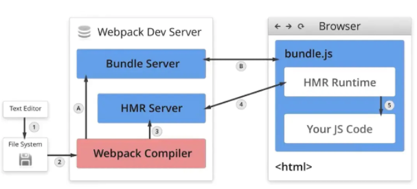

<font style="color:rgb(37, 41, 51);">整个流程分为客户端和服务端，</font>通过 `websocket` 建立起 浏览器端 和 服务器端 之间的通信

* <code><font style="color:rgb(37, 41, 51);">webpack</font></code><font style="color:rgb(37, 41, 51);"> 会创建 </font><code><font style="color:rgb(37, 41, 51);">webserver</font></code><font style="color:rgb(37, 41, 51);"> 静态服务器，让浏览器可以请求编译生成的静态资源</font>
* <font style="color:rgb(37, 41, 51);">还会创建 </font><code><font style="color:rgb(37, 41, 51);">websocket</font></code><font style="color:rgb(37, 41, 51);"> 服务，建立本地服务和浏览器的双向通信。</font>
* 然后以`watch`模式启动编译，监听到文件变化后，根据配置文件对模块重新编译打包，通过`websocket` 告知浏览器执行热更新逻辑。
* 浏览器接收服务器端推送的消息，如果需要热更新，浏览器发起 `http`请求去服务器端获取新的模块资源解析并局部刷新页面。

**<font style="color:#000000;">Webpack proxy 原理</font>**

<font style="color:#000000;">webpack proxy 即 webpack 提供的代理服务，基本行为就是接收客户端发送的请求后转发给目标服务器。</font>

<font style="color:#000000;">其目的就是为了便于开发者在开发模式下解决跨域问题，即浏览器安全策略限制。</font>

<font style="color:#000000;">想要实现代理首先需要一个中间服务器，webpack中提供服务器的工具为webpack-dev-server</font>

**<font style="color:#000000;">webpack-dev-server</font>**

<font style="color:#000000;">webpack-dev-server</font><font style="color:#000000;">是</font><font style="color:#000000;"> </font><font style="color:#000000;">webpack</font><font style="color:#000000;"> </font><font style="color:#000000;">官方推出的一款开发工具，将自动编译和自动刷新浏览器等一系列对开发友好的功能全部集成在了一起</font>

<font style="color:#000000;">目的是为了提高开发者日常的开发效率，</font><font style="color:#000000;">只适用在开发阶段</font>

<font style="color:#000000;">关于配置方面，在webpack配置对象属性中通过devServer属性提供，如下：</font>

```javascript
// ./webpack.config.js
const path = require('path')

module.exports = {
    // ...
    devServer: {
        contentBase: path.join(__dirname, 'dist'),
        compress: true,
        port: 9000,
        proxy: {
            '/api': {
                target: 'https://api.github.com'
            }
        }
        // ...
    }
}
```

<font style="color:#000000;">属性的名称是需要被代理的请求路径前缀，一般为了辨别都会设置前缀为/api，值为对应的代理匹配规则，对应如下：</font>

* <font style="color:#000000;">target：表示的是代理到的目标地址</font>
* <font style="color:#000000;">pathRewrite：默认情况下，我们的 /api-hy 也会被写入到URL中，如果希望删除，可以使用pathRewrite</font>
* <font style="color:#000000;">secure：默认情况下不接收转发到https的服务器上，如果希望支持，可以设置为false</font>
* <font style="color:#000000;">changeOrigin：它表示是否更新代理后请求的 headers 中host地址</font>

<font style="color:#000000;">proxy工作原理实质上是利用http-proxy-middleware 这个http代理中间件，实现请求转发给其他服务器</font>

<font style="color:#000000;">举个例子：</font>

<font style="color:#000000;">在开发阶段，本地地址为http://localhost:3000，该浏览器发送一个前缀带有/api标识的请求到服务端获取数据，但响应这个请求的服务器只是将请求转发到另一台服务器中</font>

```javascript
const express = require('express');
const proxy = require('http-proxy-middleware');

const app = express();

app.use('/api', proxy({target: 'http://www.example.org', changeOrigin: true}));
app.listen(3000);

// http://localhost:3000/api/foo/bar -> http://www.example.org/api/foo/bar
```

#### 如何实现一个 Webpack ？

1. <font style="color:#000000;">将 </font><code><font style="color:#000000;">import</font></code><font style="color:#000000;"> 这种浏览器不认识的关键字替换成了</font><code><font style="color:#000000;">__webpack_require__</font></code><font style="color:#000000;">函数调用。</font>
2. <code><font style="color:#000000;">__webpack_require__</font></code><font style="color:#000000;">在实现时采用了类似 </font><code><font style="color:#000000;">CommonJS</font></code><font style="color:#000000;"> 的模块思想。</font>
3. <font style="color:#000000;">一个文件就是一个模块，对应模块缓存上的一个对象。</font>
4. <font style="color:#000000;">当模块代码执行时，会将</font><font style="color:#000000;">export</font><font style="color:#000000;">的内容添加到这个模块对象上。</font>
5. <font style="color:#000000;">当再次引用一个以前引用过的模块时，会直接从缓存上读取模块。</font>

### <font style="color:#8CCF17;">Webpack 高级特性与优化</font>

#### <font style="color:#DF2A3F;">Webpack的性能优化（必看）</font>

***<u><font style="color:#000000;">提高 Webpack 打包速度</font></u>***

1. <font style="color:#000000;">优化loader配置</font>
2. <font style="color:#000000;">优化resolve.alias 起别名</font>
3. <font style="color:#000000;">使用cache-loader 进行</font><font style="color:#000000;">缓存</font>
4. <font style="color:#000000;">HappyPack 启动多线程</font>
5. <font style="color:#000000;">合理使用 sourceMap</font>

**<font style="color:#000000;">优化loader配置，精准匹配文件，缩小文件范围</font>**

<font style="color:#000000;">在使用</font><code><font style="color:#000000;">loader</font></code><font style="color:#000000;">时，可以通过配置</font><code><font style="color:#000000;">include</font></code><font style="color:#000000;">、</font><code><font style="color:#000000;">exclude</font></code><font style="color:#000000;">、</font><code><font style="color:#000000;">test</font></code><font style="color:#000000;">属性来精准的匹配哪些文件应用</font><code><font style="color:#000000;">loader</font></code><font style="color:#000000;">。</font>

<font style="color:#000000;">使用include来指定编译文件夹，exclude排除指定文件夹。</font>

```javascript
module.exports = {
  module: {
    rules: [
      {
        // 如果项目源码中只有 js 文件就不要写成 /\.jsx?$/，提升正则表达式性能
        test: /\.js$/,
        // babel-loader 支持缓存转换出的结果，通过 cacheDirectory 选项开启
        use: ['babel-loader?cacheDirectory'],
        //使用include来指定编译文件夹只对项目根目录下的 src 目录中的文件采用 babel-loader
        include: path.resolve(__dirname, 'src'),
  			//使用exclude排除指定文件夹
  			exclude: /node_modules/,
      },
    ]
  },
};
```

**<font style="color:#000000;">优化 resolve.alias 起别名</font>**

<font style="color:#000000;">alias给一些常用的路径起一个别名，特别当我们的项目目录结构比较深的时候，一个文件的路径可能是./../../的形式</font>

<font style="color:#000000;">通过配置alias以减少查找过程</font>

```javascript
module.exports = {
    ...
    resolve:{
        alias:{
            "@":path.resolve(__dirname,'./src')
        }
    }
}
```

**<font style="color:#000000;">使用 cache-loader 缓存</font>**

<font style="color:#000000;">在一些性能开销较大的</font><code><font style="color:#000000;">loader</font></code><font style="color:#000000;">之前添加</font><code><font style="color:#000000;">cache-loader</font></code><font style="color:#000000;">，以将结果缓存到磁盘里，显著提升二次构建的速度。</font>

<font style="color:#000000;">注意：保存和读取这些缓存文件也会有一些时间开销，所以只对性能开销较大的</font><code><font style="color:#000000;">loader</font></code><font style="color:#000000;">使用此</font><code><font style="color:#000000;">loader</font></code>

```javascript
module.exports = {
    module: {
        rules: [
            {
                test: /\.ext$/,
                use: ['cache-loader', ...loaders],
                include: path.resolve('src'),
            },
        ],
    },
};
```

**<font style="color:#000000;">HappyPack 启动多线程</font>**

<font style="color:#000000;">HappyPack 可以将 Loader 的同步执行转换为并行的，这样就能充分利用系统资源来加快打包效率了。</font>

<font style="color:#000000;">这是一个Webpack插件，它可以将模块的加载和构建过程分解为多个子进程，从而实现多线程构建。</font>

```javascript
module: {
  rules: [
    {
      test: /.js$/,
      loader: 'happypack/loader?id=js',
      include: [resolve('src')],
      exclude: /node_modules/
    }
  ]
},
plugins: [
  new HappyPack({
    id: 'js',//与rule中指定的id一致
    // 开启四个线程
    threads: 4,//必须配置，用于指定开启几个 worker，建议设置成 os.cpus().length - 1
    verbose: true,//是否输出详细的日志信息
    loaders: ['babel-loader?cacheDirectory'],//如何处理 js 文件，如将其转成 es5 代码
  })
]
```

**<font style="color:#000000;">合理使用Source map</font>**

<font style="color:#000000;">在开发环境下，因为需要调试源代码，一般会开启Source Map。</font>

<font style="color:#000000;">而在生产环境下，为了保护代码的安全且获得更好的性能，我们一般不开启Source Map。</font>**<font style="color:#000000;"></font>**

<font style="color:#000000;">Source map 的模式</font>

1. <font style="color:#000000;">开发环境下开启：在开发环境下启用Source map可以帮助开发者快速定位错误和调试代码。</font>

* <font style="color:#000000;">但是在构建生产代码时应该禁用，确保代码被混淆和压缩。</font>

2. <font style="color:#000000;">使用</font><code><font style="color:#000000;">Cheap</font></code><font style="color:#000000;">模式：开启Cheap模式可以大幅度减少构建时间，它只会标记行而不会标记列，因此精度较低，但对于代码调试已经足够。</font>
3. <font style="color:#000000;">使用</font><code><font style="color:#000000;">eval</font></code><font style="color:#000000;">模式：开启eval模式可以进一步缩短构建时间，因为它会将Source map嵌入到eval中，从而避免了Source map文件的生成和加载。</font>
4. <font style="color:#000000;">使用</font><code><font style="color:#000000;">inline</font></code><font style="color:#000000;">模式：将Source map嵌入到打包文件中，可以避免Source map文件的下载，但会增加打包文件的大小。</font>
5. <font style="color:#000000;">使用</font><code><font style="color:#000000;">external</font></code><font style="color:#000000;">模式：将Source map文件分离到单独的文件中，可以避免打包文件过大，同时也便于对Source map文件进行管理。</font>

***<u><font style="color:#000000;">减少 Webpack 打包体积</font></u>***

**<font style="color:#000000;">按需加载</font>**

<font style="color:#000000;">在开发 SPA 项目的时候，项目中都会存在很多路由页面。</font>

<font style="color:#000000;">如果将这些页面全部打包进一个 JS 文件的话，虽然将多个请求合并了，但是同样也加载了很多并不需要的代码，耗费了更长的时间。</font>

<font style="color:#000000;">那么为了首页能更快地呈现给用户，希望首页能加载的文件体积越小越好，这时候就可以使用按需加载，将每个路由页面单独打包为一个文件。</font>

<font style="color:#000000;">在 Webpack 中，可以结合 React Router（或者其他前端路由库）实现路由级别的代码分割：</font>

1. **<font style="color:#000000;">动态</font>****<font style="color:#000000;"> </font>****<font style="color:#000000;">import()</font>**<font style="color:#000000;">:\ </font><font style="color:#000000;">使用动态</font><font style="color:#000000;"> </font><font style="color:#000000;">import()</font><font style="color:#000000;"> </font><font style="color:#000000;">语法来导入路由组件。这会指示 Webpack 将这些组件的代码分割出去并在需要时才加载。</font>
2. **<font style="color:#000000;">React Router </font>****<font style="color:#000000;">React.lazy</font>****<font style="color:#000000;"> 和 </font>\*\*\*\*<font style="color:#000000;">Suspense</font>**<font style="color:#000000;">:\ </font><font style="color:#000000;">React 提供了内建的懒加载工具 </font><font style="color:#000000;">React.lazy</font><font style="color:#000000;"> 和 </font><font style="color:#000000;">Suspense</font><font style="color:#000000;">。</font><font style="color:#000000;">React.lazy</font><font style="color:#000000;"> 允许你定义一个动态加载的组件，而 </font><font style="color:#000000;">Suspense</font><font style="color:#000000;"> 组件可以指定加载指示器（如旋转的加载图标），在组件正在加载时显示。</font>

```javascript
import React, { Suspense, lazy } from 'react';
import { BrowserRouter as Router, Route, Switch } from 'react-router-dom';

// 使用 React.lazy 和动态 import() 定义懒加载组件
const HomePage = lazy(() => import('./pages/HomePage'));
const AboutPage = lazy(() => import('./pages/AboutPage'));
const ContactPage = lazy(() => import('./pages/ContactPage'));

function App() {
  return (
    <Router>
      <Suspense fallback={<div>Loading...</div>}>
        <Switch>
          <Route exact path="/" component={HomePage} />
          <Route path="/about" component={AboutPage} />
          <Route path="/contact" component={ContactPage} />
          // ...其他路由
        </Switch>
      </Suspense>
    </Router>
  );
}
```

<font style="color:#000000;">原理：</font>

<font style="color:#000000;">在单页面应用（SPA）中实现路由级别的按需加载主要依赖于两个核心原理：代码分割（Code Splitting）和动态导入（Dynamic Imports）。</font>

<font style="color:#000000;">以下是详细的原理介绍：</font>

<font style="color:#000000;"></font>

**<font style="color:#000000;">代码分割（Code Splitting）</font>**

<font style="color:#000000;">代码分割是一种将应用分解成多个独立的代码块（chunks）的技术，这些代码块可以独立加载。</font>

<font style="color:#000000;">Webpack 支持配置多个入口点（entry points）或者使用特定的插件和加载器（loaders）来自动分割代码。</font>

<font style="color:#000000;">在 SPA 中，通常会在路由级别进行代码分割，这意味着每个路由映射到一个或多个代码块。</font>

<font style="color:#000000;">这些代码块在用户访问对应的路由时才会被加载。</font>

<font style="color:#000000;"></font>

**<font style="color:#000000;">动态导入（Dynamic Imports）</font>**

<font style="color:#000000;">动态导入是指在代码执行过程中动态地加载模块或组件。</font>

<font style="color:#000000;">在 JavaScript 中，可以使用 </font><font style="color:#000000;">import()</font><font style="color:#000000;"> 函数（这是一个提案中的语法，但在 Webpack 中已被实现）来实现动态导入。</font>

<font style="color:#000000;">import()</font><font style="color:#000000;"> 函数返回一个 Promise 对象，该对象在模块加载成功时解析为模块的导出。</font>

<font style="color:#000000;"></font>

**<font style="color:#000000;">结合 React Router 和 Webpack</font>**

<font style="color:#000000;">在结合 React Router 和 Webpack 实现路由级别的按需加载时，以下步骤展示了整个流程：</font>

1. <font style="color:#000000;">开发者定义路由配置时，使用</font><font style="color:#000000;"> </font><font style="color:#000000;">React.lazy</font><font style="color:#000000;"> </font><font style="color:#000000;">函数包裹动态导入的路由组件，而不是直接导入。</font>
2. <font style="color:#000000;">当应用运行并且用户访问特定路由时，React 会尝试渲染对应的懒加载组件。</font>
3. <font style="color:#000000;">React.lazy</font><font style="color:#000000;"> </font><font style="color:#000000;">函数内部会调用</font><font style="color:#000000;"> </font><font style="color:#000000;">import()</font><font style="color:#000000;"> </font><font style="color:#000000;">函数，触发 Webpack 进行代码分割并加载相应的 chunk。</font>
4. <font style="color:#000000;">Webpack 识别到</font><font style="color:#000000;"> </font><font style="color:#000000;">import()</font><font style="color:#000000;"> </font><font style="color:#000000;">函数后，会自动将被导入的模块分割到一个新的 chunk 中，并生成一个新的文件（通常带有唯一的 hash）。</font>
5. <font style="color:#000000;">在组件实际被渲染前，</font><font style="color:#000000;">Suspense</font><font style="color:#000000;"> </font><font style="color:#000000;">组件提供了一个 fallback 用于显示加载状态（例如一个加载指示器），直到懒加载组件的 Promise 解析完成，即组件代码加载并准备好渲染。</font>
6. <font style="color:#000000;">当 Webpack 加载完成 chunk 后，</font><font style="color:#000000;">import()</font><font style="color:#000000;"> </font><font style="color:#000000;">Promise 被解析，懒加载组件被渲染到 DOM 中。</font>
7. <font style="color:#000000;">对于未来的路由切换，如果之前加载过的 chunk 已经存在于浏览器缓存中，Webpack 会重用这些缓存的代码，而不是重新加载，从而加快后续页面的加载速度。</font>

<font style="color:#000000;">这种按需加载的模式意味着用户只需加载他们需要访问的页面代码，而不需要一开始就加载整个应用的代码。这显著提升了性能，尤其是在首次页面加载时，因为这能减小初始负载，加快首屏显示时间，并节省带宽。</font>

**<font style="color:#000000;">Tree-Shaking</font>**

<font style="color:#000000;">通过静态代码分析的方式，识别出未使用的模块、函数、变量等，并将其从最终的构建输出中删除。</font>

<font style="color:#000000;">在 Webpack 中，启动 Tree Shaking 功能必须同时满足三个条件：</font>

* <font style="color:#000000;">使用 ESM 规范编写</font><font style="color:#000000;">模块代码，因为 Tree-Shaking 强依赖于 ESM 模块化方案的静态分析能力，所以你应该尽量坚持使用 ESM 编写模块代码。对比而言，在过往的 CommonJS、AMD、CMD 旧版本模块化方案中，导入导出行为是高度动态，难以预测的</font>
* <font style="color:#000000;">配置 optimization.usedExports 为 true，启动标记功能；</font>
* <font style="color:#000000;">启动代码优化功能，可以通过如下方式实现：</font>
  * <font style="color:#000000;">配置 mode = production；</font>
  * <font style="color:#000000;">配置</font><font style="color:#000000;"> </font><font style="color:#000000;">optimization.minimize = true</font><font style="color:#000000;"> </font><font style="color:#000000;">；</font>
  * <font style="color:#000000;">提供 optimization.minimizer 数组。</font>

```jsx
// webpack.config.js
module.exports = {
  entry: "./src/index",
  mode: "production",
  devtool: false,
  optimization: {
    usedExports: true,
  },
};
```

<font style="color:#000000;">原理：</font>

* <font style="color:#000000;">静态分析：Tree Shaking 依赖于静态代码分析，它在不执行实际代码的情况下，通过解析 JavaScript 源代码来了解模块之间的依赖关系、函数的调用关系和变量的引用关系。这种静态分析是在构建过程中进行的，通常由构建工具（如Webpack、Rollup、Vite等）的插件或内置功能完成。</font>

<font style="color:#000000;">标记未使用代</font>**<font style="color:#000000;"></font>**<font style="color:#000000;">码：在静态分析过程中，Tree Shaking 标记未使用的代码。它会识别模块中的导出（export）和导入（import）语句，并通过分析导入和导出之间的依赖关系，判断哪些代码是被使用的，哪些是未使用的。</font>

* <font style="color:#000000;">删除未使用代码：一旦标记了未使用的代码，Tree Shaking 就会将这些代码从最终的打包结果中删除。对于模块而言，未使用的模块会被完全移除。对于模块内的代码块（函数、变量等），未使用的代码会被删除或替换为无操作代码，以确保它们不会出现在最终的打包文件中。</font>
* <font style="color:#000000;">依赖关系追踪：Tree Shaking 还需要追踪模块之间的依赖关系，以确定哪些模块是被使用的。通过分析导入语句，它可以构建一个依赖图，记录模块之间的关系。这样，在标记未使用代码时，Tree Shaking 可以确定哪些模块是被使用的，哪些是没有被使用的。</font>
* <font style="color:#000000;">优化输出：一旦完成 Tree Shaking 过程，构建工具会生成优化的输出文件。未使用的模块和代码块被删除，最终的打包文件只包含被使用的部分，从而减小了文件的大小。</font>

Tree shaking 通常在以下情况下无法有效进行：

1. **动态导入**<font style="color:#000000;">：如果使用 </font><code><font style="color:#000000;">require</font></code><font style="color:#000000;"> 或者动态的 </font><code><font style="color:#000000;">import()</font></code><font style="color:#000000;">，工具可能无法确定哪些模块是未使用的。</font>
2. **副作用**<font style="color:#000000;">：如果模块有副作用（即导入模块会改变程序状态或产生其他影响），tree shaking 会认为这些模块都需要被保留，以确保程序的正确性。</font>
3. **不支持的模块格式**<font style="color:#000000;">：某些模块格式（如 CommonJS）不太适合 tree shaking，尤其是与 ES6 模块混用时。</font>
4. **没有使用 ES6 模块语法**<font style="color:#000000;">：如果代码中没有使用 </font><code><font style="color:#000000;">import</font></code><font style="color:#000000;"> 和 </font><code><font style="color:#000000;">export</font></code><font style="color:#000000;">，tree shaking 将无法识别和移除未使用的代码。</font>
5. **复杂的依赖关系**<font style="color:#000000;">：如果模块之间的依赖关系很复杂，可能导致工具无法安全地移除未使用的代码。</font>

**<font style="color:#000000;">SplitChunkPlugin</font>**

<font style="color:#000000;">将相同的代码压缩到一个公共文件中，并将其分离出来，以提高页面加载速度。</font>

<font style="color:#000000;">通过</font><code><font style="color:#000000;">SplitChunkPlugin</font></code><font style="color:#000000;">可以将应用程序的公共库和应用程序代码分开，防止其中的一个库过大并阻止页面初始加载。</font>

<code><font style="color:#000000;">Webpack</font></code><font style="color:#000000;"> 提供了 </font><code><font style="color:#000000;">SplitChunksPlugin</font></code><font style="color:#000000;"> 默认的配置，我们也可以手动来修改他的配置</font>

* <font style="color:#000000;">比如默认配置中，chunks 仅仅针对异步async 请求，我们也可以设置为all</font>
* <font style="color:#000000;">需要在 optimization 配置下进行。</font>

```javascript
module.export = {
  // 优化配置
  optimization:{
    SplitChunks:{
      // chunks 仅仅针对异步async 请求，我们也可以设置为all
     	chunks:"all",
      // 当一个包大于指定的大小时，继续进行拆包
      maxSize:20000
    }
  }
}
// 根据 Module 使用频率分包
module.exports = {
  //...
  optimization: {
    splitChunks: {
      // 设定引用次数超过 2 的模块才进行分包
      minChunks: 2
    },
  },
}
```

<code><font style="color:#000000;">SplitChunks</font></code><font style="color:#000000;"> 是一种将代码拆分成独立块的优化技术。它可以将共享的代码提取到单独的文件中，以便更好地利用缓存，并减小最终打包文件的大小。</font>

<code><font style="color:#000000;">SplitChunks</font></code><font style="color:#000000;"> 遵循一些规则来确定哪些模块应该被拆分成共享块。</font>

1. <font style="color:#000000;">代码块的大小：SplitChunks 会检查各个代码块的大小。默认情况下，它会将大小超过一定阈值（通常是30KB）的代码块拆分成单独的文件。</font>
2. <font style="color:#000000;">共享模块</font><font style="color:#000000;">：SplitChunks 会查找被多个模块引用的共享模块，并将其提取到独立的共享块中。这样做可以避免重复加载和复制相同的代码。</font>
3. <font style="color:#000000;">缓存组</font><font style="color:#000000;">：SplitChunks 可以使用缓存组（cache group）来定义拆分规则。缓存组允许根据模块的属性（如模块名称、路径、引用次数等）将模块分组，并将符合条件的模块拆分成单独的文件。通过配置多个缓存组，可以根据需求定制拆分规则。</font>
4. <font style="color:#000000;">预取/预加载模块：SplitChunks 还可以根据预取（prefetch）和预加载（preload）的策略来拆分模块。预取模块表示在将来某个导航到达的页面上可能需要的模块，而预加载模块表示在当前页面加载完成后立即请求的模块。通过配置预取/预加载策略，可以更好地管理模块的拆分和加载。</font>

<font style="color:#000000;">原理 ：</font>

<code><font style="color:#000000;">SplitChunks</font></code><font style="color:#000000;"> 的原理是通过静态代码分析和依赖关系追踪，将共享的模块或代码块提取到独立的文件中，以便在不同的代码块之间共享和复用。</font>

<font style="color:#000000;">以下是 SplitChunks 的详细工作原理：</font>

1. <font style="color:#000000;">静态分析：SplitChunks 首先进行静态代码分析，解析 JavaScript 源代码，了解模块之间的依赖关系、函数的调用关系和变量的引用关系。这种静态分析是在构建过程中进行的，通常由构建工具（如Webpack）的插件或内置功能完成。</font>
2. <font style="color:#000000;">模块的共享和重复引用：通过静态分析，SplitChunks 查找被多个模块引用的共享模块。这些共享模块可能是应用程序的公共库、第三方依赖或自定义的共享模块。SplitChunks 还会检查是否有模块被重复引用，以避免重复加载和复制相同的代码。</font>
3. <font style="color:#000000;">拆分成共享块</font><font style="color:#000000;">：一旦确定了共享的模块，SplitChunks 将这些模块提取到单独的共享块中。这些共享块会被命名，并生成独立的文件。通过将共享的模块拆分成共享块，可以利用浏览器的缓存机制，避免在多个代码块中重复加载相同的模块。</font>
4. <font style="color:#000000;">缓存组和拆分规则</font><font style="color:#000000;">：SplitChunks 还可以通过缓存组来定义拆分规则。缓存组允许根据模块的属性（如模块名称、路径、引用次数等）将模块分组，并将符合条件的模块提取到独立的共享块中。通过配置缓存组，可以根据具体需求定制拆分规则，并灵活地控制代码块的拆分。</font>
5. <font style="color:#000000;">加载和引用共享块：在最终的打包结果中，共享块会被生成为单独的文件，可以通过在 HTML 中添加相应的 <script> 标签来加载它们。在引用共享块的代码块中，可以使用异步加载的方式（如动态 import() 或使用 import 语句）来加载和使用共享块中的模块。</font>

**<font style="color:#000000;">MinCssExtractPlugin</font>**

<font style="color:#000000;">提取单独提取 CSS 文件</font>

```javascript
const MinCssExtractPlugin = require('mini-css-extract-plugin')
```

```javascript
module.exports = {
  {
    test:/\.css$/,
    use:[
      // 'style-loader' 开发阶段使用
      MiniCssExtractPlugin.loader,// 生产阶段使用
      'css-loader'
    ]  
  }
    plugins:[
    new MinCssExtractPlugin({
      // 放到一个单独的css文件夹里面
      // 正常导入的包的名称
      filename:'css/[name].css',
      // 动态导入的包的名称
      chunkFilename:'css/[name]_chunk.ss'
    });
  ]
}
```

#### <font style="color:#DF2A3F;">Webpack 5 有哪些新特性（必看）</font>

<font style="color:#000000;">模块联邦 指 多个独立的构建可以组成一个应用程序，这些独立的构建之间不应该存在依赖关系，因此可以单独开发和部署它们。</font>

**<font style="color:#000000;">持久化缓存</font>**

<font style="color:#000000;">Webpack 5 引入了内置的持久化缓存功能，可以显著提高构建性能。通过缓存模块和生成的 chunk，重复构建的速度会更快。</font>

**<font style="color:#000000;">模块联邦（Module Federation）</font>**

<font style="color:#000000;">这是 Webpack 5 的一个重大特性，它允许一个 JavaScript 应用动态地运行来自另一个应用的代码，无需重新编译。它允许不同团队独立开发和部署应用的各个部分。</font>

<font style="color:#000000;">模块联邦可以在多个 </font><code><font style="color:#000000;">webpack</font></code><font style="color:#000000;"> 编译产物之间共享模块、依赖、页面甚至应用，通过全局变量的组合，还可以在不同模块之前进行数据的获取，让跨应用间做到模块共享真正的插拔式的便捷使用。</font>

<font style="color:#000000;">比如</font><code><font style="color:#000000;">a</font></code><font style="color:#000000;">应用如果想使用</font><code><font style="color:#000000;">b</font></code><font style="color:#000000;">应用中</font><code><font style="color:#000000;">table</font></code><font style="color:#000000;">的组件，通过模块联邦可以直接在</font><code><font style="color:#000000;">a</font></code><font style="color:#000000;">中进行</font><code><font style="color:#000000;">import('b/table')</font></code><font style="color:#000000;">非常的方便。</font>

1. <font style="color:#000000;">在远程应用的 </font><code><font style="color:#000000;">webpack.config.js</font></code><font style="color:#000000;"> </font><font style="color:#000000;">文件中，使用 </font><code><font style="color:#000000;">ModuleFederationPlugin</font></code><font style="color:#000000;"> 来定义暴露的模块：</font>

```javascript
const ModuleFederationPlugin = require("webpack/lib/container/ModuleFederationPlugin");

module.exports = {
  // ...其他配置
  plugins: [
    new ModuleFederationPlugin({
      name: "remoteApp", // 远程应用的名称
      filename: "remoteEntry.js", // 远程入口文件的名称
      exposes: {
        // 定义暴露的模块及其路径
        "./Button": "./src/Button.js",
      },
      shared: ["react", "react-dom"], // 指定共享依赖，可以避免重复加载
    }),
  ],
};
```

2. <font style="color:#000000;">在宿主应用的 </font><code><font style="color:#000000;">webpack.config.js</font></code><font style="color:#000000;"> </font><font style="color:#000000;">文件中，同样使用 </font><code><font style="color:#000000;">ModuleFederationPlugin</font></code><font style="color:#000000;"> 来配置对远程模块的引用：</font>

```javascript
const ModuleFederationPlugin = require("webpack/lib/container/ModuleFederationPlugin");

module.exports = {
  // ...其他配置
  plugins: [
    new ModuleFederationPlugin({
      remotes: {
        // 远程应用的名称和 URL
        remoteApp: "remoteApp@http://localhost:3001/remoteEntry.js",
      },
      shared: ["react", "react-dom"], // 与远程应用共享的依赖
    }),
  ],
};
```

3. <font style="color:#000000;">在宿主应用中，可以使用动态 </font><font style="color:#000000;">import()</font><font style="color:#000000;"> 语法或 </font><font style="color:#000000;">React.lazy</font><font style="color:#000000;"> 来加载远程应用中暴露的模块：</font>

```javascript
// 动态导入远程模块
const RemoteButton = React.lazy(() => import("remoteApp/Button"));

function App() {
  return (
    <div>
      <h1>宿主应用</h1>
      <React.Suspense fallback="Loading Button...">
        <RemoteButton />
      </React.Suspense>
    </div>
  );
}

export default App;
```

**<font style="color:#000000;">更好的 Tree Shaking:</font>**

<font style="color:#000000;">通过静态代码分析的方式，识别出未使用的模块、函数、变量等，并将其从最终的构建输出中删除。</font>

* <font style="color:#000000;">依赖于ES6的模块特性，ES6模块依赖关系是确定的，和运行时的状态无关，可以进行可靠的静态分析，这就是 tree-shaking 的基础。</font>
* <font style="color:#000000;">静态分析就是不需要执行代码，就可以从字面量上对代码进行分析。</font>
* <font style="color:#000000;">ES6之前的模块化，比如 CommonJS 是动态加载，只有执行后才知道引用的什么模块，就不能通过静态分析去做优化，正是基于这个基础上，才使得 tree-shaking 成为可能。</font>

#### 说说你对 webpack5 模块联邦的了解?

Webpack5 的模块联邦(Module Federation)是一种新的技术，可以实现多个独立 Webpack 构建之间的共享模块和代码。它通过让每个构建的应用程序能够使用其他应用程序中的模块来提高代码共享和复用的效率。

Module Federation 基于 webpack 的远程容器特性。它允许将一个应用程序的某些模块打包为一个独立的、可远程加载的 bundle，并在运行时动态地加载这些模块。这样，在另一个应用程序中就可以通过远程容器加载这些模块，并直接使用它们。这种方式可以避免重复打包和加载相同的模块或库，提高了应用程序的性能和效率。Module Federation 的主要优势包括:

1. 多个应用程序之间可以共享代码和模块，从而减少重复代码量，
2. 应用程序可以更加灵活地划分为更小的子应用程序，从而降低应用程序的复杂度，
3. 可以避免在应用程序之间传递大量数据，从而提高应用程序的性能和效率。
4. 可以支持应用程序的动态加载和升级，从而实现更好的版本管理和迭代。

总之，Webpack5的模块联邦是一项重要的技术创新，可以帮助开发者更好地共享和复用代码、降低应用程序的复杂度，并提高应用程序的性能和效率。

#### webpack5的主要升级点有哪些?

* 持久缓存: Webpack 5引入了更好的持久缓存机制，利用了更稳定的HashedModuleIdsPlugin和NamedChunksPlugin，以改善构建性能
* Tree-shaking 改进: Webpack 5对Tree-shaking进行改进，提供了更好的代码优化，以便删除未使用代码
* 支持 WebAssembly:Webpack5对WebAssembly 提供了原生的支持，使得在项目中使用WebAssembly 更加方便
* 支持 ES6 模块导入: Webpack 5对动态导入语法(import())提供了更好的支持，可以更轻松地进行代码分割
* 模块联邦: 这是Webpack 5中的一项重大功能，允许将多个独立的Webpack构建连接在-起，实现模块共享，从而更好地支持微服务架构
* 缓存组: 新的缓存组概念被引入，可以更细粒度地控制模块的缓存策略
* 内置代码分割优化: Webpack 5通过optimization.splitChunks进行了重新设计提供了更灵活的配置选项，使得代码分割更为强大和易用
* 默认配置优化: Webpack5 默认配置中的一些优化，使得开箱即用的性能更好
* Webpack 5引入了一些性能优化，包括更快的持久化缓存、更快的构建速度等提高构建性能
* 移除废弃特性: 作为更新，Webpack 5移除了一些过时的特性和API，因此升级时需要注意潜在破坏性变化

#### webpack分包是怎么做的

<font style="color:rgb(26, 32, 41);">Webpack分包是一种优化前端应用性能的重要机制，通过将代码拆分成多个独立的包（Chunk），实现按需加载或并行加载，从而减少初始加载时间并提升用户体验</font>3<font style="color:rgb(26, 32, 41);">。</font>

1. *<u><font style="color:rgb(26, 32, 41);">分包的核心价值</font></u>*

<font style="color:rgb(26, 32, 41);">减少主包体积</font><font style="color:rgb(26, 32, 41);">：将代码拆分后，首屏加载的文件体积显著减小，加速页面渲染</font>8<font style="color:rgb(26, 32, 41);">。</font>

<font style="color:rgb(26, 32, 41);">按需加载</font><font style="color:rgb(26, 32, 41);">：通过动态导入（如</font><code><font style="color:rgb(26, 32, 41);">import()</font></code><font style="color:rgb(26, 32, 41);">语法）实现路由懒加载或组件按需加载，避免一次性加载所有资源</font>28<font style="color:rgb(26, 32, 41);">。</font>

<font style="color:rgb(26, 32, 41);">缓存优化</font><font style="color:rgb(26, 32, 41);">：公共模块（如第三方库）被单独打包，更新业务代码时无需重新下载依赖，提升缓存利用率。</font>

2. *<u><font style="color:rgb(26, 32, 41);">分包的实现方式</font></u>*

<font style="color:rgb(26, 32, 41);">多入口配置</font><font style="color:rgb(26, 32, 41);">\ </font><font style="color:rgb(26, 32, 41);">适用于多页面应用，通过配置多个入口文件生成独立的bundle，例如不同页面共享的库可提取为公共包</font>5<font style="color:rgb(26, 32, 41);">。</font>

<font style="color:rgb(26, 32, 41);">动态导入（Dynamic Imports）</font><font style="color:rgb(26, 32, 41);">\ </font><font style="color:rgb(26, 32, 41);">使用</font><code><font style="color:rgb(26, 32, 41);">import()</font></code><font style="color:rgb(26, 32, 41);">语法实现模块的异步加载，例如在Vue项目中配置路由懒加载</font>28<font style="color:rgb(26, 32, 41);">。</font>

<font style="color:rgb(26, 32, 41);">SplitChunksPlugin优化</font><font style="color:rgb(26, 32, 41);">\ </font><font style="color:rgb(26, 32, 41);">Webpack内置的插件可自动提取公共模块，支持自定义分包规则（如按模块类型、大小或引用次数拆分）</font>5<font style="color:rgb(26, 32, 41);">。</font>

<font style="color:rgb(26, 32, 41);">Runtime代码分离</font><font style="color:rgb(26, 32, 41);">\ </font><font style="color:rgb(26, 32, 41);">将Webpack运行时逻辑（如模块连接代码）独立提取，避免影响业务代码的缓存效率</font>3<font style="color:rgb(26, 32, 41);">。</font>

3. *<u><font style="color:rgb(26, 32, 41);">分包的注意事项</font></u>*

<font style="color:rgb(26, 32, 41);">避免过度分包</font><font style="color:rgb(26, 32, 41);">：分包过多可能导致HTTP请求开销增加，需合理控制文件数量</font>4<font style="color:rgb(26, 32, 41);">。</font>

<font style="color:rgb(26, 32, 41);">分析打包结果</font><font style="color:rgb(26, 32, 41);">：使用</font><code><font style="color:rgb(26, 32, 41);">webpack-bundle-analyzer</font></code><font style="color:rgb(26, 32, 41);">等工具优化分包策略，确保拆分合理。</font>

<font style="color:rgb(26, 32, 41);">通过合理配置分包策略，Webpack能有效平衡性能与开发效率，尤其适合大型前端项目</font>

#### webpack怎么制定拆包策略解决样式文件加载问题

| **策略维度** | **核心目标** | **关键技术/插件** | **适用场景** |
| :--- | :--- | :--- | :--- |
| **提取CSS为独立文件** | 使CSS可被独立缓存，与JS并行加载 | `mini-css-extract-plugin` | 生产环境，需优化首屏加载和缓存效率 |
| **代码分割与按需加载** | 减少初始加载资源体积，提升首屏速度 | `SplitChunksPlugin`<br/>, `dynamic import()`<br/>, `React.lazy`<br/>+ `Suspense`<br/>(React) | 大型项目，路由或组件较多，需按需加载 |
| **公共样式提取** | 复用公共样式，利用缓存，减少重复打包 | `SplitChunksPlugin`的 `cacheGroups` | 多页面应用(MPA)或有多入口的项目 |
| **样式压缩与优化** | 减小CSS文件体积 | `optimize-css-assets-webpack-plugin`<br/>, `css-minimizer-webpack-plugin`<br/>, `TerserPlugin` | 生产环境构建 |
| **分析构建产物** | 可视化分析包体积和依赖，指导优化决策 | `webpack-bundle-analyzer` | 任何需要优化打包体积的项目 |

### <font style="color:#07787E;">现代构建工具对比</font>

#### <font style="color:#DF2A3F;">Vite 为什么比 Webpack 快（必背）</font>

<font style="color:#000000;">Webpack 复杂应用的情况下：本地启动时间会比较长、热更新的反应速度比较慢</font>

1. **<font style="color:#000000;">本地启动时间长：由于本地开发环境，Webpack 会先进行打包，然后再在服务器运行项目，所以如果项目庞大就会出现启动慢的情况 </font>**<font style="color:#000000;">。</font>

* <font style="color:#000000;">Webpack 的打包机制是在</font><code><font style="color:#000000;">dev</font></code><font style="color:#000000;">启动的时候，会将项目中各种类型的源文件，转化供浏览器识别格式的文件，并且建立源文件之间的依赖关系，合并为少量的几个文件输出。</font>
* <font style="color:#000000;">这期间就会涉及大量的文件读写、源文件之间转换等操作。</font>
* <font style="color:#000000;">如果项目越大，所需要花费的时间也自然就多。</font>

2. **<font style="color:#000000;">热更新慢 </font>**

* <font style="color:#000000;">每次修改文件，</font><code><font style="color:#000000;">Webpack</font></code><font style="color:#000000;"> 都会对整个项目重新进行打包，这对大项目来说，是非常不友好的。</font>
* <font style="color:#000000;">虽然</font><code><font style="color:#000000;">Webpack</font></code><font style="color:#000000;">现在有了缓存机制，但还是无法从根本上解决这个问题。</font>

<font style="color:#000000;"></font>

<font style="color:#000000;">Vite 是在利用生态系统中的新进展了解决上述问题：</font>

* <font style="color:#000000;">浏览器开始原生支持</font><code><font style="color:#000000;">ES模块</font></code><font style="color:#000000;">，且越来越多 JS 工具使用 </font><code><font style="color:#000000;">编译型语言</font></code><font style="color:#000000;"> 编写。</font>

1. **<font style="color:#000000;">启动快：Vite 启动时只启动一台静态页面的服务器，对文件代码不打包，</font>**

* <font style="color:#000000;">Vite 的原理是借助了浏览器对 ESM 规范的支持。</font>
* <font style="color:#000000;">Vite 以</font><code><font style="color:#000000;">原生 ESM</font></code><font style="color:#000000;"> 方式提供源码，让浏览器接管打包程序的部分工作，Vite 只需要在浏览器请求源码的时候进行</font><code><font style="color:#000000;">转换</font></code><font style="color:#000000;">并且</font><code><font style="color:#000000;">按需提供</font></code><font style="color:#000000;">源码。</font>
* <font style="color:#000000;">浏览器会将</font><code><font style="color:#000000;">import</font></code><font style="color:#000000;">语句处理成一个个</font><code><font style="color:#000000;">HTTP网络请求</font></code><font style="color:#000000;">，去获取</font><code><font style="color:#000000;">import</font></code><font style="color:#000000;">引入的各种模块。</font>
* <font style="color:#000000;">无需进行 </font><code><font style="color:#000000;">bundle</font></code><font style="color:#000000;"> 操作，Vite 项目中源文件之间的依赖关系通过</font><code><font style="color:#000000;">浏览器对 ESM 规范的支持</font></code><font style="color:#000000;">来解析。</font>
* <font style="color:#000000;">所以在启动过程中，只需要进行一些初始化的操作，其余全部交由浏览器处理，所以项目启动非常之快。</font>

<font style="color:#000000;"></font>

2. **<font style="color:#000000;">热更新快</font>**

* <font style="color:#000000;">本地开发环境，在监听到文件变化以后，直接通过 </font><code><font style="color:#000000;">ws</font></code><font style="color:#000000;"> 连接，通知浏览器去重新加载变化的文件；</font>
* <font style="color:#000000;">在 Vite 中，HMR 是在原生 ESM 上执行的;</font>
* <font style="color:#000000;">编辑一个文件时，Vite 只需要精确地使已编辑的模块与其最近的 HMR 边界之间的链失活（大多数时候只是模块本身），使得无论应用大小如何，HMR 始终能保持快速更新；</font>
* <font style="color:#000000;">源码缓存：Vite 同时利用 HTTP 头来加速整个页面的重新加载（再次让浏览器为我们做更多事情）：源码模块的请求会根据 304 Not Modified 进行协商缓存，</font>
* <font style="color:#000000;">依赖模块缓存：解析后的依赖请求则会通过</font><code><font style="color:#000000;">Cache-Control:max-age=31536000,immutable </font></code><font style="color:#000000;">进行强缓存，因此一旦被缓存它们将不需要再次请求。</font>

<font style="color:#000000;"></font>

3. **打包快**

* <font style="color:#000000;">Vite 还使用 </font><code><font style="color:#000000;">esbuild</font></code><font style="color:#000000;"> 预构建依赖，</font><code><font style="color:#000000;">esbuild</font></code><font style="color:#000000;"> 使用 Go 编写，并且比以 JS 编写（比如 Webpack 使用 Node 编写）的打包器预构建依赖快 10-100 倍。</font>

<font style="color:#000000;"></font>

**<font style="color:#000000;">但 Vite 并不是在各方便都快，在 </font>\*\*\*\*<font style="color:#000000;">首屏加载、懒加载 方面 Webpack 要优于 Vite 。</font>**

* <font style="color:#000000;">Webpack 由于 dev 启动过程中已经完成整个打包操作，直接将构建好的首屏内容发送给浏览器，不存在性能问题；</font>
* <font style="color:#000000;">也是由于进行了打包操作，所以的依赖在 dev 构建过程中都得以处理，懒加载也不存在问题。</font>

<font style="color:#000000;"></font>

* <font style="color:#000000;">Vite 没有对文件进行 bundle 操作，会导致大量的 http 请求。</font>
* <font style="color:#000000;">dev 服务运行期间会对源文件做转换操作，需要时间。</font>
* <font style="color:#000000;">也就是说 Vite 需要把 webpack dev 启动完成的工作，移接到了 dev 响应浏览器的过程中，时间加长。</font>

#### <font style="color:#DF2A3F;">Webpack 和 Vite 的区别（必背）</font>

**<font style="color:#000000;">构建方式不同</font>**

1. <code><font style="color:#000000;">Webpack</font></code><font style="color:#000000;"> 是一个传统的打包工具，它将应用程序的源代码打包成一个或多个捆绑文件，包括所有的依赖关系。</font>
2. <code>**<font style="color:#000000;">Vite</font>**</code><font style="color:#000000;"> 则是一个基于现代浏览器原生</font><code><font style="color:#000000;">ESM</font></code><font style="color:#000000;">模块支持的构建工具，它不需要打包整个应用程序，而是按需编译和加载模块，减少了构建和重载的时间。</font>

**<font style="color:#000000;">热更新机制不同</font>**

1. <code><font style="color:#000000;">Webpack</font></code><font style="color:#000000;">项目中，每次修改文件，都会对整个项目重新进行打包，这对大项目来说，是非常不友好的。虽然</font><code><font style="color:#000000;">webpack</font></code><font style="color:#000000;">现在有了缓存机制，但还是无法从根本上解决这个问题。</font>
2. <code>**<font style="color:#000000;">Vite</font>**</code><font style="color:#000000;">项目中，监听到文件变更后，会用</font><code><font style="color:#000000;">websocket</font></code><font style="color:#000000;">通知浏览器，重新发起新的请求，只对该模块进行重新编译，然后进行替换。</font>

* <font style="color:#000000;">并且基于</font><code><font style="color:#000000;">es module</font></code><font style="color:#000000;">的特性，</font><code><font style="color:#000000;">vite</font></code><font style="color:#000000;">利用浏览器的缓存策略，针对源码模块（我们自己写的代码）做了协商缓存处理，针对依赖模块（第三方库）做了强缓存处理，这样我们项目的访问的速度也就更快了。</font>

**<font style="color:#000000;">打包方式不同</font>**

* <code><font style="color:#000000;">Vite</font></code><font style="color:#000000;">在开发环境下不会进行传统的打包，而是将依赖项进行按需编译，并生成原生ES模块的文件。这意味着在生产环境中，</font><code><font style="color:#000000;">Vite</font></code><font style="color:#000000;">会生成基于</font><code><font style="color:#000000;">Rollup</font></code><font style="color:#000000;">的优化打包结果，利用ES模块的特性进行代码拆分和优化</font>
* <code><font style="color:#000000;">Webpack</font></code><font style="color:#000000;">会将所有依赖项打包成一个或多个捆绑包，包含了所有需要的资源，如JavaScript、CSS、图片等。</font>

**<font style="color:#000000;">生态系统不同</font>**

* <code><font style="color:#000000;">Webpack</font></code><font style="color:#000000;"> 有一个庞大的生态系统和丰富的插件支持，可以处理各种场景和需求。</font>
* <code><font style="color:#000000;">Vite</font></code><font style="color:#000000;"> 相对较新，生态系统相对较小，但它仍然受到了很多开发者的欢迎，并且在不断发展壮大。</font>

#### vite有什么缺陷，开发和生产，有什么解决方案

<font style="color:rgb(26, 32, 41);">Vite作为现代前端构建工具，虽然以快速启动和热更新著称，但在开发和生产环境中仍存在一些缺陷，以下是具体分析及对应的解决方案：</font>

*<u><font style="color:rgb(26, 32, 41);">一、开发环境缺陷及解决方案</font></u>*

<font style="color:rgb(26, 32, 41);">生态成熟度不足</font><font style="color:rgb(26, 32, 41);">\ </font><font style="color:rgb(26, 32, 41);">Vite的插件生态相比Webpack还不够成熟，某些复杂场景可能缺乏现成解决方案</font>5<font style="color:rgb(26, 32, 41);">。\ </font><font style="color:rgb(26, 32, 41);">解决方案</font><font style="color:rgb(26, 32, 41);">：可尝试结合Rollup插件或自行开发插件，或暂时切换至Webpack处理特定需求。</font>

<font style="color:rgb(26, 32, 41);">依赖预构建的局限性</font><font style="color:rgb(26, 32, 41);">\ </font><font style="color:rgb(26, 32, 41);">虽然依赖预构建（基于esbuild）提升了速度，但对某些特殊类型依赖（如CJS/UMD）的支持可能不完善。\ </font><font style="color:rgb(26, 32, 41);">解决方案</font><font style="color:rgb(26, 32, 41);">：通过</font><code><font style="color:rgb(26, 32, 41);">optimizeDeps</font></code><font style="color:rgb(26, 32, 41);">配置手动指定需要预构建的依赖项。</font>

<font style="color:rgb(26, 32, 41);">安全漏洞风险</font><font style="color:rgb(26, 32, 41);">\ </font><font style="color:rgb(26, 32, 41);">如CVE-2025-30208等漏洞表明，Vite在处理特定查询参数时可能存在安全风险</font>67<font style="color:rgb(26, 32, 41);">。\ </font><font style="color:rgb(26, 32, 41);">解决方案</font><font style="color:rgb(26, 32, 41);">：及时升级至修复版本，或通过过滤敏感请求参数缓解风险。</font>

*<u><font style="color:rgb(26, 32, 41);">二、生产环境缺陷及解决方案</font></u>*

<font style="color:rgb(26, 32, 41);">构建性能与生态权衡</font><font style="color:rgb(26, 32, 41);">\ </font><font style="color:rgb(26, 32, 41);">Vite生产环境默认使用Rollup打包，其生态和优化能力弱于Webpack，尤其在大型项目中</font>4<font style="color:rgb(26, 32, 41);">。\ </font><font style="color:rgb(26, 32, 41);">解决方案</font><font style="color:rgb(26, 32, 41);">：</font>

<font style="color:rgb(26, 32, 41);">使用Rolldown（Rust实现的Rollup替代品）提升构建效率；</font>

<font style="color:rgb(26, 32, 41);">或手动配置Webpack作为生产打包工具</font>4<font style="color:rgb(26, 32, 41);">。</font>

<font style="color:rgb(26, 32, 41);">代码分割优化不足</font><font style="color:rgb(26, 32, 41);">\ </font><font style="color:rgb(26, 32, 41);">Vite的默认配置在代码分割和懒加载方面灵活性较低。\ </font><font style="color:rgb(26, 32, 41);">解决方案</font><font style="color:rgb(26, 32, 41);">：通过Rollup的</font><code><font style="color:rgb(26, 32, 41);">manualChunks</font></code><font style="color:rgb(26, 32, 41);">或动态导入（</font><code><font style="color:rgb(26, 32, 41);">import()</font></code><font style="color:rgb(26, 32, 41);">）自定义分割策略。</font>

<font style="color:rgb(26, 32, 41);">兼容性依赖处理\ </font><font style="color:rgb(26, 32, 41);">对旧版浏览器的ESM支持有限，需额外转译</font>35<font style="color:rgb(26, 32, 41);">。\ </font><font style="color:rgb(26, 32, 41);">解决方案：结合</font><code><font style="color:rgb(26, 32, 41);">@vitejs/plugin-legacy</font></code><font style="color:rgb(26, 32, 41);">生成兼容包。</font>

#### vite官方正在解决这个问题，怎么做的

<font style="color:rgb(26, 32, 41);">Vite官方针对开发环境和生产环境的差异问题，通过引入新的实验性环境API和持续优化构建流程来解决这些问题</font>\*\*\*\*

<font style="color:rgb(26, 32, 41);">在开发环境中，Vite利用原生ES模块加载和esbuild实现快速编译，但在生产环境中，它通过Rollup进行代码优化和打包</font>**23**<font style="color:rgb(26, 32, 41);">。为了弥合两者之间的差距，Vite团队正在通过新的实验性API逐步改进，例如优化依赖预构建和模块解析逻辑，以确保开发体验和生产构建的一致性</font>\*\*\*\*

<font style="color:rgb(26, 32, 41);">此外，Vite 6的发布标志着其向现代化前端基础设施的演进，团队正在通过生态系统的反馈来调整这些新API的适用性，从而解决开发与生产环境之间的差异问题</font>\*\*\*\*<font style="color:rgb(26, 32, 41);">。</font>

#### <font style="color:#ED740C;">除了webpack和vite还有什么打包技术（选背）</font>

1. Rollup\
   Rollup 是一款专注于 JavaScript 模块打包的工具，特别适合库和框架的开发。它以 ES 模块为核心，支持 Tree-shaking，能够有效去除未使用的代码，生成更优化的输出。然而，Rollup 的配置相对复杂，且对大型应用的优化不如 Webpack 和 Vite3。
2. Parcel\
   Parcel 是一款零配置的打包工具，开箱即用，适合快速原型开发和小型项目。它通过多核处理和缓存机制提升构建速度，但对复杂场景的支持有限，插件生态也相对较弱3。
3. Turbopack\
   Turbopack 是由 Rust 编写的新一代打包工具，由 Webpack 团队开发。它号称比 Webpack 快 700 倍，支持增量编译和更快的 HMR（热模块替换）。目前仍处于实验阶段，但潜力巨大。
4. Esbuild\
   Esbuild 是一款极快的 JavaScript 打包工具，使用 Go 语言编写，重点提升构建速度。它支持 TypeScript、JSX 和 CSS 预处理器，但插件生态和功能丰富度不如 Webpack 和 Vite。

### <font style="color:#2F8EF4;">模块化与包管理</font>

#### require 的原理？

有一个全局对象 `{}`，初始情况下是空的。

当你`require`某个文件时，就将这个文件拿出来执行。

如果这个文件里面存在 `module.exports`，当运行到这行代码时将 `module.exports` 的值加入这个对象，键为对应的文件名。

<font style="color:rgb(37, 41, 51);">当</font>你再次 `require` 某个文件时，如果这个对象里面有对应的值，就直接返回给你。

如果没有就重复前面的步骤，执行目标文件，然后将它的 `module.exports` 加入这个全局对象，并返回给调用者。

这个全局对象其实就是我们经常听说的缓存。

#### <font style="color:#DF2A3F;">npm和pnpm（必背）</font>

<font style="color:rgb(0, 0, 0);">npm 和 pnpm 都是 JavaScript 生态中流行的包管理工具，它们在依赖管理、性能和安全等方面有显著区别。下面我将结合你的项目背景，为你梳理它们的核心差异。</font>

| **特性维度** | **npm** | **pnpm** |
| :--- | :--- | :--- |
| **依赖存储机制** | 扁平化 `node_modules`，依赖可能重复安装 | **全局存储 + 硬链接**，所有依赖仅存储一份，通过链接引用 |
| **安装速度** | 相对较慢，尤其大型项目 | **更快**，尤其后续安装和 Monorepo 场景 |
| **磁盘空间效率** | 较低，每个项目独立存储依赖 | **极高**，多个项目共享全局存储，节省空间 |
| **node\_modules结构** | 扁平化，易产生“幽灵依赖” | **严格隔离**，符号链接结构，避免非法访问 |
| **安全性** | 依赖提升可能导致版本冲突 | **依赖隔离**更严格，减少冲突风险 |
| **Monorepo支持** | 需配合 Lerna 等工具 | **原生支持** Workspaces |
| **常用命令示例** | `npm install`, `npm run script` | `pnpm add`, `pnpm`(可省略 `run`) |

##### 依赖管理机制

* **<font style="color:rgb(0, 0, 0);">npm</font>**<font style="color:rgb(0, 0, 0);"> 采用</font>**<font style="color:rgb(0, 0, 0);">扁平化的依赖树结构</font>**<font style="color:rgb(0, 0, 0);">。从 npm@3 开始，所有依赖（包括子依赖）会尽量被提升到项目 </font><code><font style="color:rgb(0, 0, 0);">node_modules</font></code><font style="color:rgb(0, 0, 0);">的根目录。这可能导致“幽灵依赖”（即项目代码可以引用到 </font><code><font style="color:rgb(0, 0, 0);">package.json</font></code><font style="color:rgb(0, 0, 0);">中未声明的包）和依赖分身（同一个包的不同版本冲突）</font>
* **<font style="color:rgb(0, 0, 0);">pnpm</font>**<font style="color:rgb(0, 0, 0);"> 则采用</font>**<font style="color:rgb(0, 0, 0);">内容寻址存储（Content-addressable storage）和硬链接（Hard links）</font>**<font style="color:rgb(0, 0, 0);">。所有依赖包都被存储在全局的 </font><code><font style="color:rgb(0, 0, 0);">~/.pnpm-store</font></code><font style="color:rgb(0, 0, 0);">中。每个项目中的 </font><code><font style="color:rgb(0, 0, 0);">node_modules</font></code><font style="color:rgb(0, 0, 0);">里的文件都是指向全局存储的</font>**<font style="color:rgb(0, 0, 0);">硬链接</font>**<font style="color:rgb(0, 0, 0);">，这意味着磁盘上相同的依赖文件只存在一份物理拷贝。同时，pnpm 通过</font>**<font style="color:rgb(0, 0, 0);">符号链接（Symbolic links）</font>**<font style="color:rgb(0, 0, 0);"> 来构建严格的依赖树，确保每个包只能访问其自身声明的依赖，从根本上避免了“幽灵依赖”和版本冲突问题</font>

##### 性能与磁盘空间

* **<font style="color:rgb(0, 0, 0);">安装速度与磁盘空间</font>**<font style="color:rgb(0, 0, 0);">：pnpm 在</font>**<font style="color:rgb(0, 0, 0);">性能</font>**<font style="color:rgb(0, 0, 0);">和</font>**<font style="color:rgb(0, 0, 0);">磁盘空间利用</font>**<font style="color:rgb(0, 0, 0);">上优势明显。由于其全局存储和硬链接机制，当多个项目使用相同的依赖时，pnpm 无需重复下载和存储，因此</font>**<font style="color:rgb(0, 0, 0);">安装速度更快</font>**<font style="color:rgb(0, 0, 0);">（尤其在冷安装和增量安装时），并能</font>**<font style="color:rgb(0, 0, 0);">显著节省磁盘空间</font>**<font style="color:rgb(0, 0, 0);">（节省可达50%以上甚至80%）npm 每个项目都会独立存储依赖的完整副本，因此磁盘占用更高，安装速度也相对较慢。</font>
* **<font style="color:rgb(0, 0, 0);">网络流量</font>**<font style="color:rgb(0, 0, 0);">：pnpm 的全局缓存机制允许在不同的项目间共享依赖，减少了重复下载，从而降低了网络流量消耗</font>

##### node\_modules 结构与安全性

* **<font style="color:rgb(0, 0, 0);">npm</font>**<font style="color:rgb(0, 0, 0);"> 的扁平化 </font><code><font style="color:rgb(0, 0, 0);">node_modules</font></code><font style="color:rgb(0, 0, 0);">结构虽然简化了路径，但破坏了依赖树的完整性，可能导致项目意外地访问到未在 </font><code><font style="color:rgb(0, 0, 0);">package.json</font></code><font style="color:rgb(0, 0, 0);">中声明的包（即“幽灵依赖”）。这会给项目带来潜在的风险，因为某个未声明的依赖版本可能会在你不知情的情况下发生变更或丢失，导致构建失败或运行时错误</font>
* **<font style="color:rgb(0, 0, 0);">pnpm</font>**<font style="color:rgb(0, 0, 0);"> 的 </font><code><font style="color:rgb(0, 0, 0);">node_modules</font></code><font style="color:rgb(0, 0, 0);">结构是</font>**<font style="color:rgb(0, 0, 0);">严格且非扁平化</font>**<font style="color:rgb(0, 0, 0);">的。你只能访问到在 </font><code><font style="color:rgb(0, 0, 0);">package.json</font></code><font style="color:rgb(0, 0, 0);">中明确声明的直接依赖。所有间接依赖都被安全地符号链接到 </font><code><font style="color:rgb(0, 0, 0);">.pnpm</font></code><font style="color:rgb(0, 0, 0);">目录下的指定位置。这种设计提供了更好的</font>**<font style="color:rgb(0, 0, 0);">依赖隔离性</font>**<font style="color:rgb(0, 0, 0);">，确保了项目的稳定性和可重现性</font>

##### 功能与命令

* **<font style="color:rgb(0, 0, 0);">Monorepo 支持</font>**<font style="color:rgb(0, 0, 0);">：pnpm 提供</font>**<font style="color:rgb(0, 0, 0);">原生且功能强大的 Workspaces 支持</font>**<font style="color:rgb(0, 0, 0);">，通过 </font><code><font style="color:rgb(0, 0, 0);">pnpm-workspace.yaml</font></code><font style="color:rgb(0, 0, 0);">文件进行配置，能高效地管理多个子包之间的依赖关系，非常适合你的智能表单工作流系统这类可能存在的复杂项目结构；npm 虽然也从 v7 开始支持 workspaces，但功能相对基础，复杂场景下通常需要配合 Lerna 等工具使用</font>**<font style="background-color:rgba(0, 0, 0, 0.05);"></font>**<font style="color:rgb(0, 0, 0);">。</font>
* **<font style="color:rgb(0, 0, 0);">命令差异</font>**<font style="color:rgb(0, 0, 0);">：两者常用命令相似，但 pnpm 的命令更简洁一些，例如运行脚本时可以省略 </font><code><font style="color:rgb(0, 0, 0);">run</font></code><font style="color:rgb(0, 0, 0);">直接使用 </font><code><font style="color:rgb(0, 0, 0);">pnpm <script-name></font></code><font style="color:rgb(0, 0, 0);">；pnpm 也提供了与 </font><code><font style="color:rgb(0, 0, 0);">npx</font></code><font style="color:rgb(0, 0, 0);">等效的 </font><code><font style="color:rgb(0, 0, 0);">pnpm dlx</font></code><font style="color:rgb(0, 0, 0);">命令来临时执行包</font>**<font style="background-color:rgba(0, 0, 0, 0.05);">7</font>**<font style="color:rgb(0, 0, 0);">。</font>

##### 如何选择

<font style="color:rgb(0, 0, 0);">选择 npm 还是 pnpm，可以根据你的具体场景来决定</font>

**<font style="color:rgb(0, 0, 0);">选择 pnpm 的情况</font>**<font style="color:rgb(0, 0, 0);">：</font>

* <font style="color:rgb(0, 0, 0);">项目规模较大、依赖复杂。</font>
* **<font style="color:rgb(0, 0, 0);">Monorepo</font>**<font style="color:rgb(0, 0, 0);"> 项目结构。</font>
* <font style="color:rgb(0, 0, 0);">需要</font>**<font style="color:rgb(0, 0, 0);">节省磁盘空间</font>**<font style="color:rgb(0, 0, 0);">和</font>**<font style="color:rgb(0, 0, 0);">提升安装速度</font>**<font style="color:rgb(0, 0, 0);">（CI/CD环境尤其受益）。</font>
* <font style="color:rgb(0, 0, 0);">追求更</font>**<font style="color:rgb(0, 0, 0);">严格的依赖管理</font>**<font style="color:rgb(0, 0, 0);">和</font>**<font style="color:rgb(0, 0, 0);">安全性</font>**<font style="color:rgb(0, 0, 0);">，希望避免“幽灵依赖”。</font>

**<font style="color:rgb(0, 0, 0);"></font>**

**<font style="color:rgb(0, 0, 0);">选择 npm 的情况</font>**<font style="color:rgb(0, 0, 0);">：</font>

* <font style="color:rgb(0, 0, 0);">小型项目或个人学习，兼容性优先。</font>
* <font style="color:rgb(0, 0, 0);">项目依赖某些</font>**<font style="color:rgb(0, 0, 0);">老旧工具或插件</font>**<font style="color:rgb(0, 0, 0);">，这些工具可能依赖 npm 特定的扁平化 </font><code><font style="color:rgb(0, 0, 0);">node_modules</font></code><font style="color:rgb(0, 0, 0);">结构。</font>
* <font style="color:rgb(0, 0, 0);">团队工具链尚未适配 pnpm，对</font>**<font style="color:rgb(0, 0, 0);">稳定性有极高要求</font>**<font style="color:rgb(0, 0, 0);">。</font>

##### 迁移建议

<font style="color:rgb(0, 0, 0);">如果你考虑将现有项目从 npm 迁移到 pnpm，通常很简单</font>

1. <font style="color:rgb(0, 0, 0);">删除项目原有的 </font><code><font style="color:rgb(0, 0, 0);">node_modules</font></code><font style="color:rgb(0, 0, 0);">目录和 </font><code><font style="color:rgb(0, 0, 0);">package-lock.json</font></code><font style="color:rgb(0, 0, 0);">文件。</font>
2. <font style="color:rgb(0, 0, 0);">在项目根目录运行 </font><code><font style="color:rgb(0, 0, 0);">pnpm import</font></code><font style="color:rgb(0, 0, 0);">命令（如果原有锁文件存在，此命令可帮助转换）。</font>
3. <font style="color:rgb(0, 0, 0);">运行 </font><code><font style="color:rgb(0, 0, 0);">pnpm install</font></code><font style="color:rgb(0, 0, 0);">安装依赖。</font>

**<font style="color:rgb(0, 0, 0);">注意</font>**<font style="color:rgb(0, 0, 0);">：迁移后，pnpm 严格的依赖结构可能会暴露出之前因“幽灵依赖”而隐藏的问题，需要检查并修复。</font>

#### monorepo管理，用pnpm或nx的好处，项目结构怎样，如何管理多个包间依赖

\*\*Monorepo（单一代码仓库）是一种软件开发策略，将多个相关项目（包/模块）存储在同一个代码仓库中。与传统的多仓库（Multi-repo）相比，它具有以下核心优势：  \*\*

原子提交：跨包修改可单次提交，避免版本不一致

依赖提升：公共依赖只需安装一次，节省磁盘空间

统一工具链：共享 ESLint、Prettier、测试配置

即时代码共享：无需发布即可引用其他包代码

全局重构：IDE 支持跨包重构，保证接口一致性

**关键设计原则**

1分层架构：

顶层：全局配置（ESLint、Jest、TypeScript）

中间层：共享库（UI组件、工具函数）

应用层：具体业务应用

2依赖流向控制：

apps/web-app → libs/shared-ui → libs/utils

apps/mobile-app → libs/shared-ui

api-server → libs/database

3入口隔离：

每个包有独立 package.json 和构建配置

根目录管理全局依赖和脚本

#### <font style="color:#ED740C;">前端工程化怎么考虑代码复用问题（选看）</font>

| **工程化领域** | **核心目标** | **关键实践与工具** |
| :--- | :--- | :--- |
| **模块化 (Modularity)** | 将代码拆分为独立、可复用的单元 | ES Modules (ESM), CommonJS |
| **组件化 (Componentization)** | 将UI拆分为独立、可复用的组件 | React, Vue, Angular 组件; Web Components |
| **自动化 (Automation)** | 让工具自动处理重复、繁琐的开发任务 | Webpack, Vite, Gulp; Babel; ESLint, Prettier; Jest, Mocha; GitHub Actions |
| **规范化 (Standardization)** | 统一团队编码风格、项目结构和开发流程 | ESLint, Prettier; 目录结构规范; Git工作流 (如Git Flow); 语义化版本  |

#### CJS和ESM

| **特性维度** | **CommonJS (CJS)** | **ES Module (ESM)** |
| :--- | :--- | :--- |
| **语法** | `require()`和 `module.exports` | `import`和 `export` |
| **加载/解析时机** | **运行时** 动态加载 | **编译时** 静态分析 |
| **值传递** | **值的拷贝** | **值的引用**（实时绑定） |
| **加载方式** | **同步**加载 | **异步**加载 |
| **顶层**\*\* \*\*<code>**this**</code> | 指向当前模块 | `undefined`（严格模式默认启用） |
| **浏览器支持** | 原生不支持，需打包工具转换 | **现代浏览器原生支持** |
| **Node.js支持** | **默认模块系统** | 需配置（如 `"type": "module"`或 `.mjs`后缀） |
| **适用场景** | 传统Node.js环境、服务器端 | 现代浏览器、全栈应用、新Node.js项目 |

#### <font style="color:#DF2A3F;">ESmodule和CommonJS有什么区别（必背）</font>

1. **<font style="color:#000000;">用法不同：</font>**

* <font style="color:#000000;">ES module是原生支持的 Javascript 模块系统，使用import/export 关键字实现模块的导入和导出。</font>
* <font style="color:#000000;">而 CommonJs 是 Node 最早引入的模块化方案，采用 require 和 module.exports 实现模块的导入和导出</font>

2. **<font style="color:#000000;">加载方</font>****<font style="color:#000000;">式不</font>****<font style="color:#000000;">同：</font>**

* <font style="color:#000000;">编译时加载: ES module 模块不是对象，而是通过 export 命令显式指定输出的代码，import时采用静态命令的形式。即在import时可以指定加载某个输出值，而不是加载整个模块，这种加载称为“编译时加载”。</font>
* <font style="color:#000000;">运行时加载: CommonJS 模块就是对象；即在输入时是先加载整个模块，生成一个对象，然后再从这个对象上面读取方法，这种加载称为“运行时加载”。</font>

3. **<font style="color:#000000;">导入和导出特性不同：</font>**

* <font style="color:#000000;">ES module支持 异步导入，动态导入和命名导入等特性，可以根据需要动态导入导</font><font style="color:#000000;">出，模块里面的变量绑定其所在的模块。</font>
* <font style="color:#000000;">而 CommonJs 只支持同步导入导出。</font>

4. **<font style="color:#000000;">循环依赖处理方式不同：</font>**

* <font style="color:#000000;">ES module 采用在编译阶段解决并处理</font>
* <font style="color:#000000;">而 CommonJS 只能在运行时抛出错误</font>

5. **<font style="color:#000000;">兼容性不同</font>**

* <font style="color:#000000;">ESmodule 需要在支持ES6的浏览器或者Nodejs的版本才能使用，</font>
* <font style="color:#000000;">而 CommonJS 的兼容性会更好</font>

6. **<font style="color:#000000;">ES6 模块输出的是值的引用，CommonJS 模块输出的是一个值的拷贝</font>**

* <font style="color:#000000;">ES6 模块的运行机制与 CommonJS 不一样。JS 引擎对脚本静态分析的时候，遇到模块加载命令import，就会生成一个只读引用。等到脚本真正执行时，再根据这个只读引用，到被加载的那个模块里面去取值。原始值变了，import加载的值也会跟着变。</font>**<font style="color:#000000;">因此，ES6 模块是动态引用，并且不会缓存值，模块里面的变量绑定其所在的模块。</font>**
* <font style="color:#000000;">CommonJS 模块输出的是值的</font>**<font style="color:#000000;">拷贝</font>**<font style="color:#000000;">(</font>**<font style="color:#000000;">浅拷贝</font>**<font style="color:#000000;">)，也就是说，输出一个值，模块内部的变化影响不到这个值。</font>

**<font style="color:#000000;">模块加载机制</font>**

<font style="color:rgb(51, 51, 51);">存在一个全局对象</font><code><font style="background-color:rgb(247, 247, 247);">{}</font></code><font style="color:rgb(51, 51, 51);">，初始情况下是空的</font>

<font style="color:rgb(51, 51, 51);">当</font><code><font style="background-color:rgb(247, 247, 247);">require</font></code><font style="color:rgb(51, 51, 51);">某个文件时，就将这个文件拿出来执行</font>

<font style="color:rgb(51, 51, 51);">如果这个文件里面存在</font><code><font style="background-color:rgb(247, 247, 247);">module.exports</font></code><font style="color:rgb(51, 51, 51);"></font>

<font style="color:rgb(51, 51, 51);">当运行到这行代码时将</font><code><font style="background-color:rgb(247, 247, 247);">module.exports</font></code><font style="color:rgb(51, 51, 51);">的值加入这个对象，键为对应的文件名</font>

<font style="color:rgb(51, 51, 51);">最终这个对象就长这样：</font>

```javascript
{
  "a.js": "hello world",
  "b.js": function add(){},
  "c.js": 2,
  "d.js": { num: 2 }
}
```

<font style="color:rgb(51, 51, 51);">当你再次</font><code><font style="background-color:rgb(247, 247, 247);">require</font></code><font style="color:rgb(51, 51, 51);">某个文件时，如果这个对象里面有对应的值，就直接返回给你</font>

<font style="color:rgb(51, 51, 51);">如果没有就重复前面的步骤，执行目标文件，然后将它的</font><code><font style="background-color:rgb(247, 247, 247);">module.exports</font></code><font style="color:rgb(51, 51, 51);">加入这个全局对象</font>

<font style="color:rgb(51, 51, 51);">并返回给调用者。这个全局对象其实就是我们经常听说的缓存。</font>

#### 打包后的JS脚本长什么样子？

<font style="color:rgb(0, 0, 0);">打包工具 用于将JavaScript应用的多个文件和模块合并成一个或几个捆绑文件，以便在浏览器中使用。在打包过程中，每个模块被封装在一个函数中，以保持其作用域独立，防止全局变量污染。</font>

<font style="color:rgb(0, 0, 0);">构建工具生成的代码中包含一个模拟的</font><code><font style="color:rgb(0, 0, 0);">require</font></code><font style="color:rgb(0, 0, 0);">函数（例如</font><font style="color:rgb(0, 0, 0);">\_</font><code><font style="color:rgb(0, 0, 0);">_webpack_require__</font></code><font style="color:rgb(0, 0, 0);">），负责解析依赖和加载模块。</font>

<font style="color:rgb(0, 0, 0);">此外，为了提高加载速度和效率，构建工具会对代码进行压缩，包括移除多余的空格、换行和注释，以及缩短变量名。</font>

<font style="color:rgb(0, 0, 0);">模块间的依赖关系得到妥善处理，确保按正确顺序执行。</font>

<font style="color:rgb(0, 0, 0);">最终，打包后的JS脚本会包含所有必要的模块和引导代码，使得即使是复杂的前端应用也能以单个文件或少量文件的形式部署在Web服务器上。</font>

<font style="color:rgb(0, 0, 0);">这极大地简化了部署过程，并能提升用户访问应用时的性能。</font><font style="color:#000000;">\ </font>

#### 前端打包的作用是什么

**一、前端打包的核心作用**

1. 资源合并与优化\
   打包工具（如 Webpack、Vite、Rollup）可以将多个 JavaScript 文件、CSS 文件进行合并，减少 HTTP 请求次数，提高页面加载速度。\
   例如：将多个 .js 文件打包成一个 main.js，减少请求次数。
2. 代码压缩\
   打包工具可以对 JavaScript 和 CSS 代码进行压缩，去除空格、注释、冗余代码，减小文件体积。\
   例如：使用 UglifyJS、Terser 等工具压缩 JavaScript。
3. 代码转换\
   打包工具可以将现代 JavaScript（ES6+）代码转换为兼容性更好的旧版本代码（如 ES5），确保在旧浏览器中也能运行。\
   例如：使用 Babel 转换 ES6+ 语法。
4. 模块化支持\
   打包工具支持模块化开发（如 CommonJS、ES Module），可以将代码按模块组织，提高可维护性。\
   例如：Vue、React 项目通常使用模块化结构。
5. 资源处理\
   打包工具可以处理各种资源文件，如图片、字体、SVG、JSON 等，将其转换为适合浏览器加载的格式。\
   例如：使用 url-loader 将小图片转为 base64，减少请求。
6. 环境区分\
   打包工具可以根据不同环境（开发、测试、生产）进行配置，如：\
   开发环境：开启 source map、热更新等。\
   生产环境：压缩代码、去除调试信息等。
7. 代码分割（Code Splitting）\
   打包工具支持将代码拆分成多个文件，按需加载，提升性能。\
   例如：使用 Webpack 的 splitChunks 或 Vue 的 lazy loading。

### <font style="color:#4861E0;">工程化实践</font>

#### 工程化

**什么是前端工程化**

前端工程化是指通过使用一系列工具、技术和最佳实践来提高前端开发的效率、可维护性和可扩展性。

它涉及对前端开发过程的系统化和规范化，以满足现代应用程序的需求。

以下是对前端工程化的几个关键方面的理解：

1. **模块化**\
   代码拆分：将应用程序拆分成独立的、可重用的模块，促进代码的清晰和可维护性。\
   组件化：使用组件化框架（如 React、Vue）来构建 UI，使得每个组件负责一个特定功能，易于管理和复用。
2. **构建工具**\
   自动化构建：使用构建工具（如 Webpack、Rollup、Vite）来自动化项目构建过程，包括代码压缩、图像优化、样式处理等。\
   热更新：通过热模块替换（HMR）实现快速开发体验，减少页面刷新时间。
3. **包管理**\
   依赖管理：使用包管理工具（如 npm、Yarn）管理项目依赖，便于引入和更新外部库。\
   版本控制：保持依赖的版本一致性，确保不同开发环境中使用相同的库版本。
4. **测试**\
   单元测试和集成测试：编写测试代码以确保应用程序的各个部分按预期工作，使用工具（如 Jest、Mocha）进行自动化测试。\
   端到端测试：模拟用户操作，测试整个应用的功能，使用工具（如 Cypress、Selenium）进行自动化测试。
5. \*\*代码规范\
   \*\*Linting：使用 ESLint 等工具确保代码风格一致，减少潜在错误。\
   格式化：使用 Prettier 等工具自动格式化代码，提升可读性。
6. **持续集成/持续部署（CI/CD）**\
   自动化部署：通过 CI/CD 工具（如 GitHub Actions、Travis CI、CircleCI）实现代码的自动化构建、测试和部署，提高开发效率和代码质量。
7. **性能优化**\
   代码分割：通过懒加载和按需加载技术，优化应用的加载性能。\
   资源优化：压缩和合并资源文件，使用缓存策略减少网络请求，提高应用性能。
8. **团队协作**\
   规范和文档：制定编码规范和开发文档，确保团队成员能够高效协作。\
   版本控制系统：使用 Git 等版本控制系统管理代码变更，方便团队协作和回滚。

#### 模块化

JavaScript 模块化是将代码分解为独立的、可重用的模块，以便于管理和维护。

模块化的核心思想是将代码组织成较小的、具有特定功能的部分，提供清晰的接口和隔离的作用域。

**<font style="color:#000000;">能说说模块化的好处吗?</font>**

* <font style="color:#000000;">避免命名冲突(减少命名空间污染)</font>
* <font style="color:#000000;">更好的分离, 按需加载</font>
* <font style="color:#000000;">更高复用性</font>
* <font style="color:#000000;">高可维护性</font>

**<font style="color:#000000;">模块化的产物</font>**

* **打包后的 JavaScript 文件**：将多个 JavaScript 模块合并成一个或多个文件，通常是 `bundle.js`
* **CSS 文件**：将多个 CSS 文件合并，或生成内联样式，优化加载性能。
* **资源文件**：包括图片、字体等，经过处理和优化后，可以在应用中使用。
* **代码分割文件**：根据需求生成的多个代码块，支持懒加载，以提高性能。
* **HTML 文件**：通过插件生成的 HTML 文件，自动引入打包后的资源。

**<font style="color:#000000;">模块化打包方案知道啥，可以说说吗?</font>**

1. **<font style="color:#000000;">Commonjs</font>**

<font style="color:#000000;">CommonJS 是以在浏览器环境之外构建JS生态系统为目标而产生的项目，比如在服务器和桌面环境中。</font>

<font style="color:#000000;">采用同步加载模块的方式，也就是说只有加载完成，才能执行后面的操作。</font>

<font style="color:#000000;">CommonJS 模块就是对象；即在输入时是先加载整个模块，生成一个对象，然后再从这个对象上面读取方法，这种加载称为“运行时加载”。</font>

<font style="color:#000000;">使用 </font><code><font style="color:#000000;">require</font></code><font style="color:#000000;"> 引用和加载模块，然后返回 </font><code><font style="color:#000000;">module.exports</font></code><font style="color:#000000;"> 导出的内容。</font>

**<font style="color:#000000;">总结:Commonjs是用在服务器端的，同步的，如nodejs</font>**

```css
//模块输出
 module.exports={
     printRandom:printRandom,
     printIntRandom:printIntRandom
 }
```

```css
 //加载模块 math.js
 var math=require('math')
```

2. **<font style="color:#000000;">AMD</font>**

<font style="color:#000000;">AMD规范采用异步方式加载模块，模块的加载不影响它后面语句的运行。</font>

<font style="color:#000000;">所有依赖这个模块的语句，都定义在一个回调函数中，等到加载完成之后，这个回调函数才会运行。</font>

<font style="color:#000000;">它主要有两个接口：</font>**<font style="color:#000000;">define</font>**<font style="color:#000000;"> 和 </font>**<font style="color:#000000;">require</font>**<font style="color:#000000;">。</font>

<code><font style="color:#000000;">define</font></code><font style="color:#000000;"> 是模块开发者关注的方法，而 </font><code><font style="color:#000000;">require</font></code><font style="color:#000000;"> 则是模块使用者关注的方法。</font>

<font style="color:#000000;">缺点：</font>

1. <font style="color:rgb(37, 43, 58);">提高了开发成本</font>
2. <font style="color:rgb(37, 43, 58);">不符合通用的模块化思维方式</font>

```css
define(id?, dependencies?, factory);
//id ：可选参数，它指的是模块的名字。
//dependencies：可选参数，定义中模块所依赖模块的数组。
//factory：模块初始化要执行的函数或对象
```

```css
require([module], callback);
//module：一个数组，里面的成员就是要加载的模块.
//callback：模块加载成功之后的回调函数。
```

3. **UMD**

`UMD` 是 `AMD` 和 `CommonJS` 的一个糅合。

`AMD` 是浏览器优先，异步加载；`CommonJS` 是服务器优先，同步加载。

**<font style="color:#000000;">先判断是否支持 </font>**<code>**<font style="color:#000000;">node</font>**</code>**<font style="color:#000000;"> 的模块，支持就使用 </font>**<code>**<font style="color:#000000;">node</font>**</code>**<font style="color:#000000;">；</font>**

**<font style="color:#000000;">再判断是否支持 </font>**<code>**<font style="color:#000000;">AMD</font>**</code>**<font style="color:#000000;">，支持则使用 </font>**<code>**<font style="color:#000000;">AMD</font>**</code>**<font style="color:#000000;"> 的方式加载。这就是所谓的 </font>**<code>**<font style="color:#000000;">UMD</font>**</code>**<font style="color:#000000;">。</font>**

```jsx
(function (window, factory) {
  if (typeof exports === "object") {
    // CommonJS
    module.exports = factory();
  } else if (typeof define === "function" && define.amd) {
    // AMD
    define(factory);
  } else {
    // 浏览器全局定义
    window.eventUtil = factory();
  }
})(this, function () {
  // do something
});
```

4. **<font style="color:#000000;">ES6 Module</font>**

<font style="color:#000000;">ES6模块的设计思想，是尽量的静态化，使得编译时就能确定模块的依赖关系，以及输入和输出的变量。</font>

<font style="color:#000000;">所以说ES6是</font>**<font style="color:#000000;">编译时加载</font>**<font style="color:#000000;">，不同于 CommonJS 的运行时加载(实际加载的是一整个对象)，</font>

<font style="color:#000000;">ES6模块不是对象，而是通过export命令显式指定输出的代码，输入时也采用静态命令的形式。</font>

<font style="color:#000000;">模块功能主要由两个命令构成：export和import。</font>

<font style="color:#000000;">export命令用于规定模块的对外接口，import命令用于输入其他模块提供的功能。</font>

```css
export {ul};
```

```css
import {ul} from "../test/test_ul.js" ;
```

**<font style="color:#000000;">在 ESM 中 export 和 export default 导出方式的区别？</font>**<font style="color:#000000;"> </font>

**<font style="color:#000000;">export</font>**<font style="color:#000000;">用于导出一个或多个具名的变量、函数或类。例如：</font>

```css
// 导出一个函数
export function sayHello() {
  console.log('Hello!');
}

// 导出一个变量
export const PI = 3.14159;
```

<font style="color:#000000;">在其他模块中，我们可以使用</font>**<font style="color:#000000;">import</font>**<font style="color:#000000;">语句导入这些具名的变量、函数或类：</font>

```css
// 导入一个函数
import { sayHello } from './utils';

// 导入一个变量
import { PI } from './utils';
```

**<font style="color:#000000;">export default </font>**<font style="color:#000000;">则用于导出一个默认的变量、函数或类。</font>

**<font style="color:#000000;">一个模块只能有一个默认导出，而且在导入时不需要使用大括号。例如：</font>**

```css
// 导出一个默认函数
export default function() {
  console.log('Hello!');
}

// 导出一个默认变量
const PI = 3.14159;
export default PI;
```

<font style="color:#000000;">在其他模块中，我们可以使用</font>**<font style="color:#000000;">import</font>**<font style="color:#000000;">语句导入默认导出：</font>

```css
// 导入一个默认函数
import sayHello from './utils';

// 导入一个默认变量
import PI from './utils';
```

#### RestFul API的接口设计和形式

**1.核心原则**\
RESTful API 的设计遵循 REST（Representational State Transfer，表述性状态转移）架构风格，强调无状态通信和资源的标准化访问。其核心原则包括：

资源导向：通过 URL 唯一标识资源，例如 <https://api.example.com/users> 表示用户资源集合。\
统一接口：使用标准的 HTTP 方法（GET、POST、PUT、DELETE 等）操作资源，确保接口的一致性和可预测性。\
无状态通信：服务器不保存客户端状态，每次请求包含完整的信息，便于横向扩展。\
**2. URL 设计**\
URL 是 RESTful API 的核心，设计需简洁且语义化：

域名与路径：\
域名形式：<https://api.example.com> 或 <https://example.org/api/。>\
路径层级：使用名词复数形式表示资源集合，例如 /users 或 /orders。\
版本控制：通过路径或查询参数管理 API 版本，例如 /v1/users 或 ?version=1。\
**3. HTTP 方法应用**\
HTTP 方法直接映射到资源的操作：

GET：获取资源，例如 GET /users 返回用户列表。\
POST：创建资源，例如 POST /users 新增用户。\
PUT/PATCH：更新资源，PUT 全量更新，PATCH 部分更新。\
DELETE：删除资源，例如 DELETE /users/123 删除指定用户。\
**4. 状态码与数据格式**\
状态码：遵循 HTTP 标准，例如 200（成功）、201（创建成功）、404（资源未找到）。\
数据格式：通常使用 JSON，例如响应体为 {"id": 123, "name": "John"}。\
**5. 其他设计规范**\
安全性：需结合身份验证（如 OAuth2）和 HTTPS 协议，防止数据泄露。\
幂等性：GET、PUT、DELETE 操作应具备幂等性，即多次请求结果一致

#### <font style="color:#DF2A3F;">主要用哪些Git版本管理操作，对git Rebase了解多少？（必背）</font>

在Git版本管理中，常用的操作包括以下这些：

1. **克隆仓库（git clone）**：复制一个远程仓库到本地。
2. **查看状态（git status）**：查看当前仓库的状态，比如哪些文件被修改了。
3. **添加文件到暂存区（git add）**：将工作区的改动添加到暂存区。
4. **提交更改（git commit）**：将暂存区的改动提交到本地仓库。
5. **推送到远程仓库（git push）**：将本地仓库的提交推送到远程仓库。
6. **从远程仓库拉取（git pull）**：从远程仓库获取最新提交并合并到本地分支。
7. **创建分支（git branch）**：创建一个新的分支。
8. **切换分支（git checkout）**：切换到另一个分支。
9. **合并分支（git merge）**：将两个或两个以上的开发历史合并在一起。
10. **查看提交历史（git log）**：查看提交的历史记录。
11. **撤销更改（git revert/git reset）**：撤销之前的提交或更改。
12. **标签管理（git tag）**：给特定的提交打上标签，通常用于标记发布版本。

关于`git rebase`，以下是一些基本了解：

`git rebase`是一个用于重新应用提交的操作，它可以改变提交历史，使得历史更加整洁。以下是`git rebase`的一些关键点：

* **变基**：`rebase`字面上的意思是改变基，即将一系列提交应用到另一个基础提交上。
* **历史整洁**：使用`rebase`可以让提交历史看起来像是一系列线性的提交，没有分叉，这使得历史更加清晰。
* **冲突解决**：在`rebase`过程中可能会遇到冲突，这时需要手动解决冲突，然后使用`git rebase --continue`继续变基过程。
* **不要在共享分支上使用**：由于`rebase`会改变提交历史，如果在共享的分支上使用，可能会导致其他开发者的工作混乱。通常建议在私有分支上进行`rebase`操作。
* **操作类型**：
  * **本地变基**：`git rebase <base>`，将当前分支的提交应用到指定的`<base>`提交上。
  * **交互式变基**：`git rebase -i <base>`，提供一个交互式的界面，可以重新排序、编辑、删除或合并提交。
  * **远程变基**：`git rebase <remote>/<branch>`，将本地分支的提交应用到远程分支的最新提交上。

使用`git rebase`需要谨慎，因为它会重写历史，如果操作不当可能会导致数据丢失

###

###


> 更新: 2025-12-14 03:54:20  
> 原文: <https://www.yuque.com/u56987424/lwyx/kmudiycugs7l0485>