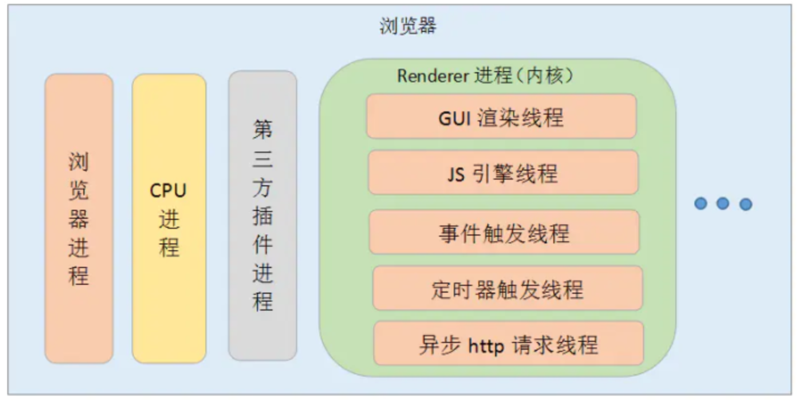
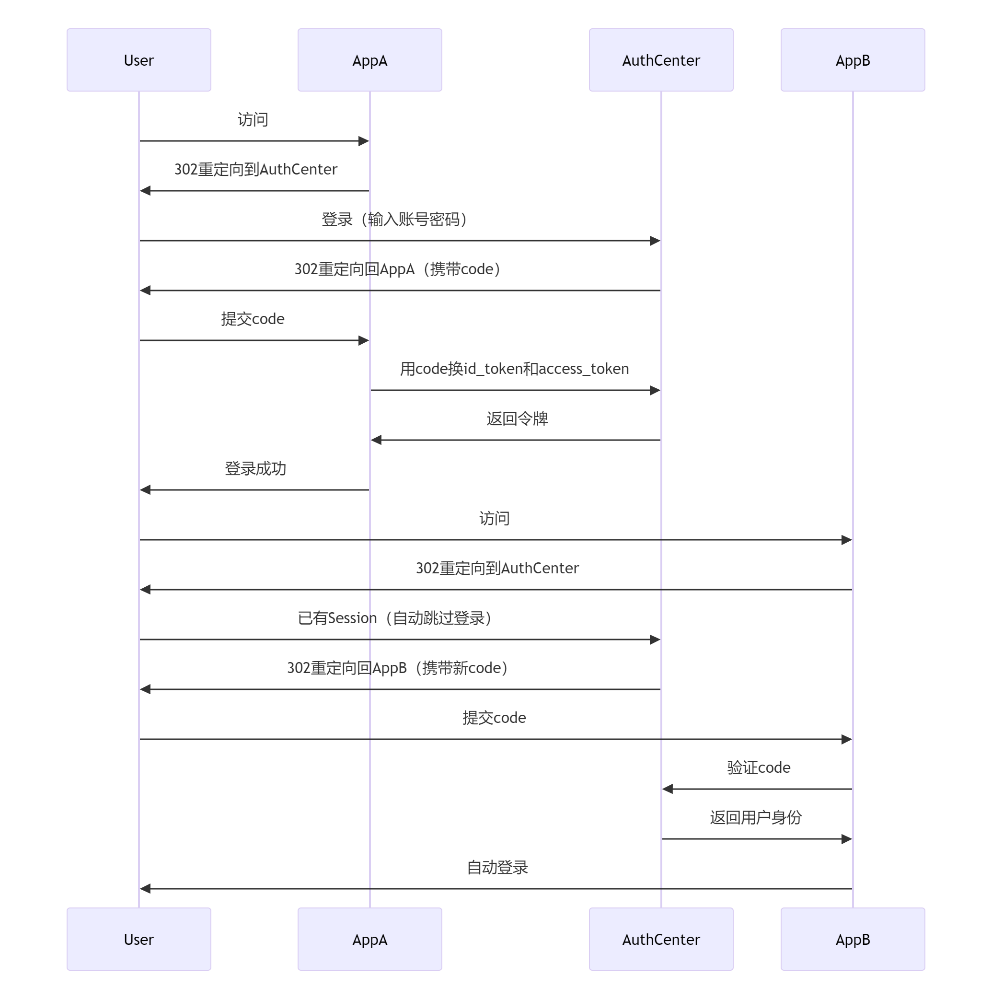

# 浏览器原理

> 架构与渲染机制
>
> 网络与通信
>
> 数据存储与缓存
>
> 安全与跨域

### <font style="color:#C99103;">架构与渲染机制</font>

#### <font style="color:rgb(51, 51, 51);">为何使用多进程架构?</font>

<font style="color:rgb(51, 51, 51);">多个线程共享 相同地址空间和资源，存在 线程之间可能恶意修改/获取 非授权数据 等 安全问题</font>

**<font style="color:rgb(51, 51, 51);">单进程浏览器</font>**<font style="color:rgb(51, 51, 51);">：</font>

1. <font style="color:rgb(51, 51, 51);">不稳定。单进程中 插件、渲染线程崩溃导致 浏览器崩溃</font>
2. <font style="color:rgb(51, 51, 51);">不流畅。脚本（死循环）/插件会使浏览器卡顿</font>
3. <font style="color:rgb(51, 51, 51);">不安全。插件和脚本可获取OS 任意资源</font>

**<font style="color:rgb(51, 51, 51);">多进程浏览器</font>**<font style="color:rgb(51, 51, 51);">：</font>

1. <font style="color:rgb(51, 51, 51);">解决不稳定。进程 相互隔离，一个页面/插件崩溃时，仅影响当前插件/页面</font>
2. <font style="color:rgb(51, 51, 51);">解决不流畅。脚本阻塞当前页面渲染进程，不影响其他页面</font>
3. <font style="color:rgb(51, 51, 51);">解决不安全。多进程架构使用沙箱。沙箱看成是OS给进程上一把锁，沙箱的程序可以运行，不能在硬盘上写入数据，不能在敏感位置读取数据</font>

#### <font style="color:rgb(51, 51, 51);">主要进程（了解 能说清楚很加分）</font>

**<font style="color:rgb(51, 51, 51);">1、浏览器主进程</font>**

<font style="color:rgb(51, 51, 51);">控制页面创建、销毁、网络资源管理、下载等， 提供存储等功能 </font>

<font style="color:rgb(51, 51, 51);">浏览器进程中线程：</font>

1. <font style="color:rgb(51, 51, 51);">UI进程</font>
2. <font style="color:rgb(51, 51, 51);">存储线程：控制文件的访问</font>

<font style="color:rgb(51, 51, 51);">2、</font>**<font style="color:rgb(51, 51, 51);">插件进程</font>**

<font style="color:rgb(51, 51, 51);">负责插件运行，插件易崩溃，需通过插件进程隔离，保证插件进程崩溃不会对浏览器/页面造成影响</font>

**<font style="color:rgb(51, 51, 51);">3、GPU进程</font>**

<font style="color:rgb(51, 51, 51);">最多一个，用于3D绘制等，从浏览器进程中独立出来</font>

**<font style="color:rgb(51, 51, 51);">4、浏览器渲染进程(浏览器内核)</font>**

**<font style="color:rgb(51, 51, 51);">每个Tab页对应一个进程，互不影响 ， 将</font>****<font style="color:rgb(51, 51, 51);background-color:rgb(243, 244, 244);">HTML</font>****<font style="color:rgb(51, 51, 51);">、</font>****<font style="color:rgb(51, 51, 51);background-color:rgb(243, 244, 244);">CSS</font>****<font style="color:rgb(51, 51, 51);"> 和 </font>****<font style="color:rgb(51, 51, 51);background-color:rgb(243, 244, 244);">JS</font>****<font style="color:rgb(51, 51, 51);">转换为可以与用户交互的网页 </font>**

<font style="color:rgb(51, 51, 51);">5、</font>**<font style="color:rgb(51, 51, 51);">网络进程</font>**

<font style="color:rgb(51, 51, 51);">从浏览器进程中独立出来， 负责页面的网络资源加载 </font>



**<font style="color:rgb(51, 51, 51);">渲染进程多线程</font>**

1. **<font style="color:rgb(51, 51, 51);">GUI 线程</font>**

<font style="color:rgb(51, 51, 51);">渲染页面。在JS引擎运行脚本期间</font><font style="color:rgb(51, 51, 51);">，GUI渲染线程都是处于挂起状态的，被”冻结”了</font>

2. **<font style="color:rgb(51, 51, 51);">JS 引擎线程</font>**

<font style="color:rgb(51, 51, 51);">解析和执行 JS ，v8 引擎 跑在 JS 引擎线程上，没有单/多线程之说，因为解释这个语言的是 的线程 是单线程；</font><font style="color:rgb(51, 51, 51);">JS 引擎线程与 GUI 线程互斥，浏览器执行 JS 程序的时候，GUI 渲染线程 保存在一个队列当中；直到 JS 程序执行完成，才接着执行；如果 JS 执行时间过长，会影响页面的渲染，所有要尽量控制 JS 的大小</font>

3. **<font style="color:rgb(51, 51, 51);">定时器触发线程</font>**

<font style="color:rgb(51, 51, 51);">JS引擎是单线程</font><font style="color:rgb(51, 51, 51);">， 处于阻塞线程状态会影响记计时的准确， 因此通过单独线程来计时并触发定时是更为合理的方案</font>

<font style="color:rgb(51, 51, 51);">为什么 setTimeout 不阻塞后面程序的运行，因为 setTimeout 不是由 JS 引擎线程完成，是由定时器触发线程完的，所以它们可以同时进行，</font><font style="color:rgb(51, 51, 51);">定时器触发线程 在定时任务完成后 通知事件触发线程 往任务队列里添加事件</font>

4. **<font style="color:rgb(51, 51, 51);">事件触发线程</font>**

<font style="color:rgb(51, 51, 51);">当一个事件被触发时该线程把事件添加到待处理队列的队尾，等待JS引擎处理。这些事件可以是当前执行的代码块如定时任务、也可来自浏览器内核的其他线程如鼠标点击、AJAX异步请求等</font>

5. **<font style="color:rgb(51, 51, 51);">异步 HTTP 请求线程</font>**

<font style="color:rgb(51, 51, 51);">XMLHttpRequest 连接 通过浏览器新开线程请求， 检测到状态变更，如果设置有回调，异步线程就产生状态变更事件放到 JS引擎的处理队列中等待处理</font>

#### <font style="color:#DF2A3F;">Event Loop（必背）</font>

<font style="color:rgb(51, 51, 51);">事件循环，是指浏览器或</font><font style="color:rgb(51, 51, 51);background-color:rgb(243, 244, 244);">Node</font><font style="color:rgb(51, 51, 51);">解决JS单线程运行时不会阻塞的一种机制</font>

<font style="color:rgb(51, 51, 51);">我们经常使用</font>**<font style="color:rgb(51, 51, 51);">异步</font>**<font style="color:rgb(51, 51, 51);">的原理设置 2 个线程</font>

* <font style="color:rgb(51, 51, 51);">一个负责程序本身的运行——“主线程”</font>
* <font style="color:rgb(51, 51, 51);">另一个负责主线程和其他进程（主要是各种 I/O 操作）的通信 ——“Event Loop 线程”</font>

<font style="color:rgb(51, 51, 51);">JS 采用这种机制，解决单线程带来的问题</font>

> <font style="color:rgb(119, 119, 119);">JS 引擎执行代码时会产生执行栈，调用异步 API，例如 </font><font style="color:rgb(119, 119, 119);background-color:rgb(243, 244, 244);">setTimeout</font><font style="color:rgb(119, 119, 119);">，</font><font style="color:rgb(119, 119, 119);background-color:rgb(243, 244, 244);">setInterval</font><font style="color:rgb(119, 119, 119);">，</font><font style="color:rgb(119, 119, 119);background-color:rgb(243, 244, 244);">Promise</font><font style="color:rgb(119, 119, 119);"> 等回调触发时，会进入异步任务队列，当同步代码执行完成后，会去异步队列取出回调函数执行，形成事件循环</font>

<font style="color:rgb(51, 51, 51);">事件循环任务：将队列和调用堆栈连接起来</font>

<font style="color:rgb(51, 51, 51);">执行栈类似于函数调用栈的运行容器，当其为空，JS检查事件队列，将第一个任务压入栈中执行。若调用栈和微任务队列为空，事件循环检查宏任务队列是否还有任务，弹出进入调用栈执行再弹出</font>

* <font style="color:rgb(51, 51, 51);">setTimeout回调 不是马上执行，而是最快可以多久后执行，因为它会等待调用 栈为空</font>
* <font style="color:rgb(51, 51, 51);">浏览器的渲染必须要调用栈为空时才会执行</font>
* <font style="color:rgb(51, 51, 51);">一个回调出栈，另一个回调进栈的间隙(此时栈空)，渲染得以顺利进行</font>

**<font style="color:rgb(51, 51, 51);">JS单线程问题</font>**

<font style="color:rgb(51, 51, 51);">setTimeout如果在主线程上运行会阻塞其他活动</font>

<font style="color:rgb(51, 51, 51);">所以，需要做的就是，离开这个线程，同时运行这个任务</font>

<font style="color:rgb(51, 51, 51);">作为浏览器脚本语言，JS主要用于 </font>**<font style="color:rgb(51, 51, 51);">用户互动、操作DOM</font>**<font style="color:rgb(51, 51, 51);">。这决定了它只能是单线程，否则会带来很复杂的同步问题</font>

<font style="color:rgb(51, 51, 51);">比如，假定JS同时有两个线程，一个线程在某个DOM节点上添加内容，另一个线程删除了这个节点，这时浏览器应该以哪个线程为准？所以，为了避免复杂</font>

<font style="color:rgb(119, 119, 119);">JS异步实现？</font>

<font style="color:rgb(51, 51, 51);">浏览器的内核多线程实现</font>

**<font style="color:rgb(51, 51, 51);">Event Loop</font>**

<font style="color:rgb(51, 51, 51);">任务被分为 宏任务 和 微任务</font>

1. <font style="color:rgb(51, 51, 51);">宏观：浏览器多线程（从宏观来看是多线程实现了异步）</font>
2. <font style="color:rgb(51, 51, 51);">微观：Event Loop</font>

**<font style="color:rgb(51, 51, 51);">常见的macrotask有：(一般由浏览器发起)</font>**<font style="color:rgb(51, 51, 51);">DOM渲染后触发</font>

1. <font style="color:rgb(51, 51, 51);">script整体代码</font>
2. <font style="color:rgb(51, 51, 51);">setImmediate(node)</font>
3. <font style="color:rgb(51, 51, 51);">setTimeout 和 setInterval</font>
4. <font style="color:rgb(51, 51, 51);">requestAnimationFrame？？不是宏任务！(CSS详述) RAF既不是微任务，也不是宏任务  raf按照系统刷新的节奏调用</font>
5. <font style="color:rgb(51, 51, 51);">I/O</font>
6. <font style="color:rgb(51, 51, 51);">UI rendering</font>
7. <font style="color:rgb(119, 119, 119);">POSTMessage</font>

**<font style="color:rgb(51, 51, 51);">常见的microtask有：</font>**<font style="color:rgb(51, 51, 51);">(一般由JS自身创建)DOM渲染前触发</font>

1. <font style="color:rgb(51, 51, 51);">process.nextTick (Node)</font>
2. <font style="color:rgb(51, 51, 51);">Promise callback(例如 promise.then)</font>
3. <font style="color:rgb(51, 51, 51);">Object.observe (基本已废弃)</font>
4. <font style="color:rgb(51, 51, 51);">MutationObserver</font>

**<font style="color:rgb(51, 51, 51);">注意点：</font>**

1. <font style="color:rgb(51, 51, 51);">一个 Event Loop 有一/多个 task queue（任务队列）</font>
2. <font style="color:rgb(51, 51, 51);">每个 Event Loop 有一个 microtask queue（微任务队列）</font>
3. **<u><font style="color:rgb(51, 51, 51);">requestAnimationFrame 不在任务队列也不在微任务队列，在渲染阶段执行</font></u>**
4. <font style="color:rgb(51, 51, 51);">任务需要多次事件循环才能执行完，微任务是一次性执行完</font>
5. <font style="color:rgb(51, 51, 51);">第一个宏任务（主程序）执行完，执行全部的微任务（一个 promise），再执行下一个宏任务（settimeout）</font>

**<font style="color:rgb(51, 51, 51);">一轮事件循环就是第一轮宏任务和微任务结束。</font>**<font style="color:rgb(51, 51, 51);">当微任务队列清空后，一个事件循环结束</font>

***<u><font style="color:rgb(51, 51, 51);">正确的一次 Event loop 顺序是：</font></u>***

1. ***<u><font style="color:rgb(51, 51, 51);">执行同步代码，这属于宏任务</font></u>***
2. ***<u><font style="color:rgb(51, 51, 51);">执行栈为空，查询是否有微任务需要执行</font></u>***
3. ***<u><font style="color:rgb(51, 51, 51);">执行所有微任务</font></u>***
4. ***<u><font style="color:rgb(51, 51, 51);">必要的话渲染 UI</font></u>***
5. ***<u><font style="color:rgb(51, 51, 51);">然后开始下一轮 Event loop，执行宏任务中的异步代码</font></u>***

***<u><font style="color:rgb(51, 51, 51);">如果宏任务中的异步代码有大量的计算并且需要操作 DOM 的话，为</font></u>**\_\_<u><font style="color:rgb(51, 51, 51);">了更快的 界面响应，我们可以把操作 DOM 放入微任务中</font></u>*

**<font style="color:rgb(51, 51, 51);">JS处理异步事件</font>**

* **<font style="color:rgb(51, 51, 51);">同步任务：主线程排队执行的任务，只有前一个执行完毕，才能执行后一个</font>**
* **<font style="color:rgb(51, 51, 51);">异步任务：不进入主线程、进入"任务队列"（task queue）的任务，只有"任务队列"通知主线程，某个异步任务可以执行，该任务才进入主线程执行</font>**

**<font style="color:rgb(51, 51, 51);">node和浏览器事件循环区别</font>**

<font style="color:rgb(51, 51, 51);">流程对比：</font>

1. <font style="color:rgb(51, 51, 51);">执行 Script 代码</font>
2. <font style="color:rgb(51, 51, 51);">把微任务队列清空：Node 清空微任务队列的手法比较特别。在浏览器中，我们只有一个微任务队列需要接受处理；但在 Node 中，有两类微任务队列：next-tick 队列和其它队列。next-tick 队列专门收敛 process.nextTick 派发的异步任务。</font>**<font style="color:rgb(51, 51, 51);">清空队列时，优先清空 next-tick 队列中的任务，随后才会清空其它微任务</font>**
3. <font style="color:rgb(51, 51, 51);">开始执行 macro-task（宏任务）。Node 执行宏任务的方式与浏览器不同：在浏览器中，每次出队执行一个宏任务； Node 中，我们每次会尝试清空当前阶段对应宏任务队列里的所有任务</font>
4. <font style="color:rgb(51, 51, 51);">步骤3开始，进入 3 -> 2 -> 3 -> 2…的循环</font>

#### <font style="color:#DF2A3F;">浏览器的垃圾回收机制有哪些?（必背）</font>

JS会在创建变量时自动分配内存，在不使用的时候会自动周期性的释放内存，释放的过程就叫"垃圾回收"。

一方面白动分配内存减轻了开发者的负担，开发者不用过多的去关注内存使用，但是另一方面，正是因为因为是自动回收，所以如果不清楚回收的机制，会很容易造成混乱，而混乱就很容易造成"内存泄漏"由于是白动回收，所以就存在一个"内存是否需要被回收的"的问题，但是这个问题的判定在程序中意味着无法通过某个算法去准确完整的解决，后面探讨的回收机制只能有限的去解决一般的问题。

回收算法

* 标记清理
* 引用计数
* 标记整理

**标记清理**

js最常用的回收策略，2012年后所有浏览器都使用了这种策略，此后的对回收策略的改进也是基于这个策略的改进。其策略是:

1. 变量进入上下文，也可理解为作用域，会加上标记，证明其存在于该上下文;。
2. 将所有在上下文中的变量以及上下文中被访问引用的变量标记去掉，表明这些变量活跃有用;.在此之后再被加上标记的变量标记为准备删除的变量，因为上下文中的变量已经无法访问它们;
3. 执行内存清理，销毁带标记的所有非活跃值并回收之前被占用的内存;

**局限**

由于是从根对象(全局对象)开始查找，对于那些无法从根对象查询到的对象都将被清除

回收后会形成内存碎片，影响后面申请大的连续内存空间引用计数

引用计数策略相对而言不常用，因为弊端较多。其思路是对每个值记录它被引用的次数，通过最后对次数的判断(引用数为0)来决定是否保留，具体的规则有:

* 声明一个变量，赋予它一个引用值时，计数+1;
* 同一个值被赋予另外一个变量时，引用+1;
* 保存对该值引用的变量被其他值覆盖，引用-1;
* 引用为0，回收内存:

最重要的问题就是，循环引用 的问题

```javascript
function refProblem(){
  let a=new Object();
  let b = new object();
  a.c = b;
  b.c=a;//互相引用
}
```

根据之前提到的规则，两个都互相引用了，引用计数不为0，所以两个变量都无法回收。如果频繁的调用改函数则会造成很严重的内存泄漏。

### <font style="color:#5C8D07;">网络与通信</font>

#### <font style="color:#DF2A3F;">浏览器每一帧都做了什么（必背）</font>

1. **处理输入事件 (Input Events)**

<font style="color:rgb(0, 0, 0);">浏览器首先处理用户的交互事件，如点击、触摸、滚动和键盘输入。这些事件会触发相应的事件监听器。</font>

```javascript
// 示例：事件处理
button.addEventListener('click', () => {
  // 这个回调函数会在当前帧的事件处理阶段执行
  console.log('按钮被点击了!');
});
```

2. **执行JavaScript**

<font style="color:rgb(0, 0, 0);">执行JavaScript代码，包括：</font>

* <font style="color:rgb(0, 0, 0);">事件处理程序</font>
* <font style="color:rgb(0, 0, 0);">定时器回调(setTimeout, setInterval)</font>
* <font style="color:rgb(0, 0, 0);">其他JavaScript逻辑</font>

```javascript
// 示例：JavaScript执行
setTimeout(() => {
  // 这个回调会在当前帧的JavaScript执行阶段运行
  updateAnimation();
}, 0);
```

3. **requestAnimationFrame回调**

<font style="color:rgb(0, 0, 0);">这是执行动画更新的最佳时机，因为它保证在浏览器进行渲染前执行。</font>

```javascript
// 示例：requestAnimationFrame
function animate() {
  // 在这里更新动画状态
  element.style.transform = `translateX(${position}px)`;

  // 请求下一帧继续动画
  requestAnimationFrame(animate);
}

// 启动动画
requestAnimationFrame(animate);
```

4. **样式计算 (Style Calculation)**

<font style="color:rgb(0, 0, 0);">浏览器计算哪些CSS规则应用于哪些元素，并确定每个元素的最终样式。</font>

5. **布局 (Layout/Reflow)**

<font style="color:rgb(0, 0, 0);">计算每个元素在屏幕上的几何位置和大小。如果修改了元素的几何属性（如宽度、高度、位置），就会触发这个阶段。</font>

```javascript
// 示例：可能触发布局的操作
element.style.width = '100px';      // 触发布局
element.style.transform = 'scale(2)'; // 不触发布局（只影响合成）
```

6. **绘制 (Paint)**

<font style="color:rgb(0, 0, 0);">将元素的视觉部分（颜色、背景、阴影等）转换为绘制操作列表。这个阶段产生的是绘制指令，而不是实际像素。</font>

7. **合成 (Compositing)**

<font style="color:rgb(0, 0, 0);">浏览器决定哪些层需要绘制以及它们的绘制顺序。现代浏览器会将页面分解为多个图层，独立进行绘制。</font>

8. **栅格化 (Rasterization)**

<font style="color:rgb(0, 0, 0);">将绘制指令转换为实际像素。这通常在GPU上执行，将矢量图形和文本转换为位图图像。</font>

9. **显示像素 (Display)**

<font style="color:rgb(0, 0, 0);">最终将像素绘制到屏幕上，完成一帧的渲染。</font>

##### 性能优化关键点

<font style="color:rgb(0, 0, 0);">为了保持流畅的60FPS（每秒60帧），每一帧的所有工作必须在约16.7毫秒内完成。以下是一些优化建议：</font>

1. \*\*\*\***<font style="color:rgb(0, 0, 0);">使用requestAnimationFrame</font>**<font style="color:rgb(0, 0, 0);">而不是setTimeout/setInterval进行动画</font>
2. \*\*\*\***<font style="color:rgb(0, 0, 0);">避免强制同步布局</font>**<font style="color:rgb(0, 0, 0);"> - 不要在JavaScript中交替读写样式属性</font>
3. \*\*\*\***<font style="color:rgb(0, 0, 0);">减少布局抖动</font>**<font style="color:rgb(0, 0, 0);"> - 批量处理DOM读写操作</font>
4. \*\*\*\***<font style="color:rgb(0, 0, 0);">使用CSS transforms和opacity</font>**<font style="color:rgb(0, 0, 0);">实现动画，它们只影响合成阶段</font>
5. \*\*\*\***<font style="color:rgb(0, 0, 0);">使用will-change</font>**<font style="color:rgb(0, 0, 0);">提示浏览器哪些元素可能会变化</font>

```javascript
// 不好的做法：强制同步布局
function badPractice() {
  // 读取offsetTop（强制浏览器立即计算布局）
  const height = element.offsetTop;

  // 修改样式（触发样式计算）
  element.style.height = `${height + 10}px`;

  // 再次读取（再次强制布局计算）
  const newHeight = element.offsetTop;
}

// 好的做法：批量读写
function goodPractice() {
  // 先读取所有需要的值
  const height = element.offsetTop;
  const width = element.offsetWidth;

  // 然后进行所有修改
  element.style.height = `${height + 10}px`;
  element.style.width = `${width + 10}px`;
}
```

#### <font style="color:#DF2A3F;">输入URL回车后（必背）</font>

> 1. URL解析
> 2. 判断是否存在缓存 如果是强制缓存且在有效期内直接从浏览器获取 否则继续执行
> 3. DNS域名解析：浏览器>系统>本地hosts>根域名>顶级域名>二级域名>三级域名
> 4. TCP三次握手
> 5. 发送HTTP请求
> 6. 处理请求并返回（如果返回304则复用缓存中的数据 如果不是则返回新数据）
> 7. 解析渲染页面
>
> html-dom
>
> css-cssom
>
> dom和cssom生成渲染树
>
> 分层 绘制 合成
>
> 8. TCP四次挥手

#### 怎么判断写的代码知否浏览器兼容（了解）

##### 开发前的规划与预防 (最重要的阶段)

<font style="color:rgb(0, 0, 0);">在写第一行代码之前，就要确立兼容性策略。</font>

**<font style="color:rgb(0, 0, 0);">定义目标浏览器 (Browser Targeting)</font>**<font style="color:rgb(0, 0, 0);">\ </font><font style="color:rgb(0, 0, 0);">这是最关键的第一步。你需要根据项目需求（如用户数据分析、客户要求）明确你要支持的浏览器及其最低版本。</font>

* **<font style="color:rgb(0, 0, 0);">常见工具：</font>**<font style="color:rgb(0, 0, 0);"> 使用 </font><code><font style="color:rgb(0, 0, 0);">browserslist</font></code><font style="color:rgb(0, 0, 0);"> 来定义和共享你的目标浏览器范围。这个配置可以被后续提到的多种工具共享使用。</font>
* **<font style="color:rgb(0, 0, 0);">配置文件 (如 </font>**<code>**<font style="color:rgb(0, 0, 0);">.browserslistrc</font>**</code>**<font style="color:rgb(0, 0, 0);">) 示例：</font>**

```plain
# 支持市场份额 > 1% 的浏览器
> 1%
# 支持所有浏览器的最新2个版本
last 2 versions
# 不支持已死亡的 IE 11
not ie 11
# 特别需要支持的浏览器
iOS >= 13
```

**<font style="color:rgb(0, 0, 0);">b. 利用现代构建工具链 (Modern Build Toolchain)</font>**<font style="color:rgb(0, 0, 0);">\ </font><font style="color:rgb(0, 0, 0);">现代前端框架（Vue CLI, Create React App, Vite）和构建工具（Webpack）已经集成了兼容性处理的生态。</font>

* **<font style="color:rgb(0, 0, 0);">Babel:</font>**<font style="color:rgb(0, 0, 0);"> 将你的现代 JavaScript (ES6+) 代码转换为兼容目标浏览器的旧版本 JS。它会根据你的 </font><code><font style="color:rgb(0, 0, 0);">browserslist</font></code><font style="color:rgb(0, 0, 0);"> 配置决定需要转换哪些特性。</font>
* **<font style="color:rgb(0, 0, 0);">Autoprefixer (PostCSS):</font>**<font style="color:rgb(0, 0, 0);"> 自动为 CSS 规则添加所需的浏览器厂商前缀（如 </font><code><font style="color:rgb(0, 0, 0);">-webkit-</font></code><font style="color:rgb(0, 0, 0);">, </font><code><font style="color:rgb(0, 0, 0);">-ms-</font></code><font style="color:rgb(0, 0, 0);">）。你只需要写标准的 CSS，它会自动处理。</font>
  * <font style="color:rgb(0, 0, 0);">例如：你写 </font><code><font style="color:rgb(0, 0, 0);">display: flex;</font></code><font style="color:rgb(0, 0, 0);">，它会自动输出 </font><code><font style="color:rgb(0, 0, 0);">display: -webkit-box; display: -ms-flexbox; display: flex;</font></code><font style="color:rgb(0, 0, 0);">。</font>
* **<font style="color:rgb(0, 0, 0);">ESLint/Stylelint:</font>**<font style="color:rgb(0, 0, 0);"> 代码检查工具可以安装相关插件，在你编写代码时实时提示可能存在的兼容性问题。</font>

##### 开发中的查询与决策

<font style="color:rgb(0, 0, 0);">在编写具体代码时，遇到不确定的 API 或 CSS 属性，需要快速查询。</font>

**<font style="color:rgb(0, 0, 0);">“Can I use...” (caniuse.com)</font>**<font style="color:rgb(0, 0, 0);">\ </font><font style="color:rgb(0, 0, 0);">这是前端开发者的权威圣经。 当你想用一个新特性（如 CSS 的 </font><code><font style="color:rgb(0, 0, 0);">gap</font></code><font style="color:rgb(0, 0, 0);"> 属性、JS 的 </font><code><font style="color:rgb(0, 0, 0);">fetch</font></code><font style="color:rgb(0, 0, 0);"> API）时，立即打开这个网站搜索。</font>

* **<font style="color:rgb(0, 0, 0);">你会看到：</font>**<font style="color:rgb(0, 0, 0);"> 详细的浏览器支持表格、全球使用率统计、已知问题链接以及常用的兼容性解决方法。</font>

**<font style="color:rgb(0, 0, 0);">MDN Web Docs (developer.mozilla.org)</font>**<font style="color:rgb(0, 0, 0);">\ </font><font style="color:rgb(0, 0, 0);">MDN 的每个 CSS 属性和 JavaScript API 文档页底部都有一个 </font>**<font style="color:rgb(0, 0, 0);">“浏览器兼容性” (Browser compatibility)</font>**<font style="color:rgb(0, 0, 0);"> 表格，信息通常来自 Can I Use，但集成在文档中更方便。它会详细说明在哪个浏览器的哪个版本开始支持，以及是否有需要特别注意的bug或前缀。</font>

**<font style="color:rgb(0, 0, 0);">编辑器和IDE插件</font>**

* <font style="color:rgb(0, 0, 0);">许多 VS Code 插件能直接在你编码时，将兼容性信息以内联形式显示出来。例如，当你写下 </font><code><font style="color:rgb(0, 0, 0);">css backdrop-filter</font></code><font style="color:rgb(0, 0, 0);"> 时，插件可能会在旁边显示一个小图标，提示你它的支持率。</font>

##### 开发后的测试与验证

<font style="color:rgb(0, 0, 0);">代码写完了，必须进行实际测试。</font>

**<font style="color:rgb(0, 0, 0);">a. 浏览器开发者工具 (DevTools)</font>**

* **<font style="color:rgb(0, 0, 0);">模拟旧版浏览器：</font>**<font style="color:rgb(0, 0, 0);"> Chrome DevTools 的 </font>**<font style="color:rgb(0, 0, 0);">Device Mode</font>**<font style="color:rgb(0, 0, 0);"> 可以模拟移动设备视图，但</font>**<font style="color:rgb(0, 0, 0);">不能模拟浏览器引擎版本</font>**<font style="color:rgb(0, 0, 0);">。它的“仿真”主要是屏幕尺寸和触摸事件。</font>
* **<font style="color:rgb(0, 0, 0);">注意：</font>**<font style="color:rgb(0, 0, 0);"> 不要以为在Chrome里运行正常就等于在所有浏览器都正常。你必须进行真实测试。</font>

**<font style="color:rgb(0, 0, 0);">b. 真实浏览器测试</font>**

* **<font style="color:rgb(0, 0, 0);">本地多浏览器安装：</font>**<font style="color:rgb(0, 0, 0);"> 最简单的办法就是在你的开发机上安装 Chrome, Firefox, Safari (macOS), Edge 等多个浏览器，然后手动测试。</font>
* **<font style="color:rgb(0, 0, 0);">浏览器内置的兼容性模式：</font>**<font style="color:rgb(0, 0, 0);"> Edge 和 Chrome 提供了“IE 模式”，但这不是一个完全可靠的测试方法，只能作为粗略参考。</font>

**<font style="color:rgb(0, 0, 0);">c. 云测试平台 (Cloud Testing Platforms)</font>**<font style="color:rgb(0, 0, 0);">\ </font><font style="color:rgb(0, 0, 0);">这是最专业和全面的方式，尤其适合团队和商业项目。</font>

* **<font style="color:rgb(0, 0, 0);">BrowserStack / Sauce Labs:</font>**<font style="color:rgb(0, 0, 0);"> 这些服务提供海量的</font>**<font style="color:rgb(0, 0, 0);">真实设备和浏览器</font>**<font style="color:rgb(0, 0, 0);">的虚拟机，你可以直接在浏览器中远程连接到一台运行着 Windows 7 + IE 11 的虚拟电脑进行测试，或者一台特定的 iPhone 测试 Safari。它们通常与 CI/CD 管道集成，可以自动运行测试套件。</font>
* **<font style="color:rgb(0, 0, 0);">LambdaTest:</font>**<font style="color:rgb(0, 0, 0);"> 类似的云测试平台。</font>

**<font style="color:rgb(0, 0, 0);">d. 自动化测试 (Automated Testing)</font>**

* <font style="color:rgb(0, 0, 0);">将浏览器兼容性测试集成到你的自动化测试流程中（如使用 Selenium, Cypress, Playwright）。你可以在云测试平台上配置这些测试脚本，针对浏览器矩阵（browser matrix）运行，每次提交代码后自动检查是否在某些浏览器上出现回归错误。</font>

##### 线上的监控与反馈

<font style="color:rgb(0, 0, 0);">即使经过测试，一些罕见的兼容性问题也可能逃到生产环境。</font>

* **<font style="color:rgb(0, 0, 0);">错误监控工具 (Error Monitoring):</font>**<font style="color:rgb(0, 0, 0);"> 使用像 </font>**<font style="color:rgb(0, 0, 0);">Sentry</font>**<font style="color:rgb(0, 0, 0);">, </font>**<font style="color:rgb(0, 0, 0);">LogRocket</font>**<font style="color:rgb(0, 0, 0);"> 这样的工具。它们能捕获生产环境中用户浏览器上发生的 JavaScript 错误，并记录下详细的堆栈信息、浏览器版本、操作系统、用户操作步骤等。这是发现你未曾预料到的兼容性问题的终极手段。</font>

##### 日常决策流程总结

<font style="color:rgb(0, 0, 0);">当你日常开发时，可以遵循这个流程：</font>

1. \*\*\*\***<font style="color:rgb(0, 0, 0);">构思功能：</font>**<font style="color:rgb(0, 0, 0);"> 我要实现一个XXX功能。</font>
2. \*\*\*\***<font style="color:rgb(0, 0, 0);">技术选型：</font>**<font style="color:rgb(0, 0, 0);"> 我打算使用 </font><code><font style="color:rgb(0, 0, 0);">YYYY</font></code><font style="color:rgb(0, 0, 0);"> 这个 CSS/JS 特性来实现它。</font>
3. \*\*\*\***<font style="color:rgb(0, 0, 0);">兼容性检查：</font>**
   * <font style="color:rgb(0, 0, 0);">快速在 </font>**<font style="color:rgb(0, 0, 0);">Can I Use</font>**<font style="color:rgb(0, 0, 0);"> 或 </font>**<font style="color:rgb(0, 0, 0);">MDN</font>**<font style="color:rgb(0, 0, 0);"> 上查 </font><code><font style="color:rgb(0, 0, 0);">YYYY</font></code><font style="color:rgb(0, 0, 0);">。</font>
   * <font style="color:rgb(0, 0, 0);">对照项目的 </font><code><font style="color:rgb(0, 0, 0);">browserslist</font></code><font style="color:rgb(0, 0, 0);"> 配置，看目标浏览器是否支持。</font>
4. \*\*\*\***<font style="color:rgb(0, 0, 0);">决策：</font>**
   * **<font style="color:rgb(0, 0, 0);">如果支持良好：</font>**<font style="color:rgb(0, 0, 0);"> 直接使用。</font>
   * **<font style="color:rgb(0, 0, 0);">如果部分支持/有前缀：</font>**<font style="color:rgb(0, 0, 0);"> 放心使用，依靠 </font>**<font style="color:rgb(0, 0, 0);">Autoprefixer</font>**<font style="color:rgb(0, 0, 0);"> 和 </font>**<font style="color:rgb(0, 0, 0);">Babel</font>**<font style="color:rgb(0, 0, 0);"> 在构建时自动处理。</font>
   * **<font style="color:rgb(0, 0, 0);">如果完全不支持：</font>**
     * **<font style="color:rgb(0, 0, 0);">方案A (首选):</font>**<font style="color:rgb(0, 0, 0);"> 寻找一个广泛支持的替代方案。</font>
     * **<font style="color:rgb(0, 0, 0);">方案B (必要情况):</font>**<font style="color:rgb(0, 0, 0);"> 使用 </font>**<font style="color:rgb(0, 0, 0);">Polyfill</font>**<font style="color:rgb(0, 0, 0);">（但现代开发中越来越不推荐，因为babel已经处理了大部分语法问题）。</font>
     * **<font style="color:rgb(0, 0, 0);">方案C (优雅降级):</font>**<font style="color:rgb(0, 0, 0);"> 提供一种基础功能体验，让不支持新特性的浏览器也能正常使用核心功能。</font>
5. \*\*\*\***<font style="color:rgb(0, 0, 0);">测试验证：</font>**<font style="color:rgb(0, 0, 0);"> 在提交代码前，在自己安装的其他浏览器上快速测试一下核心流程。利用云测试平台进行更全面的测试。</font>
6. **<font style="color:rgb(0, 0, 0);">线上监控：</font>**<font style="color:rgb(0, 0, 0);"> 依靠错误监控系统查漏补缺。</font>

#### 谈谈你对浏览器中进程和线程的理解（了解）

**浏览器是多进程的**

它主要包括以下进程:

* Browser 进程:浏览器的主进程，唯一，负责创建和销毁其它进程、网络资源的下载与管理、浏览器界面的展

示、前进后退等。

* GPU 进程:用于 3D 绘制等，最多一个。
* 第三方插件进程:每种类型的插件对应一个进程，仅当使用该插件时才创建。
* 浏览器渲染进程(浏览器内核):内部是多线程的，每打开一个新网页就会创建一个进程，主要用于页面渲染，脚本执行，事件处理等。

**渲染进程(浏览器内核)**

浏览器的渲染进程是多线程的，页面的渲染，JavaScript 的执行，事件的循环，都在这个进程内进行:

* GUI渲染线程:负责渲染浏览器界面，当界面需要重绘(Repaint)或由于某种操作引发回流(Reflow)时，该线中程就会执行。
* JavaScript 引擎线程:也称为 JavaScript 内核，负责处理 Javascript 脚本程序、解析 Javascript 脚本、运行代码等。(例如 V8 引擎)
* 事件触发线程:用来控制浏览器事件循环，注意这不归JavaScript 引擎线程管，当事件被触发时，该线程会把事件添加到待处理队列的队尾，等待 JavaScript 引擎的处理。
* 定时触发器线程:传说中的 setInterval与 setTimeout 所在线程，注意，W3C在 HTML 标准中规定，规定要求 setTimeout 中低于 4ms 的时间间隔算为 4ms。(PS:最小间隔4ms的说法是不准确的，或者说是有前提条件的，请看HTML标准:If nesting level is greater than 5,and timeout is less than 4,then set timeout to 4.，也就是说，循环嵌套超过5层的，并且延迟不到4ms，才会变成4ms)
* 异步 http 请求线程:在 XMLHtpRequest 连接后通过浏览器新开一个线程请求，将检测到状态变更时，如果设置有回调函数，异步线程就产生状态变更事件，将这个回调再放入事件队列中。再由 JavaScript 引擎执行

注意，GUI渲染线程与 JavaScript引擎线程是互斥的，当 JavaScript 引擎执,行时 GUI线程会被挂起(相当于被冻结了)，GUI 更新会被保存在一个队列中等到JavaScript 引擎空闲时立即被执行。所以如果 JavaScript 执行的时间过长，这样就会造成页面的渲染不连贯，导致页面染加载阳塞。

**单线程的 JavaScript**

所谓单线程，是指花在 JavaScript 引擎中负责解释和执行 JavaScript 代码的线程唯一，同一时间上只能执行一件任务

#### 怎么检测浏览器版本?

检测浏览器版本一共有两种方式:

* 检测 window.navigator.userAgent 的值，但这种方式很不可靠，因为userAgent可以被改写，并且早期的浏览器如 ie，会通过伪装自己的 userAgent 的值为 Mozila 来躲过服务器的检测
* 功能检测，根据每个浏览器独有的特性来进行判断，如ie下独有的 ActiveXobject。

#### 正向代理和反向代理

正向代理：服务对象是客户端 将请求发送的代理服务器 再由代理服务器转发给目标服务器

反向代理：服务对象是服务器 将代理服务器配置在目标服务器之前 客户端直接发请求给代理服务器 就像发送给目标服务器一样

##### 如何配置反向代理？

<font style="color:rgb(0, 0, 0);">配置反向代理通常涉及以下步骤，这里以最常用的 Nginx 为例：</font>

1. \*\*\*\***<font style="color:rgb(0, 0, 0);">安装 Nginx</font>**<font style="color:rgb(0, 0, 0);">：在服务器上安装 Nginx。例如，在 Ubuntu 系统上可以使用命令 </font><code><font style="color:rgb(0, 0, 0);">sudo apt-get update && sudo apt-get install nginx</font></code>
2. \*\*\*\***<font style="color:rgb(0, 0, 0);">编辑配置文件</font>**<font style="color:rgb(0, 0, 0);">：Nginx 的主配置文件通常位于 </font><code><font style="color:rgb(0, 0, 0);">/etc/nginx/nginx.conf</font></code><font style="color:rgb(0, 0, 0);">或 </font><code><font style="color:rgb(0, 0, 0);">/etc/nginx/sites-available/default</font></code><font style="color:rgb(0, 0, 0);">。你需要编辑这个文件</font>
3. \*\*\*\***<font style="color:rgb(0, 0, 0);">添加反向代理配置</font>**<font style="color:rgb(0, 0, 0);">：在配置文件的 </font><code><font style="color:rgb(0, 0, 0);">server</font></code><font style="color:rgb(0, 0, 0);">块中，使用 </font><code><font style="color:rgb(0, 0, 0);">location</font></code><font style="color:rgb(0, 0, 0);">指令来匹配需要代理的请求路径，并通过 </font><code><font style="color:rgb(0, 0, 0);">proxy_pass</font></code><font style="color:rgb(0, 0, 0);">指令指定后端服务器的地址。例如：</font>

```nginx
server {
  listen 80;
  server_name your_domain.com;

  location /api/ {
    proxy_pass http://backend-server:8080/;
    proxy_set_header Host $host;
    proxy_set_header X-Real-IP $remote_addr;
    proxy_set_header X-Forwarded-For $proxy_add_x_forwarded_for;
    proxy_set_header X-Forwarded-Proto $scheme;
  }
}
```

* <code><font style="color:rgb(0, 0, 0);">proxy_pass</font></code><font style="color:rgb(0, 0, 0);">：指定后端服务器的地址。</font>
* <code><font style="color:rgb(0, 0, 0);">proxy_set_header</font></code><font style="color:rgb(0, 0, 0);">：用于将一些客户端信息（如原始请求的 Host、客户端的真实 IP 等）传递给后端服务器，这对于后端服务器正确处理请求至关重要</font>

4. \*\*\*\***<font style="color:rgb(0, 0, 0);">重启 Nginx</font>**<font style="color:rgb(0, 0, 0);">：保存配置文件后，使用 </font><code><font style="color:rgb(0, 0, 0);">sudo systemctl restart nginx</font></code><font style="color:rgb(0, 0, 0);">或 </font><code><font style="color:rgb(0, 0, 0);">sudo service nginx restart</font></code><font style="color:rgb(0, 0, 0);">命令重启 Nginx 使配置生效</font>
5. **<font style="background-color:rgba(0, 0, 0, 0.05);"></font>**<font style="color:rgb(0, 0, 0);">如果你使用宝塔面板这类图形化工具，配置过程会更简单，只需在网站设置的“反向代理”选项中填写</font>**<font style="color:rgb(0, 0, 0);">代理名称</font>**<font style="color:rgb(0, 0, 0);">、</font>**<font style="color:rgb(0, 0, 0);">代理路径</font>**<font style="color:rgb(0, 0, 0);">（如 </font><code><font style="color:rgb(0, 0, 0);">/api</font></code><font style="color:rgb(0, 0, 0);">）和</font>**<font style="color:rgb(0, 0, 0);">目标URL</font>**<font style="color:rgb(0, 0, 0);">（后端服务地址）即可，宝塔会自动生成配置文件</font>

##### 反向代理的常见用途

<font style="color:rgb(0, 0, 0);">反向代理的功能远不止于转发请求，它还广泛应用于以下场景：</font>

* **<font style="color:rgb(0, 0, 0);">负载均衡</font>**<font style="color:rgb(0, 0, 0);">：将客户端请求分发到多个后端服务器，避免单台服务器过载，提高系统的整体处理能力和可用性。Nginx 支持轮询、加权轮询、IP Hash 等多种负载均衡策略</font>
* **<font style="color:rgb(0, 0, 0);">SSL 终端（SSL Termination）</font>**<font style="color:rgb(0, 0, 0);">：由反向代理服务器负责处理 HTTPS 的加密解密工作，减轻后端服务器的计算压力。后端服务器只需处理 HTTP 请求即可</font>
* **<font style="color:rgb(0, 0, 0);">缓存静态资源</font>**<font style="color:rgb(0, 0, 0);">：反向代理可以缓存如图片、CSS、JS 等静态资源，当再次收到相同请求时直接返回，减少对后端服务器的请求次数，加快响应速度</font>
* **<font style="color:rgb(0, 0, 0);">提升安全性</font>**<font style="color:rgb(0, 0, 0);">：隐藏后端服务器的真实 IP 地址和内部结构，对外只暴露反向代理服务器，有效抵御一些网络攻击、同时还可以集成 Web 应用防火墙（WAF）等功能</font>**<font style="background-color:rgba(0, 0, 0, 0.05);">1</font>**<font style="color:rgb(0, 0, 0);">。</font>

##### 为什么反向代理能解决跨域问题？

<font style="color:rgb(0, 0, 0);">要理解这一点，首先要明白</font>**<font style="color:rgb(0, 0, 0);">跨域问题的本质是浏览器的同源策略（Same-Origin Policy）的限制</font>**<font style="color:rgb(0, 0, 0);">。浏览器出于安全考虑，会阻止前端页面向不同源（协议、域名、端口任一不同）的服务器发起 XMLHttpRequest 或 Fetch 请求</font>

**<font style="color:rgb(0, 0, 0);">反向代理解决跨域的底层原理是“欺骗”浏览器</font>**<font style="color:rgb(0, 0, 0);">：</font>

<font style="color:rgb(0, 0, 0);">通过反向代理，</font>**<font style="color:rgb(0, 0, 0);">将前端页面和后端接口“变成”同源</font>**<font style="color:rgb(0, 0, 0);">。具体做法是：</font>

1. \*\*\*\*<font style="color:rgb(0, 0, 0);">让前端页面和后端接口都使用</font>**<font style="color:rgb(0, 0, 0);">相同的域名和端口</font>**<font style="color:rgb(0, 0, 0);">（即反向代理服务器的域名和端口）。</font>
2. <font style="color:rgb(0, 0, 0);">当前端页面需要调用后端 API 时，它不再直接请求后端的地址（如 </font><code><font style="color:rgb(0, 0, 0);">https://api.example.com:8080</font></code><font style="color:rgb(0, 0, 0);">），而是请求</font>**<font style="color:rgb(0, 0, 0);">同源</font>**<font style="color:rgb(0, 0, 0);">下的一个特定路径（如 </font><code><font style="color:rgb(0, 0, 0);">https://www.example.com/api/</font></code><font style="color:rgb(0, 0, 0);">）。</font>
3. <font style="color:rgb(0, 0, 0);">反向代理服务器接收到对 </font><code><font style="color:rgb(0, 0, 0);">/api/</font></code><font style="color:rgb(0, 0, 0);">的请求后，</font>**<font style="color:rgb(0, 0, 0);">在服务器端</font>**<font style="color:rgb(0, 0, 0);">（此时已不受浏览器同源策略限制）将请求转发给真正的后端服务器（</font><code><font style="color:rgb(0, 0, 0);">https://api.example.com:8080</font></code><font style="color:rgb(0, 0, 0);">）。</font>
4. <font style="color:rgb(0, 0, 0);">后端服务器处理请求并将响应返回给反向代理服务器，反向代理服务器再将其返回给前端浏览器</font>
5. <font style="color:rgb(0, 0, 0);">由于浏览器感知到的所有请求都是发给同一个源（</font><code><font style="color:rgb(0, 0, 0);">https://www.example.com</font></code><font style="color:rgb(0, 0, 0);">）的，因此不会触发同源策略的限制，跨域问题自然就解决了。</font>

#### 3xx状态码（了解）

**<font style="color:rgb(26, 32, 41);">300 Multiple Choices</font>**

<font style="color:rgb(26, 32, 41);">表示请求的资源存在多个可选的表示形式，客户端需要选择其中一个。这种情况较为少见，通常用于内容协商</font>

**<font style="color:rgb(26, 32, 41);">301 Moved Permanently</font>**

<font style="color:rgb(26, 32, 41);">表示请求的资源已永久移动到新的URL。客户端应使用新的URL进行后续请求，搜索引擎也会更新索引</font><font style="color:rgb(26, 32, 41);">。例如，网站域名变更后，旧域名会返回301状态码，将用户重定向到新域名</font>

**<font style="color:rgb(26, 32, 41);">302 Found</font>**

<font style="color:rgb(26, 32, 41);">表示请求的资源临时移动到新的URL。客户端应继续使用原URL进行后续请求，但本次请求需要访问新URL</font><font style="color:rgb(26, 32, 41);">。与301不同，302不会影响搜索引擎的索引</font>

**<font style="color:rgb(26, 32, 41);">303 See Other</font>**

<font style="color:rgb(26, 32, 41);">表示请求的资源可以在另一个URL中找到，且客户端应使用GET方法访问新URL。通常用于表单提交后的重定向，避免用户刷新页面导致重复提交</font>

**<font style="color:rgb(26, 32, 41);">304 Not Modified</font>**

<font style="color:rgb(26, 32, 41);">表示客户端的缓存资源仍然有效，无需重新传输。这通常用于条件请求，例如客户端发送带有If-Modified-Since头部的请求时，服务器会返回304状态码</font>

**<font style="color:rgb(26, 32, 41);">307 Temporary Redirect</font>**

<font style="color:rgb(26, 32, 41);">与302类似，表示请求的资源临时移动到新的URL，但要求客户端保持原有的请求方法（如POST）</font><font style="color:rgb(26, 32, 41);">。例如，表单提交后临时重定向到另一个页面，但POST方法不变</font>

**<font style="color:rgb(26, 32, 41);">308 Permanent Redirect</font>**

<font style="color:rgb(26, 32, 41);">与301类似，表示请求的资源已永久移动到新的URL，但要求客户端保持原有的请求方法（如POST）</font><font style="color:rgb(26, 32, 41);">。这是较新的状态码，用于替代301在非GET请求中的使用</font>

#### SSE 推送中断如何处理异常（了解）

**<font style="color:rgb(0, 0, 0);">监听错误事件</font>**<font style="color:rgb(0, 0, 0);">：通过 </font><code><font style="color:rgb(0, 0, 0);">EventSource</font></code><font style="color:rgb(0, 0, 0);">的 </font><code><font style="color:rgb(0, 0, 0);">onerror</font></code><font style="color:rgb(0, 0, 0);">事件捕获异常</font>

```javascript
const eventSource = new EventSource('/your-sse-endpoint');
eventSource.onerror = function(error) {
  console.error('SSE连接错误:', error);
  // 可更新UI，提示用户连接不稳定
};
```

**<font style="color:rgb(0, 0, 0);">利用自动重连与指数退避</font>**<font style="color:rgb(0, 0, 0);">：</font><code><font style="color:rgb(0, 0, 0);">EventSource</font></code><font style="color:rgb(0, 0, 0);">内置重连机制，会遵循服务端响应中 </font><code><font style="color:rgb(0, 0, 0);">retry</font></code><font style="color:rgb(0, 0, 0);">字段指定的时间间隔进行重连</font>

* <font style="color:rgb(0, 0, 0);">若需更精细控制，可手动实现指数退避</font>**<font style="background-color:rgba(0, 0, 0, 0.05);"></font>**

```javascript
let reconnectDelay = 1000; // 初始重连延迟1秒
let maxReconnectDelay = 30000; // 最大重连延迟30秒
function setupSSE() {
  const eventSource = new EventSource('/your-sse-endpoint');
  eventSource.onerror = function() {
    eventSource.close();
    setTimeout(() => {
      reconnectDelay = Math.min(reconnectDelay * 2, maxReconnectDelay); // 延迟加倍直至上限
      setupSSE(); // 重连
    }, reconnectDelay);
  };
}
setupSSE();
```

**<font style="color:rgb(0, 0, 0);"></font>**

**<font style="color:rgb(0, 0, 0);">心跳检测</font>**<font style="color:rgb(0, 0, 0);">：若服务端定期发送心跳消息（如空注释或特定事件），客户端可借此判断连接健康度</font>

* **<font style="background-color:rgba(0, 0, 0, 0.05);"></font>**<font style="color:rgb(0, 0, 0);">若超时未收到心跳，可主动重连。</font>

```javascript
let heartbeatTimeout;
const heartbeatInterval = 45000; // 假设服务器45秒发送一次心跳
eventSource.onmessage = function(event) {
  // 收到任何消息都重置心跳超时计时器
  clearTimeout(heartbeatTimeout);
  heartbeatTimeout = setTimeout(() => {
    console.log('心跳超时，主动重连...');
    eventSource.close();
    setupSSE();
  }, heartbeatInterval + 5000); // 容差5秒
  // 处理业务数据...
};
```

#### SSE的消息格式

**<font style="color:rgb(0, 0, 0);">消息格式</font>**<font style="color:rgb(0, 0, 0);">：</font>

<font style="color:rgb(0, 0, 0);">SSE 消息是简单的文本流，遵循特定的格式。每条消息由字段组成，以两个换行符 </font><code><font style="color:rgb(0, 0, 0);">\n\n</font></code><font style="color:rgb(0, 0, 0);">结束</font>

**常用字段**：

<code><font style="color:rgb(0, 0, 0);">data:</font></code><font style="color:rgb(0, 0, 0);">：消息的内容。如果内容有多行，可以用多个 </font><code><font style="color:rgb(0, 0, 0);">data:</font></code><font style="color:rgb(0, 0, 0);">行，客户端会自动拼接</font>

<code><font style="color:rgb(0, 0, 0);">event:</font></code><font style="color:rgb(0, 0, 0);">：可选，指定事件类型。客户端可以监听特定类型的事件</font>

<code><font style="color:rgb(0, 0, 0);">id:</font></code><font style="color:rgb(0, 0, 0);">：可选，消息的唯一标识符。用于断线重连时恢复</font>

<code><font style="color:rgb(0, 0, 0);">retry:</font></code><font style="color:rgb(0, 0, 0);">：可选，指定客户端重连的时间间隔（毫秒）</font>

### <font style="color:#0C68CA;">数据存储与缓存</font>

#### 单点登录

<font style="color:rgb(0, 0, 0);">单点登录的核心目标就是</font>**<font style="color:rgb(0, 0, 0);">在一个系统登录后，其他信任的系统自动识别身份，无需重新登录</font>**<font style="color:rgb(0, 0, 0);">。以下是主流的实现思路及技术细节：</font>

**核心机制：信任与令牌传递**

**<font style="color:rgb(0, 0, 0);">统一认证中心</font>**

**<font style="color:rgb(0, 0, 0);">作用</font>**<font style="color:rgb(0, 0, 0);">：独立负责用户认证，生成</font>**<font style="color:rgb(0, 0, 0);">安全令牌</font>**<font style="color:rgb(0, 0, 0);">（Ticket/Token）。</font>

**<font style="color:rgb(0, 0, 0);">流程</font>**<font style="color:rgb(0, 0, 0);">：</font>

1. <font style="color:rgb(0, 0, 0);">用户访问系统A，被重定向到认证中心。</font>
2. <font style="color:rgb(0, 0, 0);">用户登录成功，认证中心生成令牌并返回给用户（存储Cookie或URL参数）。</font>
3. <font style="color:rgb(0, 0, 0);">用户携带令牌访问系统A，系统A向认证中心</font>**<font style="color:rgb(0, 0, 0);">验证令牌有效性</font>**<font style="color:rgb(0, 0, 0);">。</font>

**<font style="color:rgb(0, 0, 0);">令牌传递方式</font>**

1. **<font style="color:rgb(0, 0, 0);">Cookie + 子域名共享</font>**<font style="color:rgb(0, 0, 0);">（简单场景）：</font>

* <font style="color:rgb(0, 0, 0);">认证中心设置主域名Cookie（如 </font><code><font style="color:rgb(0, 0, 0);">.company.com</font></code><font style="color:rgb(0, 0, 0);">）。</font>
* <font style="color:rgb(0, 0, 0);">子域名系统（</font><code><font style="color:rgb(0, 0, 0);">app1.company.com</font></code><font style="color:rgb(0, 0, 0);">, </font><code><font style="color:rgb(0, 0, 0);">app2.company.com</font></code><font style="color:rgb(0, 0, 0);">）读取共享Cookie实现自动登录。</font>
* **<font style="color:rgb(0, 0, 0);">缺点</font>**<font style="color:rgb(0, 0, 0);">：仅限同源策略内的系统。</font>

**<font style="color:rgb(0, 0, 0);"></font>**

2. **<font style="color:rgb(0, 0, 0);">重定向传递令牌</font>**<font style="color:rgb(0, 0, 0);">（跨域方案）：</font>

* <font style="color:rgb(0, 0, 0);">系统B验证身份时，重定向用户到认证中心。</font>
* <font style="color:rgb(0, 0, 0);">认证中心检查用户登录状态（如存在中心Cookie），直接生成令牌并重定向回系统B。</font>
* **<font style="color:rgb(0, 0, 0);">关键点</font>**<font style="color:rgb(0, 0, 0);">：依赖浏览器跳转传递临时令牌。</font>

***

**主流协议对比**

| **协议** | **适用场景** | **特点** |
| :--- | :--- | :--- |
| **OAuth 2.0** | 第三方授权（如微信登录） | 侧重**授权**（访问资源），SSO是副产品。需搭配OpenID Connect（OIDC）实现完整认证。 |
| **OIDC** | 现代SSO首选方案 | 在OAuth 2.0基础上扩展，提供标准化用户信息接口（`id_token`含身份数据）。 |
| **SAML 2.0** | 企业级应用/老系统集成 | 基于XML，通过浏览器POST重定向传递断言（Assertion），适合严格安全要求的场景。 |
| **CAS** | 校园/内部系统 | 轻量级开源协议，清晰定义令牌校验接口（`/serviceValidate`），易于自建认证中心。 |

***

**典型流程（以OIDC为例）**



**关键安全设计**

1. **<font style="color:rgb(0, 0, 0);">令牌防篡改</font>**

* <font style="color:rgb(0, 0, 0);">JWT使用</font>**<font style="color:rgb(0, 0, 0);">HS256</font>**<font style="color:rgb(0, 0, 0);">（对称）或</font>**<font style="color:rgb(0, 0, 0);">RS256</font>**<font style="color:rgb(0, 0, 0);">（非对称）签名。</font>
* <font style="color:rgb(0, 0, 0);">SAML断言需XML数字签名。</font>

2. \*\*\*\***<font style="color:rgb(0, 0, 0);">防重放攻击</font>**

<font style="color:rgb(0, 0, 0);">OIDC的</font><code><font style="color:rgb(0, 0, 0);">code</font></code><font style="color:rgb(0, 0, 0);">和</font><code><font style="color:rgb(0, 0, 0);">state</font></code><font style="color:rgb(0, 0, 0);">参数一次性有效。</font>

* <font style="color:rgb(0, 0, 0);">令牌设置短有效期（5-10分钟）。</font>

3. \*\*\*\***<font style="color:rgb(0, 0, 0);">客户端安全</font>**

* <font style="color:rgb(0, 0, 0);">Web应用用</font><code><font style="color:rgb(0, 0, 0);">Authorization Code + PKCE</font></code><font style="color:rgb(0, 0, 0);">模式防止code截获。</font>
* <font style="color:rgb(0, 0, 0);">后端服务间用</font><code><font style="color:rgb(0, 0, 0);">Client Credentials</font></code><font style="color:rgb(0, 0, 0);">模式。</font>

***

**实现要点**

**<font style="color:rgb(0, 0, 0);">会话同步登出</font>**<font style="color:rgb(0, 0, 0);">：所有系统监听认证中心的</font>**<font style="color:rgb(0, 0, 0);">全局登出事件</font>**<font style="color:rgb(0, 0, 0);">。</font>

**<font style="color:rgb(0, 0, 0);">令牌存储</font>**<font style="color:rgb(0, 0, 0);">：</font>

* **<font style="color:rgb(0, 0, 0);">浏览器</font>**<font style="color:rgb(0, 0, 0);">：HTTPS-Only Cookie（避免XSS读取）。</font>
* **<font style="color:rgb(0, 0, 0);">移动端</font>**<font style="color:rgb(0, 0, 0);">：系统安全存储区（如iOS Keychain）。</font>
* **<font style="color:rgb(0, 0, 0);">性能优化</font>**<font style="color:rgb(0, 0, 0);">：令牌验证缓存（如Redis存储已验证JWT）。</font>

**技术选型建议**

* **<font style="color:rgb(0, 0, 0);">新系统/云原生环境</font>**<font style="color:rgb(0, 0, 0);">：OAuth 2.0 + OIDC（AWS Cognito/Azure AD/Keycloak）。</font>
* **<font style="color:rgb(0, 0, 0);">旧系统集成</font>**<font style="color:rgb(0, 0, 0);">：SAML 2.0（如ADFS兼容场景）。</font>
* **<font style="color:rgb(0, 0, 0);">内部轻量级部署</font>**<font style="color:rgb(0, 0, 0);">：CAS Server或自制JWT认证中心。</font>

<font style="color:rgb(0, 0, 0);"></font>

<font style="color:rgb(0, 0, 0);">理解用户状态托管在认证中心、令牌作为信任凭证的传递机制，再结合具体需求匹配协议和实现，就能设计出可靠的SSO系统。</font>

#### <font style="color:rgba(0, 0, 0, 0.9);background-color:rgb(243, 243, 243);">cookie有哪些基本字段</font>

| **字段名** | **是否必需** | **作用描述** | **示例值** |
| :--- | :--- | :--- | :--- |
| **Name** | 是 | Cookie 的唯一标识符 | `sessionId` |
| **Value** | 是 | 存储在 Cookie 中的数据 | `a1b2c3d4e5f6` |
| **Domain** | 否 | 指定哪些域名可以访问此 Cookie | `.example.com`(允许所有子域名访问) |
| **Path** | 否 | 指定域名下的哪些路径可以访问此 Cookie | `/api`(仅 `/api`路径下的请求可携带此 Cookie) |
| **Expires** | 否 | 指定 Cookie 过期的**具体日期时间**（GMT格式） | `Thu, 31 Dec 2025 23:59:59 GMT` |
| **Max-Age** | 否 | 指定 Cookie 从创建到失效的**秒数**（相对时间） | `3600`(1小时后失效) |
| **Secure** | 否 | 标记 Cookie 仅在使用 **HTTPS** 安全连接时才会被发送到服务器 | (这是一个标志，无具体值) |
| **HttpOnly** | 否 | 标记 Cookie **无法**通过 JavaScript 的 `document.cookie`API 访问 | (这是一个标志，无具体值) |
| **SameSite** | 否 | 控制 Cookie 在**跨站请求**中是否被发送，防范 CSRF 攻击 | `Strict`, `Lax`, `None` |

#### Cookie实现子域名共享

`Domain`属性用于定义Cookie的作用范围，决定哪些域名可以访问该Cookie

**设置子域名共享Cookie的方法**

1. **在服务器端设置Cookie时指定Domain**

* 设置`Domain`为父域名，例如`.example.com`（注意前面的点表示包含所有子域名）。
* 示例（以PHP为例）：

```javascript
setcookie("name", "value", time() + 3600, "/", ".example.com", true, true);
```

2. **确保Cookie的Secure和HttpOnly属性**

* 若Cookie需要通过HTTPS传输，应设置`Secure`属性为`true`。
* 为增强安全性，建议设置`HttpOnly`属性为`true`，防止客户端脚本访问Cookie**4**。

#### localStorage是同步还是异步的

<font style="color:rgb(0, 0, 0);"></font><code><font style="color:rgb(0, 0, 0);">localStorage</font></code><font style="color:rgb(0, 0, 0);"> 是同步的，你需要注意以下几点：</font>

1. <font style="color:rgb(0, 0, 0);">性能瓶颈：同步操作会阻塞主线程。如果存储或读取的数据量较大（比如接近5MB），或者频繁进行操作，可能会导致页面短暂地卡顿或无响应，在性能较低的设备上尤其明显</font>
2. <font style="color:rgb(0, 0, 0);">并发写入问题：当同一个浏览器中多个标签页同时操作同一个 </font><code><font style="color:rgb(0, 0, 0);">localStorage</font></code><font style="color:rgb(0, 0, 0);"> 键时，可能会发生竞争条件，导致数据更新不符合预期</font><font style="background-color:rgba(0, 0, 0, 0.05);">1</font>

#### **异步的替代方案：IndexedDB**

<font style="color:rgb(0, 0, 0);">如果你需要存储大量数据（如图片、缓存文件等），或者不希望阻塞用户界面，</font>**<font style="color:rgb(0, 0, 0);">强烈推荐使用异步的存储方案</font>**<font style="color:rgb(0, 0, 0);">，主要是</font><font style="color:rgb(0, 0, 0);"> </font><code><font style="color:rgb(0, 0, 0);">IndexedDB</font></code><font style="color:rgb(0, 0, 0);">：</font>

| **对比项** | **localStorage (同步)** | **IndexedDB (异步)** |
| :--- | :--- | :--- |
| **操作方式** | 同步 | 异步 |
| **存储容量** | 小 (约5MB) | 大 (通常数百MB甚至更多) |
| **数据复杂度** | 键值对 (字符串) | 支持结构化数据、索引查询 |
| **阻塞主线程** | 是 | 否 |
| **适用场景** | 小量简单数据 | 大量数据、需要事务支持或复杂查询的场景 |

**何时选择 localStorage 还是 IndexedDB？**

<font style="color:rgb(0, 0, 0);">考虑使用 </font><code><font style="color:rgb(0, 0, 0);">localStorage</font></code><font style="color:rgb(0, 0, 0);"> 的情况：</font>

* <font style="color:rgb(0, 0, 0);">存储的数据量很小（比如用户的主题设置、身份验证令牌、简单的用户偏好）。</font>
* <font style="color:rgb(0, 0, 0);">需要快速同步地读取或写入，且操作不频繁。</font>
* <font style="color:rgb(0, 0, 0);">不需要处理复杂的数据结构或查询。</font>

<font style="color:rgb(0, 0, 0);"></font>

<font style="color:rgb(0, 0, 0);">考虑使用 </font><code><font style="color:rgb(0, 0, 0);">IndexedDB</font></code><font style="color:rgb(0, 0, 0);">（或其它异步存储）的情况：</font>

* <font style="color:rgb(0, 0, 0);">需要存储大量数据（如离线应用数据、缓存用户生成的内容）</font>
* <font style="color:rgb(0, 0, 0);">应用对性能要求高，不能接受UI卡顿</font>
* <font style="color:rgb(0, 0, 0);">需要事务支持、复杂查询或存储非字符串数据（如对象、二进制数据）</font>

#### 可过期的localstorgae删除

1. localStorage浏览器提供的一种持久化技术，本身不支持数据的过期时间
2. 惰性删除：访问时检查是否过期 数据量小 访问场景高
3. 定时删除：每隔一段时间执行一次删除操作  数据量大 需要及时清理

#### 样式变动怎么不走缓存（了解）

##### 1. 修改资源URL（简单常用）

<font style="color:rgb(0, 0, 0);">此方法通过改变CSS文件的请求路径，让浏览器认为这是一个新的资源</font>

* **<font style="color:rgb(0, 0, 0);">添加查询参数（版本号或时间戳）</font>**<font style="color:rgb(0, 0, 0);">：在引用CSS文件的链接后添加版本号或时间戳参数。</font>

```html
<!-- 使用版本号 -->
<link rel="stylesheet" href="style.css?v=1.2">

<!-- 使用时间戳 (确保每次构建不同) -->
<link rel="stylesheet" href="style.css?t=202409021200">
```

<font style="color:rgb(0, 0, 0);">每次更新CSS文件时，手动或通过脚本更新</font><code><font style="color:rgb(0, 0, 0);">v</font></code><font style="color:rgb(0, 0, 0);">或</font><code><font style="color:rgb(0, 0, 0);">t</font></code><font style="color:rgb(0, 0, 0);">的值即可。</font>

* **<font style="color:rgb(0, 0, 0);">使用构建工具自动化（推荐）</font>**<font style="color:rgb(0, 0, 0);">：现代前端构建工具如 </font>**<font style="color:rgb(0, 0, 0);">Webpack</font>**<font style="color:rgb(0, 0, 0);">、</font>**<font style="color:rgb(0, 0, 0);">Vite</font>**<font style="color:rgb(0, 0, 0);"> 或 </font>**<font style="color:rgb(0, 0, 0);">Gulp</font>**<font style="color:rgb(0, 0, 0);"> 可以自动完成这项工作。它们会在构建过程中根据文件内容生成哈希值，并自动更新引用路径</font>

```javascript
// 以 Webpack 为例，输出配置可包含 [contenthash]
output: {
  filename: '[name].[contenthash].js',
  cssFilename: 'style.[contenthash].css'
}
```

<font style="color:rgb(0, 0, 0);">构建后，可能会生成类似</font><font style="color:rgb(0, 0, 0);"> </font><code><font style="color:rgb(0, 0, 0);">style.a1b2c3d4.css</font></code><font style="color:rgb(0, 0, 0);">的文件，并自动更新HTML中的链接。</font>

##### 2. 配置服务器HTTP缓存头（一劳永逸）

<font style="color:rgb(0, 0, 0);">这是最规范和有效的方式，通过在服务器端设置HTTP响应头来控制浏览器的缓存行为</font>

* **<font style="color:rgb(0, 0, 0);">设置 </font>**<code>**<font style="color:rgb(0, 0, 0);">Cache-Control</font>**</code>**<font style="color:rgb(0, 0, 0);">头部</font>**<font style="color:rgb(0, 0, 0);">：</font>
* **<font style="color:rgb(0, 0, 0);">开发环境</font>**<font style="color:rgb(0, 0, 0);">：可以设置为 </font><code><font style="color:rgb(0, 0, 0);">no-cache</font></code><font style="color:rgb(0, 0, 0);">或 </font><code><font style="color:rgb(0, 0, 0);">no-store</font></code><font style="color:rgb(0, 0, 0);">，强制浏览器每次都向服务器验证或重新请求资源。</font>

```nginx
# Nginx 配置示例 (开发环境)
location ~ \.css$ {
  add_header Cache-Control "no-cache, must-revalidate";
}
```

* **<font style="color:rgb(0, 0, 0);">生产环境</font>**<font style="color:rgb(0, 0, 0);">：建议为静态资源设置一个较长的 </font><code><font style="color:rgb(0, 0, 0);">max-age</font></code><font style="color:rgb(0, 0, 0);">（如一年），但</font>**<font style="color:rgb(0, 0, 0);">配合使用“文件名哈希”</font>**<font style="color:rgb(0, 0, 0);">。这样，文件内容不变时浏览器会长期缓存；一旦文件内容变化，文件名也会变，浏览器自然会请求新资源。</font>

```nginx
# Nginx 配置示例 (生产环境，对带哈希的资源长期缓存)
location ~* \.(css|js)$ {
  expires 1y;
  add_header Cache-Control "public, immutable";
}
```

* **<font style="color:rgb(0, 0, 0);">利用 </font>**<code>**<font style="color:rgb(0, 0, 0);">ETag</font>**</code>**<font style="color:rgb(0, 0, 0);">或 </font>**<code>**<font style="color:rgb(0, 0, 0);">Last-Modified</font>**</code>**<font style="color:rgb(0, 0, 0);">头部</font>**<font style="color:rgb(0, 0, 0);">：这些头部用于</font>**<font style="color:rgb(0, 0, 0);">协商缓存</font>**<font style="color:rgb(0, 0, 0);">。浏览器在首次请求资源后，后续请求会携带这些验证信息。服务器会检查资源是否修改，若无修改则返回 </font><code><font style="color:rgb(0, 0, 0);">304 Not Modified</font></code><font style="color:rgb(0, 0, 0);">，告知浏览器可使用本地缓存，从而节省带宽</font>
* **<font style="background-color:rgba(0, 0, 0, 0.05);"></font>**<font style="color:rgb(0, 0, 0);">大多数Web服务器默认会启用这些头部。</font>

##### 3. 用户端强制刷新（临时措施）

<font style="color:rgb(0, 0, 0);">如果你只是自己在测试，或者需要紧急让某个用户看到最新样式，可以指导他们进行</font>**<font style="color:rgb(0, 0, 0);">强制刷新</font>**

* **<font style="color:rgb(0, 0, 0);">Windows</font>**<font style="color:rgb(0, 0, 0);">: </font><code><font style="color:rgb(0, 0, 0);">Ctrl + F5</font></code>
* **<font style="color:rgb(0, 0, 0);">Mac</font>**<font style="color:rgb(0, 0, 0);">: </font><code><font style="color:rgb(0, 0, 0);">Command + Shift + R</font></code>

#### 如何让每次请求都走强缓存

1. \*\*\*\***<font style="color:rgb(0, 0, 0);">设置长期有效的 </font>**<code>**<font style="color:rgb(0, 0, 0);">max-age</font>**</code>

<font style="color:rgb(0, 0, 0);">这是最直接的方法。将</font><font style="color:rgb(0, 0, 0);"> </font><code><font style="color:rgb(0, 0, 0);">Cache-Control</font></code><font style="color:rgb(0, 0, 0);">的</font><font style="color:rgb(0, 0, 0);"> </font><code><font style="color:rgb(0, 0, 0);">max-age</font></code><font style="color:rgb(0, 0, 0);">指令设置为一个非常大的值，例如一年（31536000 秒）。这告诉浏览器在接下来的一年内，该资源都是“新鲜”的，无需向服务器发送任何请求。</font>

```javascript
Cache-Control: public, max-age=31536000
```

**<font style="color:rgb(0, 0, 0);">注意</font>**<font style="color:rgb(0, 0, 0);">：</font><code><font style="color:rgb(0, 0, 0);">public</font></code><font style="color:rgb(0, 0, 0);">表示响应可以被浏览器和任何中间的代理缓存服务器缓存。如果你的资源是用户特有的，应使用</font><font style="color:rgb(0, 0, 0);"> </font><code><font style="color:rgb(0, 0, 0);">private</font></code><font style="color:rgb(0, 0, 0);">，但这通常不适用于需要强缓存的通用静态资源。</font>

2. \*\*\*\***<font style="color:rgb(0, 0, 0);">使用 </font>**<code>**<font style="color:rgb(0, 0, 0);">Expires</font>**</code>**<font style="color:rgb(0, 0, 0);">设置遥远的过期时间（辅助手段）</font>**

<font style="color:rgb(0, 0, 0);">虽然 </font><code><font style="color:rgb(0, 0, 0);">Cache-Control</font></code><font style="color:rgb(0, 0, 0);">的优先级更高，但可以同时设置一个非常遥远的绝对过期时间作为辅助或向后兼容。</font>

```javascript
Expires: Wed, 21 Oct 2035 07:28:00 GMT
Cache-Control: public, max-age=31536000
```

3. \*\*\*\***<font style="color:rgb(0, 0, 0);">使用 </font>**<code>**<font style="color:rgb(0, 0, 0);">immutable</font>**</code>**<font style="color:rgb(0, 0, 0);">指令（实验性，但非常有用）</font>**

<font style="color:rgb(0, 0, 0);">为了应对用户手动刷新（F5）仍然会发起缓存验证请求的行为，</font><code><font style="color:rgb(0, 0, 0);">immutable</font></code><font style="color:rgb(0, 0, 0);">指令可以明确告知浏览器：</font>**<font style="color:rgb(0, 0, 0);">该资源在生命周期内永不变更</font>**<font style="color:rgb(0, 0, 0);">，因此用户即使刷新页面，浏览器也应直接使用强缓存，无需向服务器验证。</font>

```javascript
Cache-Control: public, max-age=31536000, immutable
```

**<font style="color:rgb(0, 0, 0);">注意</font>**<font style="color:rgb(0, 0, 0);">：</font><code><font style="color:rgb(0, 0, 0);">immutable</font></code><font style="color:rgb(0, 0, 0);">是一个相对较新的指令，虽然现代浏览器广泛支持，但在一些旧版本浏览器中可能不被识别。不过，不被识别的浏览器会忽略它并回退到</font><font style="color:rgb(0, 0, 0);"> </font><code><font style="color:rgb(0, 0, 0);">max-age</font></code><font style="color:rgb(0, 0, 0);">的行为，因此通常可以安全使用。</font>

##### 重要注意事项

* **<font style="color:rgb(0, 0, 0);">资源更新问题</font>**<font style="color:rgb(0, 0, 0);">：这是配置长期强缓存</font>**<font style="color:rgb(0, 0, 0);">最大的挑战</font>**<font style="color:rgb(0, 0, 0);">。一旦你设置了很长的 </font><code><font style="color:rgb(0, 0, 0);">max-age</font></code><font style="color:rgb(0, 0, 0);">，在过期之前，浏览器将</font>**<font style="color:rgb(0, 0, 0);">不会</font>**<font style="color:rgb(0, 0, 0);">再向服务器请求该资源。这意味着如果你更新了文件内容但文件名不变，用户将无法获取到最新版本</font>

**<font style="color:rgb(0, 0, 0);">解决方案</font>**<font style="color:rgb(0, 0, 0);">：必须采用</font>**<font style="color:rgb(0, 0, 0);">缓存破坏（Cache Busting）</font>**<font style="color:rgb(0, 0, 0);"> 技术：</font>

**<font style="color:rgb(0, 0, 0);">修改文件名</font>**<font style="color:rgb(0, 0, 0);">：最有效的方法。通常在构建阶段（如使用 Webpack、Vite 等工具）为静态资源文件名添加哈希值（例如 </font><code><font style="color:rgb(0, 0, 0);">style.a1b2c3d4.css</font></code><font style="color:rgb(0, 0, 0);">）。这样，每次内容变化都会生成一个全新的文件名，对于浏览器来说就是一个全新的资源，会直接发起请求并缓存</font>

**<font style="color:rgb(0, 0, 0);">添加查询参数</font>**<font style="color:rgb(0, 0, 0);">：在资源URL后添加版本号（如 </font><code><font style="color:rgb(0, 0, 0);">script.js?v=2</font></code><font style="color:rgb(0, 0, 0);">）。但</font>**<font style="color:rgb(0, 0, 0);">注意</font>**<font style="color:rgb(0, 0, 0);">，有些代理服务器或CDN可能会忽略查询字符串，导致缓存不按预期更新，因此</font>**<font style="color:rgb(0, 0, 0);">不如修改文件名可靠</font>**

* **<font style="color:rgb(0, 0, 0);">适用资源类型</font>**<font style="color:rgb(0, 0, 0);">：这种策略</font>**<font style="color:rgb(0, 0, 0);">仅适用于真正的静态资源</font>**<font style="color:rgb(0, 0, 0);">，例如：</font>

<font style="color:rgb(0, 0, 0);">打包后带哈希的 JavaScript 和 CSS 文件</font>

<font style="color:rgb(0, 0, 0);">图片、字体、视频等媒体文件</font>

<font style="color:rgb(0, 0, 0);">库文件（如 </font><code><font style="color:rgb(0, 0, 0);">vue.js</font></code><font style="color:rgb(0, 0, 0);">, </font><code><font style="color:rgb(0, 0, 0);">react.js</font></code><font style="color:rgb(0, 0, 0);">）</font>

**<font style="color:rgb(0, 0, 0);">绝对不要</font>**<font style="color:rgb(0, 0, 0);">对 HTML 文件、API 接口或经常变动的动态资源使用长期强缓存。对于这些资源，通常应使用</font><font style="color:rgb(0, 0, 0);"> </font><code><font style="color:rgb(0, 0, 0);">Cache-Control: no-cache</font></code><font style="color:rgb(0, 0, 0);">或较短的</font><font style="color:rgb(0, 0, 0);"> </font><code><font style="color:rgb(0, 0, 0);">max-age</font></code><font style="color:rgb(0, 0, 0);">并配合协商缓存（如</font><font style="color:rgb(0, 0, 0);"> </font><code><font style="color:rgb(0, 0, 0);">ETag</font></code><font style="color:rgb(0, 0, 0);">）</font>

* **<font style="background-color:rgba(0, 0, 0, 0.05);"></font>**<code>**<font style="color:rgb(0, 0, 0);">must-revalidate</font>**</code>**<font style="color:rgb(0, 0, 0);">的含义</font>**<font style="color:rgb(0, 0, 0);">：请注意，</font><code><font style="color:rgb(0, 0, 0);">Cache-Control: must-revalidate</font></code>**<font style="color:rgb(0, 0, 0);">不会</font>**<font style="color:rgb(0, 0, 0);">帮助你实现强缓存。它的含义是：一旦强缓存过期（</font><code><font style="color:rgb(0, 0, 0);">max-age</font></code><font style="color:rgb(0, 0, 0);">时间到了），</font>**<font style="color:rgb(0, 0, 0);">必须</font>**<font style="color:rgb(0, 0, 0);">去服务器验证后才能使用已过期的缓存。它控制的是过期后的行为，而不是让你每次都命中强缓存。</font>

#### 项目部署怎么处理静态资源

##### 1. 预处理与打包

<font style="color:rgb(0, 0, 0);">现代前端项目通常使用</font>**<font style="color:rgb(0, 0, 0);">模块化</font>**<font style="color:rgb(0, 0, 0);">开发，这意味着代码和资源会被拆分到许多小文件中。直接部署这些零散文件会导致浏览器需要发起大量请求，从而降低加载速度。</font>

<font style="color:rgb(0, 0, 0);">打包工具（如 </font>**<font style="color:rgb(0, 0, 0);">Webpack</font>**<font style="color:rgb(0, 0, 0);">、</font>**<font style="color:rgb(0, 0, 0);">Parcel</font>**<font style="color:rgb(0, 0, 0);">、</font>**<font style="color:rgb(0, 0, 0);">Rollup</font>**<font style="color:rgb(0, 0, 0);"> 或 </font>**<font style="color:rgb(0, 0, 0);">Vite</font>**<font style="color:rgb(0, 0, 0);">）的核心作用，就是将这些模块和资源根据其依赖关系，</font>**<font style="color:rgb(0, 0, 0);">打包（Bundle）</font>**<font style="color:rgb(0, 0, 0);"> 成数量更少、更适合生产环境使用的静态资源文件（通常是一个或多个 JavaScript 和 CSS 文件）</font>

。它们还会在这个过程中完成一些预处理工作，例如：

* <font style="color:rgb(0, 0, 0);">将 Sass/Less 编译成 CSS。</font>
* <font style="color:rgb(0, 0, 0);">将 TypeScript 或现代 JavaScript（ES6+）语法转换为兼容性更好的 ES5 语法。</font>
* <font style="color:rgb(0, 0, 0);">处理图片、字体等资源，有时会将小图片转换为 Base64 编码直接嵌入代码中，以减少 HTTP 请求。</font>

##### 2. 优化与压缩

<font style="color:rgb(0, 0, 0);">打包后的文件通常包含注释、空格和冗长的变量名等对运行时无用的信息。</font>**<font style="color:rgb(0, 0, 0);">压缩（Minification）</font>**<font style="color:rgb(0, 0, 0);"> 和 </font>**<font style="color:rgb(0, 0, 0);">混淆（Obfuscation）</font>**<font style="color:rgb(0, 0, 0);"> 可以移除这些字符，显著减小文件体积。</font>

* **<font style="color:rgb(0, 0, 0);">JavaScript</font>**<font style="color:rgb(0, 0, 0);">：使用 </font>**<font style="color:rgb(0, 0, 0);">Terser</font>**<font style="color:rgb(0, 0, 0);">（Webpack v4 之后内置）等工具进行压缩和混淆</font>
* **<font style="background-color:rgba(0, 0, 0, 0.05);"></font>\*\*\*\*<font style="color:rgb(0, 0, 0);">CSS</font>**<font style="color:rgb(0, 0, 0);">：使用 </font>**<font style="color:rgb(0, 0, 0);">cssnano</font>**<font style="color:rgb(0, 0, 0);"> 或 </font>**<font style="color:rgb(0, 0, 0);">CssMinimizerWebpackPlugin</font>**<font style="color:rgb(0, 0, 0);"> 等工具移除空格、注释和合并重复规则</font>
* **<font style="color:rgb(0, 0, 0);">HTML</font>**<font style="color:rgb(0, 0, 0);">：使用 </font>**<font style="color:rgb(0, 0, 0);">html-webpack-plugin</font>**<font style="color:rgb(0, 0, 0);"> 等插件生成的 HTML 文件也会被压缩，移除不必要的空白字符</font>

##### 3. 静态资源优化

<font style="color:rgb(0, 0, 0);">不同类型的静态资源有特定的优化手段：</font>

**<font style="color:rgb(0, 0, 0);">图片优化</font>**<font style="color:rgb(0, 0, 0);">：</font>

* <font style="color:rgb(0, 0, 0);">根据场景选择合适的格式（WebP/AVIF 通常优于 PNG/JPG）。</font>
* <font style="color:rgb(0, 0, 0);">使用 </font>**<font style="color:rgb(0, 0, 0);">imagemin</font>**<font style="color:rgb(0, 0, 0);">、</font>**<font style="color:rgb(0, 0, 0);">image-webpack-loader</font>**<font style="color:rgb(0, 0, 0);"> 等工具进行无损或有损压缩</font>
* <font style="color:rgb(0, 0, 0);">对多尺寸设备，使用 </font><code><font style="color:rgb(0, 0, 0);">srcset</font></code><font style="color:rgb(0, 0, 0);">属性提供响应式图片。</font>

**<font style="color:rgb(0, 0, 0);">字体优化</font>**<font style="color:rgb(0, 0, 0);">：</font>

* <font style="color:rgb(0, 0, 0);">优先使用 </font><code><font style="color:rgb(0, 0, 0);">woff2</font></code><font style="color:rgb(0, 0, 0);">格式，它拥有更好的压缩率。</font>
* <font style="color:rgb(0, 0, 0);">考虑字体子集化（Subsetting），仅包含项目中使用的字符，大幅减小体积。</font>
* <font style="color:rgb(0, 0, 0);">使用 </font><code><font style="color:rgb(0, 0, 0);">font-display: swap;</font></code><font style="color:rgb(0, 0, 0);">CSS 属性避免字体加载阻塞文本渲染。</font>

##### 4. 命名与缓存策略

<font style="color:rgb(0, 0, 0);">为了有效利用浏览器缓存，同时保证用户能及时获取到更新后的资源，通常会给静态资源文件名添加</font>**<font style="color:rgb(0, 0, 0);">哈希（Hash）</font>**<font style="color:rgb(0, 0, 0);">（如</font><font style="color:rgb(0, 0, 0);"> </font><code><font style="color:rgb(0, 0, 0);">app.abc123.js</font></code><font style="color:rgb(0, 0, 0);">）。</font>

* <font style="color:rgb(0, 0, 0);">当文件内容改变时，哈希值会变，文件名也随之改变，浏览器就会下载新文件</font>
* **<font style="background-color:rgba(0, 0, 0, 0.05);"></font>**<font style="color:rgb(0, 0, 0);">文件内容没变时，哈希值不变，文件名也不变，浏览器就会直接从本地缓存读取，极大提升加载速度。</font>

<font style="color:rgb(0, 0, 0);">在 Webpack 中，这通过配置输出文件名实现：</font>

```javascript
output: {
  filename: '[name].[contenthash].js',
    }
```

##### 5. 部署与分发

<font style="color:rgb(0, 0, 0);">打包优化后的静态资源需要上传到服务器或对象存储服务。</font>

**<font style="color:rgb(0, 0, 0);">CDN（内容分发网络）</font>**<font style="color:rgb(0, 0, 0);">：将静态资源部署到 CDN 是标准做法。CDN 会将资源缓存到全球各地的边缘节点，用户访问时可以从离他最近的节点获取资源，显著降低延迟</font>

**<font style="color:rgb(0, 0, 0);">服务器配置</font>**<font style="color:rgb(0, 0, 0);">：</font>

* <font style="color:rgb(0, 0, 0);">对静态资源设置</font>**<font style="color:rgb(0, 0, 0);">长期缓存</font>**<font style="color:rgb(0, 0, 0);">（Long Term Caching）。例如，在 Nginx 中为带哈希的资源设置 </font><code><font style="color:rgb(0, 0, 0);">Cache-Control: max-age=31536000</font></code><font style="color:rgb(0, 0, 0);">（一年），因为文件名变了就是新资源，不会存在缓存问题。</font>
* <font style="color:rgb(0, 0, 0);">启用 </font>**<font style="color:rgb(0, 0, 0);">Gzip</font>**<font style="color:rgb(0, 0, 0);"> 或 </font>**<font style="color:rgb(0, 0, 0);">Brotli</font>**<font style="color:rgb(0, 0, 0);"> 压缩，在传输过程中进一步压缩文件。</font>

##### 6. 持续优化与监控

<font style="color:rgb(0, 0, 0);">前端优化是一个持续的过程。</font>

* **<font style="color:rgb(0, 0, 0);">CI/CD（持续集成/持续部署）</font>**<font style="color:rgb(0, 0, 0);">：利用 </font>**<font style="color:rgb(0, 0, 0);">Jenkins</font>**<font style="color:rgb(0, 0, 0);">、</font>**<font style="color:rgb(0, 0, 0);">GitHub Actions</font>**<font style="color:rgb(0, 0, 0);"> 等工具自动化完成构建、测试、部署流程，确保每次代码更新都能快速、安全地上线</font>
* **<font style="color:rgb(0, 0, 0);">性能监控</font>**<font style="color:rgb(0, 0, 0);">：使用 </font>**<font style="color:rgb(0, 0, 0);">Lighthouse</font>**<font style="color:rgb(0, 0, 0);">、</font>**<font style="color:rgb(0, 0, 0);">Web Vitals</font>**<font style="color:rgb(0, 0, 0);"> 等工具持续监控网站性能，及时发现并修复性能回归问题</font>

#### <font style="color:#DF2A3F;">浏览器有哪几种缓存，各种缓存的优先级是什么样的?（必备）</font>

在浏览器中，有以下几种常见的缓存:

* **强制缓存**:通过设置 Cache-Control和 Expires 等响应头实现，可以让浏览器直接从本地缓存中读取资源而不发起请求。
* **协商缓存**:通过设置 Last-Modified 和 ETag 等响应头实现，可以让浏览器发送条件请求，询问服务器是否有更新的资源。如果服务器返回 304 Not Modified 响应，则表示客户端本地缓存仍然有效，可直接使用缓存的资源。
* **Service Worker 缓存**:Service Worker 是一种特殊的 JS 脚本，可以拦截网络请求并返回缓存的响应，以实现离线访问和更快的加载速度等功能。
* **Web Storage 缓存**:包括 localStorage 和 sessionStorage，localStorage 用于存储用户在网站上的永久性数据，而 sessionStorage 则用于存储用户会话过程中的临时数据。

**这些缓存的优先级如下:**

* Service Worker 缓存:由于其可以完全控制网络请求，因此具有最高的优先级，即使是强制缓存也可以被它所覆盖。
* 强制缓存:如果存在强制缓存，并且缓存没有过期，则直接使用缓存，不需要向服务器发送请求。
* 协商缓存:如果强制缓存未命中，但协商缓存可用，则会向服务器发送条件请求，询问资源是否更新。如果服务器返回 304 Not Modified 响应，则直接使用缓存,
* Web Storage 缓存:Web Storage 缓存的优先级最低，只有在网络不可用或者其他缓存都未命中时才会生效。

#### 部署时文件缓存类型

在部署Web应用时，以下文件类型通常会被设置不同的缓存策略：

1. **HTML文件**

* **缓存策略**: 通常不缓存或缓存时间很短，因为HTML文件包含页面的结构和内容，需要经常更新。
* **设置**: `Cache-Control: no-cache` 或 `Cache-Control: max-age=0`

2. **CSS/JS文件**

* **缓存策略**: 可以设置较长的缓存时间，因为这些文件不经常变动。
* **设置**: `Cache-Control: public, max-age=31536000`（一年）

3. **图片、字体文件**

* **缓存策略**: 这些资源通常不会频繁更新，可以设置较长的缓存时间。
* **设置**: `Cache-Control: public, max-age=31536000`（一年）

4. **数据文件（如JSON）**

* **缓存策略**: 根据数据更新频率来设置，如果数据经常变动，则设置较短的缓存时间或禁用缓存。
* **设置**: `Cache-Control: no-cache` 或 `Cache-Control: max-age=300`（5分钟）

**缓存策略设置**

在服务器配置或HTML文件中，可以通过以下方式设置缓存策略：

* **HTTP响应头**: 在服务器配置中设置HTTP响应头，如Nginx、Apache等。
* **HTML文件中的Meta标签**: 在HTML中使用`<meta http-equiv="Cache-Control" content="no-cache">`等。

#### <font style="color:#DF2A3F;">Cookie、LocalStorage、SessionStorage（必背）</font>

1. 都是浏览器的本地存储机制，都遵循同源策略，但是在存储方式，生命周期，存储大小方面有所差异，
2. Cookie:请求自动携带发送到服务器 由服务端设置过期时间 没有设置默认会话cookie，关闭浏览器失效 4kb/服务端写入、ducument.cookie 同一域名共享cookie 登录信息（S，t）
3. 存储量小且与服务器交互的数据
4. SessionStorage:但是只在同一会话（标签页）有效 5MB 通过Js写入 同一标签页共享 不自动携带 会话级别数据源 播放进度
5. LocalStorage:除非手动清除，否则永久有效 5MB 同一域名下共享 不自动携带 不易变动的数据 用户偏好 存储较大且不需要频繁与服务端交互的场景

#### 内容协商

<font style="color:rgb(26, 32, 41);">内容协商（Content Negotiation）是HTTP协议中的一种机制，用于客户端和服务器之间协商选择最适合的资源表现形式，从而优化用户体验</font>\*\*\*\*

1. **<font style="color:rgb(26, 32, 41);">内容协商的本质与价值</font>**

<font style="color:rgb(26, 32, 41);">内容协商的核心在于，通过同一URI提供资源的不同表现形式，同时确保客户端能够接收到最适合其需求的格式。例如，浏览器可能希望获取HTML页面，而移动应用则可能需要JSON数据</font>\*\*\*\*

2. **<font style="color:rgb(26, 32, 41);">内容协商的机制</font>**

<font style="color:rgb(26, 32, 41);">内容协商主要通过HTTP请求头和响应头实现。常见的请求头包括：</font>

* **<font style="color:rgb(26, 32, 41);">Accept</font>**<font style="color:rgb(26, 32, 41);">：指定客户端可接受的媒体类型，例如“application/json”或“text/html”。</font>
* **<font style="color:rgb(26, 32, 41);">Accept-Language</font>**<font style="color:rgb(26, 32, 41);">：表示客户端偏好的语言，例如“en-US”或“zh-CN”。</font>
* **<font style="color:rgb(26, 32, 41);">Accept-Encoding</font>**<font style="color:rgb(26, 32, 41);">：指明客户端支持的内容编码方式，例如“gzip”或“deflate”</font>\*\*\*\*

<font style="color:rgb(26, 32, 41);">服务器根据这些请求头信息，选择并返回最合适的资源表现形式。例如，如果客户端请求头中指定了“Accept: application/json”，服务器将优先返回JSON格式的数据</font>\*\*\*\*

3. **<font style="color:rgb(26, 32, 41);">内容协商的应用场景</font>**

<font style="color:rgb(26, 32, 41);">内容协商在实际开发中有广泛的应用，例如：</font>

* **<font style="color:rgb(26, 32, 41);">多格式支持</font>**<font style="color:rgb(26, 32, 41);">：同一资源可以以HTML、XML、JSON等多种格式返回，满足不同客户端的需求</font>
* **<font style="color:rgb(26, 32, 41);">国际化支持</font>**<font style="color:rgb(26, 32, 41);">：根据客户端的语言偏好返回对应语言版本的内容</font>
* **<font style="color:rgb(26, 32, 41);">优化传输效率</font>**<font style="color:rgb(26, 32, 41);">：通过内容编码（如gzip）减少数据传输量，提高加载速度</font>

#### 页面第<font style="color:rgb(26, 32, 41);">一次加载与第二次加载的核心区别</font>

| **对比维度** | **第一次加载** | **第二次加载** |
| :--- | :--- | :--- |
| **资源来源** | 全部从服务器获取 | 部分或全部从缓存读取 |
| **缓存利用** | 无缓存可用 | 可能使用强缓存或协商缓存 |
| **加载时间** | 较长 | 显著缩短 |
| **网络请求** | 需要完整请求所有资源 | 可能减少请求或仅发送条件请求 |
| **用户体验** | 较慢 | 更快 |

### <font style="color:#7E45E8;">安全与跨域</font>

#### <font style="color:#DF2A3F;">跨域名的localStorage能否自动携带（必背）</font>

虽然无法直接跨域访问 `localStorage`，但可以通过以下技术实现跨域数据共享：

1. <code>**postMessage**</code>\*\* 方法\*\*

通过 `postMessage` 方法，不同域名下的页面（如 `iframe` 或弹出窗口）可以安全地通信。发送方使用 `postMessage` 将数据传递给接收方，接收方监听 `message` 事件并处理数据。例如：

javascript

复制

```javascript
// 发送方（如 projectA.com）
window.postMessage({ type: 'localStorageData', data: localStorage.getItem('key') }, 'https://projectB.com');

// 接收方（如 projectB.com）
window.addEventListener('message', (event) => {
  if (event.origin === 'https://projectA.com') {
    const data = event.data.data;
    localStorage.setItem('key', data);
  }
});
```

注意事项：需验证 `event.origin` 以确保安全性3。

2. <code>**iframe**</code>\*\* 嵌套\*\*

通过 `iframe` 嵌套跨域页面，并在父页面和 `iframe` 内部页面之间使用 `postMessage` 或 `window.parent` 进行数据传递。例如：

```javascript
// 父页面（projectA.com）
const iframe = document.getElementById('myIframe');
iframe.contentWindow.postMessage({ action: 'getData' }, 'https://projectB.com');

// iframe 内部页面（projectB.com）
window.addEventListener('message', (event) => {
  if (event.origin === 'https://projectA.com') {
    const data = localStorage.getItem('key');
    event.source.postMessage({ action: 'returnData', data }, event.origin);
  }
});
```

适用场景：适合需要跨域交互的复杂页面

3. **代理页面**

在服务器端设置一个代理页面（如 `proxy.html`），该页面与目标域名同源，负责读取或写入 `localStorage`，然后通过 `postMessage` 将数据返回给原始页面。这种方法绕过了浏览器的跨域限制2。

4. **跨域资源共享（CORS）**

如果后端支持 CORS，可以通过 API 请求间接操作 `localStorage`。例如，前端请求后端接口获取数据，再将数据存入本地 `localStorage`。但这种方法需要后端配合，且不直接操作跨域 `localStorage`2。

**总结**

跨域 `localStorage` 的数据共享需要借助上述技术实现，无法直接自动携带。选择哪种方法取决于具体场景：

简单通信：`postMessage` 是最直接的方式。

复杂交互：`iframe` 嵌套更灵活。

服务器控制：代理页面或 CORS 更适合需要后端支持的场景。

#### <font style="color:#DF2A3F;">浏览器的同源策略是什么?（必背）</font>

一种约定，它是浏览器最核心也最基本的安全功能，如果缺少了同源策略，则浏览器的正常功能可能都会受到影响。可以说 Web 是构建在同源策略基础之上的，浏览器只是针对同源策略的一种实现。

它的核心就在于它认为自任何站点装载的信赖内容是不安全的。当被浏览器半信半疑的脚本运行在沙箱时，它们应该只被允许访问来自同一站点的资源，而不是那些来自其它站点可能怀有恶意的资源。

所谓同源是指:**域名、协议、端口**相同。

另外，同源策略又分为以下两种:

DOM 同源策略:禁止对不同源页面 DOM 进行操作。这里主要场景是 iframe 跨域的情况，不同域名的 iframe是限制互相访问的。

XMLHttpRequest 同源策略:禁止使用 XHR 对象向不同源的服务器地址发起 HTTP 请求

#### <font style="color:#DF2A3F;">跨域（必背）</font>

1. <font style="color:rgb(26, 32, 41);">当前页面中的某个接口请求与当前页面的域名、端口、协议任一不同，则跨域 浏览器采用同源策略，限制跨越请求</font>
2. <font style="color:rgb(26, 32, 41);">CORS（跨域资源共享）服务器设置请求头、允许特定来源的请求跨域访问</font>
3. <font style="color:rgb(26, 32, 41);">Node中间件/Nginx反向代理</font>
4. <font style="color:rgb(26, 32, 41);">JSONP 利用<script>标签跨域加载跨域资源的特性，动态创建script标签获取数据</font>
5. <font style="color:rgb(26, 32, 41);">postMessage HTML5提供的API，可以实现跨窗口通信</font>

#### <font style="color:rgba(0, 0, 0, 0.9);background-color:rgb(252, 252, 252);">跨域请求的核心流程</font>

**<font style="color:rgba(0, 0, 0, 0.9);background-color:rgb(252, 252, 252);">1. 简单请求（Simple Request）</font>**

**<font style="color:rgba(0, 0, 0, 0.9);background-color:rgb(252, 252, 252);">条件</font>**<font style="color:rgba(0, 0, 0, 0.9);background-color:rgb(252, 252, 252);">（需同时满足）：</font>

* <font style="color:rgba(0, 0, 0, 0.9);background-color:rgb(252, 252, 252);">方法为</font><font style="color:rgba(0, 0, 0, 0.9);background-color:rgb(252, 252, 252);"> </font><code><font style="color:rgba(0, 0, 0, 0.9);background-color:rgb(252, 252, 252);">GET</font></code><font style="color:rgba(0, 0, 0, 0.9);background-color:rgb(252, 252, 252);">、</font><code><font style="color:rgba(0, 0, 0, 0.9);background-color:rgb(252, 252, 252);">POST</font></code><font style="color:rgba(0, 0, 0, 0.9);background-color:rgb(252, 252, 252);">、</font><code><font style="color:rgba(0, 0, 0, 0.9);background-color:rgb(252, 252, 252);">HEAD</font></code>
* <font style="color:rgba(0, 0, 0, 0.9);background-color:rgb(252, 252, 252);">请求头仅含以下字段：</font>
  * <code><font style="color:rgba(0, 0, 0, 0.9);background-color:rgb(252, 252, 252);">Accept</font></code><font style="color:rgba(0, 0, 0, 0.9);background-color:rgb(252, 252, 252);">、</font><code><font style="color:rgba(0, 0, 0, 0.9);background-color:rgb(252, 252, 252);">Accept-Language</font></code><font style="color:rgba(0, 0, 0, 0.9);background-color:rgb(252, 252, 252);">、</font><code><font style="color:rgba(0, 0, 0, 0.9);background-color:rgb(252, 252, 252);">Content-Language</font></code>
  * <code><font style="color:rgba(0, 0, 0, 0.9);background-color:rgb(252, 252, 252);">Content-Type</font></code><font style="color:rgba(0, 0, 0, 0.9);background-color:rgb(252, 252, 252);">仅限 </font><code><font style="color:rgba(0, 0, 0, 0.9);background-color:rgb(252, 252, 252);">application/x-www-form-urlencoded</font></code><font style="color:rgba(0, 0, 0, 0.9);background-color:rgb(252, 252, 252);">、</font><code><font style="color:rgba(0, 0, 0, 0.9);background-color:rgb(252, 252, 252);">multipart/form-data</font></code><font style="color:rgba(0, 0, 0, 0.9);background-color:rgb(252, 252, 252);">、</font><code><font style="color:rgba(0, 0, 0, 0.9);background-color:rgb(252, 252, 252);">text/plain</font></code>
* <font style="color:rgba(0, 0, 0, 0.9);background-color:rgb(252, 252, 252);">无自定义头（如 </font><code><font style="color:rgba(0, 0, 0, 0.9);background-color:rgb(252, 252, 252);">Authorization</font></code><font style="color:rgba(0, 0, 0, 0.9);background-color:rgb(252, 252, 252);">）</font>

**<font style="color:rgba(0, 0, 0, 0.9);background-color:rgb(252, 252, 252);">工作流程</font>**<font style="color:rgba(0, 0, 0, 0.9);background-color:rgb(252, 252, 252);">：</font>

**<font style="color:rgba(0, 0, 0, 0.9);background-color:rgb(252, 252, 252);">浏览器发送请求</font>**<font style="color:rgba(0, 0, 0, 0.9);background-color:rgb(252, 252, 252);">：</font>

<font style="color:rgba(0, 0, 0, 0.9);background-color:rgb(252, 252, 252);">自动添加</font><font style="color:rgba(0, 0, 0, 0.9);background-color:rgb(252, 252, 252);"> </font><code><font style="color:rgba(0, 0, 0, 0.9);background-color:rgb(252, 252, 252);">Origin</font></code><font style="color:rgba(0, 0, 0, 0.9);background-color:rgb(252, 252, 252);">头（如</font><font style="color:rgba(0, 0, 0, 0.9);background-color:rgb(252, 252, 252);"> </font><code><font style="color:rgba(0, 0, 0, 0.9);background-color:rgb(252, 252, 252);">Origin: https://your-site.com</font></code><font style="color:rgba(0, 0, 0, 0.9);background-color:rgb(252, 252, 252);">），标明请求来源。</font>

**<font style="color:rgba(0, 0, 0, 0.9);background-color:rgb(252, 252, 252);">服务端响应</font>**<font style="color:rgba(0, 0, 0, 0.9);background-color:rgb(252, 252, 252);">：</font>

* <font style="color:rgba(0, 0, 0, 0.9);background-color:rgb(252, 252, 252);">若允许跨域，响应头需包含：</font>
  \* <code><font style="color:rgba(0, 0, 0, 0.9);background-color:rgb(252, 252, 252);">Access-Control-Allow-Origin: https://your-site.com</font></code><font style="color:rgba(0, 0, 0, 0.9);background-color:rgb(252, 252, 252);">（或</font><font style="color:rgba(0, 0, 0, 0.9);background-color:rgb(252, 252, 252);"> </font><code><font style="color:rgba(0, 0, 0, 0.9);background-color:rgb(252, 252, 252);">*</font></code><font style="color:rgba(0, 0, 0, 0.9);background-color:rgb(252, 252, 252);">）</font>
  \* <font style="color:rgba(0, 0, 0, 0.9);background-color:rgb(252, 252, 252);">若需携带凭证（Cookies），需加</font><font style="color:rgba(0, 0, 0, 0.9);background-color:rgb(252, 252, 252);"> </font><code><font style="color:rgba(0, 0, 0, 0.9);background-color:rgb(252, 252, 252);">Access-Control-Allow-Credentials: true</font></code><font style="color:rgba(0, 0, 0, 0.9);background-color:rgb(252, 252, 252);">（且</font><font style="color:rgba(0, 0, 0, 0.9);background-color:rgb(252, 252, 252);"> </font><code><font style="color:rgba(0, 0, 0, 0.9);background-color:rgb(252, 252, 252);">Origin</font></code><font style="color:rgba(0, 0, 0, 0.9);background-color:rgb(252, 252, 252);">不能为</font><font style="color:rgba(0, 0, 0, 0.9);background-color:rgb(252, 252, 252);"> </font><code><font style="color:rgba(0, 0, 0, 0.9);background-color:rgb(252, 252, 252);">*</font></code><font style="color:rgba(0, 0, 0, 0.9);background-color:rgb(252, 252, 252);">）。</font>

**<font style="color:rgba(0, 0, 0, 0.9);background-color:rgb(252, 252, 252);">浏览器处理响应</font>**<font style="color:rgba(0, 0, 0, 0.9);background-color:rgb(252, 252, 252);">：</font>

* <font style="color:rgba(0, 0, 0, 0.9);background-color:rgb(252, 252, 252);">校验 </font><code><font style="color:rgba(0, 0, 0, 0.9);background-color:rgb(252, 252, 252);">Access-Control-Allow-Origin</font></code><font style="color:rgba(0, 0, 0, 0.9);background-color:rgb(252, 252, 252);">是否匹配 </font><code><font style="color:rgba(0, 0, 0, 0.9);background-color:rgb(252, 252, 252);">Origin</font></code><font style="color:rgba(0, 0, 0, 0.9);background-color:rgb(252, 252, 252);">：</font>
  * <font style="color:rgba(0, 0, 0, 0.9);background-color:rgb(252, 252, 252);">匹配 → 返回数据给前端；</font>
  * <font style="color:rgba(0, 0, 0, 0.9);background-color:rgb(252, 252, 252);">不匹配 → 拦截响应并报错</font>

**<font style="color:rgba(0, 0, 0, 0.9);background-color:rgb(252, 252, 252);"></font>**

**<font style="color:rgba(0, 0, 0, 0.9);background-color:rgb(252, 252, 252);">2. 预检请求（Preflight Request）</font>**

**<font style="color:rgba(0, 0, 0, 0.9);background-color:rgb(252, 252, 252);">触发条件</font>**<font style="color:rgba(0, 0, 0, 0.9);background-color:rgb(252, 252, 252);">（满足任一）：</font>

* <font style="color:rgba(0, 0, 0, 0.9);background-color:rgb(252, 252, 252);">方法为 </font><code><font style="color:rgba(0, 0, 0, 0.9);background-color:rgb(252, 252, 252);">PUT</font></code><font style="color:rgba(0, 0, 0, 0.9);background-color:rgb(252, 252, 252);">、</font><code><font style="color:rgba(0, 0, 0, 0.9);background-color:rgb(252, 252, 252);">DELETE</font></code><font style="color:rgba(0, 0, 0, 0.9);background-color:rgb(252, 252, 252);">、</font><code><font style="color:rgba(0, 0, 0, 0.9);background-color:rgb(252, 252, 252);">PATCH</font></code><font style="color:rgba(0, 0, 0, 0.9);background-color:rgb(252, 252, 252);">等非常规方法；</font>
* <font style="color:rgba(0, 0, 0, 0.9);background-color:rgb(252, 252, 252);">含自定义头（如 </font><code><font style="color:rgba(0, 0, 0, 0.9);background-color:rgb(252, 252, 252);">Authorization</font></code><font style="color:rgba(0, 0, 0, 0.9);background-color:rgb(252, 252, 252);">）或 </font><code><font style="color:rgba(0, 0, 0, 0.9);background-color:rgb(252, 252, 252);">Content-Type: application/json</font></code><font style="color:rgba(0, 0, 0, 0.9);background-color:rgb(252, 252, 252);">。</font>

**<font style="color:rgba(0, 0, 0, 0.9);background-color:rgb(252, 252, 252);">工作流程</font>**<font style="color:rgba(0, 0, 0, 0.9);background-color:rgb(252, 252, 252);">：</font>

**<font style="color:rgba(0, 0, 0, 0.9);background-color:rgb(252, 252, 252);">浏览器发送预检请求（OPTIONS）</font>**<font style="color:rgba(0, 0, 0, 0.9);background-color:rgb(252, 252, 252);">：</font>

* <font style="color:rgba(0, 0, 0, 0.9);background-color:rgb(252, 252, 252);">自动添加以下头信息：</font>
  \* <code><font style="color:rgba(0, 0, 0, 0.9);background-color:rgb(252, 252, 252);">Origin: https://your-site.com</font></code>
  \* <code><font style="color:rgba(0, 0, 0, 0.9);background-color:rgb(252, 252, 252);">Access-Control-Request-Method: PUT</font></code><font style="color:rgba(0, 0, 0, 0.9);background-color:rgb(252, 252, 252);">（声明实际方法）</font>
  \* <code><font style="color:rgba(0, 0, 0, 0.9);background-color:rgb(252, 252, 252);">Access-Control-Request-Headers: X-Custom-Header</font></code><font style="color:rgba(0, 0, 0, 0.9);background-color:rgb(252, 252, 252);">（声明自定义头）</font>

**<font style="color:rgba(0, 0, 0, 0.9);background-color:rgb(252, 252, 252);">服务端响应预检</font>**<font style="color:rgba(0, 0, 0, 0.9);background-color:rgb(252, 252, 252);">：</font>

* <font style="color:rgba(0, 0, 0, 0.9);background-color:rgb(252, 252, 252);">需返回以下头信息：</font>
  \* <code><font style="color:rgba(0, 0, 0, 0.9);background-color:rgb(252, 252, 252);">Access-Control-Allow-Origin: https://your-site.com</font></code>
  \* <code><font style="color:rgba(0, 0, 0, 0.9);background-color:rgb(252, 252, 252);">Access-Control-Allow-Methods: PUT, GET</font></code><font style="color:rgba(0, 0, 0, 0.9);background-color:rgb(252, 252, 252);">（允许的方法列表）</font>
  \* <code><font style="color:rgba(0, 0, 0, 0.9);background-color:rgb(252, 252, 252);">Access-Control-Allow-Headers: X-Custom-Header</font></code><font style="color:rgba(0, 0, 0, 0.9);background-color:rgb(252, 252, 252);">（允许的自定义头）</font>
  \* <code><font style="color:rgba(0, 0, 0, 0.9);background-color:rgb(252, 252, 252);">Access-Control-Max-Age: 86400</font></code><font style="color:rgba(0, 0, 0, 0.9);background-color:rgb(252, 252, 252);">（预检结果缓存时间，单位秒）</font>

**<font style="color:rgba(0, 0, 0, 0.9);background-color:rgb(252, 252, 252);">浏览器处理预检响应</font>**<font style="color:rgba(0, 0, 0, 0.9);background-color:rgb(252, 252, 252);">：</font>

* <font style="color:rgba(0, 0, 0, 0.9);background-color:rgb(252, 252, 252);">校验通过 → 发送实际请求；</font>
* <font style="color:rgba(0, 0, 0, 0.9);background-color:rgb(252, 252, 252);">校验失败 → 拦截实际请求并报错。</font>

**<font style="color:rgba(0, 0, 0, 0.9);background-color:rgb(252, 252, 252);">实际请求阶段</font>**<font style="color:rgba(0, 0, 0, 0.9);background-color:rgb(252, 252, 252);">：</font>

* <font style="color:rgba(0, 0, 0, 0.9);background-color:rgb(252, 252, 252);">流程同简单请求，需携带 </font><code><font style="color:rgba(0, 0, 0, 0.9);background-color:rgb(252, 252, 252);">Origin</font></code><font style="color:rgba(0, 0, 0, 0.9);background-color:rgb(252, 252, 252);">头，服务端需再次返回 </font><code><font style="color:rgba(0, 0, 0, 0.9);background-color:rgb(252, 252, 252);">Access-Control-Allow-Origin</font></code>

**<font style="color:rgba(0, 0, 0, 0.9);background-color:rgb(252, 252, 252);">二、关键 HTTP 头部说明</font>**

| **<font style="background-color:rgb(252, 252, 252);">头部字段</font>** | **<font style="background-color:rgb(252, 252, 252);">作用</font>** |
| :---: | :---: |
| <code><font style="background-color:rgb(252, 252, 252);">Origin</font></code> | <font style="background-color:rgb(252, 252, 252);">浏览器自动添加，标明请求来源。</font> |
| <code><font style="background-color:rgb(252, 252, 252);">Access-Control-Allow-Origin</font></code> | <font style="background-color:rgb(252, 252, 252);">服务端指定允许的源（如</font><font style="background-color:rgb(252, 252, 252);"> </font><code><font style="background-color:rgb(252, 252, 252);">https://your-site.com</font></code><font style="background-color:rgb(252, 252, 252);">或</font><font style="background-color:rgb(252, 252, 252);"> </font><code><font style="background-color:rgb(252, 252, 252);">*</font></code><font style="background-color:rgb(252, 252, 252);">）。</font> |
| <code><font style="background-color:rgb(252, 252, 252);">Access-Control-Allow-Methods</font></code> | <font style="background-color:rgb(252, 252, 252);">服务端声明允许的 HTTP 方法（如</font><font style="background-color:rgb(252, 252, 252);"> </font><code><font style="background-color:rgb(252, 252, 252);">GET, PUT</font></code><font style="background-color:rgb(252, 252, 252);">）。</font> |
| <code><font style="background-color:rgb(252, 252, 252);">Access-Control-Allow-Headers</font></code> | <font style="background-color:rgb(252, 252, 252);">服务端允许的自定义头（如</font><font style="background-color:rgb(252, 252, 252);"> </font><code><font style="background-color:rgb(252, 252, 252);">Authorization</font></code><font style="background-color:rgb(252, 252, 252);">）。</font> |
| <code><font style="background-color:rgb(252, 252, 252);">Access-Control-Allow-Credentials</font></code> | <font style="background-color:rgb(252, 252, 252);">是否允许携带凭证（Cookies），值为</font><font style="background-color:rgb(252, 252, 252);"> </font><code><font style="background-color:rgb(252, 252, 252);">true</font></code><font style="background-color:rgb(252, 252, 252);">时需指定具体源（非</font><font style="background-color:rgb(252, 252, 252);"> </font><code><font style="background-color:rgb(252, 252, 252);">*</font></code><font style="background-color:rgb(252, 252, 252);">）。</font> |
| <code><font style="background-color:rgb(252, 252, 252);">Access-Control-Max-Age</font></code> | <font style="background-color:rgb(252, 252, 252);">预检请求的缓存时间（秒），减少重复 OPTIONS 请求</font> |

#### 浏览器为什么要有跨域限制?

因为存在浏览器同源策略，所以才会有跨域问题。那么浏览器是出于何种原因会有跨域的限制呢。其实不难想到跨域限制主要的目的就是为了用户的上网安全。

如果浏览器没有同源策略，会存在什么样的安全问题呢。下面从 DOM 同源策略和 XMLHttpRequest 同源策略来举例说明:

如果没有 DOM 同源策略，也就是说不同域的 iframe 之间可以相互访问，那么黑客可以这样进行攻击:。做一个假网站，里面用 iframe 嵌套一个银行网站 <http://mybank.com>

把 iframe 宽高啥的调整到页面全部，这样用户进来除了域名，别的部分和银行的网站没有任何差别。.这时如果用户输入账号密码，我们的主网站可以跨域访问到 <http://mybank.com> 的 dom 节点，就可以拿到用户的账户密码了

如果没有 XMLHttpRequest 同源策略，那么黑客可以进行 CSRF(跨站请求伪造)攻击

用户登录了自己的银行页面 <http://mybank.com>，<http://mybank.com> 向用户的 cookie 中添加用户标识。。

用户浏览了恶意页面 <http://evil.com>，执行了页面中的恶意 AJAX 请求代码。.

<http://evil.com> 向 <http://mybank.com> 发起 AJAX HTTP 请求，请求会默认把 <http://mybank.com> 对应 cookie也同时发送过去。

银行页面从发送的 cookie 中提取用户标识，验证用户无误，response 中返回请求数据。此时数据就泄露了而且由于 Ajax 在后台执行，用户无法感知这一过程。

因此，有了浏览器同源策略，我们才能更安全的上网。

#### 跨域资源的区别

<font style="color:rgb(0, 0, 0);">策略主要在以下几个方面实施限制</font>

1. \*\*\*\***<font style="color:rgb(0, 0, 0);">DOM 访问</font>**<font style="color:rgb(0, 0, 0);">：禁止 JavaScript 读取或操作来自不同源的页面的 DOM。例如，你无法通过 JavaScript 访问或修改嵌入的跨域 </font><code><font style="color:rgb(0, 0, 0);"><iframe></font></code><font style="color:rgb(0, 0, 0);">的内部内容。</font>
2. \*\*\*\***<font style="color:rgb(0, 0, 0);">数据存储访问</font>**<font style="color:rgb(0, 0, 0);">：</font>

* **<font style="color:rgb(0, 0, 0);">Cookie</font>**<font style="color:rgb(0, 0, 0);">、</font>**<font style="color:rgb(0, 0, 0);">LocalStorage</font>**<font style="color:rgb(0, 0, 0);">、</font>**<font style="color:rgb(0, 0, 0);">IndexedDB</font>**<font style="color:rgb(0, 0, 0);"> 等浏览器存储数据仅限同源页面访问。一个源的网页无法读取或修改另一个源的这些数据。</font>

3. \*\*\*\***<font style="color:rgb(0, 0, 0);">网络请求</font>**<font style="color:rgb(0, 0, 0);">：默认情况下，通过 </font>**<font style="color:rgb(0, 0, 0);">XMLHttpRequest</font>**<font style="color:rgb(0, 0, 0);"> 或 </font>**<font style="color:rgb(0, 0, 0);">Fetch API</font>**<font style="color:rgb(0, 0, 0);"> 发起的 </font>**<font style="color:rgb(0, 0, 0);">AJAX 请求</font>**<font style="color:rgb(0, 0, 0);">不能发送到不同源的服务器</font>

##### 允许跨域嵌入的资源

<font style="color:rgb(0, 0, 0);">浏览器允许某些资源跨域嵌入（Cross-origin embedding），但通常限制了对其内容的直接读取或操作</font>

* <code>**<font style="color:rgb(0, 0, 0);"><script></font>**</code><font style="color:rgb(0, 0, 0);">：可以引入外部 JavaScript 文件。JSONP 就是利用此特性实现跨域数据获取的</font>
* <code>**<font style="color:rgb(0, 0, 0);"></font>**</code><font style="color:rgb(0, 0, 0);">：可以显示跨域图片。但无法通过 JavaScript 读取图片的像素数据</font>
* <code>**<font style="color:rgb(0, 0, 0);"><link></font>**</code><font style="color:rgb(0, 0, 0);">：可以引入外部 CSS 样式表文件</font>
* <code>**<font style="color:rgb(0, 0, 0);"><iframe></font>**</code><font style="color:rgb(0, 0, 0);">：可以嵌入跨域页面。但通常无法通过 JavaScript 访问其内部 DOM，除非配合 CORS 或 </font><code><font style="color:rgb(0, 0, 0);">sandbox</font></code><font style="color:rgb(0, 0, 0);">属性等特殊设置</font>
* <code>**<font style="color:rgb(0, 0, 0);"><video></font>**</code>**<font style="color:rgb(0, 0, 0);">、</font>**<code>**<font style="color:rgb(0, 0, 0);"><audio></font>**</code><font style="color:rgb(0, 0, 0);">：可以加载和播放跨域媒体资源，但某些 API 操作可能受限</font>
* **<font style="color:rgb(0, 0, 0);">CSS 中的 </font>**<code>**<font style="color:rgb(0, 0, 0);">@font-face</font>**</code><font style="color:rgb(0, 0, 0);">：可以引入跨域字体文件</font>

#### get和post在跨域上的区别

<font style="color:rgb(0, 0, 0);">浏览器会根据请求的</font>**<font style="color:rgb(0, 0, 0);">方法、头信息（Headers）和内容类型（Content-Type）</font>**<font style="color:rgb(0, 0, 0);"> 来自动判断是简单请求还是非简单请求</font>

* **<font style="color:rgb(0, 0, 0);">GET 请求</font>**<font style="color:rgb(0, 0, 0);">通常属于</font>**<font style="color:rgb(0, 0, 0);">简单请求</font>**<font style="color:rgb(0, 0, 0);">（除非添加了自定义头或特殊的 </font><code><font style="color:rgb(0, 0, 0);">Content-Type</font></code><font style="color:rgb(0, 0, 0);">）。简单请求的GET不会触发预检请求（OPTIONS），浏览器会直接发出，但响应仍需服务器正确配置CORS头（如 </font><code><font style="color:rgb(0, 0, 0);">Access-Control-Allow-Origin</font></code><font style="color:rgb(0, 0, 0);">）</font>**<font style="background-color:rgba(0, 0, 0, 0.05);"></font>**
* **<font style="color:rgb(0, 0, 0);">POST 请求则不一定</font>**<font style="color:rgb(0, 0, 0);">：</font>
  * <font style="color:rgb(0, 0, 0);">若 </font><code><font style="color:rgb(0, 0, 0);">Content-Type</font></code><font style="color:rgb(0, 0, 0);"> 为 </font><code><font style="color:rgb(0, 0, 0);">application/x-www-form-urlencoded</font></code><font style="color:rgb(0, 0, 0);">、</font><code><font style="color:rgb(0, 0, 0);">multipart/form-data</font></code><font style="color:rgb(0, 0, 0);"> 或 </font><code><font style="color:rgb(0, 0, 0);">text/plain</font></code><font style="color:rgb(0, 0, 0);"> 且无自定义头，则视为简单请求，不会触发预检</font>
  * <font style="color:rgb(0, 0, 0);">若 </font><code><font style="color:rgb(0, 0, 0);">Content-Type</font></code><font style="color:rgb(0, 0, 0);"> 为 </font><code><font style="color:rgb(0, 0, 0);">application/json</font></code><font style="color:rgb(0, 0, 0);"> 或包含自定义头（如 </font><code><font style="color:rgb(0, 0, 0);">Authorization</font></code><font style="color:rgb(0, 0, 0);">），则视为非简单请求，浏览器会先发送一个 OPTIONS 方法的预检请求询问服务器是否允许此跨域请求。服务器必须正确处理此OPTIONS请求（返回允许的方法、头信息等），浏览器才会继续发送实际的POST请求</font>

#### cors具体配置

<font style="color:rgb(0, 0, 0);">配置 CORS（跨域资源共享）主要是在服务器端进行的，它允许你控制哪些外部源可以访问你的资源。下面我会为你梳理核心配置方法、注意事项，并提供不同后端框架的示例。</font>

##### CORS 核心响应头

<font style="color:rgb(0, 0, 0);">CORS 机制主要通过一系列 HTTP 响应头来实现。下表列出了关键的响应头及其作用：</font>

| **响应头** | **作用与示例值** | **注意事项** |
| :--- | :--- | :--- |
| `Access-Control-Allow-Origin` | **允许访问的源**。例如：`https://example.com`或 `http://localhost:3000` | 如果设置 `*`，则**不能**与 `Access-Control-Allow-Credentials: true`同时使用。设置多个源时，通常需要动态判断并设置。 |
| `Access-Control-Allow-Methods` | **允许的 HTTP 方法**。例如：`GET, POST, PUT, DELETE, OPTIONS` | 对于预检请求，应返回服务器支持的所有跨域方法，而不仅仅是当前请求使用的方法。 |
| `Access-Control-Allow-Headers` | **允许客户端携带的请求头**。例如：`Content-Type, Authorization, X-Custom-Header` | 如果请求中包含自定义头部，服务器必须在此明确列出，否则预检请求会失败。 |
| `Access-Control-Allow-Credentials` | **是否允许发送凭据**（如 Cookies、HTTP 认证）。例如：`true` | 如果设置为 `true`，则 `Access-Control-Allow-Origin`**不能**为 `*`，必须指定明确的域名。前端请求也需设置 `credentials: 'include'`。 |
| `Access-Control-Expose-Headers` | **允许浏览器暴露的响应头**。例如：`X-Custom-Header` | 默认情况下，浏览器只能暴露 CORS 安全列表中的响应头（如 `Cache-Control`、`Content-Language`等），自定义头部需在此声明。 |
| `Access-Control-Max-Age` | **预检请求结果的缓存时间**（秒）。例如：`86400`（24 小时） | 设置合理的缓存时间可以减少预检请求的次数，提升性能。 |

##### 配置方法与示例

**<font style="color:rgb(0, 0, 0);">Node.js (Express框架)</font>**

<font style="color:rgb(0, 0, 0);">Express 中可以使用 </font><code><font style="color:rgb(0, 0, 0);">cors</font></code><font style="color:rgb(0, 0, 0);">中间件或手动设置响应头。</font>

**<font style="color:rgb(0, 0, 0);">使用</font>\*\*\*\*<font style="color:rgb(0, 0, 0);"> </font>**<code>**<font style="color:rgb(0, 0, 0);">cors</font>**</code>**<font style="color:rgb(0, 0, 0);">中间件（推荐）</font>**<font style="color:rgb(0, 0, 0);">：</font>

```javascript
const express = require('express');
const cors = require('cors');
const app = express();

// 基本使用：允许所有跨域请求（不推荐用于生产）
// app.use(cors());

// 配置具体的 CORS 策略（推荐）
const corsOptions = {
  origin: 'http://localhost:3000', // 或传入函数动态判断 origin
  methods: ['GET', 'POST', 'PUT', 'DELETE'],
  allowedHeaders: ['Content-Type', 'Authorization'],
  credentials: true, // 允许携带凭据
  maxAge: 86400 // 预检请求缓存 24 小时
};
app.use(cors(corsOptions));

// 你的路由
app.get('/api/data', (req, res) => {
  res.json({ message: 'CORS is configured!' });
});

app.listen(3000);
```

**<font style="color:rgb(0, 0, 0);">手动设置响应头（更灵活，适合自定义逻辑）</font>**<font style="color:rgb(0, 0, 0);">：</font>

```javascript
app.use((req, res, next) => {
  // 动态设置允许的源，例如从白名单中查找
  const allowedOrigins = ['http://localhost:3000', 'https://example.com'];
  const requestOrigin = req.headers.origin;
  if (allowedOrigins.includes(requestOrigin)) {
    res.header('Access-Control-Allow-Origin', requestOrigin);
  }
  res.header('Access-Control-Allow-Methods', 'GET, POST, PUT, DELETE, OPTIONS');
  res.header('Access-Control-Allow-Headers', 'Content-Type, Authorization');
  res.header('Access-Control-Allow-Credentials', 'true');
  res.header('Access-Control-Max-Age', '86400');

  // 处理预检请求
  if (req.method === 'OPTIONS') {
    return res.sendStatus(200);
  }
  next();
});
```

#### options方法

`options` 方法是 HTTP 协议中定义的一种请求方法，用于获取目标资源的通信选项。

它允许客户端查询服务器关于该资源或服务器本身的能力，而不会对资源产生任何影响。`options` 方法通常用于以下目的：

1. **发现允许的请求方法**：客户端可以通过 `options` 请求来获取服务器支持的 HTTP 方法，如 GET、POST、PUT、DELETE 等。
2. **跨域资源共享（CORS）**：在 CORS 中，`options` 方法用于预检请求（Preflight Request），以确定实际请求是否安全可接受。这包括检查请求方法、自定义头部字段等是否被允许。
3. **获取服务器信息**：`options` 方法还可以用来获取服务器的一些元信息，如支持的媒体类型、认证方案等。

#### <font style="color:rgb(0, 0, 0);">WebSocket 为什么能够跨域</font>

<font style="color:rgb(0, 0, 0);">主要是因为其协议设计和连接建立机制与传统的 HTTP 请求有所不同。虽然浏览器通常严格限制跨域请求，但 WebSocket 在握手成功后，就建立了一个不受同源策略直接限制的持久化双向通信通道</font>

| **特性维度** | **描述** |
| :--- | :--- |
| **协议基础** | 基于 TCP 的全双工通信协议，连接建立后不受浏览器同源策略直接限制 |
| **握手阶段** | 通过 HTTP 请求升级协议，浏览器会携带 `Origin`<br/> 头，服务器据此决定是否允许连接 |
| **与 CORS 的区别** | 无预检请求 (Preflight)，直接在握手阶段通过 HTTP 响应码 (如 101) 完成权限控制 |
| **浏览器行为** | 浏览器会发送 `Origin`头，并根据服务器在握手阶段的响应决定是否建立连接或拒绝 |
| **安全考量** | 服务器**必须**验证 `Origin`头，否则可能遭受跨站 WebSocket 劫持 (CSWSH) 攻击 |

####


> 更新: 2025-12-15 04:08:27  
> 原文: <https://www.yuque.com/u56987424/lwyx/nal45aropbo8pn8f>